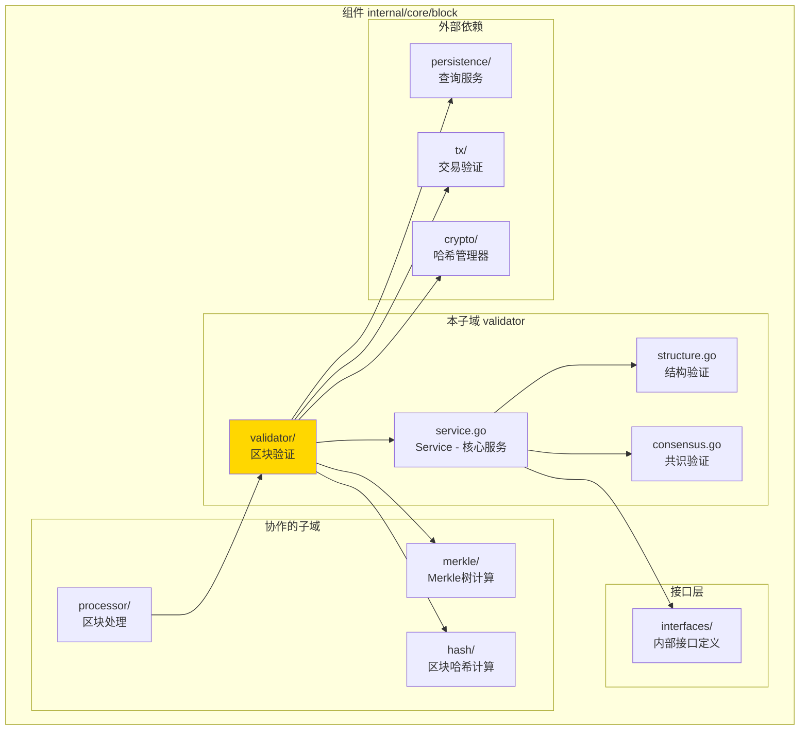
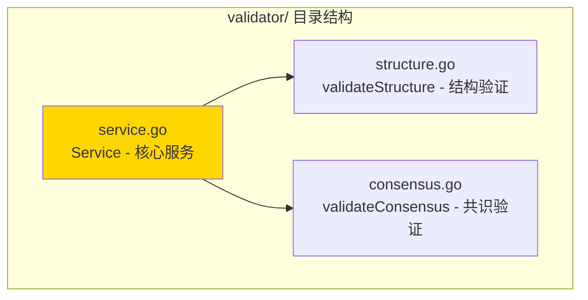

# validator - 区块验证子域

---

## 📌 版本信息

- **版本**：1.0
- **状态**：stable
- **最后更新**：2025-11-XX
- **最后审核**：2025-11-XX
- **所有者**：Block 开发组
- **适用范围**：区块验证服务实现

---

## 🎯 子域定位

**路径**：`internal/core/block/validator/`

**所属组件**：`block`

**核心职责**：验证区块有效性，确保区块符合协议规则

**在组件中的角色**：
- 区块验证的核心逻辑实现
- 多层验证策略：结构 → 共识 → 交易
- 快速失败机制

---

## 🏗️ 架构设计

### 在组件中的位置

> **说明**：展示此子域在 Block 组件内部的位置和协作关系



**位置说明**：

| 关系类型 | 目标 | 关系说明 |
|---------|------|---------|
| **被依赖** | processor/ | 处理区块前验证区块有效性 |
| **协作** | merkle/ | 验证Merkle根 |
| **协作** | hash/ | 计算并验证区块哈希 |
| **依赖** | interfaces/ | 实现 InternalBlockValidator 接口 |
| **依赖** | persistence/ | 通过 QueryService 查询链状态 |
| **依赖** | tx/ | 通过 TxVerifier 验证交易 |

---

### 内部组织

> **说明**：展示此子域内部的文件组织和类型关系



---

## 📁 目录结构

```
internal/core/block/validator/
├── README.md                    # 本文档
├── service.go                   # Service - 核心服务实现
├── structure.go                 # validateStructure - 结构验证实现
└── consensus.go                 # validateConsensus - 共识验证实现
```

---

## 🔧 核心实现

### 实现文件：`service.go`

**核心类型**：`Service`

**职责**：实现 BlockValidator 接口，提供区块验证服务

**关键字段**：

```go
type Service struct {
    // 依赖注入
    queryService  persistence.QueryService                        // 查询服务
    hasher        crypto.HashManager                              // 哈希管理器
    blockHashClient core.BlockHashServiceClient                   // 区块哈希服务客户端
    txHashClient    transaction.TransactionHashServiceClient      // 交易哈希服务客户端
    txVerifier     tx.TxVerifier                                   // 交易验证器
    logger         log.Logger                                      // 日志记录器
    
    // 指标收集
    metrics        *interfaces.ValidatorMetrics                    // 验证指标
    metricsMu      sync.Mutex                                      // 指标锁
    
    // 状态管理
    isHealthy      bool                                            // 健康状态
    lastError      error                                           // 最后错误
}
```

**关键方法**：

| 方法名 | 职责 | 可见性 | 备注 |
|-------|------|-------|-----|
| `NewService()` | 构造函数 | Public | 用于依赖注入 |
| `ValidateBlock()` | 验证区块有效性 | Public | 实现接口方法 |
| `GetValidatorMetrics()` | 获取验证性能指标 | Public | 实现接口方法 |
| `validateStructure()` | 验证区块结构 | Private | 内部结构验证逻辑 |
| `validateConsensus()` | 验证共识规则 | Private | 内部共识验证逻辑 |

---

### 辅助文件

**structure.go** - 结构验证实现：
- `validateStructure()` - 验证区块结构完整性
- 验证区块头字段
- 验证区块体字段
- 验证Merkle根

**consensus.go** - 共识验证实现：
- `validateConsensus()` - 验证共识规则
- 验证区块难度
- 验证时间戳
- 验证区块哈希（如需要）

---

## 🔗 协作关系

### 依赖的接口

| 接口 | 来源 | 用途 |
|-----|------|-----|
| `InternalBlockValidator` | `internal/core/block/interfaces/` | 实现区块验证接口 |
| `persistence.QueryService` | `pkg/interfaces/persistence/` | 查询链状态 |
| `tx.TxVerifier` | `pkg/interfaces/tx/` | 验证交易有效性 |
| `crypto.HashManager` | `pkg/interfaces/infrastructure/crypto/` | 哈希计算 |

---

### 被依赖关系

**被以下子域使用**：
- `processor/` - 处理区块前验证区块有效性

**示例**：

```go
// 在 processor 中使用
import "github.com/weisyn/v1/internal/core/block/validator"

func ProcessBlock(processor interfaces.InternalBlockProcessor, validator interfaces.InternalBlockValidator, block *core.Block) error {
    // 先验证区块
    valid, err := validator.ValidateBlock(ctx, block)
    if !valid {
        return fmt.Errorf("区块验证失败: %w", err)
    }
    
    // 再处理区块
    return processor.ProcessBlock(ctx, block)
}
```

---

## 🧪 测试

### 测试覆盖

| 测试类型 | 文件 | 覆盖率目标 | 当前状态 |
|---------|------|-----------|---------|
| 单元测试 | `validator_test.go` | ≥ 80% | ⏳ 待实施 |
| 集成测试 | `../integration/` | 核心场景 | ⏳ 待实施 |

---

### 测试示例

```go
func TestService_ValidateBlock(t *testing.T) {
    // Arrange
    mockQueryService := newMockQueryService()
    mockHasher := newMockHasher()
    mockTxVerifier := newMockTxVerifier()
    service := validator.NewService(mockQueryService, mockHasher, mockTxVerifier, ...)
    
    block := createTestBlock()
    
    // Act
    valid, err := service.ValidateBlock(ctx, block)
    
    // Assert
    assert.NoError(t, err)
    assert.True(t, valid)
}
```

---

## 📊 关键设计决策

### 决策 1：多层验证策略

**问题**：如何组织验证逻辑？

**方案**：采用多层验证策略：结构 → 共识 → 交易，快速失败

**理由**：
- 先验证简单的结构，快速发现错误
- 再验证共识规则，确保符合协议
- 最后验证交易，确保交易有效性
- 快速失败减少不必要的计算

**权衡**：
- ✅ 优点：高效，快速发现错误
- ⚠️ 缺点：需要维护多层验证逻辑

---

### 决策 2：无状态验证

**问题**：验证服务应该维护状态吗？

**方案**：验证服务是无状态的，只读验证，不修改任何状态

**理由**：
- 简化实现，易于测试
- 支持并发验证
- 职责单一，只负责验证

**权衡**：
- ✅ 优点：简单可靠，易于测试
- ⚠️ 缺点：需要外部查询服务获取状态

---

### 决策 3：验证器分离

**问题**：如何组织结构验证和共识验证？

**方案**：分离到不同文件，结构验证在 structure.go，共识验证在 consensus.go

**理由**：
- 职责分离，易于维护
- 可以独立测试和优化
- 代码组织清晰

**权衡**：
- ✅ 优点：代码组织清晰，易于维护
- ⚠️ 缺点：文件数量增加

---

## 📚 相关文档

- [组件总览](../README.md)
- [内部接口](../interfaces/README.md)
- [公共接口](../../../../pkg/interfaces/block/README.md)
- [接口与实现的组织架构](../../../../docs/system/standards/principles/code-organization.md)

---

## 📝 变更历史

| 版本 | 日期 | 变更内容 | 作者 |
|-----|------|---------|------|
| 1.0 | 2025-11-XX | 初始版本 | Block 开发组 |

---

## 🚧 待办事项

- [ ] 完善单元测试覆盖
- [ ] 优化验证性能
- [ ] 添加更详细的错误信息
- [ ] 支持验证规则配置

