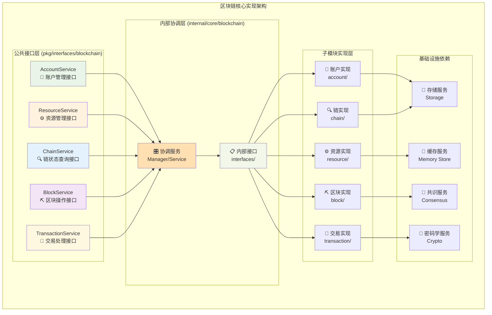
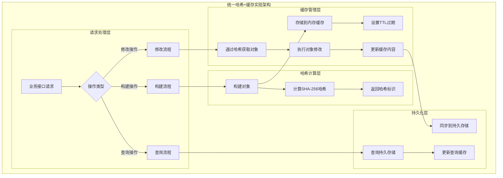
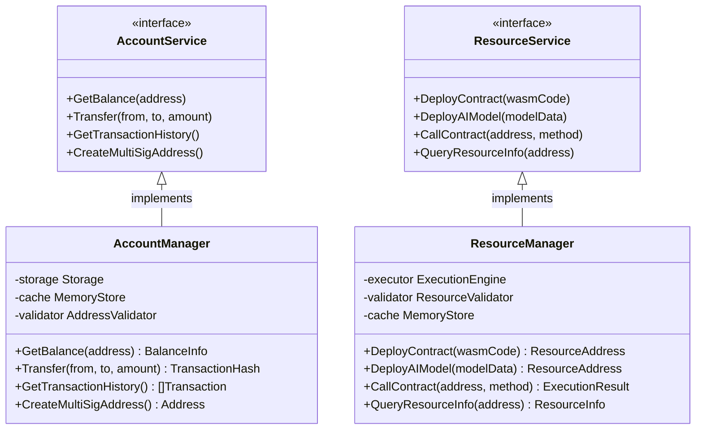

# 区块链核心实现（internal/core/blockchain）

【模块定位】
　　本模块是WES区块链系统的核心业务实现层，负责实现pkg/interfaces/blockchain中定义的所有公共接口。通过模块化的内部架构和严格的分层设计，提供高性能、高可靠性的区块链核心功能实现，支撑上层接口的业务需求，确保系统的稳定运行和功能完整性。

【设计原则】
- 接口实现：严格实现pkg/interfaces/blockchain定义的所有公共接口
- 模块化设计：按业务域组织子模块，确保高内聚低耦合
- 分层架构：内部接口层协调子模块，实现复杂业务逻辑
- 依赖注入：遵循fx框架，通过依赖注入实现组件协作
- 性能优化：采用缓存、批处理等技术提升系统性能

【核心职责】
1. **公共接口实现**：实现所有blockchain业务接口的具体逻辑
2. **内部架构协调**：通过内部接口层协调各子模块协作
3. **业务逻辑封装**：封装复杂的区块链业务逻辑和状态管理
4. **性能优化实现**：实现哈希+缓存架构和性能优化策略
5. **数据一致性保证**：确保区块链数据的完整性和一致性
6. **错误处理机制**：提供完善的错误处理和恢复机制

【实现架构】

　　采用**公共接口 → 内部协调 → 子模块实现**的三层实现架构，确保复杂业务的有序组织和高效协作。



**架构层次说明：**

1. **公共接口层**：外部系统和应用访问的统一入口
   - 定义标准的业务接口契约
   - 隐藏内部实现复杂性
   - 提供一致的API体验

2. **内部协调层**：复杂业务逻辑的协调中枢
   - 实现公共接口的具体逻辑
   - 通过内部接口协调子模块
   - 处理跨模块的业务流程

3. **子模块实现层**：专业化的功能实现
   - 每个子模块专注特定业务域
   - 通过内部接口暴露核心能力
   - 实现具体的数据处理和业务逻辑

---

## 📁 **子模块组织结构**

【内部模块架构】

```
internal/core/blockchain/
├── 📋 interfaces/              # 内部接口协调层
│   ├── account.go             # 账户子模块内部接口
│   ├── resource.go            # 资源子模块内部接口
│   ├── chain.go               # 链查询子模块内部接口
│   ├── block.go               # 区块子模块内部接口
│   ├── transaction.go         # 交易子模块内部接口
│   └── README.md              # 内部接口设计文档
├── 📱 account/                 # 账户管理实现
│   ├── manager.go             # 账户管理器
│   ├── balance.go             # 余额计算逻辑
│   ├── multisig.go            # 多重签名实现
│   └── README.md              # 账户模块文档
├── ⚙️ resource/                # 资源管理实现
│   ├── manager.go             # 资源管理器
│   ├── deploy.go              # 资源部署逻辑
│   ├── execution.go           # 资源执行逻辑
│   └── README.md              # 资源模块文档
├── 🔍 chain/                   # 链状态查询实现
│   ├── manager.go             # 链查询管理器
│   ├── query.go               # 数据查询逻辑
│   ├── cache.go               # 查询缓存管理
│   └── README.md              # 链查询模块文档
├── ⛏️ block/                   # 区块操作实现
│   ├── manager.go             # 区块管理器
│   ├── builder.go             # 区块构建逻辑
│   ├── validator.go           # 区块验证逻辑
│   ├── hash_utils.go          # 区块哈希工具
│   ├── cache_utils.go         # 区块缓存工具
│   └── README.md              # 区块模块文档
├── 💸 transaction/             # 交易处理实现（模块化重构）
│   ├── manager.go             # 交易协调管理器
│   ├── transfer/              # 资产转账服务
│   ├── contract/              # 智能合约服务
│   ├── aimodel/               # AI模型服务
│   ├── resource/              # 静态资源服务
│   ├── lifecycle/             # 生命周期服务（签名、提交、查询等）
│   ├── validation/            # 交易验证服务
│   ├── fee/                   # 统一费用系统
│   ├── internal/              # 内部工具和缓存
│   └── README.md              # 交易模块架构文档
└── 📖 README.md               # 本文档
```

### **🎯 子模块职责分工**

| **子模块** | **核心职责** | **对外接口** | **内部组件** | **复杂度** |
|-----------|-------------|-------------|-------------|-----------|
| `interfaces/` | 内部接口协调 | 为子模块定义内部接口 | 接口定义、依赖注入配置 | ⭐⭐ |
| `account/` | 账户资产管理 | AccountService实现 | 余额计算、多签管理、历史查询 | ⭐⭐⭐ |
| `resource/` | 资源生命周期 | ResourceService实现 | 部署验证、执行引擎、权限控制 | ⭐⭐⭐⭐ |
| `chain/` | 链数据查询 | ChainService实现 | 查询优化、缓存管理、状态监控 | ⭐⭐⭐ |
| `block/` | 区块级操作 | BlockService实现 | 区块构建、挖矿支持、验证逻辑 | ⭐⭐⭐⭐⭐ |
| `transaction/` | 交易完整流程 | TransactionService等多接口实现 | 模块化架构：转账、合约、AI、资源、生命周期、验证、费用 | ⭐⭐⭐⭐⭐ |

---

## 🔄 **统一哈希+缓存实现**

【实现策略】

　　所有子模块均严格遵循**哈希+内存缓存**架构模式，确保系统性能和数据一致性。



**关键实现要点：**

1. **标准化哈希计算**：
   - 统一使用SHA-256算法
   - 对象序列化采用确定性方法
   - 哈希计算结果可复现

2. **内存缓存管理**：
   - TTL自动清理机制
   - LRU策略防止内存溢出
   - 缓存键命名标准化

3. **性能优化策略**：
   - 批量操作减少缓存访问
   - 预取常用数据对象
   - 延迟写入优化并发性能

---

## 🏗️ **依赖注入架构**

【fx框架集成】

　　全面采用fx依赖注入框架，实现组件间的松耦合和生命周期自动管理。

```go
// 示例：子模块依赖注入配置
package blockchain

import (
    "go.uber.org/fx"
    "github.com/weisyn/v1/pkg/interfaces/blockchain"
)

// Module 区块链核心模块
var Module = fx.Module("blockchain",
    // 导入子模块
    fx.Provide(
        // 内部协调层
        NewBlockchainCoordinator,
        
        // 子模块实现
        account.New,
        resource.New, 
        chain.New,
        block.New,
        transaction.New,
    ),
    
    // 导出公共接口
    fx.Provide(
        fx.Annotate(
            func(coord *Coordinator) blockchain.AccountService {
                return coord.AccountService()
            },
            fx.As(new(blockchain.AccountService)),
        ),
        // ... 其他接口导出
    ),
)
```

**依赖管理特点：**
- **自动生命周期**：组件启动和停止由fx自动管理
- **接口导向**：通过接口而非具体类型进行依赖
- **层次清晰**：明确的依赖方向，避免循环依赖
- **测试友好**：支持依赖注入的单元测试

---

## 📊 **性能与监控**

【性能指标】

| **操作类型** | **目标延迟** | **吞吐量目标** | **缓存命中率** | **监控方式** |
|-------------|-------------|---------------|--------------|------------|
| 账户余额查询 | < 10ms | > 1000 QPS | > 95% | 实时监控 |
| 交易构建 | < 50ms | > 500 TPS | > 90% | 批量统计 |
| 区块验证 | < 100ms | > 100 BPS | > 85% | 关键路径监控 |
| 资源部署 | < 200ms | > 50 DPS | N/A | 异步监控 |
| 链状态查询 | < 5ms | > 2000 QPS | > 98% | 实时监控 |

**性能优化策略：**
- **缓存优先**：热点数据预加载到内存缓存
- **批量处理**：相关操作打包执行，减少系统调用
- **异步处理**：非关键路径操作异步执行
- **资源池**：数据库连接池、对象池等资源复用

---

## 🔗 **与公共接口的映射关系**

【接口实现映射】



**实现要点：**
- **接口契约**：严格遵循公共接口的方法签名和语义
- **错误处理**：标准化的错误返回和异常处理机制
- **日志记录**：完善的操作日志和性能指标记录
- **测试覆盖**：每个接口方法都有对应的单元测试和集成测试

---

## 🚀 **后续扩展规划**

【模块演进方向】

1. **性能优化**
   - 实现更高效的缓存策略
   - 优化热点代码路径
   - 添加性能监控和告警

2. **功能扩展**
   - 支持更多类型的智能合约
   - 增强多签管理功能
   - 扩展链查询能力

3. **架构升级**
   - 微服务化改造支持
   - 更灵活的插件体系
   - 支持更多存储后端

4. **运维增强**
   - 更完善的健康检查
   - 自动故障恢复机制
   - 运维工具和控制面板

---

## 📋 **开发指南**

【子模块开发规范】

1. **新建子模块步骤**：
   - 在interfaces/中定义内部接口
   - 创建子模块目录和基础文件
   - 实现核心业务逻辑
   - 添加完整的单元测试
   - 更新fx依赖注入配置

2. **代码质量要求**：
   - 遵循Go语言最佳实践
   - 100%的接口方法测试覆盖
   - 完善的错误处理机制
   - 清晰的代码注释和文档

3. **性能要求**：
   - 关键路径延迟指标达标
   - 内存使用合理，避免泄漏
   - 并发安全的数据访问
   - 合理的资源清理机制

【参考文档】
- [内部接口设计](interfaces/README.md)
- [各子模块实现文档](./*/README.md)
- [WES架构设计文档](../../../docs/architecture/)
