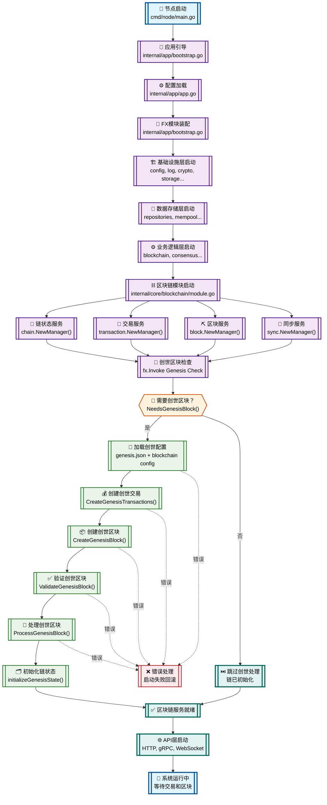

# WES Blockchain启动流程设计

## 📊 **完整启动流程图**



## 🔍 **关键流程节点详解**

### **1. 节点启动阶段**
```
cmd/node/main.go → app.Start() → BootstrapApp()
```
- **入口单一**：所有启动逻辑统一在main.go中
- **选项模式**：支持配置文件路径等启动参数
- **错误处理**：启动失败立即退出

### **2. 模块装配阶段** 
```
fx.Module("blockchain") → 依赖注入 → 服务创建
```
- **分层装配**：基础设施 → 数据 → 业务 → 应用
- **依赖解析**：fx自动解析循环依赖
- **生命周期**：统一管理服务启停

### **3. 创世检查阶段**
```go
// 在所有blockchain服务就绪后触发
fx.Invoke(genesisInitializationCheck)
```
- **时机精确**：所有依赖服务都已创建完成
- **配置驱动**：基于genesis.json和blockchain配置
- **原子操作**：创世初始化要么全成功要么全失败

### **4. 创世区块处理流程**

#### **4.1 创世交易创建**
```go
// internal/core/blockchain/interfaces/transaction.go
CreateGenesisTransactions(ctx, genesisConfig) → []*Transaction
```
- **配置解析**：从genesis.json读取初始账户
- **交易构造**：创建初始代币分配交易
- **确定性**：相同配置产生相同交易

#### **4.2 创世区块构建**
```go
// internal/core/blockchain/interfaces/block.go
CreateGenesisBlock(ctx, genesisTransactions, genesisConfig) → *Block
```
- **区块头构造**：Height=0, PreviousHash=全零
- **Merkle根计算**：基于创世交易计算
- **时间戳设置**：使用配置中的时间戳

#### **4.3 创世区块处理**
```go
// internal/core/blockchain/chain/genesis.go
ProcessGenesisBlock(ctx, genesisBlock) → error
```
- **最终验证**：确保创世区块格式正确
- **数据存储**：调用repository.StoreBlock()
- **状态初始化**：设置ChainInitializedKey等状态

## 🎯 **设计优势分析**

### **1. 延迟初始化策略**
- **优势**：系统可以在没有创世区块的情况下启动所有服务
- **适用场景**：开发测试、多节点部署、灾难恢复
- **实现**：通过fx.Invoke在服务就绪后执行创世检查

### **2. 配置驱动的确定性**
- **优势**：相同配置在任何节点都产生相同创世区块
- **实现**：完全基于genesis.json构建创世状态
- **验证**：创世区块可以通过配置重现和验证

### **3. 统一的处理管道**
- **优势**：创世区块和普通区块使用相同的处理逻辑
- **实现**：通过isGenesisBlock标志区分特殊处理
- **维护**：减少代码重复，降低维护复杂度

### **4. 原子性状态管理**
- **优势**：创世初始化要么全部成功要么全部失败
- **实现**：所有状态变更在BadgerDB事务中完成
- **恢复**：支持失败后的自动重试和状态清理

## 🔧 **核心文件职责**

### **创世处理相关文件**
```
internal/core/blockchain/
├── chain/genesis.go                 # 创世区块管理核心
├── interfaces/transaction.go       # 创世交易接口
├── interfaces/block.go             # 创世区块接口  
├── module.go                       # 启动时创世检查
└── repositories/repository/chain.go # 创世状态持久化
```

### **启动流程相关文件**
```
cmd/node/main.go                    # 启动入口
internal/app/bootstrap.go           # 模块装配
internal/app/app.go                 # 配置管理
configs/genesis.json                # 创世配置
```

## 🚀 **启动命令示例**

### **标准启动**
```bash
# 使用默认配置启动
./bin/node

# 使用指定配置启动  
./bin/node --config configs/config.json
```

### **创世区块相关日志**
```
INFO  开始创世区块初始化检查...
INFO  检查是否需要创建创世区块
INFO  链状态未初始化，需要创建创世区块
INFO  开始创建创世区块...
INFO  ✅ 创世区块创建成功，交易数: 2
INFO  开始处理创世区块...
INFO  ✅ 创世区块处理完成
INFO  🎉 创世区块初始化完成
INFO  区块链核心模块已加载
```

这个设计实现了**"配置驱动、延迟初始化、原子处理"**的创世区块管理策略，既保证了系统启动的灵活性，又确保了创世状态的确定性和一致性。
