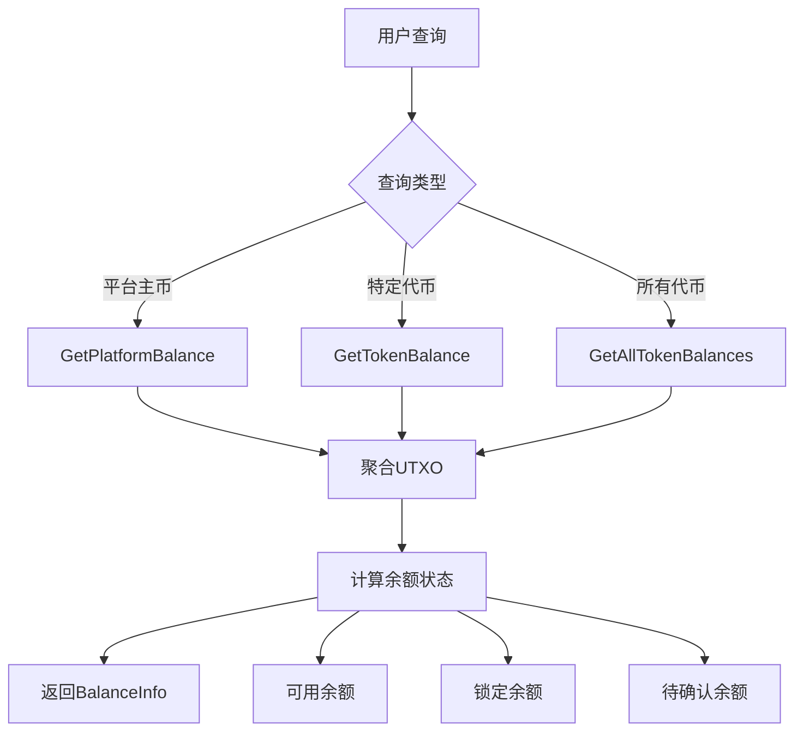
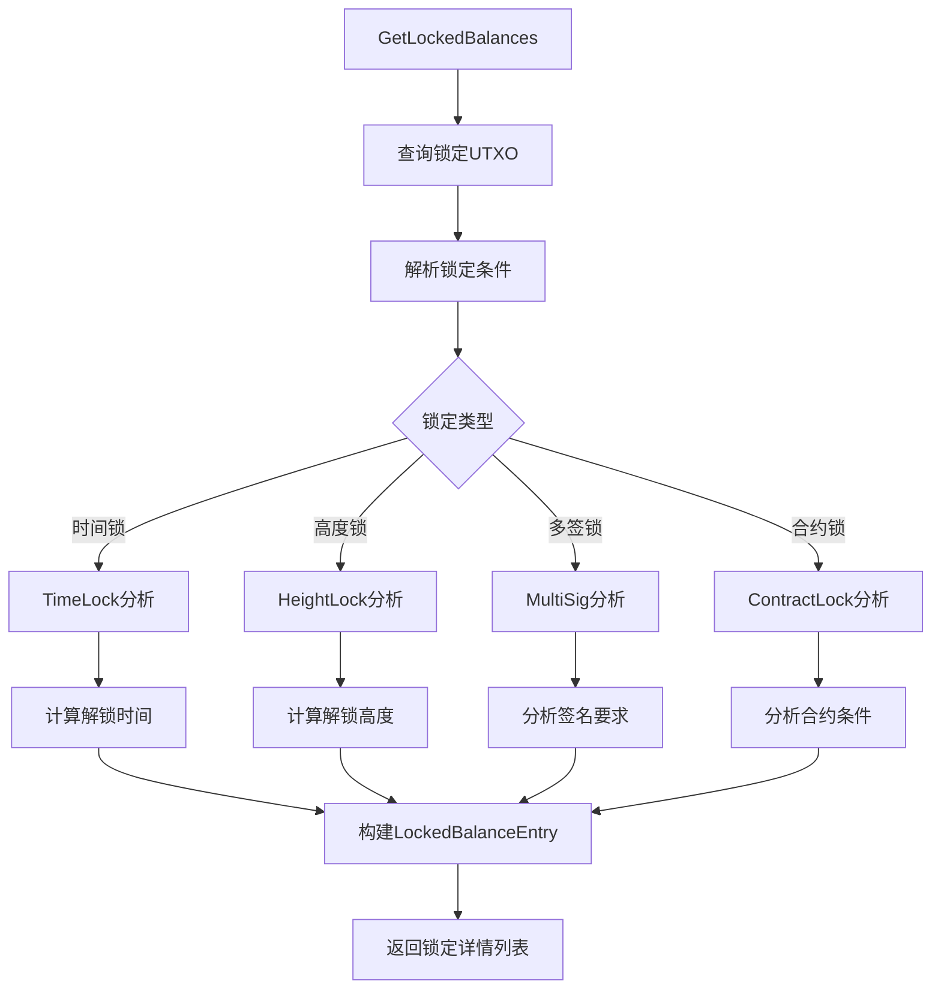
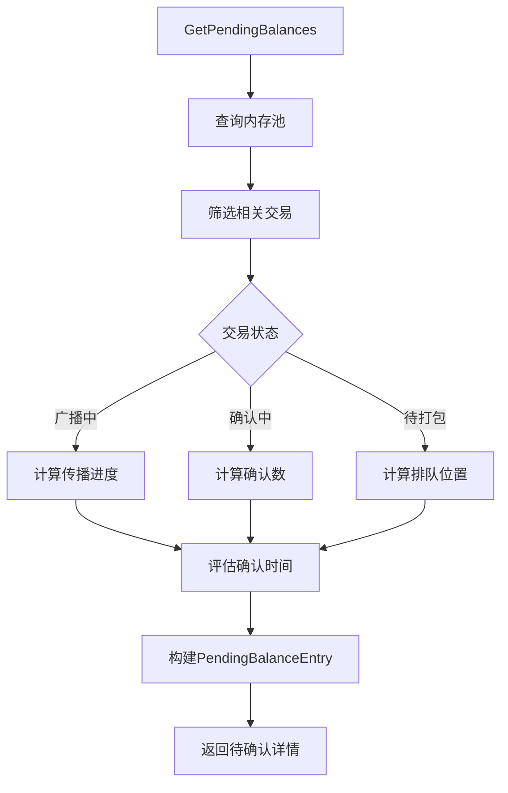
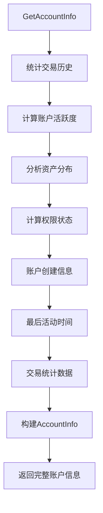

# 账户管理模块 (Account Management Module)

【模块定位】
　　本模块是WES区块链系统的账户管理实现层，负责实现pkg/interfaces/blockchain/account.go中定义的AccountService公共接口。通过UTXO模型抽象，为用户提供友好的账户概念，隐藏底层技术细节，实现高效的余额查询、状态管理和账户信息服务。

【设计原则】
- 业务导向：提供直观的账户概念，隐藏底层UTXO技术细节
- 用户友好：以用户关心的账户、余额、转账为核心设计
- 高性能优化：针对账户查询场景优化算法和缓存策略
- 分层架构：作为UTXO模型之上的业务抽象层
- 接口实现：严格实现公共接口的所有方法和语义

【核心职责】
1. **余额查询服务**：支持平台主币、自定义代币的多维度余额查询
2. **账户状态管理**：锁定余额、待确认余额的详细状态管理
3. **历史信息服务**：统计分析、历史记录、权限信息等综合服务
4. **UTXO模型抽象**：将底层UTXO模型抽象为用户友好的账户概念
5. **缓存优化实现**：通过智能缓存策略提升查询性能
6. **多签地址管理**：创建和管理多重签名地址及其权限

---

## 🔧 核心业务方法

### 📊 **余额管理 (Balance Management)**



### 🔒 **锁定余额管理 (Locked Balance Management)**



### ⏳ **待确认余额管理 (Pending Balance Management)**



### 📈 **账户信息管理 (Account Info Management)**



---

## 🎯 文件结构与职责分工

```
internal/core/blockchain/account/
├── manager.go      # 🎯 统一入口 - 公共接口实现
│   ├── GetPlatformBalance()    → 调用 balance.go
│   ├── GetTokenBalance()       → 调用 balance.go
│   ├── GetAllTokenBalances()   → 调用 balance.go
│   ├── GetLockedBalances()     → 调用 locked.go
│   ├── GetPendingBalances()    → 调用 pending.go
│   └── GetAccountInfo()        → 调用 info.go
│
├── balance.go      # 💰 余额查询 - 主要余额计算逻辑
├── locked.go       # 🔒 锁定余额 - 锁定条件分析和状态管理
├── pending.go      # ⏳ 待确认余额 - 内存池交易状态跟踪
├── info.go         # 📊 账户信息 - 统计分析和元信息管理
└── README.md       # 📚 本文档
```

### 📋 **核心方法映射**

| 公共接口方法 | 实现文件 | 核心功能 | 复杂度 |
|-------------|---------|----------|--------|
| `GetPlatformBalance` | balance.go | 平台主币余额查询 | ⭐⭐ |
| `GetTokenBalance` | balance.go | 指定代币余额查询 | ⭐⭐ |
| `GetAllTokenBalances` | balance.go | 所有代币余额聚合 | ⭐⭐⭐ |
| `GetLockedBalances` | locked.go | 锁定条件解析分析 | ⭐⭐⭐⭐ |
| `GetPendingBalances` | pending.go | 内存池状态跟踪 | ⭐⭐⭐ |
| `GetAccountInfo` | info.go | 综合统计与分析 | ⭐⭐⭐⭐ |

---

## 💡 架构优势

### ✅ **设计优势**

1. **统一抽象**：将复杂的 UTXO 模型抽象为直观的账户概念
2. **性能优化**：针对查询场景优化，支持缓存和索引
3. **模块化设计**：每个文件专注特定功能，便于维护和测试
4. **状态管理**：完整的余额状态生命周期管理

### 🚀 **业务价值**

- **用户体验**：提供钱包、DApp 友好的账户视图
- **开发效率**：简化上层应用的账户操作复杂度  
- **数据一致性**：确保各种余额状态的准确计算
- **扩展性**：支持未来新的代币类型和锁定机制

---

## 📚 使用说明

### 🔨 **开发指南**

1. **接口继承**：严格继承 `pkg/interfaces/blockchain.AccountService`
2. **依赖注入**：通过构造函数注入必需的服务依赖
3. **错误处理**：提供清晰的错误信息和日志记录
4. **性能要求**：查询方法要求毫秒级响应

### 📖 **实现原则**

- **数据准确性**：确保余额计算的精确性和一致性
- **状态完整性**：全面跟踪各种余额状态和变化
- **用户友好性**：提供直观易懂的返回数据结构
- **可扩展性**：支持未来新功能的平滑集成

---

## 🎯 版本信息

- **当前版本**：v1.0.0
- **兼容性**：WES v0.0.1+
- **更新日期**：2024年
- **维护状态**：✅ 活跃开发中
