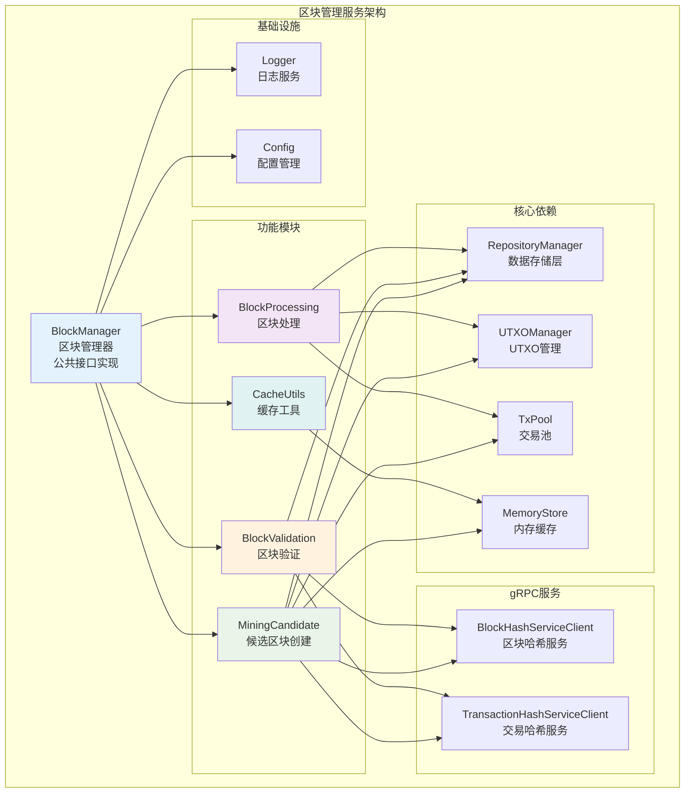
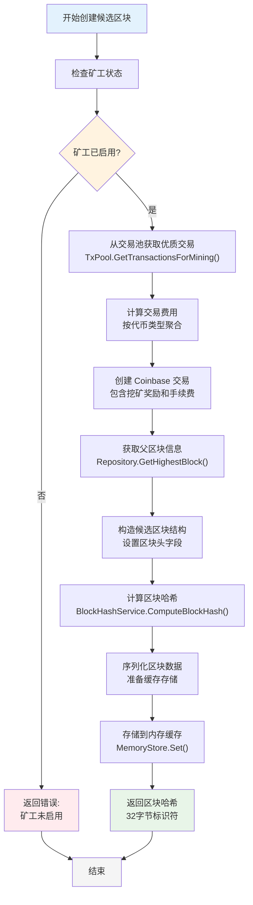
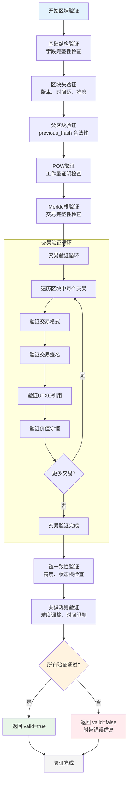
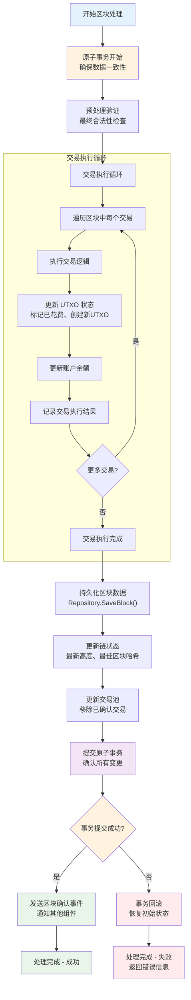
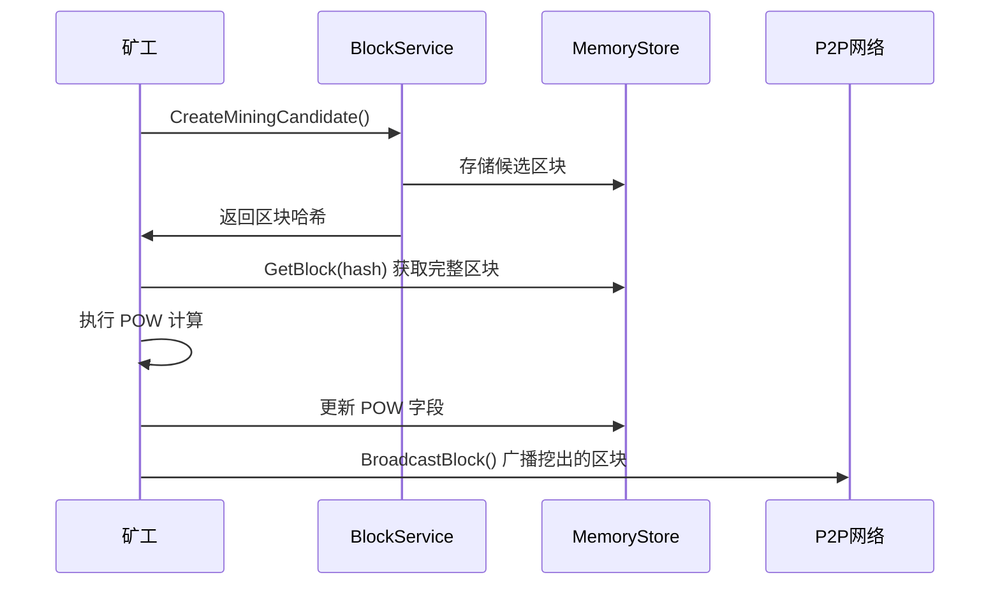
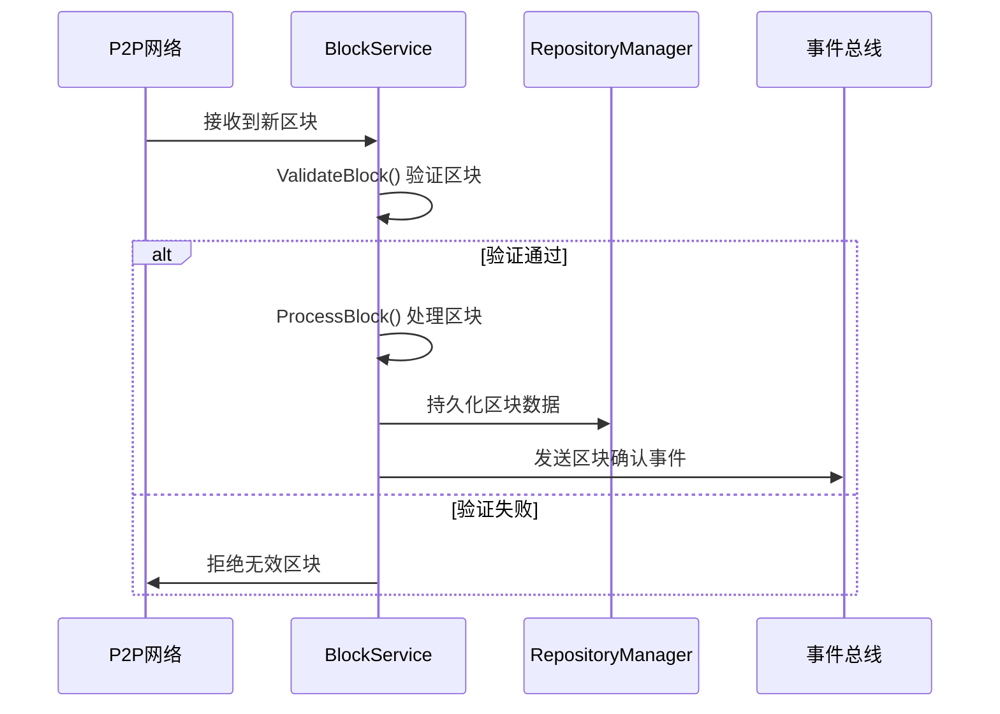

# 区块管理服务 (Block Management Service)

【模块定位】
　　本模块是WES区块链系统的区块管理实现层，负责实现pkg/interfaces/blockchain/block.go中定义的BlockService公共接口。专注于矿工挖矿和节点同步的核心业务逻辑，采用哈希+缓存架构模式，确保高性能和架构一致性，为区块链的核心运行提供可靠支撑。

【设计原则】
- 业务导向：专注挖矿和同步业务逻辑，数据查询委托给RepositoryManager
- 架构一致：与TransactionService统一采用"哈希+缓存"模式
- 职责单一：严格遵循业务层职责，不涉及数据存储实现
- 高性能优化：关键路径优化，支持企业级挖矿需求
- 依赖分离：通过依赖注入实现组件解耦

【核心职责】
1. **矿工挖矿支持**：创建候选区块，支持POW挖矿流程
2. **节点同步支持**：验证和处理来自网络的区块
3. **哈希+缓存实现**：与TransactionService保持一致的轻量级哈希返回模式
4. **企业级性能**：优化关键路径，支持高并发挖矿场景
5. **区块验证服务**：提供完整的区块验证和完整性检查
6. **分叉处理支持**：处理区块链分叉和链重组场景
7. **细粒度接口实现**：实现BlockValidator、BlockProcessor等细粒度接口，解决循环依赖

## 📁 推荐文件组织结构

基于我们对公共接口方法复杂度的分析，推荐采用按功能分离的文件组织方式：

```
internal/core/blockchain/block/
├── manager.go                 # 核心Manager结构和构造函数
├── mining_candidate.go        # CreateMiningCandidate 完整实现
├── validation.go              # ValidateBlock 完整实现  
├── processing.go              # ProcessBlock 完整实现
├── cache_utils.go             # 缓存相关辅助方法（序列化/反序列化）
├── fee_calculation.go         # 交易费用计算和Coinbase交易生成
├── hash_utils.go              # 区块哈希计算辅助方法
└── README.md                  # 本文档
```

### 📋 文件职责分工

- **`manager.go`**：Manager 结构定义、依赖注入、接口方法入口
- **`mining_candidate.go`**：候选区块创建的完整业务逻辑
- **`validation.go`**：区块验证的多层验证体系
- **`processing.go`**：区块处理的原子事务管理
- **`cache_utils.go`**：内存缓存的序列化/反序列化工具
- **`fee_calculation.go`**：手续费聚合和 Coinbase 交易构造
- **`hash_utils.go`**：区块哈希计算的标准化方法

## 🔧 依赖架构

### 核心依赖关系




## 🎯 核心业务方法实现

### 1. CreateMiningCandidate - 创建挖矿候选区块

创建候选区块并返回区块哈希，采用哈希+缓存架构模式。

#### 🔄 业务流程图



#### 💡 关键设计要点

- **矿工地址来源**：从系统配置获取，如未配置则返回错误
- **交易选择策略**：基于费用率、时间戳、依赖关系的综合排序
- **费用聚合机制**：按代币类型聚合，生成对应的 Coinbase 输出
- **缓存TTL管理**：设置合理的缓存存活时间，避免内存泄漏
- **并发安全**：支持多个矿工同时创建候选区块

#### 🎯 哈希+缓存模式优势

1. **网络传输优化**：返回32字节哈希而非完整区块结构
2. **修改支持**：矿工可在缓存中修改 POW 字段（类似交易签名）
3. **架构一致性**：与 TransactionService 保持统一的设计模式
4. **内存效率**：通过 TTL 机制自动清理过期缓存

### 2. ValidateBlock - 区块验证

对从网络接收的区块进行完整的多层验证。

#### 🔄 验证流程图



#### 🛡️ 多层验证体系

1. **结构验证**：protobuf 格式、字段完整性
2. **密码学验证**：POW、Merkle根、交易签名
3. **业务规则验证**：价值守恒、UTXO合法性
4. **共识验证**：难度、时间戳、链连接性
5. **状态一致性验证**：UTXO状态根、链状态

### 3. ProcessBlock - 区块处理

处理验证通过的区块，更新区块链状态。

#### 🔄 处理流程图



#### 🎯 原子事务保证

1. **事务边界**：整个区块处理在单个事务中完成
2. **回滚机制**：任何步骤失败都会完全回滚
3. **状态一致性**：确保 UTXO、账户、链状态的严格一致
4. **错误恢复**：提供详细的错误信息和恢复建议

## 🔖 交易列表与 Coinbase 约束

- 位置约定：由 `internal/core/blockchain/transaction/mining_template.go` 生成的挖矿模板保证 Coinbase 交易位于交易列表首位。
- 识别规则：统一使用 `pkg/utils/transaction.go` 的 `IsCoinbaseTx(tx)` 判断（无输入即为 coinbase；内部对空前置输出点做兼容）。
- 数量：当前模板生成 1 笔 coinbase；若未来扩展为多笔，请保持“所有 coinbase 均无输入”的一致性，区块验证与处理将基于 `IsCoinbaseTx` 自动识别。
- 清理行为：`ProcessBlock` 在交易池确认时跳过 coinbase（不会向 txpool 确认 coinbase），只确认普通交易。

## 🏗️ 核心架构优势

1. **哈希+缓存模式**：
   - 轻量级哈希返回，减少网络传输
   - 内存缓存存储复杂对象
   - 支持后续修改（POW计算）

2. **企业级性能**：
   - 并发挖矿支持
   - 原子事务保证
   - 多层验证优化

3. **按功能模块化**：
   - 按业务方法分离文件
   - 清晰的职责边界
   - 易于维护和扩展

4. **细粒度接口实现**：
   - 实现BlockValidator、BlockProcessor等细粒度接口
   - 支持ForkService、SyncService的精确依赖
   - 通过接口分离解决循环依赖问题
   - 保持向后兼容的同时提供灵活的内部协作能力

## 🎯 **细粒度接口实现说明**

### **接口实现清单**

BlockManager 实现以下细粒度接口：

```go
// ✅ 已实现的验证接口
type BlockValidator interface {
    ValidateBlock(ctx context.Context, block *core.Block) (bool, error)        // ← validate.go
    ValidateMerkleRoot(ctx context.Context, transactions []*transaction.Transaction, expectedMerkleRoot []byte) (bool, error)  // ← merkle.go
}

// ✅ 已实现的处理接口  
type BlockProcessor interface {
    ProcessBlock(ctx context.Context, block *core.Block) error                 // ← process.go
}

// 🎯 复合接口自动满足
type BlockValidatorProcessor interface {
    BlockValidator
    BlockProcessor
}
```

### **接口使用场景**

- **ForkService**: 使用 `BlockValidatorProcessor` 进行分叉区块的验证和处理
- **SyncService**: 使用 `BlockValidatorProcessor` 进行同步区块的验证和处理
- **ChainService**: 直接使用完整的 `InternalBlockService` 接口

### **架构优势**

1. **依赖精确化**: 各服务只依赖所需的最小接口集
2. **循环依赖解决**: 通过接口分离打破原有的循环依赖
3. **测试友好**: 可以轻松Mock细粒度接口进行单元测试
4. **扩展性强**: 新服务可以选择性依赖特定接口

## 🎯 业务场景支持

### 矿工挖矿场景



### 节点同步场景



## 📊 性能指标

### 关键性能目标

- **候选区块创建**：< 100ms（包含交易选择和费用计算）
- **区块验证**：< 500ms（1MB区块，1000个交易）
- **区块处理**：< 1000ms（包含UTXO更新和持久化）
- **内存缓存**：< 10ms 读写延迟
- **并发挖矿**：支持 > 100 个矿工同时创建候选区块

### 优化策略

1. **交易选择优化**：预构建交易索引，快速费用排序
2. **验证并行化**：交易签名验证支持多线程并行
3. **缓存策略**：智能TTL管理，避免内存泄漏
4. **批量操作**：UTXO批量更新，减少数据库交互
5. **异步处理**：非关键路径操作异步执行

## 🛡️ 安全设计

### 安全机制

1. **密码学安全**：
   - 标准化哈希计算（SHA-256）
   - 严格的签名验证
   - POW工作量证明

2. **业务逻辑安全**：
   - 严格的价值守恒验证
   - UTXO双花检测
   - 交易重放攻击防护

3. **系统安全**：
   - 原子事务保证数据一致性
   - 错误恢复机制
   - 缓存安全策略

### 攻击防护

- **51%攻击**：POW共识机制天然防护
- **双花攻击**：UTXO状态严格验证
- **重放攻击**：Nonce机制防护
- **DoS攻击**：费用机制和处理限制

## 📋 配置管理

### 关键配置项

```yaml
block_service:
  # 挖矿配置
  mining:
    enabled: true
    miner_address: "bp1q..."
    candidate_ttl: "300s"
    max_candidates: 100
  
  # 验证配置  
  validation:
    max_block_size: "2MB"
    max_transactions: 1000
    enable_parallel: true
    timeout: "30s"
  
  # 处理配置
  processing:
    transaction_timeout: "5s"
    batch_size: 100
    enable_recovery: true
  
  # 缓存配置
  cache:
    default_ttl: "1h"
    max_memory: "1GB"
    cleanup_interval: "5m"
```

## 🌐 **系统协调集成**

### 🤝 **与区块链协调器集成**

　　Block模块不再直接处理区块写入，而是通过**BlockchainCoordinator**与**SingleBlockWriter**实现统一协调。

**协调原则**：
- **验证统一性**：所有区块都通过相同的验证流程，无论来源是挖矿、同步还是分叉处理
- **分叉检测**：验证失败时自动触发PotentialForkDetected事件
- **状态隔离**：验证过程不修改系统状态，由协调器统一管理

### 🔒 **区块写入单一入口**

**设计要点**：
- **ProcessBlock**方法移至SingleBlockWriter，保证写入的原子性
- **UTXO状态同步**：区块数据与UTXO状态在同一事务中更新
- **高度统一管理**：通过HeightTracker统一管理高度更新

### 📡 **事件驱动协调**

**Block模块不再直接发布事件**，所有事件由SingleBlockWriter统一发布：

**重要事件**：
- `BlockWritten`: 区块成功写入，通知所有相关模块
- `PotentialForkDetected`: 验证失败或检测到可能的分叉
- `ValidationFailed`: 区块验证失败，包含详细错误信息

### 🖄 **新的协作模式**

- **BlockManager** → **BlockchainCoordinator** → **SingleBlockWriter**：区块写入必须经过协调器
- **BlockManager** ↔ **TransactionService**：交易验证和处理（不变）
- **BlockManager** ↔ **UTXOManager**：UTXO状态管理（不变）  
- **SingleBlockWriter** ↔ **RepositoryManager**：数据存储和查询
- **SingleBlockWriter** ↔ **HeightTracker**：高度统一管理

**核心变化**：
1. **ProcessBlock**方法移至SingleBlockWriter，保证单一性
2. **分叉检测**由BlockchainCoordinator统一处理
3. **事件发布**由SingleBlockWriter统一发布

## 📈 监控和诊断

### 关键指标

- **业务指标**：候选区块创建率、验证成功率、处理延迟
- **性能指标**：CPU使用率、内存占用、缓存命中率
- **安全指标**：验证失败次数、攻击检测、错误恢复次数

### 日志记录

- **INFO**：正常业务流程关键节点
- **WARN**：性能警告、缓存清理、重试操作
- **ERROR**：验证失败、处理错误、系统异常
- **DEBUG**：详细的执行流程、性能数据

## 🚀 未来扩展

### 扩展方向

1. **性能优化**：
   - 更智能的交易选择算法
   - GPU加速的并行验证
   - 分层存储优化

2. **功能增强**：
   - 支持更多共识算法
   - 跨链区块验证
   - 智能合约集成

3. **企业特性**：
   - 审计日志增强
   - 合规性检查
   - 企业级监控

### 架构演进

- **微服务化**：支持独立部署的挖矿服务
- **云原生**：容器化部署，弹性扩缩容
- **边缘计算**：分布式验证节点支持

---

## 📚 参考文档

- `pkg/interfaces/blockchain/README.md`：区块链接口设计原理
- `pkg/interfaces/repository/README.md`：数据存储接口规范  
- `internal/core/consensus/README.md`：共识机制实现文档
- `internal/config/blockchain/README.md`：区块链配置文档

---

*📝 文档版本：v1.0 | 最后更新：2024年*
