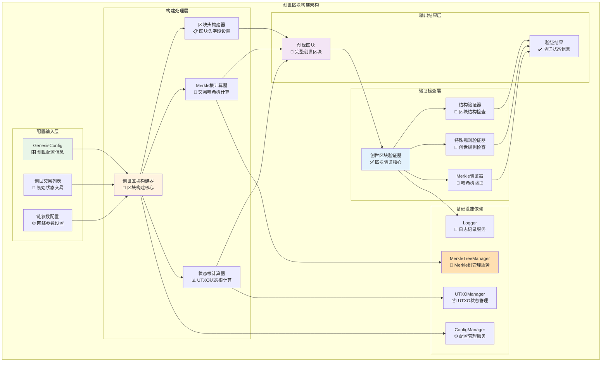
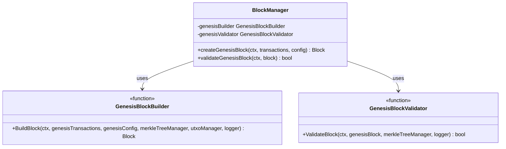

# 创世区块构建模块（internal/core/blockchain/block/genesis）

【模块定位】
　　本模块是WES区块链系统的创世区块构建和验证核心模块，负责基于创世配置和创世交易构建区块链的第一个区块。通过确定性的构建算法和专门化的验证规则，确保创世区块的正确性、一致性和网络兼容性，为整个区块链网络奠定可信的基础状态。

【设计原则】
- **确定性构建**：相同配置必须产生完全相同的创世区块
- **配置驱动**：完全基于GenesisConfig和创世交易进行构建
- **特殊化处理**：创世区块使用专门的构建和验证规则
- **原子操作**：构建和验证过程必须是原子性的
- **状态一致性**：确保创世状态与系统预期完全一致

【核心职责】
1. **创世区块构建**：基于配置和创世交易构建完整的创世区块
2. **特殊验证规则**：实现创世区块专门化的验证逻辑
3. **状态根计算**：计算和验证创世状态的UTXO状态根
4. **Merkle根处理**：基于创世交易计算正确的Merkle根哈希
5. **配置一致性保证**：确保区块构建与GenesisConfig完全一致
6. **确定性保障**：保证相同输入产生相同的创世区块

【实现架构】

　　采用**构建器+验证器**的双组件架构，确保创世区块构建的正确性和可验证性。



**架构层次说明：**

1. **配置输入层**：接收和处理创世区块构建所需的全部配置信息
   - 严格的配置格式验证
   - 完整的参数一致性检查
   - 配置信息的结构化处理

2. **构建处理层**：执行创世区块的具体构建逻辑
   - 确定性的构建算法
   - 精确的数值计算
   - 完整的状态初始化

3. **验证检查层**：实施创世区块的专门化验证
   - 创世区块特殊规则验证
   - 完整性和一致性检查
   - 网络兼容性验证

---

## 📁 **模块组织结构**

【内部模块架构】

```
internal/core/blockchain/block/genesis/
├── 🔨 builder.go                   # 创世区块构建器 - 核心构建逻辑
├── ✅ validator.go                 # 创世区块验证器 - 专门验证逻辑  
└── 📚 README.md                    # 本文档
```

### **🎯 组件职责分工**

| **组件** | **核心职责** | **对外接口** | **内部组件** | **复杂度** |
|---------|-------------|-------------|-------------|-----------|
| `builder.go` | 创世区块构建逻辑 | BuildBlock函数 | 区块头构建、Merkle计算、状态根计算 | ⭐⭐⭐⭐ |
| `validator.go` | 创世区块验证逻辑 | ValidateBlock函数 | 结构验证、特殊规则验证、一致性检查 | ⭐⭐⭐ |

---

## 🔄 **统一确定性构建实现**

【实现策略】

　　所有创世区块构建均严格遵循**确定性构建**原则，确保相同输入产生完全相同的创世区块。

```mermaid
flowchart TD
    subgraph "确定性创世区块构建流程"
        subgraph "输入标准化"
            A[配置输入] --> B[配置验证]
            B --> C[参数标准化]
            C --> D[交易排序]
        end
        
        subgraph "区块头构建"
            D --> E[版本字段设置]
            E --> F[父哈希设置全零]
            F --> G[高度设置为0]
            G --> H[时间戳规范化]
        end
        
        subgraph "内容构建"
            H --> I[Merkle根计算]
            I --> J[状态根计算]  
            J --> K[难度参数设置]
            K --> L[Nonce字段处理]
        end
        
        subgraph "完整性验证"
            L --> M[结构完整性检查]
            M --> N[字段一致性验证]
            N --> O[哈希正确性验证]
            O --> P[创世区块完成]
        end
    end
```



**关键实现要点：**

1. **输入标准化处理**：
   - 配置参数的严格验证和标准化
   - 创世交易的确定性排序
   - 时间戳的规范化处理

2. **确定性计算**：
   - Merkle根的确定性计算算法
   - 状态根的精确计算方法
   - 所有哈希计算的标准化实现

3. **特殊字段处理**：
   - 父哈希字段设置为32字节全零
   - 区块高度固定设置为0
   - Nonce字段的特殊处理逻辑

---

## 🏗️ **依赖注入架构**

【fx框架集成】

　　全面采用fx依赖注入框架，实现创世区块模块组件间的松耦合和生命周期自动管理。

```go
// 示例：创世区块模块依赖注入配置
package genesis

import (
    "go.uber.org/fx"
)

// Module 创世区块模块
var Module = fx.Module("genesis",
    // 导入核心组件
    fx.Provide(
        // 构建器
        NewGenesisBlockBuilder,
        
        // 验证器
        NewGenesisBlockValidator,
    ),
    
    // 导出工具函数
    fx.Provide(
        fx.Annotate(
            BuildBlock,
            fx.As(new(GenesisBlockBuilder)),
        ),
        fx.Annotate(
            ValidateBlock,
            fx.As(new(GenesisBlockValidator)),
        ),
    ),
)
```

**依赖管理特点：**
- **自动生命周期**：组件启动和停止由fx自动管理
- **接口导向**：通过接口而非具体类型进行依赖
- **层次清晰**：明确的依赖方向，避免循环依赖
- **测试友好**：支持依赖注入的单元测试

---

## 📊 **性能与监控**

【性能指标】

| **操作类型** | **目标延迟** | **内存使用** | **成功率** | **监控方式** |
|-------------|-------------|------------|-----------|------------|
| 创世区块构建 | < 500ms | < 10MB | 100% | 构建时监控 |
| Merkle根计算 | < 100ms | < 5MB | 100% | 计算监控 |
| 状态根计算 | < 200ms | < 8MB | 100% | 状态监控 |
| 创世区块验证 | < 200ms | < 5MB | 100% | 验证监控 |
| 配置一致性检查 | < 50ms | < 1MB | 100% | 检查监控 |

**性能优化策略：**
- **算法优化**：使用高效的哈希计算和Merkle树算法
- **内存管理**：合理的内存分配和及时的资源回收
- **并发安全**：确保构建过程的线程安全性
- **缓存策略**：合理缓存中间计算结果

---

## 🔗 **与公共接口的映射关系**

【接口实现映射】



**实现要点：**
- **函数式接口**：提供纯函数式的构建和验证接口
- **错误处理**：标准化的错误返回和异常处理机制
- **日志记录**：完善的操作日志和过程追踪记录
- **测试覆盖**：每个函数都有对应的单元测试和集成测试

---

## 🚀 **后续扩展规划**

【模块演进方向】

1. **功能增强**
   - 支持更复杂的创世配置格式
   - 增加创世区块模板系统
   - 支持多种网络类型的创世区块

2. **性能优化**
   - 优化大规模创世交易的处理能力
   - 提升Merkle根和状态根的计算效率
   - 减少内存使用和提高构建速度

3. **验证强化**
   - 增加更严格的创世区块验证规则
   - 支持创世区块的跨版本兼容性检查
   - 增强配置一致性验证能力

4. **工具支持**
   - 提供创世区块构建的CLI工具
   - 支持创世配置的可视化编辑
   - 增加创世区块的调试和分析工具

---

## 📋 **开发指南**

【创世区块开发规范】

1. **构建确定性要求**：
   - 所有构建逻辑必须是确定性的
   - 相同输入必须产生完全相同的输出
   - 避免使用随机数或时间相关的不确定因素
   - 实现可重复的构建过程

2. **验证完整性要求**：
   - 实现完整的创世区块验证逻辑
   - 验证所有特殊字段和规则
   - 确保验证逻辑与构建逻辑的一致性
   - 提供详细的验证错误信息

3. **性能优化要求**：
   - 构建和验证过程延迟指标达标
   - 合理使用内存和CPU资源
   - 支持大规模创世交易的处理
   - 实现高效的算法和数据结构

【参考文档】
- [创世交易模块](../../transaction/genesis/README.md)
- [区块处理主模块](../README.md)
- [创世配置类型定义](../../../../pkg/types/)

---

> 📝 **模块说明**：本模块是WES v0.0.1区块链网络启动的关键基础，通过可靠的创世区块构建确保网络的正确初始化和一致性。

> 🔄 **维护指南**：本文档应随着创世区块构建逻辑的演进及时更新，确保文档与代码实现的一致性。建议在每次重大配置格式变更后更新相应章节。
