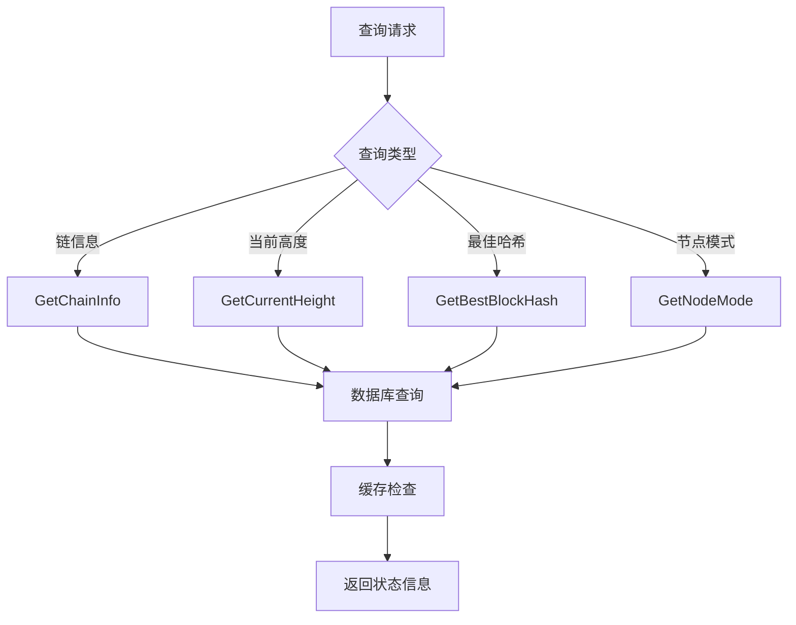
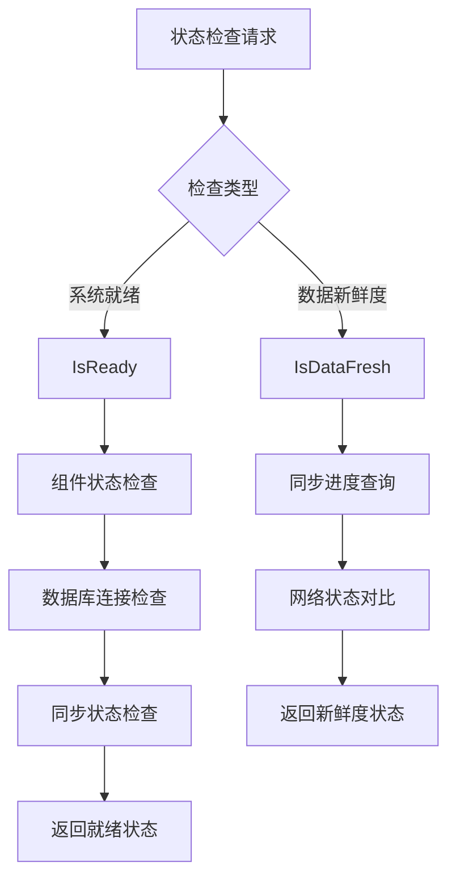
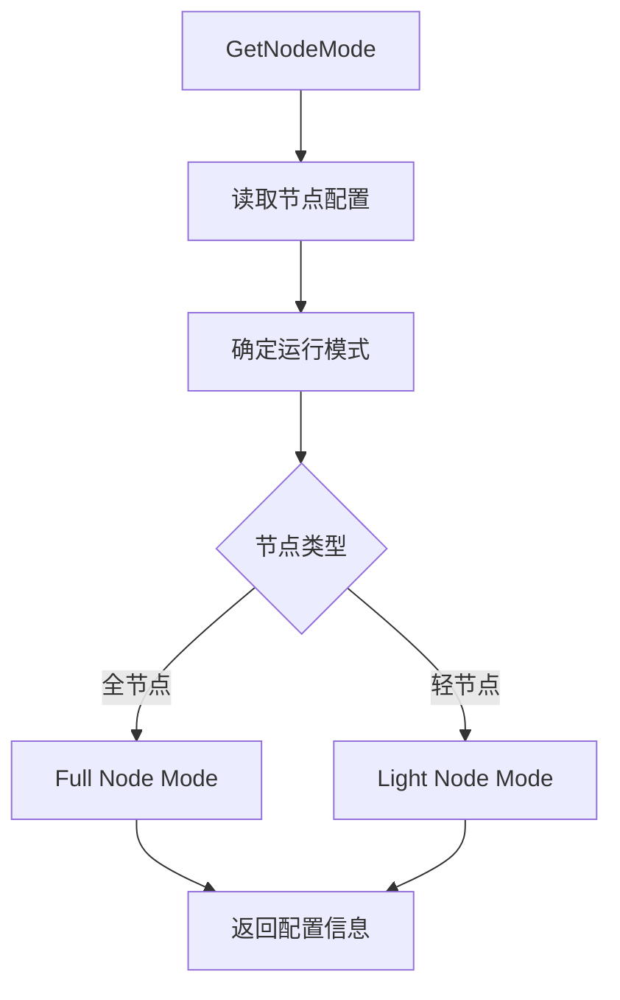

# 链状态管理模块 (Chain State Management Module)

【模块定位】
　　本模块是WES区块链系统的链状态管理实现层，负责实现pkg/interfaces/blockchain/chain.go中定义的ChainService公共接口。专注于基础链状态查询服务，为系统各组件提供高性能的链状态信息访问，支持矿工、API、监控等多种业务场景。

【设计原则】
- 业务导向：只提供真实业务场景需要的查询接口
- 高性能优化：频繁调用的接口要求毫秒级响应
- 状态透明：提供清晰的链状态信息
- 职责聚焦：专注链状态，不涉及网络管理
- 缓存优先：通过智能缓存策略提升查询效率

【核心职责】
1. **基础状态查询**：链高度、最佳区块哈希、链信息等核心状态查询
2. **系统就绪检查**：系统就绪状态、数据新鲜度验证
3. **配置信息服务**：节点模式、网络参数等配置信息获取
4. **高性能查询**：毫秒级响应的高频调用接口实现
5. **状态一致性保证**：确保返回数据的准确性和实时性
6. **监控数据支持**：为系统监控和告警提供基础数据

---

## 🔧 核心业务方法

### 📊 **链状态查询 (Chain State Query)**



### ✅ **系统状态检查 (System Status Check)**



### 🔧 **配置信息查询 (Configuration Query)**



---

## 🎯 文件结构与职责分工

```
internal/core/blockchain/chain/
├── manager.go      # 🎯 统一入口 - 公共接口实现  
│   ├── GetChainInfo()      → 调用 info.go
│   ├── GetCurrentHeight()  → 调用 height.go
│   ├── GetBestBlockHash()  → 调用 hash.go
│   ├── IsReady()          → 调用 status.go
│   ├── IsDataFresh()      → 调用 status.go
│   └── GetNodeMode()      → 调用 config.go
│
├── info.go         # 📊 链信息 - 综合链状态信息查询
├── height.go       # 📏 高度查询 - 当前链高度获取  
├── hash.go         # 🔗 哈希查询 - 最佳区块哈希获取
├── status.go       # ✅ 状态检查 - 系统就绪和数据新鲜度
├── config.go       # ⚙️ 配置查询 - 节点模式和参数配置
└── README.md       # 📚 本文档
```

### 📋 **核心方法映射**

| 公共接口方法 | 实现文件 | 核心功能 | 复杂度 |
|-------------|---------|----------|--------|
| `GetChainInfo` | info.go | 综合链状态信息查询 | ⭐⭐⭐ |
| `GetCurrentHeight` | height.go | 当前链高度获取 | ⭐ |
| `GetBestBlockHash` | hash.go | 最佳区块哈希获取 | ⭐⭐ |
| `IsReady` | status.go | 系统就绪状态检查 | ⭐⭐⭐ |
| `IsDataFresh` | status.go | 数据新鲜度验证 | ⭐⭐⭐ |
| `GetNodeMode` | config.go | 节点模式配置查询 | ⭐ |

---

## 💡 架构优势

### ✅ **设计优势**

1. **高性能**：针对高频查询优化，支持毫秒级响应
2. **状态透明**：提供清晰准确的链状态信息
3. **模块化设计**：每个文件专注特定功能，便于维护
4. **缓存友好**：支持查询结果缓存和优化

### 🚀 **业务价值**

- **系统监控**：为监控系统提供准确的状态信息
- **API服务**：支撑上层API服务的状态查询需求
- **矿工组件**：为挖矿决策提供链状态依据
- **同步优化**：支持数据同步状态的准确判断

---

## 📚 使用说明

### 🔨 **开发指南**

1. **接口继承**：严格继承 `pkg/interfaces/blockchain.ChainService`
2. **依赖注入**：通过构造函数注入必需的服务依赖
3. **性能要求**：所有查询方法要求毫秒级响应
4. **缓存策略**：合理使用缓存提升查询性能

### 📖 **实现原则**

- **数据准确性**：确保链状态信息的准确性和实时性
- **高性能查询**：优化查询逻辑，支持高频调用
- **状态一致性**：保持各种状态查询的一致性
- **故障友好**：合理的错误处理和降级策略

---

## 🎯 版本信息

- **当前版本**：v1.0.0  
- **兼容性**：WES v0.0.1+
- **更新日期**：2024年
- **维护状态**：✅ 活跃开发中
