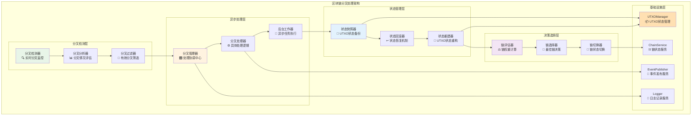
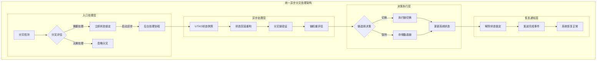
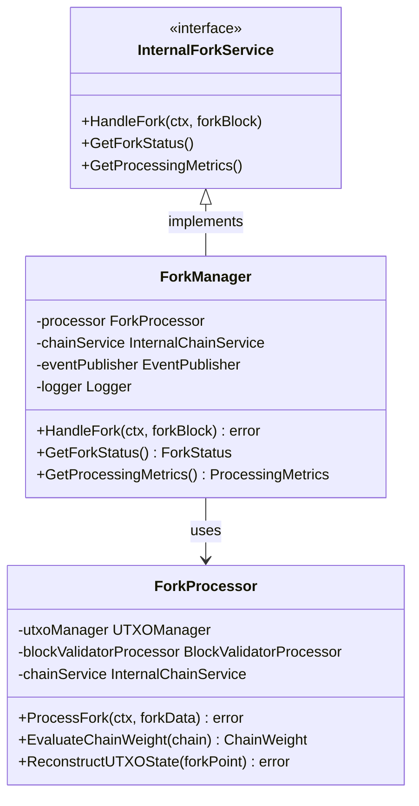

# 区块链分叉处理模块（internal/core/blockchain/fork）

【模块定位】
　　本模块是WES区块链系统中区块链分叉检测与处理的核心安全模块，负责维护区块链一致性和网络稳定性。通过智能分叉检测、异步处理机制和UTXO状态重构技术，确保在面对网络分叉时能够做出正确决策，保持系统的可用性和数据一致性，为区块链网络提供强大的容错能力。

【设计原则】
- **安全优先**：分叉处理过程中确保数据完整性和系统安全性
- **非阻塞设计**：异步处理机制避免阻塞主要业务流程
- **状态一致性**：严格保证UTXO状态和链状态的一致性
- **智能决策**：基于链权重和业务规则做出最优分叉选择
- **容错恢复**：提供完善的错误处理和系统恢复机制

【核心职责】
1. **分叉检测与识别**：实时检测区块链网络中的分叉情况和分叉深度
2. **异步处理协调**：通过后台协程处理耗时的分叉处理逻辑
3. **UTXO状态重构**：回滚和重建UTXO状态以适应新的链结构
4. **链选择决策**：基于累积工作量和业务规则选择最佳链
5. **系统状态管理**：协调系统各组件的状态锁定和恢复
6. **分叉事件通知**：向其他系统组件发送分叉处理状态变更通知

【触发机制】
　　分叉处理采用**事件驱动架构**，由区块处理层检测到分叉时发布事件触发：
- **事件名称**：`blockchain.fork.detected`
- **触发位置**：区块处理模块在检测到分叉时发布事件
- **处理响应**：分叉管理器订阅此事件并异步处理分叉逻辑
- **架构优势**：解除了区块处理层与分叉处理层的直接耦合，提升系统模块化

【实现架构】

　　采用**异步处理 + 状态锁定**的两阶段处理架构，确保分叉处理的安全性和系统的高可用性。



**架构层次说明：**

1. **分叉检测层**：实时监控网络分叉情况，评估分叉的严重性和处理必要性
   - 高效的分叉检测算法
   - 智能的分叉情况分析
   - 有效分叉的筛选机制

2. **异步处理层**：通过异步机制处理分叉，避免阻塞主要业务流程
   - 非阻塞的协调管理
   - 后台异步任务执行
   - 完善的错误处理机制

3. **状态管理层**：管理UTXO状态的快照、回滚和重建过程
   - 原子性的状态操作
   - 可靠的状态恢复机制
   - 高效的状态重构算法

---

## 📁 **模块组织结构**

【内部模块架构】

```
internal/core/blockchain/fork/
├── 🎛️ manager.go                   # 分叉管理器 - 统一协调入口
├── ⚙️ processor.go                 # 分叉处理器 - 核心处理逻辑
└── 📚 README.md                    # 本文档
```

### **🎯 组件职责分工**

| **组件** | **核心职责** | **对外接口** | **内部组件** | **复杂度** |
|---------|-------------|-------------|-------------|-----------|
| `manager.go` | 分叉处理协调管理 | InternalForkService实现 | 状态锁定、异步调度、事件通知 | ⭐⭐⭐ |
| `processor.go` | 具体分叉处理逻辑 | 处理器内部接口 | UTXO重构、链评估、状态切换 | ⭐⭐⭐⭐⭐ |

---

### **🤝 与区块链协调器集成**

【系统协调原则】

　　Fork模块与**BlockchainCoordinator**和**SystemStateManager**紧密集成，实现系统性的分叉处理协调。

**协调要点**：
- **状态协调**：分叉处理期间将系统状态设为FORK_PROCESSING，暂停同步和其他操作
- **单一写入**：分叉处理产生的区块写入必须通过SingleBlockWriter统一处理
- **事件驱动**：分叉检测、处理完成等状态通过事件总线通知
- **资源隔离**：分叉处理过程中的UTXO操作与其他操作互斥

## 🔄 **系统协调的异步处理实现**

【实施策略】

　　所有分叉处理均严格遵循**系统协调+异步处理+状态锁定**模式，确保与其他模块的系统性一致。



**关键实现要点：**

1. **立即响应机制**：
   - HandleFork方法立即返回，不阻塞调用方
   - 快速设置系统状态锁定，防止并发冲突
   - 异步启动后台处理协程

2. **状态安全保证**：
   - 原子性的状态快照和恢复操作
   - 完整的错误回滚机制
   - 严格的并发控制策略

3. **智能处理策略**：
   - 基于分叉深度和影响范围的智能评估
   - 最小化UTXO状态重构范围
   - 批量操作优化处理性能

---

## 🏗️ **依赖注入架构**

【fx框架集成】

　　全面采用fx依赖注入框架，实现组件间的松耦合和生命周期自动管理。

```go
// 示例：分叉处理模块依赖注入配置
package fork

import (
    "go.uber.org/fx"
    "github.com/weisyn/v1/internal/core/blockchain/interfaces"
)

// Module 分叉处理模块
var Module = fx.Module("fork",
    // 导入核心组件
    fx.Provide(
        // 管理器层
        NewForkManager,
        
        // 处理器层
        NewForkProcessor,
    ),
    
    // 导出内部接口
    fx.Provide(
        fx.Annotate(
            func(mgr *Manager) interfaces.InternalForkService {
                return mgr
            },
            fx.As(new(interfaces.InternalForkService)),
        ),
    ),
)
```

**依赖管理特点：**
- **自动生命周期**：组件启动和停止由fx自动管理
- **接口导向**：通过接口而非具体类型进行依赖
- **层次清晰**：明确的依赖方向，避免循环依赖
- **测试友好**：支持依赖注入的单元测试

---

## 📊 **性能与监控**

【性能指标】

| **操作类型** | **目标延迟** | **吞吐量目标** | **成功率** | **监控方式** |
|-------------|-------------|---------------|-----------|------------|
| 分叉检测 | < 100ms | > 1000 检测/秒 | > 99.9% | 实时监控 |
| 状态锁定 | < 50ms | N/A | > 99.9% | 关键路径监控 |
| UTXO重构 | < 30s | 视分叉深度 | > 99% | 批量统计 |
| 链切换决策 | < 5s | N/A | > 98% | 异步监控 |
| 系统恢复 | < 10s | N/A | > 99.9% | 实时监控 |

**性能优化策略：**
- **智能评估**：快速评估分叉重要性，避免不必要的处理
- **批量操作**：批量处理UTXO状态变更，提升重构效率
- **并发控制**：合理的并发策略，平衡性能和安全性
- **资源管理**：动态调整处理资源，避免系统过载

---

## 🔗 **与公共接口的映射关系**

【接口实现映射】



**实现要点：**
- **接口契约**：严格遵循内部接口的方法签名和语义
- **错误处理**：标准化的错误返回和异常处理机制
- **日志记录**：完善的操作日志和性能指标记录
- **测试覆盖**：每个接口方法都有对应的单元测试和集成测试

---

## 🚀 **后续扩展规划**

【模块演进方向】

1. **智能化增强**
   - 基于机器学习的分叉预测算法
   - 自适应的处理策略优化
   - 智能化的资源调度机制

2. **性能优化**
   - 更高效的UTXO状态重构算法
   - 并行化的分叉处理能力
   - 内存和CPU使用优化

3. **可观测性提升**
   - 更详细的处理过程可视化
   - 实时性能指标监控
   - 分叉处理历史分析

4. **容错能力强化**
   - 更robust的错误恢复机制
   - 分布式分叉处理支持
   - 跨区域容灾能力

---

## 📋 **开发指南**

【分叉处理开发规范】

1. **异步处理原则**：
   - 所有分叉处理都必须异步进行，避免阻塞主线程
   - 合理设置处理超时时间和重试机制
   - 实现完善的进度通知和状态回报

2. **状态安全要求**：
   - 严格遵循原子操作原则，确保状态一致性
   - 实现可靠的状态快照和恢复机制
   - 添加完整的并发安全检查

3. **性能要求**：
   - 分叉检测延迟指标达标
   - UTXO重构过程内存使用合理
   - 支持大规模分叉场景的处理能力
   - 合理的资源清理和回收机制

【参考文档】
- [分叉处理接口定义](../interfaces/fork.go)
- [UTXO管理接口](../../../pkg/interfaces/repository/utxo.go)
- [WES架构设计文档](../../../docs/architecture/)

---

> 📝 **模块说明**：本模块是WES v0.0.1区块链系统安全稳定运行的关键保障，通过智能化的分叉处理机制确保网络的一致性和可用性。

> 🔄 **维护指南**：本文档应随着分叉处理机制的演进及时更新，确保文档与代码实现的一致性。建议在每次重大功能变更后更新相应章节。
