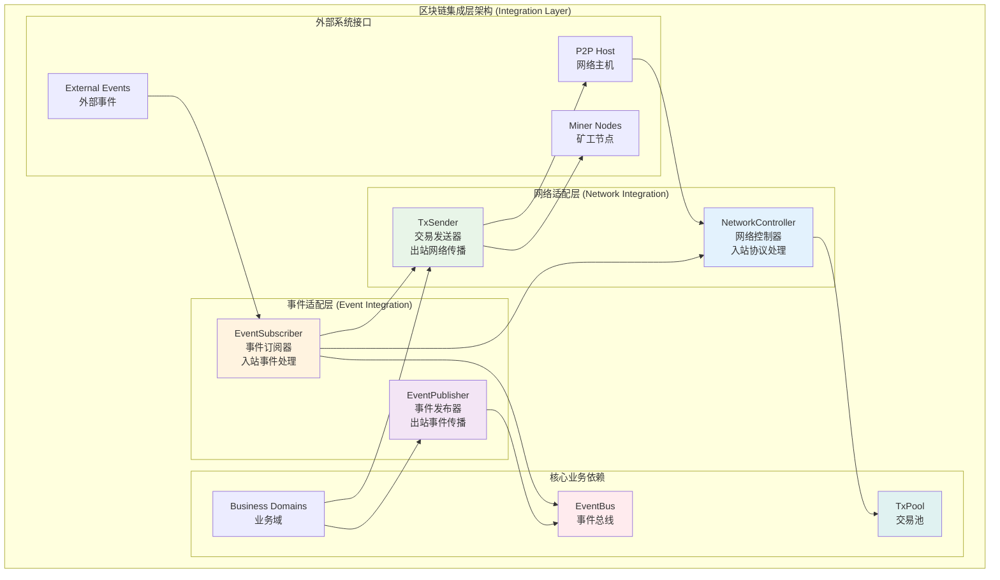
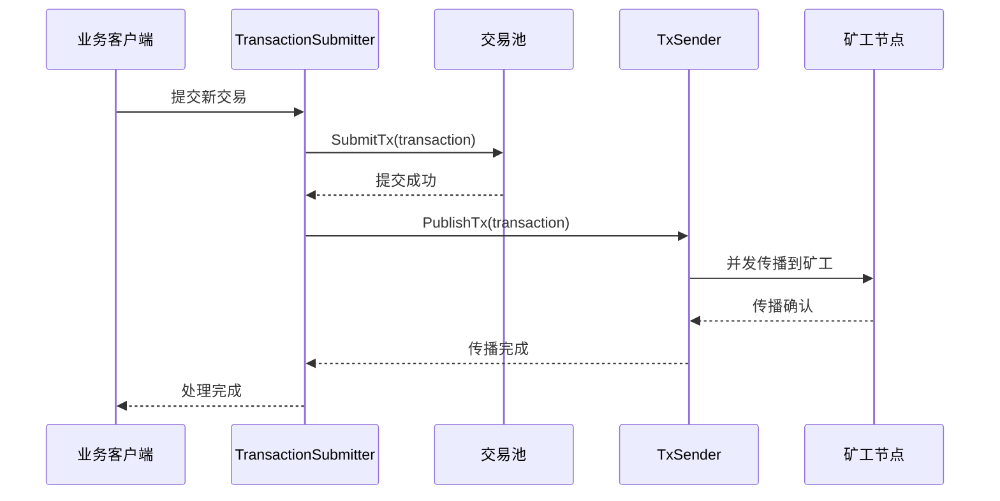
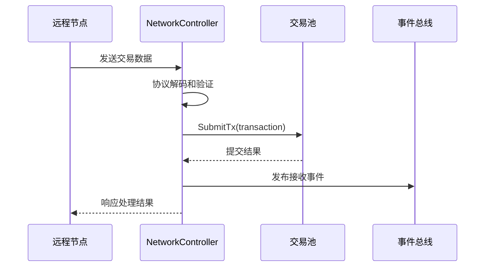
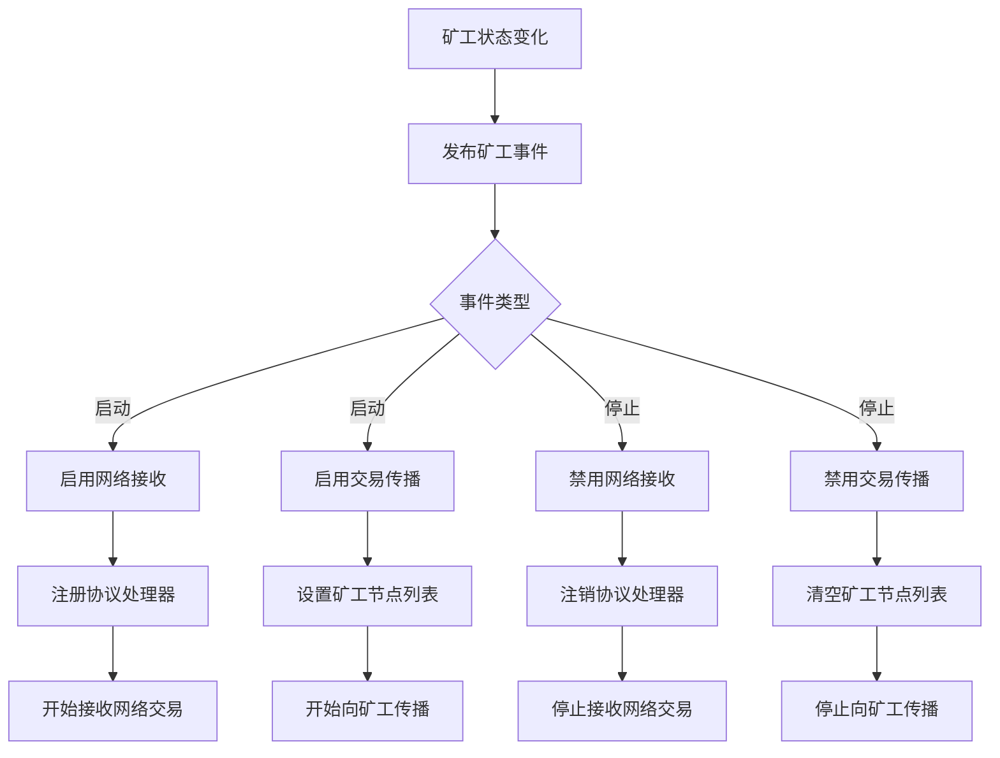

# 区块链集成层 (Blockchain Integration Layer)

## 【模块定位】

**区块链集成层**是WES区块链系统的适配协调模块，负责实现"端口-适配器（Ports & Adapters）"模式，协调区块链核心组件与外部系统（网络、事件）的适配工作。作为架构中的关键适配层，集成层保持核心业务逻辑的纯净性，提供统一的外部系统接入标准。

## 【设计原则】

### 适配器模式原则

- **端口分离**: 明确区分入站（incoming）和出站（outgoing）端口类型
- **内部适配**: 作为组件内部适配层，不对外暴露公共接口
- **协议隔离**: 网络协议处理与业务逻辑完全分离

### 事件驱动原则

- **松耦合设计**: 通过事件系统实现组件间的松耦合协作
- **动态控制**: 支持基于事件的运行时功能启停控制
- **状态响应**: 根据系统状态智能调整组件行为

### 架构边界原则

- **职责单一**: 仅负责适配路由，不包含业务验证逻辑
- **高内聚**: 每个子层职责清晰明确
- **接口纯净**: 避免在接口中暴露生命周期方法

## 【核心职责】

### 网络适配管理

- 提供区块链组件与P2P网络的标准适配接口
- 管理网络协议的注册、路由和转发
- 实现交易、区块等数据的网络传播和接收

### 事件适配管理

- 协调系统内部事件的订阅和发布
- 提供事件驱动的组件启停控制机制
- 管理跨组件的事件传播和处理

### 交易流程协调

- 支持本地直写和网络传播的双路径交易处理
- 实现基于矿工状态的智能传播控制
- 提供高性能的交易路由和转发服务

## 【架构组件】



## 【目录结构说明】

```text
integration/
├── network/                # 网络适配层
│   ├── stream_handlers.go     # 流式协议处理器
│   ├── subscribe_handlers.go  # 订阅式协议处理器
│   └── README.md             # 网络适配层文档
├── event/                  # 事件适配层（规划中）
│   ├── incoming/             # 入站事件订阅处理
│   ├── outgoing/             # 出站事件发布处理
│   └── README.md             # 事件适配层文档
└── README.md              # 本文档
```

## 【依赖关系】

### 上层业务依赖

- **domains/transaction**: 交易业务逻辑和处理服务
- **domains/block**: 区块业务逻辑和处理服务
- **domains/sync**: 同步业务逻辑和协调服务

### 下层基础设施依赖

- **pkg/interfaces/mempool**: 交易池接口
- **pkg/interfaces/network**: P2P网络接口
- **pkg/interfaces/infrastructure/event**: 事件总线接口
- **pkg/interfaces/infrastructure/log**: 日志记录接口

### 外部系统依赖

- **libp2p**: P2P网络通信库
- **protobuf**: 消息序列化协议
- **fx**: 依赖注入框架

## 【系统特性】

### 双路径交易处理

- **本地直写路径**: 业务层直接通过DI调用内存池，性能优异
- **网络传播路径**: 通过P2P网络向矿工节点精准传播
- **智能路由**: 根据交易来源选择最优处理路径

### 事件驱动控制

- **矿工状态响应**: 根据矿工启停事件动态调整网络处理
- **自动化管理**: 无需手动配置，系统状态自动驱动功能开关
- **实时适配**: 支持运行时的功能启停和参数调整

### 高性能网络处理

- **并发传播**: 支持向多个矿工节点的并行传播
- **连接复用**: 高效复用已建立的P2P连接
- **精准投递**: 避免全网泛洪，减少网络负载

### 容错恢复机制

- **部分失败容忍**: 单个节点故障不影响整体功能
- **优雅降级**: 网络组件异常时提供降级服务
- **自动恢复**: 网络恢复后自动重新启用功能

## 【工作流程】

### 交易本地直写流程



### 交易网络接收流程



### 矿工事件驱动流程



## 【配置管理】

### 网络传播配置

```yaml
network:
  propagation:
    connection_timeout: "5s"      # 连接超时时间
    send_timeout: "10s"           # 发送超时时间
    read_timeout: "30s"           # 读取超时时间
    max_concurrent_sends: 100     # 最大并发发送数
    max_retry_attempts: 3         # 最大重试次数
    retry_delay: "1s"             # 重试延迟时间
  
  protocols:
    tx_relay: "/blockchain/txrelay/v1"  # 交易中继协议ID
    block_sync: "/blockchain/blocksync/v1"  # 区块同步协议ID
```

### 事件驱动配置

```yaml
events:
  miner_state:
    subscription_enabled: true    # 启用矿工状态订阅
    response_timeout: "5s"        # 事件响应超时
    retry_on_failure: true        # 失败时重试
  
  auto_control:
    network_auto_enable: true     # 自动启用网络功能
    propagation_auto_enable: true # 自动启用传播功能
```

### 性能优化配置

```yaml
performance:
  connection_pool:
    max_connections: 200          # 最大连接数
    idle_timeout: "300s"          # 空闲连接超时
    keep_alive: true              # 启用连接保活
  
  buffer_management:
    read_buffer_size: "64KB"      # 读缓冲区大小
    write_buffer_size: "64KB"     # 写缓冲区大小
    max_message_size: "1MB"       # 最大消息大小
```

## 【外部接口】

### 网络适配接口

- **NetworkController**: 网络控制器
  - `EnableTxRelay() error`
  - `DisableTxRelay() error`
  - `IsEnabled() bool`

- **TxSender**: 交易发送器
  - `PublishTx(ctx, tx) error`
  - `EnablePropagation(minerNodes) error`
  - `DisablePropagation() error`

### 事件适配接口

- **EventSubscriber**: 事件订阅器
  - `SubscribeMinerEvents() error`
  - `UnsubscribeEvents() error`
  - `HandleMinerStateChange(event) error`

- **EventPublisher**: 事件发布器
  - `PublishNetworkEvent(event) error`
  - `PublishTransactionEvent(event) error`

### 生命周期接口

- **Integration管理器**: 集成层管理
  - `Start(ctx) error`
  - `Stop(ctx) error`
  - `GetStatus() *Status`

## 【相关文档】

- **网络适配层**: `internal/core/blockchain/integration/network/README.md`
- **事件适配层**: `internal/core/blockchain/integration/event/README.md`
- **P2P网络接口**: `pkg/interfaces/network/README.md`
- **事件总线接口**: `pkg/interfaces/infrastructure/event/README.md`
- **依赖注入指南**: `docs/architecture/dependency-injection.md`

## 【使用策略】

### 集成开发策略

- **接口优先**: 优先定义清晰的适配接口，再实现具体逻辑
- **事件驱动**: 充分利用事件驱动机制实现松耦合设计
- **分层隔离**: 保持网络层、事件层、业务层的清晰边界

### 性能优化策略

- **连接管理**: 合理管理P2P连接池，避免频繁建立连接
- **并发控制**: 根据系统负载动态调整并发传播数量
- **缓存策略**: 合理缓存网络连接和协议状态

### 扩展策略

- **协议扩展**: 支持新网络协议的无缝集成
- **事件扩展**: 支持新事件类型的订阅和处理
- **适配器复用**: 为其他组件提供标准的适配器模式

### 测试策略

- **接口测试**: 重点测试适配接口的正确性
- **集成测试**: 验证与外部系统的集成效果
- **性能测试**: 验证高负载下的系统表现

## 【错误处理】

### 网络适配错误

- **ConnectionError**: P2P连接建立失败
- **ProtocolError**: 网络协议解析错误
- **TransmissionError**: 数据传输失败
- **TimeoutError**: 网络操作超时

### 事件适配错误

- **SubscriptionError**: 事件订阅失败
- **PublishError**: 事件发布失败
- **HandlerError**: 事件处理器执行失败
- **ConfigurationError**: 事件配置错误

### 业务协调错误

- **RoutingError**: 消息路由失败
- **ValidationError**: 适配层验证失败
- **ResourceError**: 系统资源不足
- **StateError**: 组件状态异常

### 错误恢复机制

- **自动重试**: 对临时性错误实施智能重试机制
- **降级服务**: 在部分功能失败时提供基础服务
- **状态恢复**: 系统恢复后自动重新初始化组件
- **监控告警**: 实时监控关键错误并及时告警
