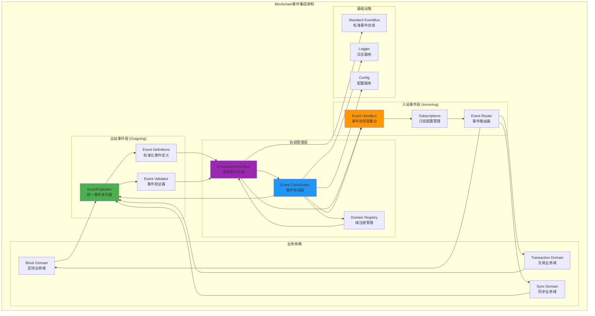
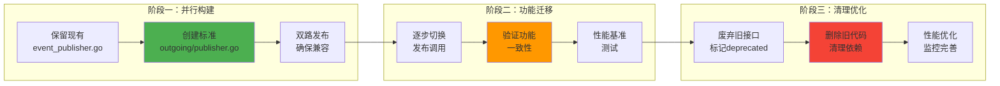

# Blockchain事件集成层 (Blockchain Event Integration Layer)

## 【模块定位】

　　**Blockchain事件集成层**是WES区块链系统事件通信的标准化实现，遵循端口适配器架构模式。本模块负责统一管理区块链组件的事件发布和订阅，实现与增强事件系统的深度集成，为区块链业务逻辑提供高效、可靠的事件通信服务。

## 【设计原则】

### 标准化原则

- **统一接口**：使用标准`event.EventBus`接口，完全兼容增强事件系统
- **域注册管理**：遵循事件域注册规范，实现"blockchain"域的标准化管理
- **类型安全**：统一使用`event.EventType`类型，避免类型转换开销

### 分离原则

- **入站出站分离**：明确区分事件订阅处理(incoming)和事件发布(outgoing)
- **业务适配分离**：事件集成层专注于事件路由，不包含业务逻辑
- **生命周期分离**：事件管理与组件生命周期解耦

### 增强原则

- **智能路由**：利用增强事件系统的路由策略和优先级管理
- **事件验证**：实现区块链特定的事件验证规则
- **统计监控**：提供完整的事件统计和健康状态监控

## 【架构组件】



## 【目录结构】

```text
integration/event/
├── README.md                    ← 本文档：事件集成架构说明
├── outgoing/                    ← 出站事件发布层
│   ├── publisher.go                ← 统一事件发布器实现
│   ├── events.go                   ← 标准化事件定义
│   ├── payloads.go                 ← 事件载荷结构
│   └── validator.go                ← 事件验证器
├── incoming/                    ← 入站事件处理层
│   ├── handlers.go                 ← 统一事件处理器
│   ├── subscriptions.go            ← 订阅配置管理
│   └── router.go                   ← 事件路由器
├── coordinator.go               ← 事件协调器
├── module.go                    ← 依赖注入模块
├── integration_test.go          ← 事件集成测试
└── benchmark_test.go            ← 性能基准测试
```

## 【核心接口】

### EventPublisher - 统一事件发布器

```go
type EventPublisher interface {
    // 区块相关事件发布
    PublishBlockProduced(block *core.Block, miner []byte) error
    PublishBlockProcessed(block *core.Block, processingTime time.Duration) error
    PublishBlockValidated(block *core.Block, isValid bool) error
    
    // 链状态事件发布
    PublishChainHeightChanged(previousHeight, newHeight uint64, blockHash []byte) error
    PublishChainStateUpdated(height uint64, blockHash []byte, totalTxs uint64, stateRoot []byte) error
    PublishChainReorganized(fromHeight, toHeight uint64, reason string) error
    
    // 交易相关事件发布
    PublishTransactionValidated(tx *core.Transaction, isValid bool, reason string) error
    PublishTransactionExecuted(tx *core.Transaction, result ExecutionResult) error
    PublishTransactionFailed(tx *core.Transaction, error error) error
    
    // 批量发布
    PublishEvents(events []EventData) error
}
```

### EventSubscriber - 统一事件订阅器

```go
type EventSubscriber interface {
    // 区块事件订阅
    SubscribeBlockEvents(handler BlockEventHandler) (SubscriptionID, error)
    SubscribeChainEvents(handler ChainEventHandler) (SubscriptionID, error)
    SubscribeTransactionEvents(handler TransactionEventHandler) (SubscriptionID, error)
    
    // 外部事件订阅
    SubscribeConsensusEvents(handler ConsensusEventHandler) (SubscriptionID, error)
    SubscribeNetworkEvents(handler NetworkEventHandler) (SubscriptionID, error)
    
    // 订阅管理
    Unsubscribe(subscriptionID SubscriptionID) error
    UnsubscribeAll() error
}
```

### EventCoordinator - 事件协调器

```go
type EventCoordinator interface {
    // 生命周期管理
    Start(ctx context.Context) error
    Stop(ctx context.Context) error
    IsRunning() bool
    
    // 域管理
    RegisterBlockchainDomain() error
    ValidateEventName(eventName string) error
    
    // 统计监控
    GetStatistics() *EventStatistics
    GetHealthStatus() *HealthStatus
    
    // 配置管理
    UpdateConfiguration(config *EventConfig) error
}
```

## 【事件类型体系】

### 标准化事件常量

```go
const (
    // 区块生命周期事件
    EventTypeBlockProduced      = "blockchain.block.produced"      // 区块生产完成
    EventTypeBlockValidated     = "blockchain.block.validated"     // 区块验证完成
    EventTypeBlockProcessed     = "blockchain.block.processed"     // 区块处理完成
    EventTypeBlockConfirmed     = "blockchain.block.confirmed"     // 区块确认
    EventTypeBlockReverted      = "blockchain.block.reverted"      // 区块回滚
    EventTypeBlockFinalized     = "blockchain.block.finalized"     // 区块最终确认
    
    // 链状态事件
    EventTypeChainHeightChanged = "blockchain.chain.height_changed" // 链高度变化
    EventTypeChainStateUpdated  = "blockchain.chain.state_updated"  // 链状态更新
    EventTypeChainReorganized   = "blockchain.chain.reorganized"    // 链重组
    
    // 交易生命周期事件
    EventTypeTransactionReceived  = "blockchain.transaction.received"  // 交易接收
    EventTypeTransactionValidated = "blockchain.transaction.validated" // 交易验证
    EventTypeTransactionExecuted  = "blockchain.transaction.executed"  // 交易执行
    EventTypeTransactionFailed    = "blockchain.transaction.failed"    // 交易失败
    EventTypeTransactionConfirmed = "blockchain.transaction.confirmed" // 交易确认
    
    // 同步相关事件
    EventTypeSyncStarted         = "blockchain.sync.started"          // 同步开始
    EventTypeSyncCompleted       = "blockchain.sync.completed"        // 同步完成
    EventTypeSyncFailed          = "blockchain.sync.failed"           // 同步失败
    EventTypeSyncProgress        = "blockchain.sync.progress"         // 同步进度
)
```

### 事件优先级配置

| 事件类型 | 优先级 | 路由策略 | 说明 |
|----------|--------|----------|------|
| 区块生产完成 | Critical | Broadcast | 关键业务事件，需要广播 |
| 链高度变化 | High | Broadcast | 重要状态变化，需要广播 |
| 交易执行 | Normal | Direct | 普通业务事件，定向路由 |
| 同步进度 | Low | Filter | 统计事件，按需过滤 |

## 【增强功能集成】

### 域注册配置

```go
// Blockchain域注册信息
var BlockchainDomainInfo = event.DomainInfo{
    Name:        "blockchain",
    Component:   "blockchain_core",
    Description: "WES区块链核心事件域",
    EventTypes: []string{
        "blockchain.block.*",
        "blockchain.chain.*", 
        "blockchain.transaction.*",
        "blockchain.sync.*",
    },
    Active: true,
}
```

### 验证规则配置

```go
// 区块事件验证规则
type BlockEventValidationRule struct {
    id string
}

func (r *BlockEventValidationRule) Validate(event Event) error {
    // 1. 验证事件名称格式
    if !strings.HasPrefix(string(event.Type()), "blockchain.block.") {
        return nil // 非区块事件跳过
    }
    
    // 2. 验证载荷数据
    data := event.Data()
    if blockData, ok := data.(BlockEventData); ok {
        if blockData.Block == nil {
            return fmt.Errorf("区块数据不能为空")
        }
        if blockData.Block.Header == nil {
            return fmt.Errorf("区块头不能为空")
        }
        if blockData.Block.Header.Height <= 0 {
            return fmt.Errorf("区块高度必须大于0")
        }
    }
    
    return nil
}
```

### 智能路由配置

```go
// 区块链事件路由策略配置
var BlockchainRouteStrategies = map[string]RouteStrategy{
    "blockchain.block.produced":      RouteStrategyBroadcast,
    "blockchain.block.finalized":     RouteStrategyBroadcast,
    "blockchain.chain.height_changed": RouteStrategyBroadcast,
    "blockchain.transaction.executed": RouteStrategyDirect,
    "blockchain.sync.progress":       RouteStrategyFilter,
}
```

## 【集成策略】

### 渐进式迁移策略



### 兼容性保证

1. **接口兼容**：新`EventPublisher`完全兼容现有方法签名
2. **数据兼容**：事件载荷结构保持完全兼容
3. **行为兼容**：事件发布时机和顺序保持一致
4. **性能兼容**：新系统性能不低于现有实现

## 【配置管理】

### 事件集成配置

```yaml
blockchain:
  event_integration:
    # 基础配置
    enabled: true
    enhanced_features: true
    
    # 域注册配置
    domain_registration:
      auto_register: true
      strict_validation: true
      
    # 路由配置
    routing:
      default_strategy: "broadcast"
      priority_routing: true
      
    # 验证配置
    validation:
      enabled: true
      rules:
        - "block_format_validation"
        - "chain_state_validation"
        - "transaction_validation"
        
    # 性能配置
    performance:
      batch_size: 100
      buffer_size: 1000
      worker_count: 4
      
    # 监控配置
    monitoring:
      statistics_enabled: true
      health_check_interval: "30s"
      metrics_update_interval: "10s"
```

## 【使用示例】

### 基础事件发布

```go
// 获取事件发布器
publisher := coordinator.GetEventPublisher()

// 发布区块生产事件
err := publisher.PublishBlockProduced(block, minerAddress)
if err != nil {
    logger.Errorf("发布区块生产事件失败: %v", err)
}

// 批量发布事件
events := []EventData{
    NewBlockEventData(EventTypeBlockProduced, block),
    NewChainEventData(EventTypeChainHeightChanged, height),
}
err = publisher.PublishEvents(events)
```

### 事件订阅处理

```go
// 获取事件订阅器
subscriber := coordinator.GetEventSubscriber()

// 订阅区块事件
subscriptionID, err := subscriber.SubscribeBlockEvents(func(event BlockEvent) error {
    logger.Infof("接收到区块事件: %s, 高度: %d", event.Type, event.Height)
    return nil
})

// 订阅共识事件（跨组件）
subscriptionID, err = subscriber.SubscribeConsensusEvents(func(event ConsensusEvent) error {
    // 处理来自共识模块的事件
    return handleConsensusEvent(event)
})
```

### 增强功能使用

```go
// 域注册
err := coordinator.RegisterBlockchainDomain()
if err != nil {
    logger.Errorf("注册blockchain域失败: %v", err)
}

// 获取统计信息
stats := coordinator.GetStatistics()
logger.Infof("事件统计: 总数=%d, 成功=%d, 失败=%d", 
    stats.TotalEvents, stats.SuccessfulEvents, stats.FailedEvents)

// 获取健康状态
health := coordinator.GetHealthStatus()
if health.Overall != HealthHealthy {
    logger.Warnf("事件系统健康警告: %v", health.Issues)
}
```

## 【测试策略】

### 单元测试

- **发布器测试**：验证所有事件发布方法的正确性
- **订阅器测试**：验证事件订阅和处理的正确性
- **协调器测试**：验证域注册和配置管理
- **验证器测试**：验证事件验证规则的准确性

### 集成测试

- **端到端测试**：验证完整的事件发布-订阅流程
- **兼容性测试**：验证新旧系统的兼容性
- **压力测试**：验证高负载下的系统稳定性
- **故障测试**：验证异常情况的处理能力

### 性能测试

- **吞吐量测试**：测试事件发布和处理的QPS
- **延迟测试**：测试事件传递的端到端延迟
- **内存测试**：测试长时间运行的内存使用情况
- **并发测试**：测试多线程并发访问的安全性

## 【监控指标】

### 核心指标

| 指标名称 | 类型 | 说明 |
|---------|------|------|
| blockchain_events_total | Counter | 总事件发布数量 |
| blockchain_events_success | Counter | 成功发布事件数量 |
| blockchain_events_failed | Counter | 失败发布事件数量 |
| blockchain_event_latency | Histogram | 事件处理延迟分布 |
| blockchain_subscriptions_active | Gauge | 活跃订阅数量 |
| blockchain_domain_health | Gauge | 域健康状态 |

### 业务指标

| 指标名称 | 类型 | 说明 |
|---------|------|------|
| blockchain_blocks_produced | Counter | 区块生产事件数量 |
| blockchain_transactions_executed | Counter | 交易执行事件数量 |
| blockchain_chain_height | Gauge | 当前链高度 |
| blockchain_sync_progress | Gauge | 同步进度百分比 |

## 【错误处理】

### 错误分类

| 错误类型 | 处理策略 | 恢复机制 |
|---------|----------|----------|
| 网络错误 | 重试3次 | 指数退避 |
| 验证错误 | 记录日志，丢弃 | 无 |
| 序列化错误 | 记录日志，告警 | 降级处理 |
| 系统错误 | 熔断保护 | 自动恢复 |

### 降级策略

1. **发布降级**：增强功能故障时回退到基础EventBus
2. **订阅降级**：订阅器故障时使用默认处理器
3. **验证降级**：验证器故障时跳过验证步骤
4. **路由降级**：路由器故障时使用广播策略

## 【相关文档】

- [事件系统设计文档](../../../docs/architecture/EVENT_SYSTEM_DESIGN.md)
- [增强事件系统接口](../../../pkg/interfaces/infrastructure/event/README.md)
- [Blockchain组件架构](../README.md)
- [依赖注入指南](../../../docs/architecture/dependency-injection.md)
