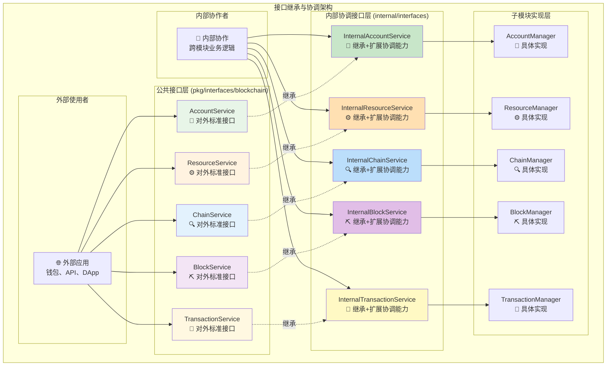

# 区块链内部接口协调层（internal/core/blockchain/interfaces）

【模块定位】
　　本模块定义了区块链核心实现的内部接口协调层，承担公共接口与子模块实现之间的桥接责任。通过接口继承和扩展机制，既保证对外接口的标准化和稳定性，又为内部子模块提供更丰富的协作能力，实现复杂业务逻辑的有序组织和高效协调。

【设计原则】
- 接口继承：严格继承pkg/interfaces/blockchain的所有公共接口
- 能力扩展：为内部子模块间协作提供专用接口方法
- 类型安全：通过强类型接口确保实现的正确性和一致性
- 分层清晰：明确区分对外标准接口和内部协调接口
- 向后兼容：内部接口扩展不影响公共接口的稳定性

【核心职责】
1. **公共接口继承**：继承所有blockchain公共接口，确保API兼容性
2. **内部能力扩展**：为子模块间协作定义专用的内部接口方法
3. **类型约束保证**：通过接口类型确保实现类的正确性
4. **架构边界管理**：明确内外接口边界，维护架构层次清晰
5. **依赖注入支持**：为fx框架提供清晰的接口绑定规范
6. **扩展性预留**：为未来功能扩展预留接口定义空间

　　采用**继承+扩展**的接口设计模式，确保内部实现既满足公共接口规范，又具备内部协作的丰富能力。



**继承关系说明：**

1. **严格继承**：内部接口通过Go接口嵌入完全继承公共接口
2. **能力扩展**：在继承基础上添加内部协作专用方法
3. **实现统一**：Manager同时实现公共接口和内部接口
4. **访问隔离**：外部只能访问公共接口，内部可访问扩展能力

**接口继承代码模式：**

```go
// 内部接口继承公共接口，扩展协调能力
type InternalChainService interface {
    blockchain.ChainService  // 🔗 完全继承公共接口
    
    // 🔄 内部协作扩展方法
    GetCacheStatistics() CacheStats
    InvalidateCache(cacheType string) error
    GetInternalMetrics() InternalMetrics
    CrossModuleQuery(req CrossModuleRequest) (interface{}, error)
}

type InternalBlockService interface {
    blockchain.BlockService  // 🔗 完全继承公共接口
    
    // 🔄 内部协作扩展方法  
    GetCandidateFromCache(blockHash []byte) (*core.Block, bool)
    StoreCandidateToCache(blockHash []byte, block *core.Block, ttl time.Duration) error
    NotifyBlockReady(blockHash []byte) error
    GetMiningMetrics() MiningMetrics
}

type InternalTransactionService interface {
    blockchain.TransactionService  // 🔗 继承基础交易服务
    blockchain.ContractService     // 🔗 继承合约服务  
    blockchain.AIModelService      // 🔗 继承AI模型服务
    blockchain.TransactionManager  // 🔗 继承交易管理器
    
    // 🔄 内部协作扩展方法
    ValidateTransactionsInBlock(ctx context.Context, transactions []*transaction.Transaction) (bool, error)
    GetMiningTemplate(ctx context.Context) ([]*transaction.Transaction, error)
}
```

## 📁 接口文件结构

```
interfaces/
├── README.md                    ← 本文件：接口设计说明
├── chain.go                     ← InternalChainService 接口定义
├── block.go                     ← InternalBlockService 接口定义 + 细粒度接口
├── transaction.go               ← InternalTransactionService 接口定义（已扩展）
├── account.go                   ← InternalAccountService 接口定义
├── sync.go                      ← InternalSystemSyncService 接口定义
├── fork.go                      ← InternalForkService 接口定义
└── resource.go                  ← InternalResourceService 接口定义
```

## 🎯 **细粒度接口分离设计**

【解决循环依赖的接口分离策略】

**设计背景：**
　　在区块链系统中，BlockService、ForkService、SyncService之间存在天然的循环依赖关系。为了解决这个架构问题，我们在`block.go`中引入了细粒度接口分离设计。

**核心思想：**
　　将复杂的BlockService按职责分离为多个细粒度接口，让依赖方只依赖它们真正需要的接口，从而打破循环依赖。

### **细粒度接口定义**

```go
// 🎯 区块验证接口 - 专注验证逻辑
type BlockValidator interface {
    ValidateBlock(ctx context.Context, block *core.Block) (bool, error)
    ValidateMerkleRoot(ctx context.Context, transactions []*transaction.Transaction, expectedMerkleRoot []byte) (bool, error)
}

// 🔄 区块处理接口 - 专注状态变更
type BlockProcessor interface {
    ProcessBlock(ctx context.Context, block *core.Block) error
}

// 📖 区块读取接口 - 专注数据查询
type BlockReader interface {
    GetBlock(ctx context.Context, height uint64) (*core.Block, error)
    GetBlockByHash(ctx context.Context, hash []byte) (*core.Block, error)
    GetBlockHeight(ctx context.Context) (uint64, error)
}

// 💾 区块写入接口 - 专注数据持久化
type BlockWriter interface {
    WriteBlock(ctx context.Context, block *core.Block) error
}

// 🎯 复合接口 - 便捷组合
type BlockValidatorProcessor interface {
    BlockValidator
    BlockProcessor
}
```

### **依赖关系重构**

**❌ 原循环依赖：**
```
BlockService → ForkService → SyncService → BlockService
```

**✅ 新架构设计：**
```
BlockService (实现所有细粒度接口)
     ↓ 单向依赖
ForkService (只依赖 BlockValidatorProcessor)
SyncService (只依赖 BlockValidatorProcessor)
ChainService (直接依赖 BlockService + TransactionService)
```

### **实现策略**

1. **接口归属**：所有细粒度接口定义在`block.go`中，保持统一架构
2. **实现统一**：`block.Manager`实现所有接口，确保功能完整性
3. **依赖精确**：各服务只依赖所需的最小接口集合
4. **向后兼容**：公共接口保持不变，内部重构对外透明

### **架构优势**

- 🎯 **单一职责**：每个接口专注特定功能领域
- 🔄 **依赖倒置**：高层模块不依赖低层模块的具体实现
- 🧪 **易于测试**：可以轻松Mock细粒度接口
- 📈 **可扩展性**：新服务只需依赖所需的最小接口集
- 🛡️ **类型安全**：编译时检查接口实现完整性

## 🚀 **交易接口重大升级**

【InternalTransactionService 全面功能扩展】

**多接口继承设计：**

`InternalTransactionService` 通过继承四个核心公共接口，提供完整的交易处理能力：

1. **TransactionService** - 基础资产转账服务
2. **ContractService** - 智能合约部署和调用
3. **AIModelService** - AI模型部署和推理
4. **TransactionManager** - 交易生命周期管理

**内部协作扩展方法：**

### **ValidateTransactionsInBlock**
```go
ValidateTransactionsInBlock(ctx context.Context, transactions []*transaction.Transaction) (bool, error)
```

**功能描述：**
- 批量验证区块中所有交易的完整性
- 检查交易签名、UTXO引用、费用计算等
- 为区块验证提供高性能的交易验证服务
- 支持并行验证，提升区块处理速度

### **GetMiningTemplate**  
```go
GetMiningTemplate(ctx context.Context) ([]*transaction.Transaction, error)
```

**功能描述：**
- 一站式挖矿模板生成服务
- 从内存池获取优质交易
- 计算所有交易费用聚合
- 生成包含奖励的Coinbase交易
- 返回完整的交易列表（Coinbase交易在首位）

**设计优势：**
- **职责集中**：交易相关逻辑完全内聚在transaction服务
- **简化调用**：blockchain层只需一次调用获得完整模板
- **性能优化**：内部缓存和批量处理提升效率
- **易于维护**：交易逻辑变更不影响其他层

## 🎯 接口设计原则

### **1. 继承公共接口**
```go
// ✅ 正确：简单继承公共接口
type InternalBlockService interface {
    blockchain.BlockService  // 继承所有公共方法
    // 暂时不扩展，保持简洁
}

// ❌ 错误：重新定义公共方法
type InternalBlockService interface {
    CreateMiningCandidate(ctx context.Context) ([]byte, error)  // 重复定义
    ProcessBlock(ctx context.Context, block *core.Block) error // 重复定义
}
```

### **2. 保持简洁**
当前阶段内部接口仅作为类型标识，不添加额外方法：
- **类型安全**: 确保内部实现正确实现公共接口
- **未来扩展**: 为将来可能的内部方法扩展预留接口
- **架构清晰**: 明确内部实现的接口边界

### **3. 接口边界**
- **对外**: 通过公共接口提供标准API
- **对内**: 通过内部接口进行类型约束
- **实现**: 管理器实现内部接口，自动满足公共接口

## 🔄 接口实现模式

### **推荐实现方式**
```go
// 管理器同时实现公共接口和内部接口
type BlockManager struct {
    repository repository.RepositoryManager
    cache      BlockCacheManager
    logger     log.Logger
    // ... 其他字段
}

// 实现公共接口方法
func (bm *BlockManager) CreateMiningCandidate(ctx context.Context) ([]byte, error) {
    // 实现公共接口逻辑
}

func (bm *BlockManager) ProcessBlock(ctx context.Context, block *core.Block) error {
    // 实现公共接口逻辑  
}

// 实现内部接口扩展方法
func (bm *BlockManager) GetFromCache(ctx context.Context, blockHash []byte) (*core.Block, error) {
    // 实现缓存获取逻辑
}

func (bm *BlockManager) StoreToCache(ctx context.Context, blockHash []byte, block *core.Block) error {
    // 实现缓存存储逻辑
}
```

### **依赖注入配置**
```go
// 在module.go中同时提供公共接口和内部接口
fx.Provide(
    fx.Annotate(
        NewBlockManager,
        fx.As(new(blockchain.BlockService)),        // 公共接口
        fx.As(new(InternalBlockService)),           // 内部接口
    ),
)
```

## 🚀 使用场景

### **外部模块使用公共接口**
```go
// 外部模块依赖公共接口
func SomeExternalService(blockSvc blockchain.BlockService) {
    // 使用标准公共接口
    blockHash, err := blockSvc.CreateMiningCandidate(ctx)
}
```

### **内部模块使用内部接口**  
```go
// 内部模块可以使用扩展功能
func SomeInternalService(blockSvc InternalBlockService) {
    // 使用公共接口方法
    blockHash, err := blockSvc.CreateMiningCandidate(ctx)
    
    // 使用内部扩展方法
    cachedBlock, err := blockSvc.GetFromCache(ctx, blockHash)
}
```

## 📊 接口职责分工

| 接口文件 | 公共接口继承 | 当前功能 | 主要职责 |
|---------|-------------|-----------|---------|  
| **chain.go** | ChainService | 类型约束 | 链状态查询服务接口继承 |
| **block.go** | BlockService | 接口分离+实现 | 区块管理服务接口继承+细粒度接口分离 |
| **transaction.go** | TransactionService, ContractService, AIModelService, TransactionManager | 功能扩展 | 交易处理全套服务接口继承+挖矿模板服务 |
| **fork.go** | - | 类型约束 | 分叉处理服务接口定义 |
| **sync.go** | - | 类型约束 | 同步服务接口定义 |
| **account.go** | AccountService | 类型约束 | 账户管理服务接口继承 |
| **resource.go** | ResourceService | 类型约束 | 资源管理服务接口继承 |

### **block.go 特殊说明**

`block.go` 文件包含两类接口：

1. **主接口**：`InternalBlockService` - 继承公共BlockService
2. **细粒度接口**：`BlockValidator`、`BlockProcessor`、`BlockReader`、`BlockWriter`等

这种设计既保持了统一架构（接口与实现一一对应），又通过接口分离解决了循环依赖问题。

## 🔧 开发指导

### **新增内部接口步骤**
1. **继承公共接口**: 确保包含所有公共方法
2. **扩展内部方法**: 添加内部专用的管理方法
3. **更新实现类**: 让管理器实现新的内部接口
4. **配置依赖注入**: 在module.go中提供接口绑定
5. **编写测试**: 测试公共接口和内部接口功能

### **接口命名规范**
- **内部接口**: `Internal{ServiceName}Service`
- **缓存接口**: `{ServiceName}CacheManager` 
- **管理器类**: `{ServiceName}Manager`
- **数据类型**: 使用描述性命名，避免与公共类型冲突

---

**注意**: 本模块严格遵循接口继承原则，确保内部实现与公共接口完全兼容，同时通过内部接口扩展提供更丰富的管理功能。
