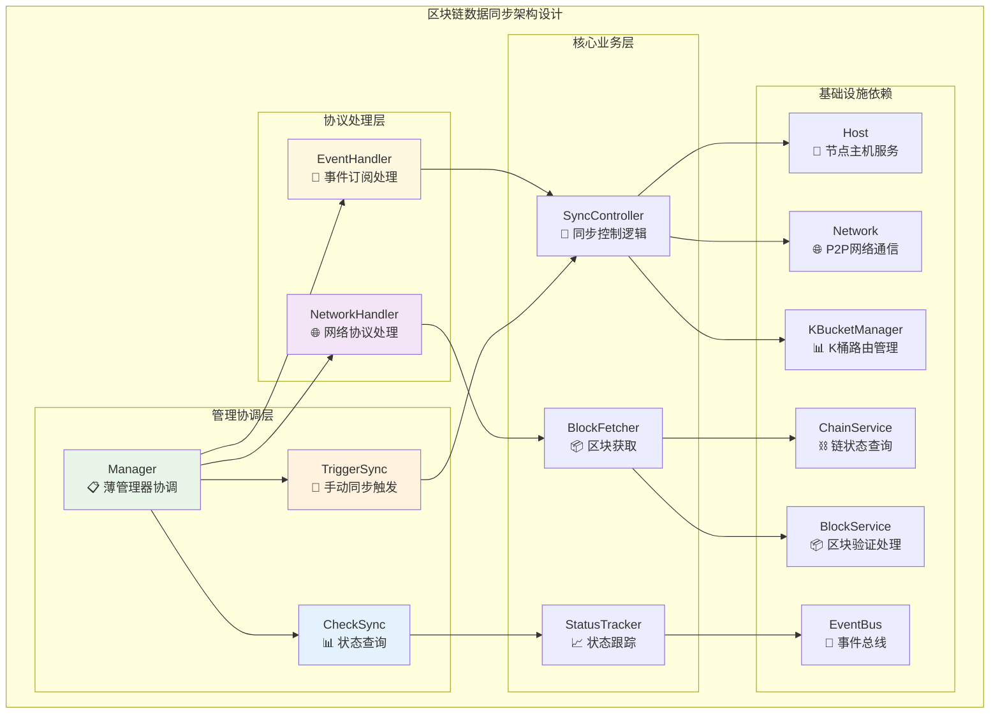
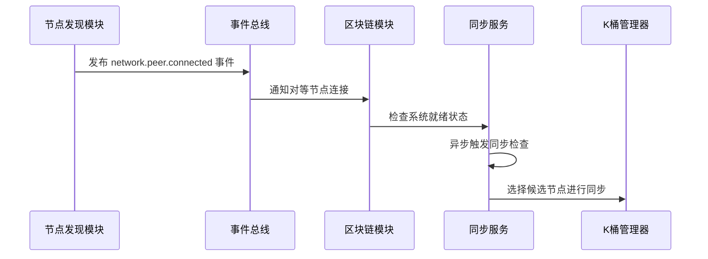
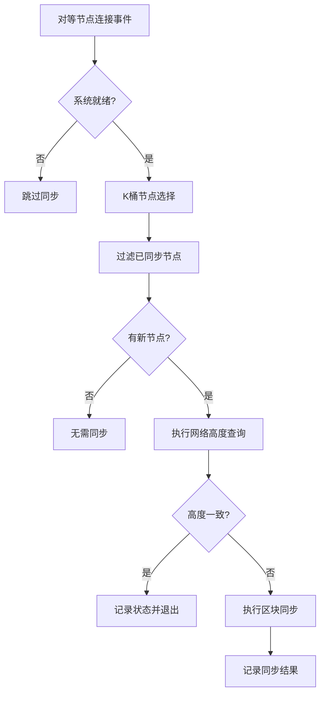
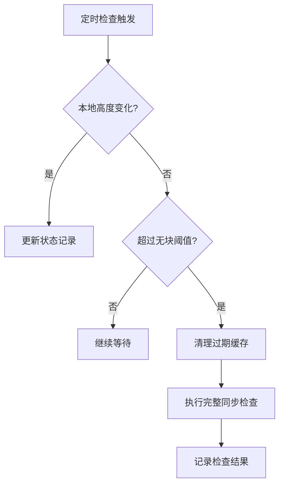
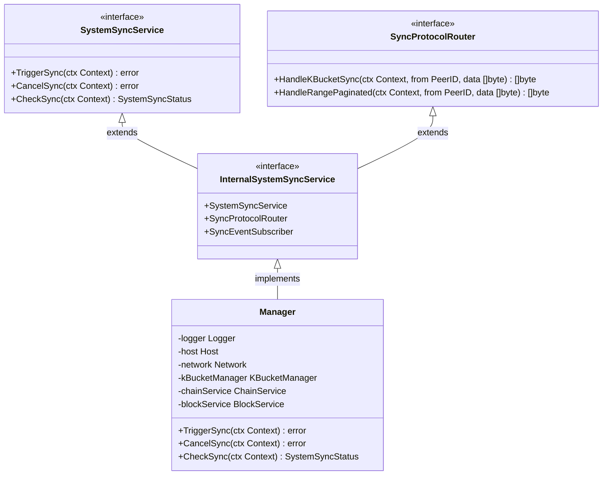

# 区块链数据同步组件（internal/core/blockchain/sync）

【模块定位】
　　本模块是WES区块链系统中数据同步功能域的核心实现组件，负责与P2P网络中的其他节点进行区块链数据同步。通过事件驱动的拉取式同步架构和K桶智能选择的设计，提供高效可靠的区块数据同步能力，支撑节点网络连接后的自动同步等核心业务场景，确保本地节点与网络的数据一致性。

【设计原则】
- **事件驱动设计**：基于对等节点连接事件触发同步，避免无效同步尝试
- **接口驱动设计**：严格使用pkg/interfaces中的公共接口，避免依赖具体实现，确保组件间松耦合
- **薄管理器模式**：Manager仅负责委托协调，具体业务逻辑由专门的处理器模块实现
- **拉取式同步策略**：主动从网络拉取数据，避免推送广播导致的网络拥塞问题
- **K桶智能选择**：基于Kademlia距离算法进行节点选择，避免依赖不可靠的节点状态
- **分层职责分离**：网络通信、区块验证、数据存储等职责分离，确保架构清晰

【核心职责】
1. **事件驱动同步**：订阅对等节点连接事件，在有可用节点时自动触发同步检查
2. **同步控制管理**：提供手动触发同步、取消同步的控制接口，支持管理和调试场景
3. **同步状态查询**：提供详细的同步状态信息，包括进度、高度差、错误信息等
4. **K桶拉取同步**：基于K桶算法选择最近邻节点，执行智能分页的区块数据拉取
5. **网络协议处理**：实现同步相关的网络协议处理器，响应其他节点的同步请求
6. **事件驱动协调**：处理分叉检测、网络质量变化等系统事件，动态调整同步策略
7. **重试故障容错**：提供梯度重试机制和故障处理策略，确保网络不稳定时的自动恢复

【实现架构】

　　采用**委托式薄管理器**的3层实现架构，确保职责分离和高内聚低耦合特性。



**架构层次说明：**

1. **管理协调层**：薄管理器实现，负责接口方法委托和统一协调
   - Manager：实现InternalSystemSyncService接口，委托具体处理
   - TriggerSync/CheckSync：核心同步方法的薄委托实现
   - 严格遵循依赖注入原则，使用公共接口

2. **协议处理层**：专门的协议和事件处理器，负责外部交互
   - NetworkHandler：处理来自其他节点的同步协议请求
   - EventHandler：处理系统事件，如分叉检测、网络质量变化
   - 独立模块化设计，便于扩展和测试

3. **核心业务层**：具体的同步业务逻辑实现，封装算法细节
   - SyncController：核心同步控制逻辑和K桶拉取算法
   - BlockFetcher：智能分页的区块获取和验证协调
   - StatusTracker：同步状态管理和进度跟踪

---

## 🎯 **同步触发策略**

### 事件驱动自动同步

　　系统采用事件驱动的自动同步机制，确保在合适的时机触发同步操作：

#### 1. 对等节点连接事件触发



#### 2. 同步触发时机设计

**✅ 正确的触发时机：**
- 对等节点连接成功后（`network.peer.connected` 事件）
- 系统就绪检查通过后
- K桶中有可用节点时

**❌ 错误的触发时机：**
- 区块链模块启动完成时（此时可能无网络连接）
- 固定时间间隔轮询（浪费资源且可能无节点可用）
- 网络服务启动时（节点发现可能还未完成）

#### 3. 事件驱动优势

- **智能时机**：只在有对等节点时才尝试同步，避免无效请求
- **资源节省**：避免无节点时的轮询和重试开销
- **响应迅速**：对等节点连接后立即检查并同步
- **故障容错**：单个节点连接失败不影响整体同步能力
- **重复避免**：智能缓存已同步节点状态，避免对同一节点重复请求

#### 4. 智能同步策略

**4.1 节点状态缓存机制**

系统维护已同步节点的状态缓存，避免重复向同一节点请求：

- **缓存时间**: 默认5分钟，可配置
- **缓存内容**: 节点ID、最后同步时间、同步高度、高度一致性标记
- **清理策略**: 定期清理过期记录，避免内存泄漏

```
如果节点A在5分钟内已经与节点B同步过且高度一致，
则不会再次向节点B发起同步请求，直到缓存过期或高度变化
```

**4.2 定时同步机制**

除了事件驱动同步外，系统还实现了基于时间的定期同步：

- **触发条件**: 长时间无新区块产生
- **检查间隔**: 默认10分钟，可通过`TimeCheckIntervalMins`配置
- **无块阈值**: 默认15分钟无新区块时触发，可通过`TimeCheckThresholdMins`配置

#### 5. 同步决策逻辑

**5.1 智能过滤流程**



**5.2 定时同步流程**



---

## 🎯 **核心业务流程**

【流程概述】

　　区块链数据同步采用**事件驱动+定时触发的智能同步**策略，结合节点状态缓存机制，既能快速响应网络变化，又能避免重复同步，确保高效可靠的区块链数据一致性。

**核心特性：**
1. **事件驱动同步**：监听节点连接事件，智能触发同步检查
2. **定时同步保障**：长时间无新区块时自动触发同步
3. **节点状态缓存**：避免对已同步节点重复请求，提高效率
4. **智能过滤机制**：只向新节点或缓存过期节点发起同步请求

### **📊 智能同步流程图**

```mermaid
sequenceDiagram
    participant API as 📱 API/管理接口
    participant Manager as 📋 同步管理器
    participant Controller as 🎯 同步控制器
    participant KBucket as 📊 K桶管理器
    participant Network as 🌐 网络服务
    participant RemotePeer as 🔗 远程节点
    participant BlockSvc as 📦 区块服务

    Note over API,BlockSvc: 🎯 阶段1: 同步触发与节点选择
    API->>+Manager: TriggerSync(ctx)
    Manager->>+Controller: 委托执行同步控制
    
    Controller->>+KBucket: FindClosestPeers(localNodeID, count=5)
    Note right of KBucket: 基于Kademlia距离算法<br/>选择最近的5个节点
    KBucket-->>-Controller: 返回节点列表 peerList[]
    
    Note over Controller,RemotePeer: 📊 阶段1.5: 网络高度查询
    loop 优先级节点高度查询
        Controller->>+Network: Call(peer, ProtocolKBucketSync, heightQuery)
        Network->>+RemotePeer: 发送高度查询请求 (1KB限制)
        
        Note right of RemotePeer: 高度查询响应：<br/>• 返回网络当前高度<br/>• 极小响应包(仅头信息)
        
        RemotePeer-->>-Network: 网络高度信息
        Network-->>-Controller: 接收高度响应
        
        alt 高度查询成功
            Note over Controller: 获得网络真实高度<br/>选择第一个成功节点
            break 使用第一个成功响应
        else 节点响应失败
            Note over Controller: 尝试下一个K桶节点
        end
    end
    
    Note over Controller,RemotePeer: 🌐 阶段2: K桶智能同步请求
    loop 遍历K桶节点列表
        Controller->>+Network: Call(peer, ProtocolKBucketSync, blockRequest)
        Network->>+RemotePeer: 发送首批区块请求
        
        Note right of RemotePeer: 智能分页响应：<br/>• 返回首批区块数据<br/>• 不再依赖NextHeight推高度
        
        RemotePeer-->>-Network: 首批区块数据
        Network-->>-Controller: 接收区块响应
        
        alt 成功获取数据
            Controller->>+BlockSvc: ValidateBlock(block) / ProcessBlock(block)
            BlockSvc-->>-Controller: 验证处理结果
            break 使用第一个成功的节点
        else 节点响应失败
            Note over Controller: 尝试下一个K桶节点
        end
    end
    
    Note over Controller,BlockSvc: 📦 阶段3: 分页补齐同步
    alt 需要更多区块数据
        loop 直到同步完成
            Controller->>+Network: Call(peer, ProtocolRangePaginated, request)
            Network->>+RemotePeer: 请求区块范围数据
            RemotePeer-->>-Network: 返回分页区块数据
            Network-->>-Controller: 区块数据
            
            Controller->>+BlockSvc: ValidateBlock + ProcessBlock
            BlockSvc-->>-Controller: 处理完成
        end
    end
    
    Controller-->>-Manager: 同步完成
    Manager-->>-API: 返回同步结果
```

### **🔄 详细流程分析**

#### **阶段1: 同步触发与节点选择**

**📍 核心职责**: 根据K桶算法选择最优节点，为同步操作选择可靠的数据源

**🔄 详细步骤**:

1. **触发条件检查** (`SyncController`)
   - 验证当前系统状态，避免在分叉处理期间同步
   - 获取本地链高度作为同步起点
   - 检查是否已有活跃的同步任务

2. **K桶节点选择** (`KBucketManager`)
   - 使用Kademlia距离算法：`distance = XOR(localNodeID, targetPeerID)`
   - 按距离升序排列，选择最近的5个节点
   - 不依赖节点"活跃"状态，完全基于算法确定性选择

**📤 输出**: 按距离排序的目标节点列表

#### **阶段1.5: 网络高度查询**

**📍 核心职责**: 显式查询网络真实高度，为后续同步提供准确的目标高度

**🔄 详细步骤**:

1. **高度查询请求**: 使用`ProtocolKBucketSync`协议发送专门的高度查询请求
2. **优先级节点**: 优先使用第一个成功响应的节点，确保高度数据一致性
3. **智能响应大小**: 高度查询使用极小响应大小（1KB），避免网络浪费

**📤 输出**: 网络真实高度信息 + 高度数据源节点

#### **阶段2: K桶智能同步请求**

**📍 核心职责**: 获取首批区块数据，为后续分页同步提供起始数据

**🔄 详细步骤**:

1. **首批区块请求**: 使用`ProtocolKBucketSync`协议获取初始区块批次
2. **智能分页响应**: 远程节点根据网络限制自主决定返回的区块数量
3. **容错处理**: 节点超时或失败时自动尝试列表中的下一个节点

**📤 输出**: 首批区块数据（不再依赖NextHeight推算网络高度）

### **🔗 关键组件交互详情**

#### **1. KBucketManager** (`K桶路由管理器`)
- **距离计算**: 基于XOR算法的确定性距离计算
- **节点选择**: 不依赖状态的算法化节点选择策略
- **容错机制**: 节点失效时的自动替换和重试机制

#### **2. Network Service** (`网络通信服务`)
- **协议处理**: 支持KBucketSync和RangePaginated两种同步协议
- **智能分页**: 接收端根据区块大小和网络限制动态调整返回数据量
- **超时管理**: 合理的请求超时和重试机制

### **⚡ 性能特征**

- **K桶节点选择**: ~1-3ms (基于内存路由表计算)
- **网络同步请求**: ~50-200ms (依赖网络延迟和区块大小)
- **区块验证处理**: ~10-50ms (依赖区块复杂度)
- **内存占用**: 10-50MB (包括区块缓存和状态数据)
- **并发支持**: 单一同步任务，避免并发冲突

### **📋 设计原则总结**

#### **1. 拉取优先策略** 🎯
- **主动同步**: 节点主动查询网络，不依赖被动推送
- **网络友好**: 避免广播风暴和网络拥塞问题
- **可控性强**: 同步时机和策略完全由本地控制

#### **2. 算法化节点选择** 📊
- **确定性选择**: 基于Kademlia算法的数学化节点选择
- **无状态依赖**: 不依赖节点"健康"等主观状态判断
- **高效容错**: 失效节点的快速替换和重试机制

#### **3. 智能分页传输** 🌐
- **网络适应**: 根据网络条件和区块大小动态调整传输量
- **效率优化**: 一次请求同时获取高度和区块数据
- **续传支持**: 支持大范围数据的分批传输和断点续传

---

## 📁 **模块组织结构**

【内部模块架构】

```
internal/core/blockchain/sync/
├── 📋 manager.go                    # 薄管理器实现，统一依赖注入和接口委托
├── 🚀 trigger.go                    # TriggerSync实现，K桶拉取同步逻辑
├── ❌ cancel.go                     # CancelSync实现，同步取消和资源清理
├── 📊 status.go                     # CheckSync实现，同步状态查询和进度跟踪
├── 🌐 network_handler/              # 网络协议处理器模块
│   ├── sync_network_handler.go     # 处理KBucketSync和RangePaginated协议
│   └── README.md                    # 网络处理器文档
├── 📡 event_handler/                # 事件处理器模块
│   ├── sync_event_handler.go       # 处理分叉检测和网络质量变化事件
│   └── README.md                    # 事件处理器文档
├── 🔧 sync_utils.go                 # 同步算法工具函数和辅助方法
└── 📝 README.md                     # 本文档
```

### **🎯 子模块职责分工**

| **子模块** | **核心职责** | **对外接口** | **内部组件** | **复杂度** |
|-----------|-------------|-------------|-------------|-----------|
| `manager.go` | 薄管理器协调 | InternalSystemSyncService | Manager结构体 | 简单 |
| `trigger.go` | 同步触发控制 | triggerSyncImpl | K桶拉取算法 | 中等 |
| `cancel.go` | 同步取消管理 | cancelSyncImpl | 取消信号和清理 | 简单 |
| `status.go` | 状态查询跟踪 | checkSyncImpl | 状态计算和进度 | 简单 |
| `network_handler/` | 协议处理 | SyncProtocolRouter | 协议解析和响应 | 中等 |
| `event_handler/` | 事件处理 | SyncEventSubscriber | 事件响应逻辑 | 简单 |

---

## 🏗️ **依赖注入架构**

【fx框架集成】

　　全面采用fx依赖注入框架，实现组件间的松耦合和生命周期自动管理。

```go
// 区块链同步模块依赖注入配置
package sync

import (
    "go.uber.org/fx"
    "github.com/weisyn/v1/pkg/interfaces/blockchain"
    "github.com/weisyn/v1/internal/core/blockchain/interfaces"
)

// Module 区块链同步模块
var Module = fx.Module("blockchain-sync",
    // 核心实现提供
    fx.Provide(
        // 薄管理器实现
        NewManager,
    ),
    
    // 公共接口导出
    fx.Provide(
        fx.Annotate(
            func(manager interfaces.InternalSystemSyncService) blockchain.SystemSyncService {
                return manager
            },
            fx.As(new(blockchain.SystemSyncService)),
        ),
    ),
)
```

**依赖管理特点：**
- **自动生命周期**：同步服务启动和停止由fx自动管理，无需手动Start/Stop方法
- **接口导向**：通过pkg/interfaces公共接口进行依赖，避免与具体实现耦合
- **层次清晰**：明确的依赖方向，Manager依赖基础设施接口，不存在循环依赖
- **测试友好**：支持接口Mock的单元测试和集成测试

---

## 📊 **性能与监控**

【性能指标】

| **操作类型** | **目标延迟** | **吞吐量目标** | **成功率** | **监控方式** |
|-------------|-------------|---------------|-----------|------------|
| K桶节点选择 | < 5ms | > 1000 ops/s | > 99% | 实时监控 |
| 网络高度查询 | < 100ms | > 50 req/s | > 95% | 实时监控 |
| 区块数据拉取 | < 1s | > 10 blocks/s | > 90% | 批量统计 |
| 同步状态查询 | < 10ms | > 100 ops/s | > 99% | 关键路径监控 |
| 事件处理响应 | < 50ms | > 100 events/s | > 99% | 异步监控 |

**性能优化策略：**
- **K桶缓存优化**：缓存距离计算结果，避免重复计算开销
- **智能分页策略**：根据网络条件动态调整区块传输批次大小
- **并发控制优化**：避免多个同步任务的资源竞争和状态冲突
- **内存管理优化**：及时释放已处理的区块数据，控制内存占用峰值

---

## 🔗 **与公共接口的映射关系**

【接口实现映射】



**实现要点：**
- **接口契约**：严格遵循pkg/interfaces/blockchain/sync.go中的方法签名和语义约定
- **错误处理**：标准化的错误返回机制，包括网络错误、验证错误、状态错误等分类
- **日志记录**：完善的操作日志，记录同步开始、进度、完成、错误等关键事件
- **测试覆盖**：每个接口方法都有对应的单元测试，覆盖正常流程和异常场景

---

## 🚀 **后续扩展规划**

【模块演进方向】

1. **智能同步策略优化**
   - 基于网络质量的动态节点选择权重调整
   - 根据历史同步性能的节点信誉度评分机制
   - 支持多种同步策略的可配置切换

2. **高级容错机制增强**
   - 网络分区检测和自适应降级同步策略
   - 基于区块链分叉深度的智能重试策略
   - 支持多数据源的一致性验证机制

3. **性能监控和诊断工具**
   - 详细的同步性能指标收集和分析
   - 网络节点质量评估和可视化展示
   - 同步瓶颈定位和性能优化建议

4. **扩展协议支持**
   - 支持增量同步和差异同步协议
   - 兼容其他区块链网络的同步协议适配
   - 支持跨链数据同步的协议扩展

---

## 📋 **开发指南**

【同步组件开发规范】

1. **新增同步功能步骤**：
   - 在internal/core/blockchain/interfaces/sync.go中扩展内部接口
   - 在相应的处理文件中实现具体逻辑（trigger.go、cancel.go、status.go）
   - 在Manager中添加对应的委托方法
   - 添加完整的单元测试和集成测试
   - 更新README文档中的功能说明

2. **代码质量要求**：
   - 严格使用pkg/interfaces中的公共接口，避免依赖具体实现
   - 完善的错误处理和日志记录，包括详细的错误分类
   - 100%的接口方法测试覆盖，包括正常和异常场景
   - 清晰的代码注释，说明关键算法和业务逻辑

3. **性能要求**：
   - K桶节点选择延迟控制在5ms以内
   - 网络请求合理设置超时时间，避免长时间阻塞
   - 合理的内存使用，及时清理临时数据
   - 避免并发同步任务导致的资源竞争

【核心依赖组件】
- [K桶路由管理器](../../../pkg/interfaces/infrastructure/kademlia/kbucket.go) - 节点发现和距离计算
- [P2P网络服务](../../../pkg/interfaces/network/network.go) - 网络通信和协议处理
- [区块链服务](../../../pkg/interfaces/blockchain/chain.go) - 链状态查询
- [区块管理服务](../../../pkg/interfaces/blockchain/block.go) - 区块验证和处理

---

> 📝 **文档说明**：本README文档基于WES v0.0.1统一文档规范设计，专注于同步组件的架构设计和开发指导，避免过多实现细节干扰。

> 🔄 **维护指南**：本文档应随着同步功能的演进及时更新，确保架构描述与代码实现的一致性。建议在每次重大功能变更后更新相应的架构图和流程说明。