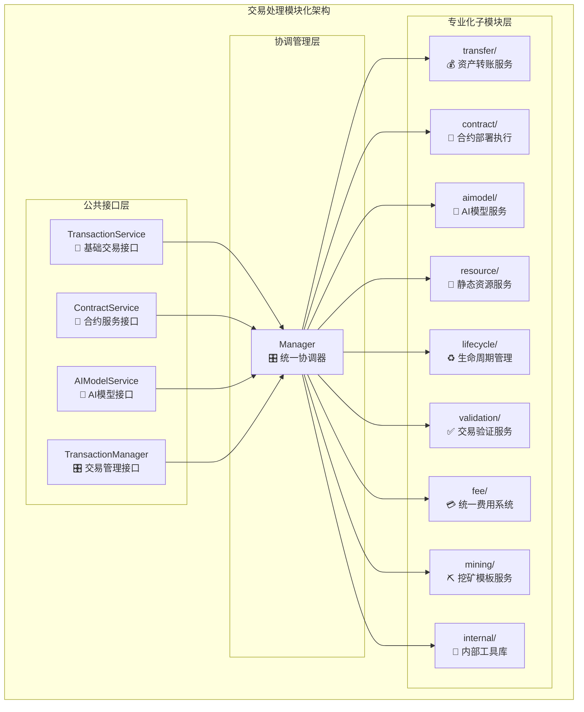
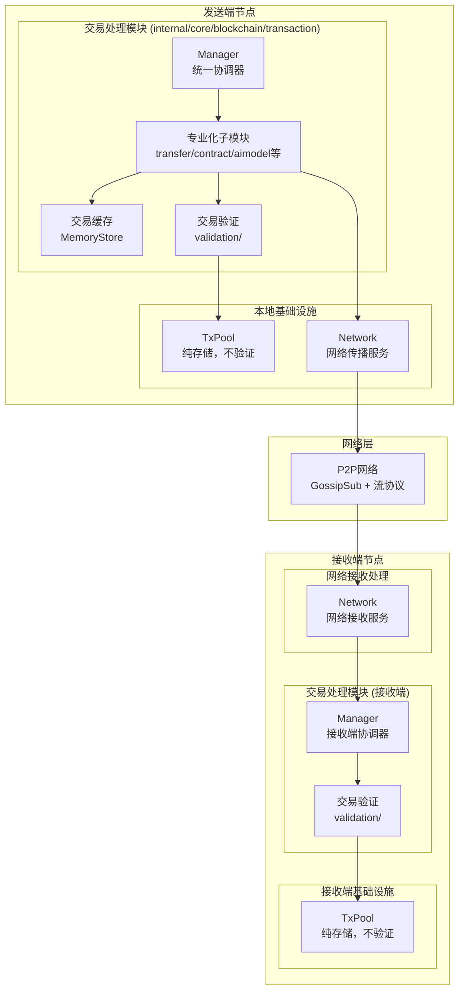
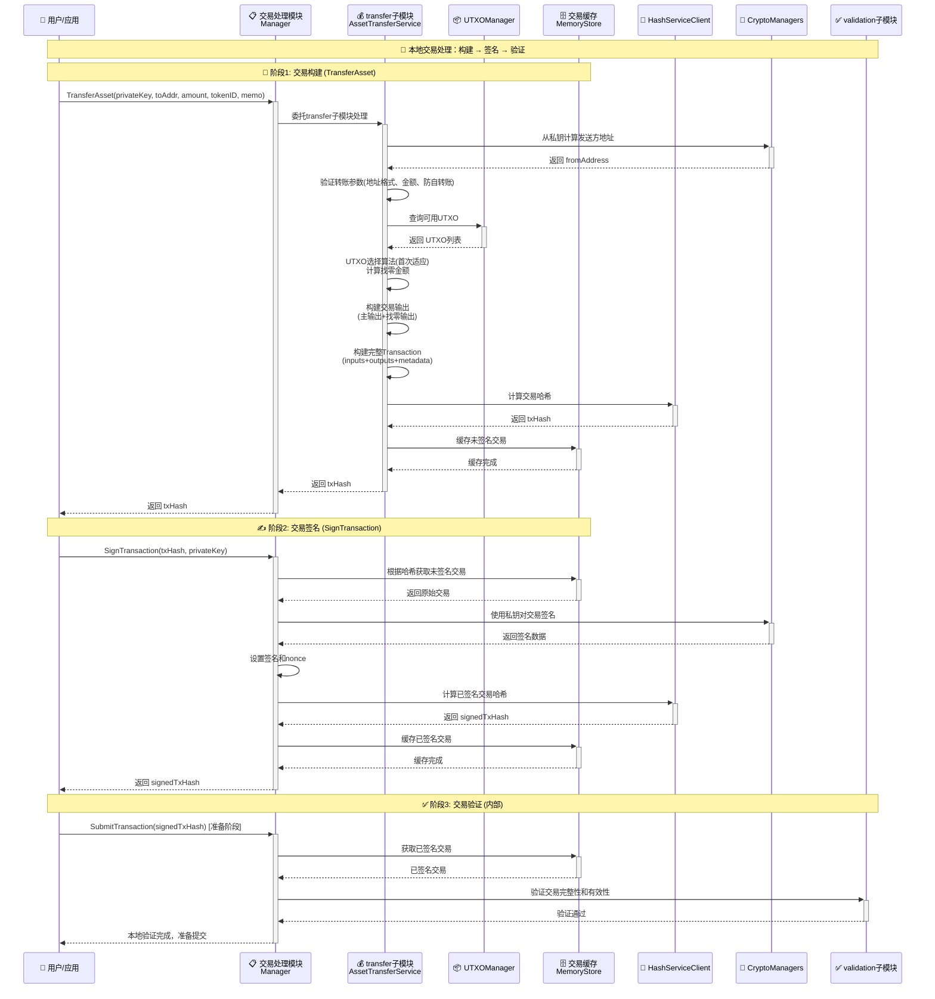
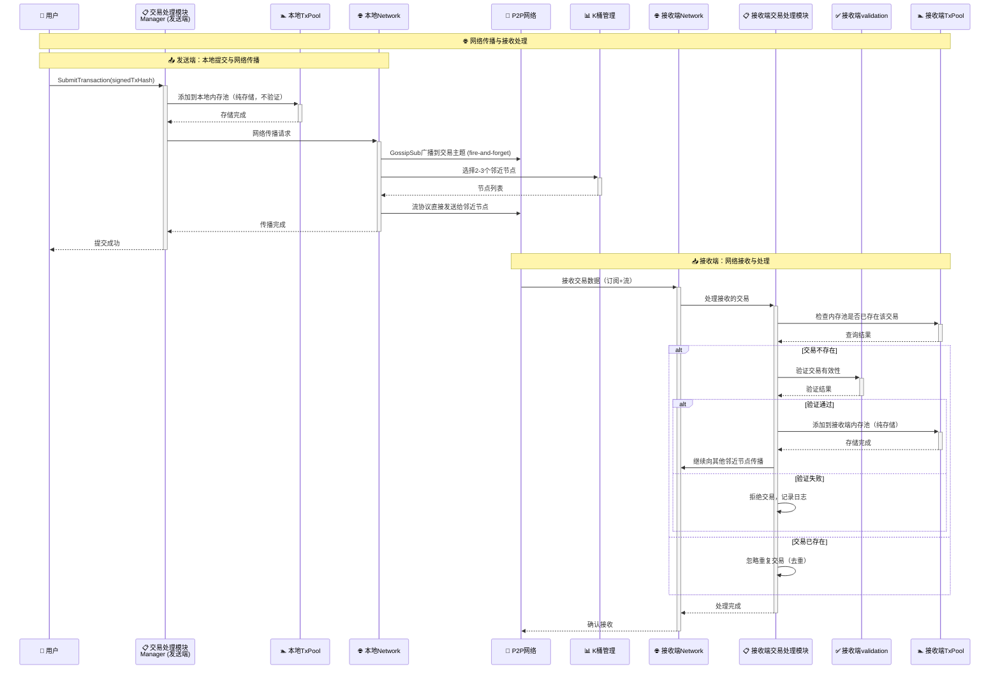

# 交易处理核心实现（internal/core/blockchain/transaction）

【模块定位】
　　本模块是WES区块链系统的交易处理核心，实现完整的EUTXO权利载体交易系统。通过模块化架构设计，提供资产转账、合约部署执行、AI模型服务、静态资源管理等全方位的交易处理能力。

【设计理念】
- **模块化架构**：按业务域垂直切分，各子模块专注特定交易类型
- **统一协调**：Manager作为薄层协调器，统一对外接口和内部调度
- **权利载体实现**：完整实现EUTXO权利载体理论的三层输出架构
- **高性能缓存**：基于哈希+内存缓存架构，支持高并发交易处理
- **企业级功能**：支持多签、委托、时间锁等复杂业务场景
- **极简设计**：遵循极简设计哲学，拒绝过度工程化，避免不必要的抽象层

---

## ⚠️ **UTXO架构极简设计原则**

### 🎯 **核心设计哲学**

　　在本模块的UTXO相关设计中，我们坚持**极简设计原则**，避免过度工程化：

> **"UTXO选择就像从购物车中选择几件商品，不需要专门创建一个'商品选择服务'"**

### 📋 **设计原则**

**✅ 正确的做法：**
- 在各子模块内部直接实现UTXO选择逻辑
- 使用简单有效的首次适应算法遍历选择
- 直接调用`UTXOManager.GetUTXOsByAddress()`获取数据
- 返回简单明确的结果：选中的UTXO + 找零金额

**❌ 过度设计的错误：**
- 创建独立的UTXOBusinessService、UTXOSelectionService等业务层
- 使用策略模式、工厂模式等复杂设计模式
- 封装UTXOSelectionParams、UTXOSelectionDependencies等参数对象
- 添加健康度报告、优化建议、复杂度评分等无实际使用场景的功能

### 🔍 **架构判断标准**

**当考虑添加新的UTXO相关组件时，问自己：**
1. 这个组件解决了什么**具体**问题？
2. 有人会**真正使用**这个功能吗？
3. 不添加这个组件，系统会**无法工作**吗？

**如果答案不够肯定，答案就是"不需要"。**

### 🏗️ **现有实现模式**

各子模块都采用了内部UTXO选择方法的模式：
- `transfer/asset_transfer.go` → `selectUTXOsForTransfer()`
- `transfer/batch_transfer.go` → `selectUTXOsForAmount()`
- `resource/static_deploy.go` → `selectUTXOsForDeployment()`
- `contract/contract_call.go` → `selectUTXOsForContract()`
- `contract/contract_deploy.go` → `selectUTXOsForDeploy()`
- `aimodel/model_deploy.go` → `selectUTXOsForModelDeploy()`
- `aimodel/model_infer.go` → `selectUTXOsForInference()`

**所有方法都采用相同的简单模式：**
```go
// 简单直接的UTXO选择实现
func (s *SomeService) selectUTXOsForSomething(ctx context.Context, address []byte, amountStr string) {
    // 1. 获取可用UTXO
    allUTXOs, err := s.utxoManager.GetUTXOsByAddress(ctx, address, &assetCategory, true)
    
    // 2. 遍历选择（首次适应）
    for _, utxo := range allUTXOs {
        if totalSelected >= targetAmount { break }
        selectedInputs = append(selectedInputs, createTxInput(utxo))
        totalSelected += extractAmount(utxo)
    }
    
    // 3. 返回结果
    return selectedInputs, calculateChange(totalSelected, targetAmount), nil
}
```

**重构历史**：本设计原则源于2024年UTXO架构重构，删除了多个过度设计的组件，详见 [ADR-005](../../../docs/architecture/ADR/ADR-005-UTXO-SIMPLIFICATION.md)。

---

## 🏗️ **模块化架构概览**

【架构特点】

　　采用**薄管理层 + 专业化子模块**的架构设计，Manager作为统一协调入口，各子模块专注特定业务域的深度实现。

### **🌐 网络处理架构**

【网络集成设计】

　　交易模块实现**双重保障传播机制**，确保交易的可靠传播和处理：

- **统一网络处理**：承担系统内所有交易相关的网络通信，统一处理protobuf协议序列化/反序列化
- **双重传播机制**：主要路径（GossipSub）+ 备份路径（Stream RPC）确保传输可靠性
- **智能消息验证**：交易公告接收时的完整性验证和去重处理
- **委托处理模式**：Manager委托给专门的network_handler子模块处理网络协议

#### **🔄 架构继承设计**

交易模块的网络处理遵循**integration + interfaces + network_handler委托**的统一架构模式：

**接口继承层次**：
```go
// 继承集成层网络接口 (内部继承)
interfaces.NetworkProtocolHandler {
    networkintegration.TxProtocolRouter    // 流式协议处理
    networkintegration.TxAnnounceRouter    // 订阅协议处理
}

// 业务服务接口 (对外暴露)
interfaces.InternalTransactionService {
    blockchain.TransactionService          // 公共交易服务
    interfaces.NetworkProtocolHandler      // 网络协议处理能力
    // ... 其他交易相关方法
}
```

**实现层委托**：
```go
// Manager 委托网络处理
type Manager struct {
    networkHandlerService interfaces.NetworkProtocolHandler // 网络协议委托
    // ... 其他依赖
}

// 网络协议方法委托
func (m *Manager) HandleTransactionDirect(ctx context.Context, from peer.ID, reqBytes []byte) ([]byte, error) {
    return m.networkHandlerService.HandleTransactionDirect(ctx, from, reqBytes)
}

func (m *Manager) HandleTransactionAnnounce(ctx context.Context, from peer.ID, topic string, data []byte) error {
    return m.networkHandlerService.HandleTransactionAnnounce(ctx, from, topic, data)
}
```

#### **🌐 核心协议支持**

| **协议类型** | **Protocol ID / Topic** | **Message类型** | **用途** | **处理接口** |
|------------|------------------------|----------------|---------|------------|
| **交易直连传播** | `/weisyn/blockchain/tx_direct/1.0.0` | `TransactionPropagationRequest/Response` | 备份传播路径（Stream RPC） | `TxProtocolRouter` |
| **交易广播通告** | `weisyn.blockchain.tx_announce.v1` | `TransactionAnnouncement` | 主要传播路径（GossipSub） | `TxAnnounceRouter` |

#### **🏗️ 网络架构组件**

```
📁 network_handler/                    # 网络协议处理子组件（薄委托层）
├── handler.go                        # TxNetworkProtocolHandlerService实现
│   ├── 🔌 实现interfaces.NetworkProtocolHandler
│   ├── 📡 委托给Manager的业务逻辑
│   └── ✅ 编译时接口检查
├── README.md                         # 网络处理架构文档
└── (继承networkintegration.TxProtocolRouter + TxAnnounceRouter)

📁 integration/network/               # 网络集成层（全局共享）
├── stream_handlers.go               # 定义TxProtocolRouter接口
├── subscribe_handlers.go            # 定义TxAnnounceRouter接口
└── 注册函数：RegisterTxStreamHandlers + RegisterSubscribeHandlers
```

#### **📋 依赖注入流程**

```go
// 在 blockchain/module.go 中统一注册
func Module() fx.Option {
    return fx.Module("blockchain",
        // ... 其他提供商
        
        // 网络协议注册（统一入口）
        fx.Invoke(func(
            network network.Network,
            txService interfaces.InternalTransactionService,    // 作为TxProtocolRouter
            syncService interfaces.InternalSystemSyncService,   // 作为SyncProtocolRouter
            logger log.Logger,
        ) error {
            // 注册交易流式协议
            if err := networkIntegration.RegisterTxStreamHandlers(network, txService, logger); err != nil {
                return fmt.Errorf("注册交易流式协议处理器失败: %w", err)
            }
            
            // 注册交易订阅协议
            if err := networkIntegration.RegisterSubscribeHandlers(network, txService, logger); err != nil {
                return fmt.Errorf("注册交易订阅协议处理器失败: %w", err)
            }
            
            return nil
        }),
    )
}
```

#### **🔧 协议常量归口管理**

**重要架构变化**：所有网络协议常量已归口到 `pkg/constants/protocols/system_protocols.go`：

```go
import "github.com/weisyn/v1/pkg/constants/protocols"

// 使用全局协议常量
network.Call(peerID, protocols.ProtocolTransactionDirect, data)
network.Subscribe(protocols.TopicTransactionAnnounce, handler)
```

**归口优势**：
- **全局一致性**：避免各组件重复定义协议常量  
- **版本管理**：统一的协议版本控制和兼容性管理
- **跨组件复用**：多个组件可以安全引用相同的协议定义
- **维护简化**：协议变更只需更新一个文件

#### **🔄 网络处理流程示例**

**交易直连传播处理**：
```go
// 1. 网络层接收到Stream RPC请求
// 2. 路由到 TxNetworkProtocolHandlerService.HandleTransactionDirect
// 3. 委托给 Manager.HandleTransactionDirect (业务逻辑)
// 4. 验证交易 → 添加到TxPool → 继续传播
// 5. 返回处理结果给请求方
```

**交易广播通告处理**：
```go
// 1. 网络层接收到GossipSub消息
// 2. 路由到 TxNetworkProtocolHandlerService.HandleTransactionAnnounce  
// 3. 委托给 Manager.HandleTransactionAnnounce (业务逻辑)
// 4. 去重检查 → 验证交易 → 添加到TxPool
// 5. 异步返回（fire-and-forget模式）
```

#### **🎯 架构设计原则**

**职责分离**：
- **Manager**: 负责交易业务逻辑（构建、验证、存储）
- **NetworkProtocolHandler**: 薄委托层，只负责网络协议适配
- **Integration Layer**: 全局网络协议定义和注册

**统一模式**：
- 与`consensus/aggregator`采用相同的架构模式  
- 接口继承 → 委托实现 → 统一注册
- 确保系统架构一致性和可维护性



---

## 🎯 **交易处理完整业务流程**

【流程概述】

　　本节以 TransferAsset 转账操作为例，展现 WES 交易处理模块中从用户意图到网络确认的完整技术路径。该流程体现了 EUTXO 权利载体理论的实际应用，以及模块化架构的协调配合。

### **🌐 全局交易业务流程架构**



### **📊 本地交易处理流程**



### **🌐 网络传播与接收流程**



### **🔄 详细流程分析**

#### **核心环节一: 交易构建 (TransferAsset)**

**📍 核心职责**: 交易处理模块将用户转账意图转换为标准的 EUTXO 交易结构

**🔄 详细步骤**:

1. **地址计算** (`crypto.AddressManager`)
   ```go
   fromAddress, err := addressManager.PrivateKeyToAddress(senderPrivateKey)
   ```
   - 椭圆曲线运算: 私钥 → 公钥 → Keccak256 → 20字节地址

2. **参数验证** (transfer子模块内部逻辑)
   - 地址格式验证 (40字符十六进制)
   - 金额有效性 (`utils.ParseDecimalToWei`)  
   - TokenID 格式检查
   - 防自转账验证

3. **UTXO选择与引用** (`repository.UTXOManager`) 🔒
   ```go
   selectedInputs, changeAmount, err := selectUTXOsForTransfer(ctx, fromAddrBytes, amount, tokenID)
   ```
   - 查询可用AssetUTXO: `GetUTXOsByAddress(ctx, address, &assetCategory, true)`
   - **首次适应算法**: 遍历UTXO直到总额 ≥ 需求金额
   - **🔒 关键安全措施**: 使用现有的ReferenceUTXO机制防止并发使用
   - **找零计算**: `changeAmount = selectedTotal - transferAmount`
   
   ```go
   // 使用现有UTXO引用机制防双花
   for _, selectedInput := range selectedInputs {
       err := utxoManager.ReferenceUTXO(ctx, selectedInput.PreviousOutput)
       if err != nil {
           // 引用失败，可能被其他交易使用，需要重新选择UTXO
           return fmt.Errorf("UTXO引用失败，可能存在并发使用: %w", err)
       }
   }
   ```

4. **费用闭合性处理** 🔥
   ```go
   // 计算手续费 (从转账金额内扣除)
   calculatedFeeWei := transferAmountWei * baseFeeRate / 10000
   actualReceiveAmountWei := transferAmountWei - calculatedFeeWei
   ```
   - **实际到账** = 转账金额 - 手续费 (接收方得到净金额)
   - **找零金额** = 选中UTXO总额 - 转账金额 (不受手续费影响)
   - **矿工收益** = 输入总额 - 输出总额 = 手续费

5. **交易输出构建** (EUTXO标准)
   ```go
   outputs := []*transaction.TxOutput{
       // 主输出: 给接收方 (已扣手续费)
       {Owner: toAddress, Asset: {Amount: actualReceiveAmountStr}},
       // 找零输出: 给发送方 (如果 > 粉尘阈值)
       {Owner: fromAddress, Asset: {Amount: changeAmount}},
   }
   ```

6. **完整交易组装** (protobuf 结构)
   ```go
   tx := &transaction.Transaction{
       Version: 1,
       Inputs: selectedInputs,
       Outputs: outputs,
       Nonce: 0, // 待签名时设置
       CreationTimestamp: time.Now().Unix(),
       ChainId: []byte("weisyn-chain-{id}"),
   }
   ```

7. **哈希计算与缓存**
   ```go
   txHash := HashService.ComputeHash(tx)
   CacheUnsignedTransaction(cacheStore, txHash, tx)
   ```

**📤 输出**: 32字节交易哈希，用于后续签名

#### **核心环节二: 交易签名 (SignTransaction)**

**📍 核心职责**: 交易处理模块使用私钥对交易进行数字签名授权

**🔄 详细步骤**:

1. **交易检索**: 从交易缓存根据 `txHash` 获取原始未签名交易
2. **数字签名**: 使用 `crypto.SignatureManager` 进行 ECDSA secp256k1 签名
3. **Nonce设置**: 设置防重放随机数
4. **已签名哈希**: 计算签名后交易的新哈希值
5. **缓存更新**: 在交易缓存中存储已签名交易供提交使用

**📤 输出**: 已签名交易哈希，用于网络提交

#### **核心环节三: 交易提交 (SubmitTransaction)**

**📍 核心职责**: 交易处理模块验证交易，然后委托给基础设施进行存储和网络传播

**🔄 详细步骤**:

1. **交易验证**: 交易处理模块内部验证已签名交易的完整性和有效性
2. **本地存储**: 交易处理模块将验证过的交易提交给本地TxPool
   ```go
   err := txPool.AddTransaction(signedTx)  // 纯存储，不验证
   ```
   - TxPool只负责存储，不进行验证（避免循环依赖）
   - 排队等待: 按手续费排序，等待矿工打包

3. **网络传播**: 交易处理模块委托Network进行双重保障传播
   ```go
   err := network.BroadcastTransaction(ctx, signedTx)
   ```
   - **主要路径**: GossipSub订阅模式广播 (fire-and-forget)
   - **备份路径**: 流协议发送给2-3个邻近节点
   - **负载均衡**: K桶算法选择不同的邻近节点

4. **状态跟踪**: 交易处理模块更新交易缓存状态为 "submitted"

5. **🔒 错误处理与UTXO解引用**: 
   ```go
   // 如果提交过程中发生错误，必须解除已引用的UTXO
   if err := network.BroadcastTransaction(ctx, signedTx); err != nil {
       // 网络传播失败，解除所有已引用的UTXO，防止资源永久占用
       for _, input := range signedTx.Inputs {
           _ = utxoManager.UnreferenceUTXO(ctx, input.PreviousOutput)
       }
       return fmt.Errorf("网络传播失败: %w", err)
   }
   ```

**📤 输出**: 成功提交确认，交易进入网络传播阶段

#### **接收端处理流程**

**📍 核心职责**: 接收端交易处理模块验证接收的交易，决定是否接受和继续传播

**🔄 详细步骤**:

1. **接收交易**: Network接收到交易数据后，委托给交易处理模块
2. **去重检查**: 交易处理模块查询本地TxPool是否已存在该交易
3. **🔒 UTXO状态检查**: 关键安全验证，检查交易输入的UTXO状态
   ```go
   // UTXO状态检查逻辑
   for _, input := range receivedTx.Inputs {
       utxo, err := utxoManager.GetUTXO(ctx, input.PreviousOutput)
       if err != nil || utxo == nil {
           return fmt.Errorf("引用的UTXO不存在")
       }
       
       // 检查UTXO生命周期状态
       if utxo.Status != utxo.UTXO_LIFECYCLE_AVAILABLE {
           return fmt.Errorf("UTXO不可用，状态: %v", utxo.Status)
       }
   }
   ```
4. **交易验证**: 验证交易签名、余额充足性、业务逻辑等
5. **存储决策**: 验证通过后，存储到本地TxPool（纯存储）
6. **继续传播**: 向其他邻近节点继续传播（可选）

### **🔗 关键组件职责边界**

#### **1. 交易处理模块** (`internal/core/blockchain/transaction`)
```go
// 核心职责
- 交易构建、签名、验证
- 交易缓存管理
- 委托基础设施进行存储和传播
- 接收端交易验证和处理决策
```

#### **2. TxPool** (基础设施)
```go
// 核心职责 - 纯存储
- 存储已验证的交易
- 提供交易查询接口
- 维护交易排序（按手续费）
- 不进行交易验证（避免循环依赖）
```

#### **3. Network** (基础设施)
```go
// 核心职责 - 网络传播
- 双重保障传播机制（订阅+流式）
- K桶节点选择
- 网络连接管理
- 接收网络数据并委托给业务模块处理
```

#### **4. 交易缓存系统** (`storage.MemoryStore`)
```go
// 交易生命周期缓存
key: txHash -> value: serialized_transaction
TTL: 30分钟 (适合签名流程时长)
```
- **无状态设计**: 每次调用都携带完整参数
- **原子操作**: 支持并发访问和事务性
- **自动过期**: TTL管理，避免内存泄漏


### **💰 费用闭合性设计详解**

这是 WES 交易系统的核心创新，确保价值守恒：

```
🔍 费用计算示例:
用户转账: 100 WES
手续费率: 0.3% (万三)
选中UTXO: 120 WES

📊 费用分配:
├── 手续费: 100 × 0.003 = 0.3 WES  
├── 实际到账: 100 - 0.3 = 99.7 WES (给接收方)
├── 找零金额: 120 - 100 = 20 WES (给发送方)  
└── 矿工收益: 120 - 99.7 - 20 = 0.3 WES ✓

✅ 价值守恒验证:
输入总额: 120 WES
输出总额: 99.7 + 20 = 119.7 WES  
手续费: 120 - 119.7 = 0.3 WES ✓
```

### **⚡ 性能特征**

- **交易构建**: ~50-200ms (取决于UTXO数量)
- **数字签名**: ~1-5ms (ECDSA计算)  
- **网络广播**: ~100-500ms (取决于网络状况)
- **内存占用**: 1-10KB/交易 (取决于输入输出数量)
- **并发支持**: 无锁设计，支持高并发交易构建

### **📋 核心架构设计原则总结**

基于以上完整流程分析，WES 交易处理模块体现了以下设计思想：

#### **1. 职责边界清晰** 📐
- **交易处理模块**: 专注交易业务逻辑（构建、签名、验证）
- **基础设施层**: TxPool纯存储，Network专注传播，避免循环依赖
- **薄管理器模式**: Manager作为协调中心，具体业务委托给专业子模块

#### **2. 双重保障机制** 🔄  
- **网络传播**: 订阅模式(GossipSub) + 流式协议双重保障
- **验证策略**: 发送端验证 + 接收端验证双重保障
- **存储机制**: 交易缓存 + TxPool存储双重保障

#### **3. EUTXO价值守恒** ⚖️
- **费用闭合性**: 输入总额 = 输出总额 + 矿工手续费
- **用户友好**: 手续费从转账金额内扣除，用户体验直观
- **防粉尘机制**: 最小找零阈值，维护网络健康

#### **4. 并发防护机制** 🔐
- **UTXO引用机制**: 交易构建时使用ReferenceUTXO引用选中UTXO，防止并发使用
- **状态管理**: 基于现有UTXO生命周期状态进行安全验证
- **错误回滚**: 交易失败时使用UnreferenceUTXO解除引用，避免资源永久占用
- **接收端验证**: 检查UTXO_LIFECYCLE_AVAILABLE状态，确保UTXO可用性

#### **5. 网络适应性** 🌐
- **K桶节点选择**: 基于距离算法选择不同邻近节点
- **传播策略**: fire-and-forget + 确保送达相结合
- **负载均衡**: 避免重复请求同一组节点，分散网络压力

　　这个交易流程设计展现了 WES 作为企业级区块链基础设施的技术深度，通过清晰的职责分离和双重保障机制，既保证了安全性和可靠性，又兼顾了性能和网络适应性。

---

## 📦 **子模块详细架构**

【模块组织】

```
internal/core/blockchain/transaction/
├── 🎛️ manager.go                    # 统一协调管理器
├── 💰 transfer/                     # 资产转账服务
│   ├── asset_transfer.go            # 单笔资产转账
│   └── batch_transfer.go            # 批量转账优化
├── 📄 contract/                     # 智能合约服务  
│   ├── contract_deploy.go           # 合约部署逻辑
│   └── contract_call.go             # 合约调用执行
├── 🧠 aimodel/                      # AI模型服务
│   ├── model_deploy.go              # AI模型部署
│   └── model_infer.go               # AI模型推理
├── 📁 resource/                     # 静态资源服务
│   ├── static_deploy.go             # 静态资源部署
│   └── file_validator.go            # 文件验证服务
├── ♻️ lifecycle/                    # 交易生命周期
│   ├── sign.go                      # 交易签名服务
│   ├── submit.go                    # 交易提交服务
│   ├── query.go                     # 交易查询服务
│   ├── status.go                    # 状态跟踪服务
│   ├── fee_estimation.go            # 费用估算服务
│   ├── validation.go                # 验证服务入口
│   └── multisig.go                  # 多签会话管理
├── ✅ validation/                   # 交易验证系统
│   ├── single_validation.go         # 单交易验证
│   └── block_validation.go          # 区块级验证
├── 💳 fee/                          # 统一费用系统
│   ├── manager.go                   # 费用管理器
│   ├── calculator.go                # 费用计算引擎
│   └── mechanisms.go                # 费用机制实现
├── ⛏️ mining/                       # 挖矿模板服务
│   └── mining_template.go           # 挖矿模板服务实现
└── 🔧 internal/                     # 内部工具库
    ├── cache_utils.go               # 缓存工具函数
    └── hash_utils.go                # 哈希工具函数
```

### **🎯 子模块职责矩阵**

| **子模块** | **核心职责** | **输出类型** | **复杂度** | **关键特性** |
|-----------|-------------|-------------|-----------|-------------|
| `transfer/` | 资产转账处理 | AssetOutput | ⭐⭐⭐ | UTXO选择、找零计算、批量优化 |
| `contract/` | 合约生命周期 | ResourceOutput | ⭐⭐⭐⭐⭐ | WASM验证、ABI处理、执行费用计算 |
| `aimodel/` | AI模型服务 | ResourceOutput | ⭐⭐⭐⭐⭐ | 模型格式验证、推理费用、批量处理 |
| `resource/` | 静态资源管理 | ResourceOutput | ⭐⭐⭐ | MIME检测、哈希验证、存储策略 |
| `lifecycle/` | 生命周期管理 | 不直接输出 | ⭐⭐⭐⭐ | 签名验证、网络提交、状态跟踪 |
| `validation/` | 交易验证 | 不直接输出 | ⭐⭐⭐⭐⭐ | 7种解锁机制、业务逻辑验证 |
| `fee/` | 费用系统 | 不直接输出 | ⭐⭐⭐⭐ | 多种费用机制、动态估算 |
| `mining/` | 挖矿模板服务 | Transaction数组 | ⭐⭐⭐⭐ | Coinbase构建、交易选择、费用计算 |
| `internal/` | 工具支撑 | 不直接输出 | ⭐⭐ | 通用工具、性能优化 |

---

## 🔄 **EUTXO权利载体实现**

　　本模块完整实现统一权利载体理论的EUTXO权利具现化，通过三层输出架构实现权利载体的创建和转换。

**权利载体实现特点：**

1. **输入权利释放**：通过7种标准解锁机制验证权利合法性
2. **权利转换处理**：基于业务逻辑进行权利验证和转换  
3. **输出权利创建**：AssetOutput（价值载体）、ResourceOutput（能力载体）、StateOutput（证据载体）
4. **权利约束设置**：为新创建的UTXO设置锁定条件

---

## 🔗 **接口映射关系**

【公共接口实现】

**接口委托映射（薄管理器模式）：**

1. **TransactionService → transfer + resource（纯参数透传）**
   - `TransferAsset(privateKey, ...)` → `transfer/asset_transfer.go`
   - `BatchTransfer(privateKey, ...)` → `transfer/batch_transfer.go`  
   - `DeployStaticResource(privateKey, filePath, ...)` → `resource/static_deploy.go`

2. **ContractService → contract（纯参数透传）**
   - `DeployContract(privateKey, filePath, ...)` → `contract/contract_deploy.go`
   - `CallContract(privateKey, ...)` → `contract/contract_call.go`

3. **AIModelService → aimodel（纯参数透传）**
   - `DeployAIModel(privateKey, filePath, ...)` → `aimodel/model_deploy.go`
   - `InferAIModel(privateKey, ...)` → `aimodel/model_infer.go`

4. **TransactionManager → lifecycle + validation + fee（纯参数透传）**
   - 签名、提交、查询 → `lifecycle/`各服务
   - 验证 → `validation/single_validation.go`
   - 费用估算 → `lifecycle/fee_estimation.go` + `fee/`
   - 多签管理 → `lifecycle/multisig.go`

**关键改进点：**
- Manager层不再处理参数转换和业务逻辑
- 所有私钥参数直接透传给具体服务处理
- 文件路径参数由具体服务负责读取和验证
- 实现真正的薄管理器架构

---

## 📊 **性能优化策略**

【优化重点】

**性能指标目标：**

| **操作类型** | **目标延迟** | **吞吐量** | **缓存命中率** | **优化策略** |
|-------------|-------------|-----------|--------------|-------------|
| 资产转账构建 | < 50ms | > 500 TPS | > 90% | UTXO预选、批量处理 |
| 合约部署 | < 200ms | > 100 TPS | > 80% | WASM缓存、并行验证 |
| 交易签名 | < 10ms | > 1000 TPS | > 95% | 签名聚合、硬件加速 |
| 状态查询 | < 5ms | > 2000 QPS | > 98% | 多级缓存、预取 |
| 费用估算 | < 20ms | > 800 QPS | > 85% | 动态模型、历史数据 |

---

## 🚀 **技术实现亮点**

【核心技术】

1. **模块化设计**：按业务域垂直切分，Manager作为薄协调层
2. **EUTXO权利载体**：完整实现统一权利载体理论  
3. **企业级功能**：多重签名、委托授权、时间控制
4. **高性能缓存**：基于SHA256哈希的对象标识和多级缓存
5. **统一费用系统**：多种费用机制的统一抽象
6. **完整生命周期**：从构建到确认的全流程管理

---

## 📋 **开发和维护指南**

【开发规范】

1. **新增子模块**：在对应业务域目录下创建服务文件，更新Manager委托逻辑
2. **薄管理器原则**：Manager只做参数透传，不处理业务逻辑或参数转换
3. **无状态设计**：所有服务方法都通过privateKey参数获取调用者身份
4. **文件处理规范**：大文件使用路径传递，服务内部负责读取和验证
5. **文件验证要求**：必须验证文件格式、完整性和安全性
6. **接口扩展**：优先在现有子模块中扩展，保持向后兼容性  
7. **性能优化**：关注缓存命中率和延迟指标，使用批量操作
8. **安全考虑**：严格验证输入参数，添加审计日志

### ⚠️ **极简设计开发约束**

**UTXO相关开发必须遵循以下约束，避免过度设计：**

9. **UTXO选择逻辑**：必须在各子模块内部直接实现，不得创建独立的业务服务
10. **算法实现**：优先使用简单的首次适应算法，避免复杂的策略模式
11. **参数传递**：直接使用基本类型参数，不得封装复杂的参数对象
12. **功能添加审查**：任何新功能都必须通过"三问测试"：
    - 这个功能解决了什么**具体**问题？
    - 有人会**真正使用**这个功能吗？
    - 不添加这个功能，系统会**无法工作**吗？
13. **代码审查重点**：重点审查是否存在不必要的抽象层和无实际使用场景的功能
14. **重构指导**：当怀疑某个组件是否必要时，默认答案是"不必要"

【参考文档】
- [公共接口设计](../../../../pkg/interfaces/blockchain/TRANSACTION_GUIDE.md)
- [Protobuf数据结构](../../../../pb/blockchain/block/transaction/README.md)
- [各子模块实现文档](./*/README.md)
- [WES架构设计](../../../../docs/architecture/)
- [UTXO全局设计文档](../../../../docs/architecture/UTXO_GLOBAL_DESIGN.md)
- [UTXO架构极简化ADR](../../../../docs/architecture/ADR/ADR-005-UTXO-SIMPLIFICATION.md)