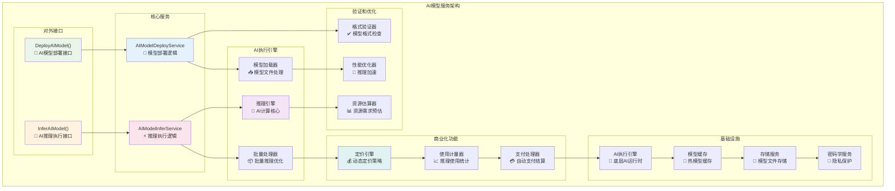
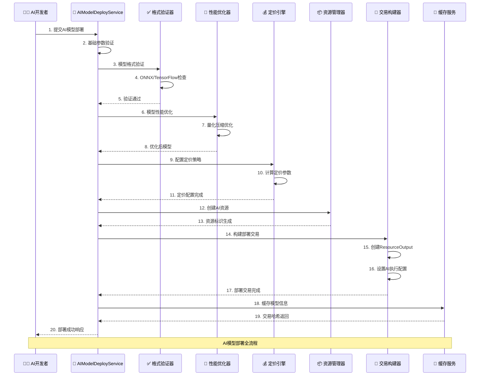
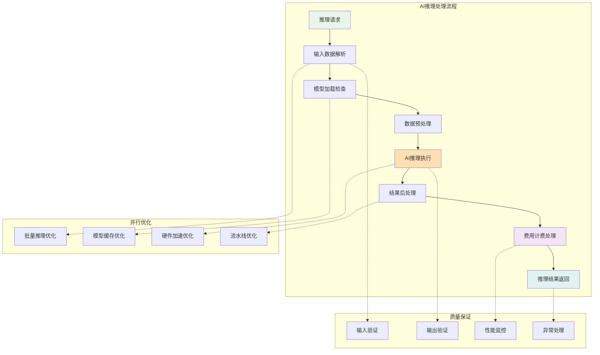
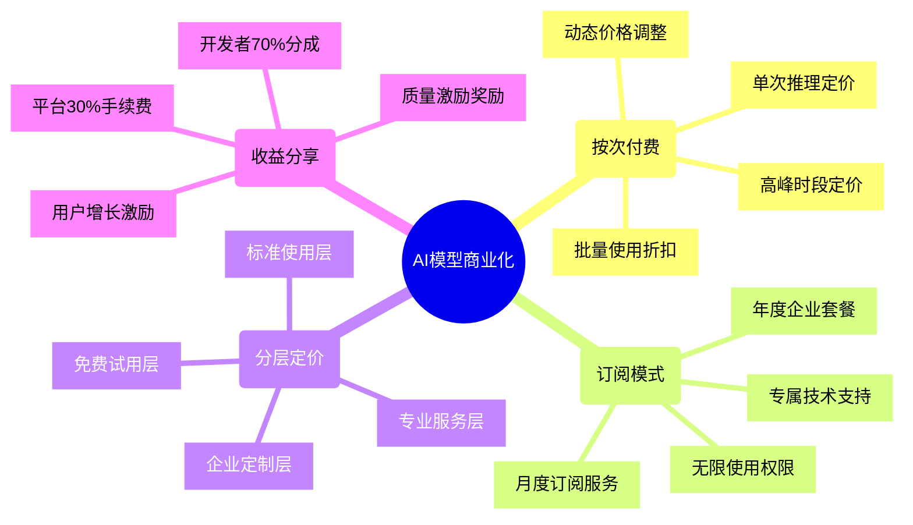
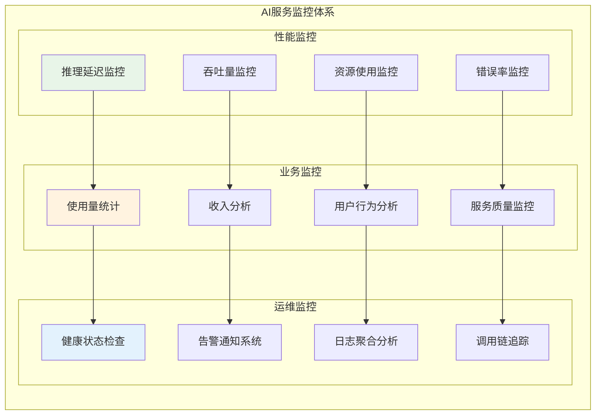
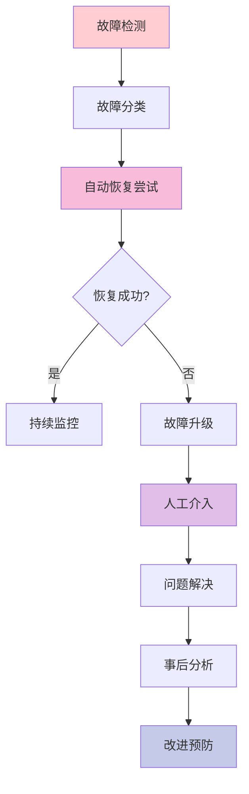

# AI模型服务（internal/core/blockchain/transaction/aimodel）

【模块定位】
　　AI模型服务是交易处理系统中专门处理人工智能模型部署和推理的前沿模块。通过区块链技术实现AI模型的去中心化部署、商业化运营和可信推理，建立AI能力的价值网络。基于ResourceOutput创建AI能力载体UTXO，为区块链生态提供智能计算服务。

【核心职责】
- **AI模型部署**：支持ONNX、TensorFlow、PyTorch等主流模型格式
- **推理服务管理**：提供高性能、可扩展的AI推理能力
- **商业化支持**：实现按次付费、订阅制等多种商业模式
- **隐私保护计算**：基于零知识证明的隐私保护推理
- **模型版本管理**：支持模型升级、回滚和版本控制

---

## 🏗️ **模块架构**

【服务组织】



**架构特点说明：**

1. **双引擎设计**：部署和推理分离，各自专业化优化
2. **多格式支持**：兼容主流AI框架的模型格式
3. **商业化内置**：原生支持多种商业化模式
4. **性能优化**：从模型加载到推理执行的全链路优化

---

## 🧠 **AI模型部署服务**

【model_deploy.go】

　　处理AI模型的完整部署流程，包括格式验证、性能优化、商业化配置等关键环节。



**部署处理阶段：**

1. **模型验证阶段**：
   - 支持格式：ONNX、TensorFlow SavedModel、PyTorch Script
   - 完整性检查：文件结构、权重完整性
   - 安全扫描：恶意代码检测、资源消耗预估
   - 兼容性验证：推理引擎兼容性确认

2. **性能优化阶段**：
   - 模型量化：减少内存占用和计算量
   - 图优化：算子融合和冗余消除
   - 硬件适配：GPU、TPU等加速器优化
   - 批处理优化：支持批量推理加速

3. **商业化配置**：
   - 定价模式：按次付费、订阅制、分层定价
   - 访问控制：白名单、权限分级、地域限制
   - 服务质量：SLA承诺、响应时间保证
   - 收益分成：开发者分成比例配置

---

## 🔮 **AI推理服务**

【model_infer.go】

　　提供高性能的AI推理能力，支持单次推理、批量推理、流式推理等多种模式。



**推理处理特性：**

1. **多模态输入支持**：
   - 文本数据：自然语言处理模型
   - 图像数据：计算机视觉模型
   - 音频数据：语音识别和生成
   - 结构化数据：表格数据分析

2. **推理模式优化**：
   - 单次推理：低延迟响应优化
   - 批量推理：高吞吐量处理
   - 流式推理：实时数据处理
   - 增量推理：状态保持推理

3. **智能资源调度**：
   - 模型热加载：常用模型预加载
   - 动态扩缩容：根据负载自动调整
   - 负载均衡：多实例负载分发
   - 资源隔离：不同模型资源隔离

---

## 💰 **商业化模式**

【多样化的盈利模式】



**定价策略框架：**

| **服务层级** | **定价模式** | **典型价格** | **目标用户** | **服务承诺** |
|-------------|-------------|-------------|-------------|-------------|
| 免费试用 | 限量免费 | 1000次/月免费 | 开发者试用 | 基础推理服务 |
| 标准服务 | 按次付费 | 0.001-0.01原生币/次 | 中小企业 | 99%可用性承诺 |
| 专业服务 | 订阅制 | 100原生币/月 | 专业用户 | 优先响应+技术支持 |
| 企业定制 | 定制报价 | 1000+原生币/月 | 大型企业 | SLA+专属部署 |

**动态定价机制：**

```go
// 智能定价算法
type DynamicPricing struct {
    BasePrice        float64  // 基础价格
    DemandMultiplier float64  // 需求倍数
    QualityBonus     float64  // 质量加成
    VolumeDiscount   float64  // 批量折扣
    TimeAdjustment   float64  // 时间调整
}

func (p *DynamicPricing) CalculatePrice(request *InferenceRequest) float64 {
    price := p.BasePrice
    price *= p.DemandMultiplier    // 根据当前需求调整
    price *= (1 + p.QualityBonus)  // 高质量模型加成
    price *= (1 - p.VolumeDiscount) // 批量使用折扣
    price *= p.TimeAdjustment      // 时段调整
    return price
}
```

---

## 🔒 **隐私保护计算**

【零知识证明驱动的隐私AI】

```mermaid
graph TB
    subgraph "隐私保护AI推理架构"
        subgraph "数据输入层"
            RAW_DATA[原始敏感数据]
            DATA_ENCRYPT[数据加密处理]
            ZK_INPUT[零知识输入生成]
        end
        
        subgraph "计算执行层"
            PRIVATE_COMPUTE[隐私计算执行]
            MODEL_PROTECT[模型参数保护]
            RESULT_ENCRYPT[结果加密处理]
        end
        
        subgraph "证明生成层"
            ZK_PROOF[零知识证明生成]
            VERIFY_CIRCUIT[验证电路构建]
            PROOF_OPTIMIZE[证明优化压缩]
        end
        
        subgraph "结果输出层"
            PROOF_OUTPUT[证明结果输出]
            RESULT_DECRYPT[结果解密还原]
            AUDIT_TRAIL[审计轨迹记录]
        end
    end
    
    RAW_DATA --> DATA_ENCRYPT
    DATA_ENCRYPT --> ZK_INPUT
    ZK_INPUT --> PRIVATE_COMPUTE
    
    PRIVATE_COMPUTE --> MODEL_PROTECT
    MODEL_PROTECT --> RESULT_ENCRYPT
    RESULT_ENCRYPT --> ZK_PROOF
    
    ZK_PROOF --> VERIFY_CIRCUIT
    VERIFY_CIRCUIT --> PROOF_OPTIMIZE
    PROOF_OPTIMIZE --> PROOF_OUTPUT
    
    PROOF_OUTPUT --> RESULT_DECRYPT
    RESULT_DECRYPT --> AUDIT_TRAIL
    
    style RAW_DATA fill:#FFCDD2
    style PRIVATE_COMPUTE fill:#F8BBD9
    style ZK_PROOF fill:#E1BEE7
    style PROOF_OUTPUT fill:#C5CAE9
```



**隐私保护特性：**

1. **输入隐私保护**：
   - 同态加密：支持加密数据计算
   - 安全多方计算：多方数据联合建模
   - 差分隐私：添加噪声保护个人隐私
   - 联邦学习：本地训练全局聚合

2. **模型隐私保护**：
   - 模型加密：保护模型参数不被泄露
   - 知识蒸馏：转移知识而非参数
   - 模型分片：分布式模型部署
   - 访问控制：严格的模型访问权限

3. **输出隐私保护**：
   - 结果脱敏：敏感信息自动脱敏
   - 零知识证明：证明计算正确性而不泄露细节
   - 审计友好：支持隐私审计和合规检查

---

## 🚀 **性能优化**

【全方位性能提升策略】

```mermaid
dashboard
    title AI模型服务性能仪表板
    
    gauge "模型部署成功率" value 98.2 max 100 units "%"
    gauge "推理平均延迟" value 45 max 100 units "ms"
    gauge "推理服务TPS" value 850 max 1500
    gauge "模型缓存命中率" value 89.5 max 100 units "%"
    gauge "GPU利用率" value 76.3 max 100 units "%"
    gauge "内存使用效率" value 82.1 max 100 units "%"
```

**性能优化维度：**

| **优化类别** | **具体策略** | **性能提升** | **适用场景** |
|-------------|-------------|-------------|-------------|
| 模型优化 | 量化压缩 | 4x速度提升 | 边缘设备推理 |
| 硬件加速 | GPU并行 | 10x吞吐提升 | 批量推理处理 |
| 缓存策略 | 智能预加载 | 80%延迟减少 | 热门模型推理 |
| 批处理 | 动态批合并 | 3x效率提升 | 高频推理请求 |
| 网络优化 | 模型分片传输 | 60%传输加速 | 大模型部署 |

**优化技术实现：**

1. **模型级优化**：
   - INT8量化：减少内存使用和计算量
   - 剪枝优化：移除不重要的连接
   - 知识蒸馏：小模型学习大模型知识
   - 架构搜索：自动寻找最优模型结构

2. **系统级优化**：
   - 异步推理：非阻塞推理执行
   - 内存池：预分配内存减少GC
   - 连接复用：复用网络连接
   - 负载均衡：智能请求分发

3. **硬件级优化**：
   - GPU加速：CUDA并行计算
   - TPU支持：专用AI芯片加速
   - 混合精度：FP16+FP32混合计算
   - 内存优化：减少内存拷贝

---

## 📊 **监控和分析**

【全面的服务监控体系】



**监控指标体系：**

1. **核心性能指标**：
   - P95推理延迟 < 100ms
   - 服务可用性 > 99.9%
   - 错误率 < 0.1%
   - 资源利用率 > 70%

2. **业务健康指标**：
   - 日活跃模型数
   - 推理请求总量
   - 收入增长趋势
   - 用户满意度评分

3. **运维质量指标**：
   - 故障平均修复时间
   - 部署成功率
   - 监控覆盖率
   - 告警响应时间

---

## 🛠️ **故障诊断和恢复**

【智能故障处理机制】

| **故障类型** | **检测方式** | **自动恢复策略** | **人工介入条件** |
|-------------|-------------|----------------|----------------|
| 模型加载失败 | 健康检查失败 | 重试+备份模型 | 连续失败3次 |
| 推理超时 | 响应时间监控 | 请求转移+扩容 | 超时率>5% |
| 内存不足 | 资源监控告警 | 模型卸载+GC | 可用内存<10% |
| GPU异常 | 硬件状态检查 | 切换CPU推理 | GPU完全不可用 |
| 网络异常 | 连接状态监控 | 重连+降级服务 | 网络中断>5min |

**智能恢复流程：**



---

## 📋 **开发指南**

【AI模型集成最佳实践】

1. **模型准备**：
   - 使用标准格式导出模型（ONNX推荐）
   - 优化模型大小和结构
   - 准备详细的模型文档
   - 提供测试用例和基准数据

2. **部署配置**：
   - 合理设置资源需求
   - 配置合适的定价策略
   - 设置访问控制策略
   - 准备服务质量承诺

3. **测试验证**：
   - 功能正确性测试
   - 性能基准测试
   - 负载压力测试
   - 安全漏洞测试

4. **监控运营**：
   - 设置关键指标监控
   - 配置异常告警规则
   - 定期性能优化
   - 收集用户反馈

【常见问题解决】

```go
// AI模型服务故障诊断接口
type AIModelDiagnostics interface {
    CheckModelHealth(modelAddress string) (*ModelHealthReport, error)
    AnalyzeInferencePerformance(modelAddress string) (*PerformanceReport, error)
    ValidateModelFormat(modelBytes []byte, format string) (*FormatReport, error)
    EstimateResourceRequirement(modelBytes []byte) (*ResourceRequirement, error)
}
```

【参考文档】
- [AI模型接口规范](../../../../pkg/interfaces/blockchain/aimodel.go)
- [AI执行引擎文档](../../../../internal/core/engines/aimodel/README.md)
- [隐私计算框架](../../../../internal/core/privacy/README.md)
- [性能优化指南](../../../../docs/optimization/ai_performance.md)
