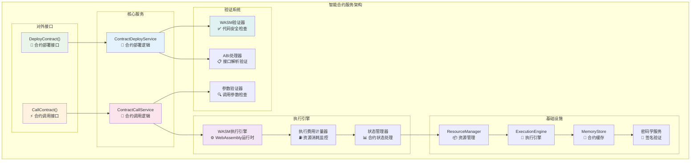
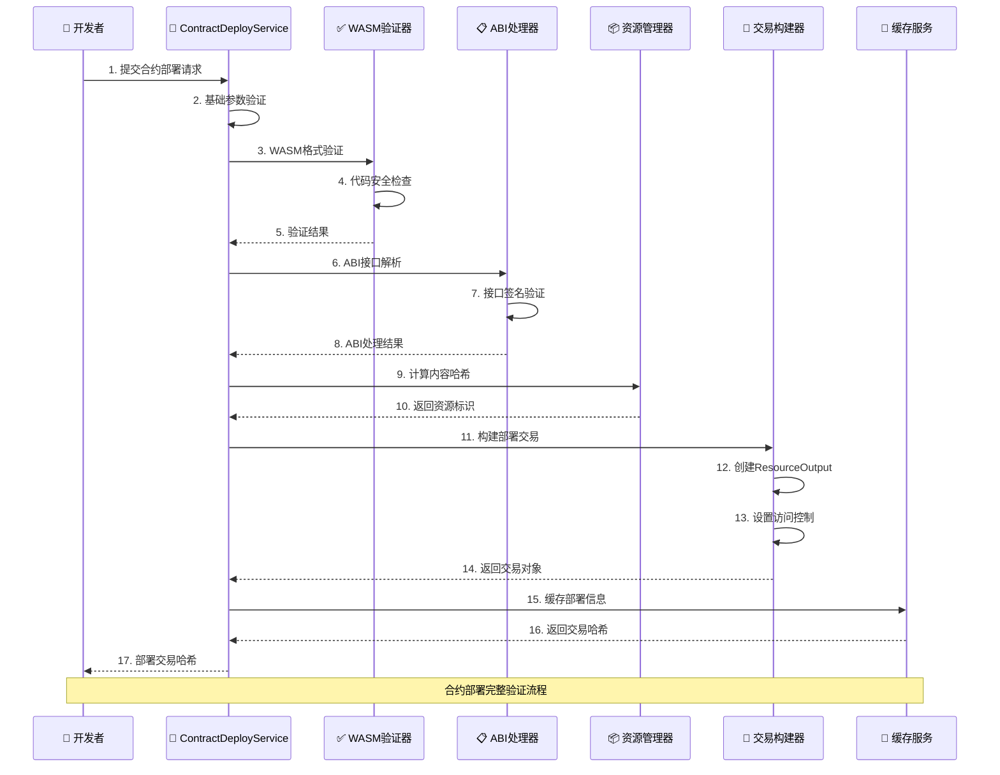
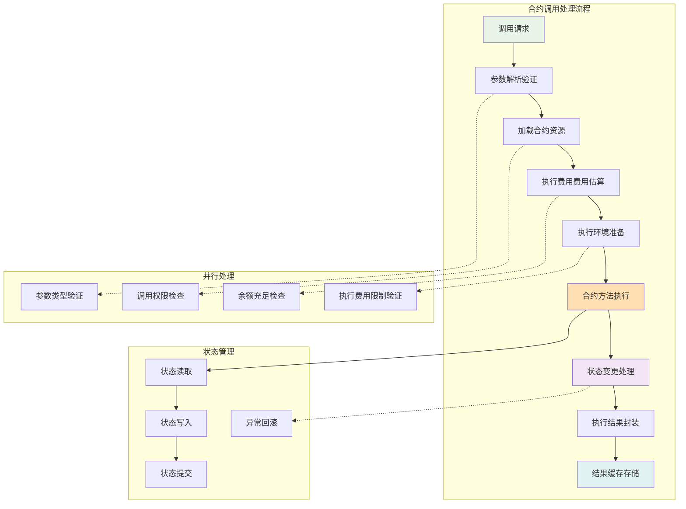
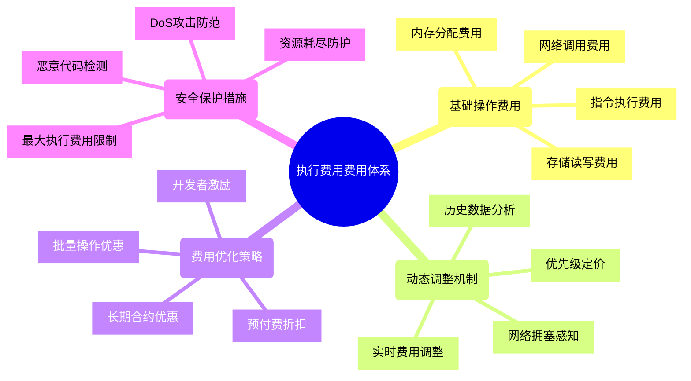
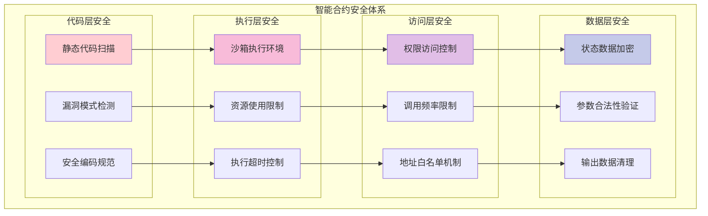
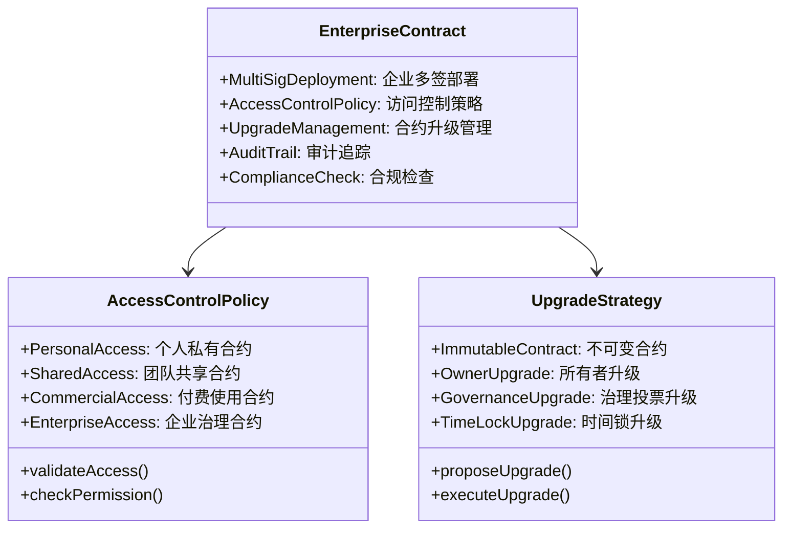
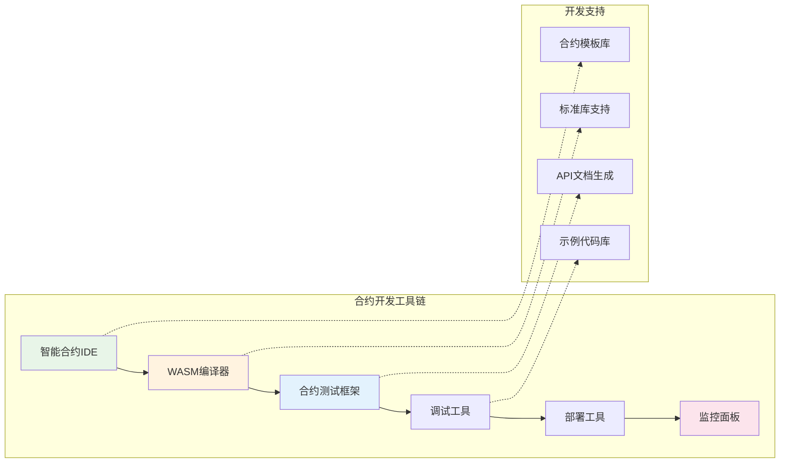

# 智能合约服务（internal/core/blockchain/transaction/contract）

【模块定位】
　　智能合约服务是交易处理系统中处理可执行资源（智能合约）部署和调用的核心模块。基于WebAssembly（WASM）执行环境，实现去中心化计算和可编程业务逻辑，通过ResourceOutput创建能力载体UTXO，为区块链提供图灵完备的计算能力。

【核心职责】
- **合约部署管理**：验证、部署WASM智能合约到区块链
- **合约调用执行**：处理合约方法调用和状态变更
- **执行费用管理**：精确计算和控制合约执行成本
- **状态转换验证**：确保合约执行的确定性和一致性
- **企业级权限控制**：支持复杂的合约访问控制策略

---

## 🏗️ **模块架构**

【服务组织】



**架构特点说明：**

1. **双服务设计**：部署和调用分离，专业化处理不同业务逻辑
2. **WASM执行引擎**：基于WebAssembly的安全可控执行环境
3. **完整验证链**：从代码验证到参数检查的多层安全保障
4. **执行费用精确计量**：确保资源消耗的可预测和公平计费

---

## 📄 **合约部署服务**

【contract_deploy.go】

　　处理智能合约的完整部署流程，包括代码验证、ABI解析、资源创建等关键步骤。



**部署处理步骤：**

1. **代码验证阶段**：
   - WASM格式合规性检查
   - 代码完整性验证
   - 安全漏洞扫描
   - 资源消耗预估

2. **ABI处理阶段**：
   - 接口定义解析
   - 方法签名验证
   - 参数类型检查
   - 导出函数映射

3. **资源创建阶段**：
   - 计算内容哈希（SHA256）
   - 创建ResourceOutput
   - 设置ExecutableType为CONTRACT
   - 配置ContractExecutionConfig

4. **权限控制设置**：
   - 根据options配置访问策略
   - 设置合适的LockingConditions
   - 支持企业级权限管理
   - 配置合约升级权限

---

## ⚡ **合约调用服务**

【contract_call.go】

　　处理智能合约方法调用，包括参数处理、执行费用计算、状态管理等核心功能。



**调用处理特点：**

1. **智能参数处理**：
   - JSON参数自动转换
   - 类型安全验证
   - 复杂数据结构支持
   - ABI兼容性检查

2. **精确执行费用管理**：
   - 执行前执行费用估算
   - 运行时执行费用计量
   - 超限自动终止
   - 剩余执行费用退还

3. **状态一致性保证**：
   - 原子性状态更新
   - 异常自动回滚
   - 并发访问控制
   - 状态快照机制

---

## ⛽ **执行费用费用系统**

【精确的资源计量】

　　提供公平、可预测的计算资源计费机制，确保网络资源的合理分配。



**执行费用计算公式：**

```
总执行费用费用 = 基础执行费用 + 存储费用 + 网络费用 + 优先级费用

其中：
- 基础执行费用 = 指令数量 × 指令执行费用价格
- 存储费用 = 存储字节数 × 存储执行费用价格  
- 网络费用 = 外部调用次数 × 网络执行费用价格
- 优先级费用 = 基础费用 × 优先级倍数
```

**执行费用费用等级：**

| **操作类型** | **执行费用消耗** | **说明** | **优化建议** |
|-------------|------------|----------|-------------|
| 算术运算 | 3-5 执行费用 | 基础数学计算 | 使用内建函数 |
| 内存读写 | 3 执行费用 | 局部变量访问 | 减少临时变量 |
| 存储读写 | 200-20000 执行费用 | 持久化存储 | 批量读写优化 |
| 合约调用 | 700+ 执行费用 | 跨合约调用 | 减少调用层级 |
| 日志输出 | 375+ 执行费用 | 事件记录 | 精简日志内容 |
| 创建合约 | 32000+ 执行费用 | 部署新合约 | 工厂模式优化 |

---

## 🔒 **安全机制**

【多层安全保障】



**安全特性详解：**

1. **代码安全验证**：
   - 静态分析检测已知漏洞模式
   - 禁止危险操作和系统调用
   - 强制内存安全和类型安全
   - 代码签名和完整性验证

2. **执行环境隔离**：
   - WebAssembly沙箱执行
   - 严格的资源使用限制
   - 确定性执行保证
   - 异常自动恢复机制

3. **访问权限管控**：
   - 基于锁定条件的访问控制
   - 调用频率和执行费用限制
   - 白名单和黑名单机制
   - 动态权限调整

---

## 🎯 **企业级功能**

【复杂业务场景支持】



**企业功能特性：**

1. **多重签名部署**：
   - M-of-N企业级合约部署
   - 分阶段部署审核流程
   - 部署权限精细控制
   - 异常回滚和恢复

2. **访问控制策略**：
   - 基于角色的访问控制（RBAC）
   - 动态权限调整机制
   - 时间和地域限制
   - 审计日志自动记录

3. **合约升级管理**：
   - 向后兼容性保证
   - 渐进式升级部署
   - 治理投票决策机制
   - 升级异常保护

---

## 📊 **性能优化**

【高性能执行策略】

| **优化维度** | **策略** | **效果** | **适用场景** |
|-------------|----------|----------|-------------|
| 代码编译 | AOT预编译 | 50%执行加速 | 频繁调用合约 |
| 状态缓存 | 智能预取 | 80%IO减少 | 状态密集操作 |
| 并行执行 | 无关联并行 | 3x吞吐提升 | 批量合约调用 |
| 执行费用优化 | 指令级优化 | 20%费用减少 | 复杂计算合约 |
| 网络优化 | 批量打包 | 60%网络减少 | 高频合约交互 |

**性能监控指标：**

```mermaid
dashboard
    title 合约服务性能仪表板
    
    gauge "合约部署成功率" value 96.5 max 100
    gauge "平均部署时间" value 180 max 500 units "ms"
    gauge "合约调用TPS" value 520 max 1000  
    gauge "执行费用使用效率" value 78.2 max 100 units "%"
    gauge "缓存命中率" value 91.8 max 100 units "%"
```

---

## 🔧 **开发工具支持**

【完善的开发体验】



**开发工具特性：**

1. **智能合约IDE**：
   - 语法高亮和自动补全
   - 实时错误检查
   - 集成调试环境
   - 版本控制集成

2. **测试框架**：
   - 单元测试自动化
   - 集成测试支持
   - 执行费用消耗分析
   - 性能基准测试

3. **部署和监控**：
   - 一键部署到测试网
   - 实时性能监控
   - 错误日志追踪
   - 用户使用统计

---

## 🛠️ **故障诊断**

【问题排查指南】

| **问题类型** | **症状** | **可能原因** | **解决方案** |
|-------------|----------|-------------|-------------|
| 部署失败 | 合约无法部署 | WASM格式错误 | 检查编译器版本和输出格式 |
| 调用超时 | 执行时间过长 | 无限循环或复杂计算 | 优化算法或增加执行费用限制 |
| 执行费用不足 | 交易执行失败 | 执行费用估算不准确 | 使用更精确的执行费用估算 |
| 权限错误 | 访问被拒绝 | 锁定条件不匹配 | 检查调用者权限和锁定条件 |
| 状态异常 | 数据不一致 | 并发访问冲突 | 使用事务或加锁机制 |

**诊断工具：**

```go
// 合约诊断接口
type ContractDiagnostics interface {
    CheckContractHealth(address string) (*HealthReport, error)
    Analyze执行费用Usage(txHash []byte) (*执行费用Report, error)
    ValidateContractState(address string) (*StateReport, error)
    TraceExecution(txHash []byte) (*ExecutionTrace, error)
}
```

---

## 📋 **最佳实践**

【开发建议】

1. **合约设计原则**：
   - 保持合约逻辑简单明确
   - 避免复杂的状态依赖
   - 使用事件记录重要操作
   - 实现合理的权限控制

2. **执行费用优化技巧**：
   - 避免不必要的存储操作
   - 使用批量操作减少调用
   - 选择合适的数据结构
   - 预计算常用数值

3. **安全开发规范**：
   - 输入参数严格验证
   - 避免重入攻击漏洞
   - 正确处理整数溢出
   - 实现紧急暂停机制

4. **测试和部署**：
   - 完整的单元测试覆盖
   - 多种场景的集成测试
   - 测试网充分验证
   - 灰度发布策略

【参考文档】
- [智能合约接口规范](../../../../pkg/interfaces/blockchain/contract.go)
- [WASM执行引擎文档](../../../../internal/core/engines/contract/README.md)
- [资源管理协议](../../../../pb/blockchain/block/transaction/resource/README.md)
- [执行费用费用系统](../fee/README.md)
