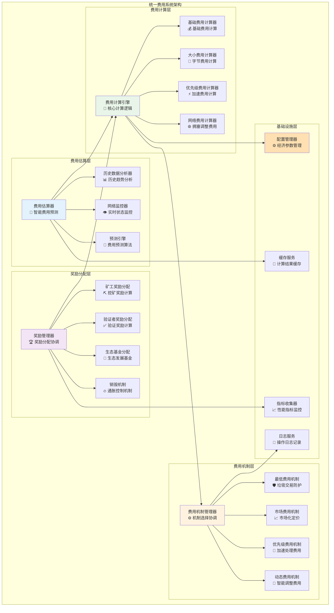
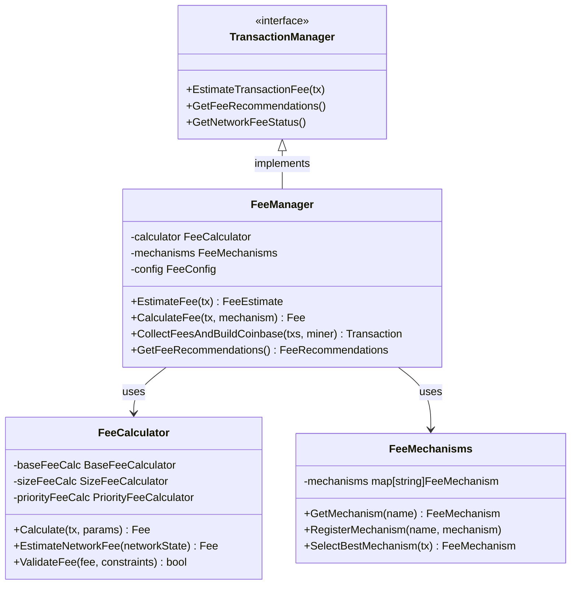

# 统一费用系统（internal/core/blockchain/transaction/fee）

【模块定位】
　　本模块是WES区块链系统的经济激励核心，负责构建完整的费用计算、分配和管理体系。通过多样化的费用机制和智能化的费用估算算法，实现网络资源的合理定价、矿工激励的公平分配和系统经济模型的稳定运行，为区块链生态提供可持续的经济基础。

【设计原则】
- **经济合理性**：基于网络资源消耗和市场供需的科学定价机制
- **公平透明性**：公开透明的费用计算规则和分配策略
- **动态适应性**：根据网络状况和使用情况动态调整费用策略
- **多元化支持**：支持多种费用机制和支付方式的灵活组合
- **高性能计算**：毫秒级费用计算响应和高并发处理能力

【核心职责】
1. **费用计算引擎**：提供高精度、高性能的交易费用计算服务
2. **费用机制管理**：支持多种费用机制的注册、选择和切换
3. **智能费用估算**：基于历史数据和网络状态的费用预测算法
4. **Coinbase构建服务**：为挖矿模板生成包含奖励分配的Coinbase交易
5. **费用分配管理**：实现矿工奖励、生态基金等的合理分配
6. **经济参数调优**：根据网络运行状况动态优化经济参数

【实现架构】

　　采用**多层费用计算 + 智能分配**的经济激励架构，确保费用系统的公平性、效率性和可持续性。



**架构层次说明：**

1. **费用计算层**：提供精确、高效的费用计算能力，支持多维度费用组合
   - 高精度的数学计算引擎
   - 多种费用组件的灵活组合
   - 毫秒级的计算响应性能

2. **费用机制层**：实现多种费用策略，适应不同场景和用户需求
   - 可插拔的费用机制架构
   - 动态的机制选择和切换
   - 经济模型的灵活调整能力

3. **费用估算层**：基于历史数据和实时网络状态提供智能费用预测
   - 机器学习驱动的预测算法
   - 实时网络状态感知
   - 个性化的费用建议服务

---

## 📁 **模块组织结构**

【内部模块架构】

```
internal/core/blockchain/transaction/fee/
├── 🎛️ manager.go                   # 费用管理器 - 统一协调所有费用功能
├── 🧮 calculator.go                # 费用计算引擎 - 核心费用计算逻辑
├── ⚙️ mechanisms.go                # 费用机制实现 - 多样化费用策略
├── 🔮 utils.go                     # 费用工具函数 - 通用计算和转换工具
├── 💰 coinbase.go                  # Coinbase构建器 - 挖矿奖励交易生成
└── 📚 README.md                    # 本文档
```

### **🎯 组件职责分工**

| **组件** | **核心职责** | **对外接口** | **内部组件** | **复杂度** |
|---------|-------------|-------------|-------------|-----------|
| `manager.go` | 费用系统统一管理 | FeeManager对外接口 | 机制协调、配置管理、API封装 | ⭐⭐⭐ |
| `calculator.go` | 费用计算引擎 | 计算接口实现 | 基础计算、大小计算、优先级计算 | ⭐⭐⭐⭐ |
| `mechanisms.go` | 费用机制实现 | 机制接口集合 | 最低费用、市场费用、动态费用 | ⭐⭐⭐⭐ |
| `utils.go` | 费用工具函数 | 工具函数库 | 数据转换、格式化、验证 | ⭐⭐ |
| `coinbase.go` | Coinbase交易构建 | Coinbase构建接口 | 奖励计算、费用聚合、交易生成 | ⭐⭐⭐⭐⭐ |

---

## 🔄 **统一费用计算实现**

【实现策略】

　　所有费用计算均遵循**多层费用组合**模式，通过不同费用组件的叠加实现灵活的定价策略。


**关键实现要点：**

1. **多维度费用计算**：
   - 基础费用：防止垃圾交易的基本门槛
   - 大小费用：基于交易字节数的资源消耗费用
   - 优先级费用：用户可选的加速处理费用
   - 网络调整费用：基于网络拥塞的动态调整

2. **费用机制选择**：
   - 智能识别交易类型和复杂度
   - 根据网络状态选择最优费用机制
   - 支持用户自定义费用策略

3. **计算结果优化**：
   - 费用计算结果智能缓存
   - 批量计算性能优化
   - 并发计算安全保证

---

## 🏗️ **依赖注入架构**

【fx框架集成】

　　全面采用fx依赖注入框架，实现费用系统组件间的松耦合和生命周期自动管理。

```go
// 示例：费用系统模块依赖注入配置
package fee

import (
    "go.uber.org/fx"
)

// Module 费用系统模块
var Module = fx.Module("fee",
    // 导入核心组件
    fx.Provide(
        // 管理器层
        NewFeeManager,
        
        // 计算器层
        NewFeeCalculator,
        
        // 机制层
        NewFeeMechanisms,
        
        // Coinbase构建器
        NewCoinbaseBuilder,
    ),
    
    // 导出外部接口
    fx.Provide(
        fx.Annotate(
            func(mgr *Manager) FeeManager {
                return mgr
            },
            fx.As(new(FeeManager)),
        ),
    ),
)
```

**依赖管理特点：**
- **自动生命周期**：组件启动和停止由fx自动管理
- **接口导向**：通过接口而非具体类型进行依赖
- **层次清晰**：明确的依赖方向，避免循环依赖
- **测试友好**：支持依赖注入的单元测试

---

## 📊 **性能与监控**

【性能指标】

| **操作类型** | **目标延迟** | **吞吐量目标** | **缓存命中率** | **监控方式** |
|-------------|-------------|---------------|--------------|------------|
| 费用计算 | < 10ms | > 5000 QPS | > 95% | 实时监控 |
| 费用估算 | < 50ms | > 1000 QPS | > 90% | 批量统计 |
| Coinbase构建 | < 100ms | > 100 BPS | > 85% | 关键路径监控 |
| 费用分配 | < 20ms | > 2000 QPS | > 93% | 异步监控 |
| 配置更新 | < 5s | N/A | N/A | 配置变更监控 |

**性能优化策略：**
- **计算缓存**：费用计算结果智能缓存，避免重复计算
- **批量处理**：批量费用计算和分配，减少系统调用
- **异步优化**：非关键路径操作异步执行
- **内存优化**：合理的数据结构和内存使用策略

---

## 🔗 **与公共接口的映射关系**

【接口实现映射】



**实现要点：**
- **接口契约**：严格遵循公共接口的方法签名和语义
- **错误处理**：标准化的错误返回和异常处理机制
- **日志记录**：完善的操作日志和性能指标记录
- **测试覆盖**：每个接口方法都有对应的单元测试和集成测试

---

## 🚀 **后续扩展规划**

【模块演进方向】

1. **智能化增强**
   - 基于机器学习的费用预测模型
   - 自适应的费用调整算法
   - 个性化的费用推荐服务

2. **经济模型优化**
   - 更科学的费用定价机制
   - 动态的经济参数调整
   - 长期可持续的激励模型

3. **性能提升**
   - 更高效的费用计算算法
   - 分布式费用计算支持
   - 实时费用数据处理能力

4. **用户体验改进**
   - 更直观的费用展示界面
   - 实时的费用状态通知
   - 费用优化建议服务

---

## 📋 **开发指南**

【费用系统开发规范】

1. **新增费用机制步骤**：
   - 实现FeeMechanism接口定义
   - 在mechanisms.go中注册新机制
   - 添加相应的配置参数支持
   - 编写完整的单元测试

2. **费用计算精度要求**：
   - 使用big.Int避免精度损失
   - 实施合理的舍入策略
   - 确保计算结果的可复现性
   - 验证极端情况下的计算正确性

3. **性能优化要求**：
   - 费用计算延迟指标达标
   - 合理使用缓存机制
   - 避免不必要的重复计算
   - 实现高并发下的性能稳定

【参考文档】
- [交易费用接口](../../../../pkg/interfaces/blockchain/transaction.go)
- [交易数据结构](../../../../pb/blockchain/block/transaction/transaction.proto)
- [经济模型设计文档](../../../../docs/economics/fee_economics.md)

---

> 📝 **模块说明**：本模块是WES v0.0.1经济模型的核心实现，通过科学的费用定价和公平的奖励分配，为区块链生态的可持续发展提供经济基础。

> 🔄 **维护指南**：本文档应随着经济模型和费用机制的演进及时更新，确保文档与代码实现的一致性。建议在每次重大经济参数调整后更新相应章节。