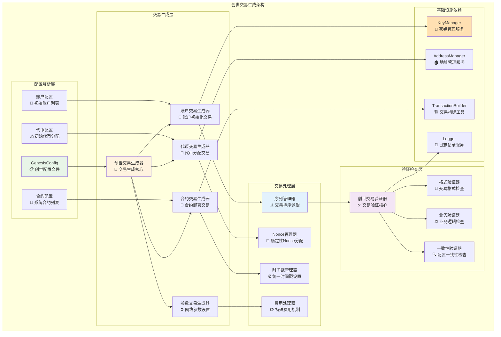
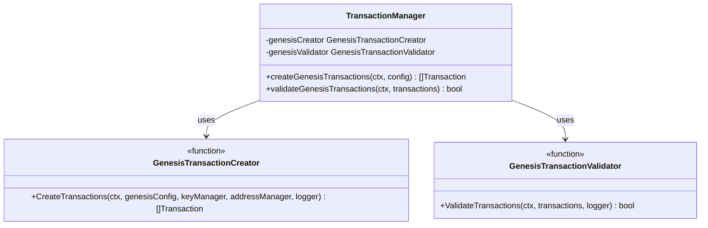

# 创世交易生成模块（internal/core/blockchain/transaction/genesis）

【模块定位】
　　本模块是WES区块链系统的创世交易生成和验证核心模块，负责基于创世配置自动生成初始化区块链网络状态的创世交易集合。通过确定性的交易生成算法和专门化的验证规则，确保创世交易的正确性、一致性和网络初始化的可重复性，为区块链网络提供可信的初始状态基础。

【设计原则】
- **确定性生成**：相同配置必须产生完全相同的创世交易序列
- **配置驱动**：完全基于GenesisConfig进行自动化交易生成
- **原子性操作**：创世交易的生成和验证必须是原子性的
- **无外部依赖**：创世交易不依赖任何现有的区块链状态
- **格式标准化**：严格遵循交易格式规范和创世交易特殊规则

【核心职责】
1. **创世交易自动生成**：基于配置自动生成完整的创世交易列表
2. **初始状态构建**：创建区块链网络的初始账户和代币分配
3. **系统合约初始化**：可选的核心系统合约部署交易生成
4. **确定性排序**：确保创世交易具有确定的生成顺序
5. **特殊验证规则**：实现创世交易专门化的验证逻辑
6. **配置一致性保证**：确保生成的交易与GenesisConfig完全一致

【实现架构】

　　采用**生成器+验证器**的双组件架构，确保创世交易生成的正确性和可验证性。



**架构层次说明：**

1. **配置解析层**：解析和处理创世配置文件，提取交易生成所需信息
   - 配置格式验证和标准化
   - 配置项完整性检查
   - 配置数据的结构化处理

2. **交易生成层**：根据不同配置类型生成相应的创世交易
   - 专门化的交易生成器
   - 确定性的生成算法
   - 完整的交易内容构建

3. **交易处理层**：处理交易的排序、Nonce分配等标准化操作
   - 确定性的交易排序
   - 统一的时间戳和Nonce管理
   - 特殊费用机制处理

---

## 📁 **模块组织结构**

【内部模块架构】

```
internal/core/blockchain/transaction/genesis/
├── 🔨 creator.go                   # 创世交易生成器 - 核心生成逻辑
├── ✅ validator.go                 # 创世交易验证器 - 专门验证逻辑
└── 📚 README.md                    # 本文档
```

### **🎯 组件职责分工**

| **组件** | **核心职责** | **对外接口** | **内部组件** | **复杂度** |
|---------|-------------|-------------|-------------|-----------|
| `creator.go` | 创世交易生成逻辑 | CreateTransactions函数 | 账户生成、代币分配、合约部署、排序管理 | ⭐⭐⭐⭐⭐ |
| `validator.go` | 创世交易验证逻辑 | ValidateTransactions函数 | 格式验证、业务检查、一致性验证 | ⭐⭐⭐ |

---

## 🔄 **统一确定性生成实现**

【实现策略】

　　所有创世交易生成均严格遵循**确定性生成**原则，确保相同配置产生完全相同的交易列表。

```mermaid
flowchart TD
    subgraph "确定性创世交易生成流程"
        subgraph "配置预处理"
            A[GenesisConfig输入] --> B[配置格式验证]
            B --> C[配置内容标准化]
            C --> D[配置项排序规范化]
        end
        
        subgraph "账户交易生成"
            D --> E[初始账户列表排序]
            E --> F[账户初始化交易生成]
            F --> G[代币分配交易生成]
        end
        
        subgraph "系统交易生成"
            G --> H[系统合约部署交易]
            H --> I[网络参数设置交易]  
            I --> J[其他初始化交易]
        end
        
        subgraph "交易标准化"
            J --> K[交易排序标准化]
            K --> L[Nonce确定性分配]
            L --> M[时间戳统一设置]
            M --> N[费用机制标准化]
        end
        
        subgraph "验证确认"
            N --> O[交易格式验证]
            O --> P[业务逻辑验证]
            P --> Q[配置一致性验证]
            Q --> R[创世交易列表完成]
        end
    end
```



**关键实现要点：**

1. **配置标准化处理**：
   - 配置参数的严格验证和规范化
   - 账户地址和金额的确定性排序
   - 配置项的标准格式转换

2. **确定性生成算法**：
   - 基于配置内容的确定性交易排序
   - 统一的Nonce分配策略
   - 标准化的时间戳设置规则

3. **特殊交易处理**：
   - 创世交易无输入UTXO的特殊处理
   - 免费执行的费用机制设置
   - 特殊验证规则的应用

---

## 🏗️ **依赖注入架构**

【fx框架集成】

　　全面采用fx依赖注入框架，实现创世交易模块组件间的松耦合和生命周期自动管理。

```go
// 示例：创世交易模块依赖注入配置
package genesis

import (
    "go.uber.org/fx"
)

// Module 创世交易模块
var Module = fx.Module("genesis",
    // 导入核心组件
    fx.Provide(
        // 生成器
        NewGenesisTransactionCreator,
        
        // 验证器
        NewGenesisTransactionValidator,
    ),
    
    // 导出工具函数
    fx.Provide(
        fx.Annotate(
            CreateTransactions,
            fx.As(new(GenesisTransactionCreator)),
        ),
        fx.Annotate(
            ValidateTransactions,
            fx.As(new(GenesisTransactionValidator)),
        ),
    ),
)
```

**依赖管理特点：**
- **自动生命周期**：组件启动和停止由fx自动管理
- **接口导向**：通过接口而非具体类型进行依赖
- **层次清晰**：明确的依赖方向，避免循环依赖
- **测试友好**：支持依赖注入的单元测试

---

## 📊 **性能与监控**

【性能指标】

| **操作类型** | **目标延迟** | **内存使用** | **成功率** | **监控方式** |
|-------------|-------------|------------|-----------|------------|
| 创世交易生成 | < 1s | < 20MB | 100% | 生成时监控 |
| 账户分配处理 | < 200ms | < 5MB | 100% | 账户监控 |
| 合约部署处理 | < 300ms | < 10MB | 100% | 合约监控 |
| 交易验证 | < 100ms | < 3MB | 100% | 验证监控 |
| 配置一致性检查 | < 50ms | < 2MB | 100% | 检查监控 |

**性能优化策略：**
- **生成算法优化**：使用高效的交易生成和排序算法
- **内存管理**：合理的内存分配和及时的资源回收
- **批量处理**：批量生成和验证相关交易
- **缓存策略**：合理缓存配置解析和中间结果

---

## 🔗 **与公共接口的映射关系**

【接口实现映射】



**实现要点：**
- **函数式接口**：提供纯函数式的生成和验证接口
- **错误处理**：标准化的错误返回和异常处理机制
- **日志记录**：完善的操作日志和过程追踪记录
- **测试覆盖**：每个函数都有对应的单元测试和集成测试

---

## 🚀 **后续扩展规划**

【模块演进方向】

1. **功能增强**
   - 支持更复杂的初始状态配置
   - 增加创世交易模板系统
   - 支持多种网络类型的创世交易

2. **性能优化**
   - 优化大规模账户初始化的处理能力
   - 提升交易生成和验证的效率
   - 减少内存使用和提高生成速度

3. **配置灵活性**
   - 支持更灵活的配置格式
   - 增加配置验证和错误提示
   - 支持配置的模块化组合

4. **工具支持**
   - 提供创世交易生成的CLI工具
   - 支持创世配置的可视化编辑
   - 增加创世交易的调试和分析工具

---

## 📋 **开发指南**

【创世交易开发规范】

1. **生成确定性要求**：
   - 所有生成逻辑必须是确定性的
   - 相同配置必须产生完全相同的交易列表
   - 避免使用随机数或时间相关的不确定因素
   - 实现可重复的生成过程

2. **验证完整性要求**：
   - 实现完整的创世交易验证逻辑
   - 验证所有特殊字段和规则
   - 确保验证逻辑与生成逻辑的一致性
   - 提供详细的验证错误信息

3. **性能优化要求**：
   - 生成和验证过程延迟指标达标
   - 合理使用内存和CPU资源
   - 支持大规模账户初始化的处理
   - 实现高效的算法和数据结构

【参考文档】
- [创世区块模块](../../block/genesis/README.md)
- [交易处理主模块](../README.md)
- [创世配置类型定义](../../../../pkg/types/)

---

> 📝 **模块说明**：本模块是WES v0.0.1区块链网络初始化的核心基础，通过自动化的创世交易生成确保网络状态的正确初始化和一致性。

> 🔄 **维护指南**：本文档应随着创世交易生成逻辑的演进及时更新，确保文档与代码实现的一致性。建议在每次重大配置格式变更后更新相应章节。
