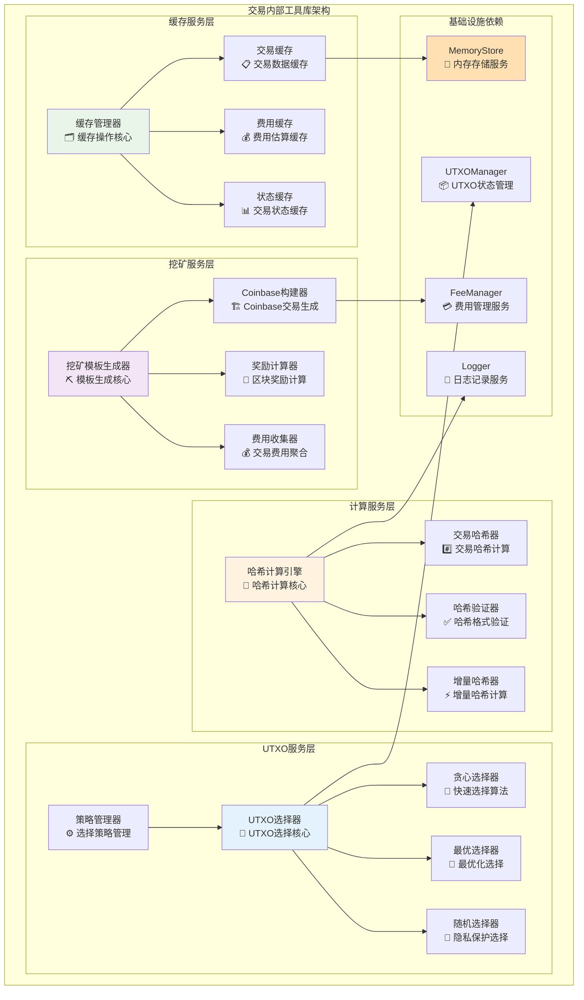
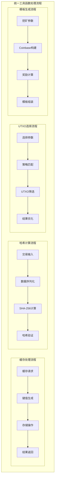

# 交易内部工具库（internal/core/blockchain/transaction/internal）

【模块定位】
　　本模块是WES区块链交易系统的内部工具库和底层支撑服务模块，负责提供交易处理过程中的通用工具函数、缓存管理、UTXO选择算法和挖矿模板生成等核心辅助功能。作为交易系统的基础设施层，通过高性能的工具组件和优化算法，为上层交易处理模块提供可靠的底层支撑，确保交易处理的效率和质量。

【设计原则】
- **函数式设计**：所有工具函数设计为独立的包级别函数，避免服务耦合
- **高内聚低耦合**：每个组件专注单一职责，通过参数传递实现协作
- **性能优先**：优化关键路径算法，提供高效的工具函数实现
- **可重用性**：提供通用的工具组件，支持多个子模块共享使用
- **可测试性**：所有函数支持单元测试，确保代码质量和可靠性

【核心职责】
1. **缓存管理服务**：提供交易相关数据的高效缓存操作和管理功能
2. **哈希计算工具**：实现安全可靠的交易哈希计算和验证功能
3. **UTXO选择算法**：提供多种策略的UTXO选择算法优化交易构建
4. **挖矿模板生成**：生成Coinbase交易和挖矿模板支持区块构建
5. **性能优化组件**：提供缓存、索引、并行处理等性能优化机制
6. **通用辅助工具**：提供交易处理过程中的各种辅助和工具函数

【实现架构】

　　采用**分层工具库**架构，通过独立的工具组件提供完整的交易处理底层支撑服务。



**架构层次说明：**

1. **缓存服务层**：提供高效的数据缓存管理，优化交易处理性能
   - 分类型的缓存管理策略
   - 高效的缓存读写操作
   - 智能的缓存过期和清理机制

2. **计算服务层**：实现安全可靠的哈希计算和验证功能
   - 标准化的哈希计算算法
   - 高性能的增量哈希计算
   - 完整的哈希格式验证

3. **UTXO服务层**：提供多策略的UTXO选择算法和优化机制
   - 多种选择策略的灵活组合
   - 高效的UTXO筛选和排序
   - 智能的选择策略管理

---

## 📁 **模块组织结构**

【内部模块架构】

```
internal/core/blockchain/transaction/internal/
├── 🗂️ cache_utils.go               # 缓存工具函数 - 交易数据缓存管理
├── 🔐 hash_utils.go                # 哈希计算工具 - 交易哈希计算验证
├── 💎 utxo_selector.go             # UTXO选择算法 - 多策略UTXO选择
├── ⛏️ mining_template.go           # 挖矿模板生成 - Coinbase交易构建
└── 📚 README.md                    # 本文档
```

### **🎯 组件职责分工**

| **组件** | **核心职责** | **对外接口** | **内部组件** | **复杂度** |
|---------|-------------|-------------|-------------|-----------|
| `cache_utils.go` | 缓存管理服务 | 缓存操作函数集合 | 交易缓存、费用缓存、状态缓存 | ⭐⭐⭐ |
| `hash_utils.go` | 哈希计算工具 | 哈希计算函数集合 | 交易哈希、哈希验证、增量哈希 | ⭐⭐ |
| `utxo_selector.go` | UTXO选择算法 | UTXO选择函数集合 | 贪心选择、最优选择、随机选择 | ⭐⭐⭐⭐ |
| `mining_template.go` | 挖矿模板生成 | 挖矿模板函数集合 | Coinbase构建、奖励计算、费用聚合 | ⭐⭐⭐⭐⭐ |

---

## 🔄 **统一工具函数实现**

【实现策略】

　　所有工具函数均采用**函数式设计+参数注入**模式，确保高内聚低耦合和良好的可测试性。



**关键实现要点：**

1. **函数式设计原则**：
   - 所有工具函数为独立的包级别函数
   - 通过参数传递外部依赖，避免服务耦合
   - 支持单元测试和Mock测试

2. **性能优化策略**：
   - 缓存操作的批量处理优化
   - 哈希计算的增量算法优化
   - UTXO选择的索引和并行优化

3. **错误处理标准**：
   - 统一的错误返回格式
   - 详细的错误上下文信息
   - 完整的边界条件检查

---

## 🏗️ **依赖注入架构**

【fx框架集成】

　　虽然采用函数式设计，但通过fx框架管理工具函数的配置和初始化参数。

```go
// 示例：交易内部工具库依赖注入配置
package internal

import (
    "go.uber.org/fx"
)

// Module 交易内部工具库模块
var Module = fx.Module("transaction_internal",
    // 提供工具函数配置
    fx.Provide(
        // 缓存配置
        NewCacheConfig,
        
        // 哈希配置
        NewHashConfig,
        
        // UTXO选择配置
        NewUTXOSelectorConfig,
        
        // 挖矿模板配置
        NewMiningTemplateConfig,
    ),
    
    // 导出工具函数接口
    fx.Provide(
        fx.Annotate(
            NewCacheUtils,
            fx.As(new(CacheUtils)),
        ),
        fx.Annotate(
            NewHashUtils,
            fx.As(new(HashUtils)),
        ),
        fx.Annotate(
            NewUTXOSelector,
            fx.As(new(UTXOSelector)),
        ),
        fx.Annotate(
            NewMiningTemplate,
            fx.As(new(MiningTemplate)),
        ),
    ),
)
```

**依赖管理特点：**
- **配置管理**：统一的工具函数配置参数管理
- **函数封装**：将函数式设计封装为接口形式
- **依赖注入**：通过参数传递实现依赖注入
- **测试支持**：支持配置化的单元测试

---

## 📊 **性能与监控**

【性能指标】

| **操作类型** | **目标延迟** | **吞吐量目标** | **内存使用** | **监控方式** |
|-------------|-------------|---------------|------------|------------|
| 缓存操作 | < 1ms | > 100000 OPS | < 1MB | 实时监控 |
| 哈希计算 | < 1ms | > 10000 OPS | < 100KB | 批量统计 |
| UTXO选择 | < 100ms | > 500 选择/秒 | < 10MB | 关键路径监控 |
| 挖矿模板生成 | < 200ms | > 100 模板/秒 | < 5MB | 异步监控 |
| 批量处理 | < 1s | > 1000 批次/秒 | < 50MB | 性能监控 |

**性能优化策略：**
- **缓存优化**：L1内存缓存 + L2持久化缓存的分层策略
- **算法优化**：使用高效的数据结构和算法实现
- **并行处理**：支持多协程并行处理大量数据
- **内存管理**：对象池化和及时的资源回收

---

## 🔗 **与公共接口的映射关系**

【工具函数接口映射】

```mermaid
classDiagram
    class CacheUtils {
        <<utility>>
        +CacheTransaction(store, txHash, tx) error
        +GetTransactionFromCache(store, txHash) Transaction
        +ClearTransactionCache(store, prefixes) error
        +GetCacheStatus(store) CacheStatus
    }
    
    class HashUtils {
        <<utility>>
        +ComputeTransactionHash(tx) []byte
        +ValidateTransactionHash(tx, expectedHash) error
        +ValidateHashLength(hash) error
    }
    
    class UTXOSelector {
        <<utility>>
        +SelectUTXOs(ctx, address, amount, strategy) []UTXO
        +SelectOptimalUTXOs(ctx, utxoManager, address, amount) []UTXO
        +GetSelectionStrategy(ctx, params) SelectionStrategy
    }
    
    class MiningTemplate {
        <<utility>>
        +GenerateCoinbaseTransaction(ctx, minerAddress, blockHeight, totalFees, feeManager) Transaction
        +CreateMiningTemplate(transactions, coinbase) MiningTemplate
        +CalculateBlockReward(blockHeight) BigInt
    }
```



**实现要点：**
- **函数式接口**：提供独立的工具函数而非对象方法
- **参数化设计**：通过参数传递所有必需的依赖和配置
- **错误处理**：标准化的错误返回和异常处理机制
- **性能优化**：针对不同使用场景的性能优化实现

---

## 🚀 **后续扩展规划**

【模块演进方向】

1. **算法增强**
   - 更高效的UTXO选择算法
   - 智能化的缓存策略优化
   - 基于机器学习的选择策略

2. **性能提升**
   - 分布式缓存支持
   - GPU加速的哈希计算
   - 大规模并行UTXO选择

3. **功能扩展**
   - 更多类型的缓存支持
   - 跨链交易的工具函数
   - 智能合约相关的工具集

4. **监控增强**
   - 更详细的性能指标
   - 实时的工具函数使用统计
   - 智能的性能瓶颈分析

---

## 📋 **开发指南**

【工具函数开发规范】

1. **函数式设计要求**：
   - 所有工具函数必须是纯函数或明确标记副作用
   - 通过参数传递所有外部依赖
   - 避免全局状态和单例模式
   - 支持并发安全的函数设计

2. **性能优化要求**：
   - 工具函数延迟指标达标
   - 合理使用缓存和内存池
   - 支持批量操作优化
   - 实现高效的算法和数据结构

3. **测试覆盖要求**：
   - 单元测试覆盖率 > 90%
   - 包含边界条件和异常场景测试
   - 性能基准测试和回归测试
   - 并发安全性测试

【参考文档】
- [交易管理器接口](../../../../pkg/interfaces/blockchain/transaction.go)
- [UTXO数据结构](../../../../pb/blockchain/utxo/utxo.proto)
- [交易数据结构](../../../../pb/blockchain/block/transaction/transaction.proto)

---

> 📝 **模块说明**：本模块是WES v0.0.1交易处理系统的底层工具库基础，通过高性能的工具函数和优化算法为整个交易处理流程提供可靠的支撑服务。

> 🔄 **维护指南**：本文档应随着工具函数实现的演进及时更新，确保文档与代码实现的一致性。建议在每次重大工具函数变更后更新相应章节。
