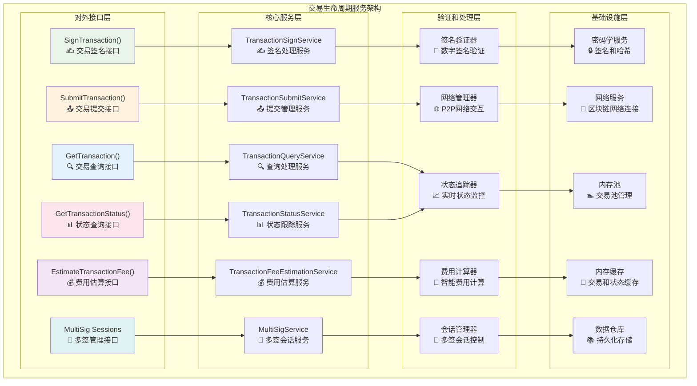
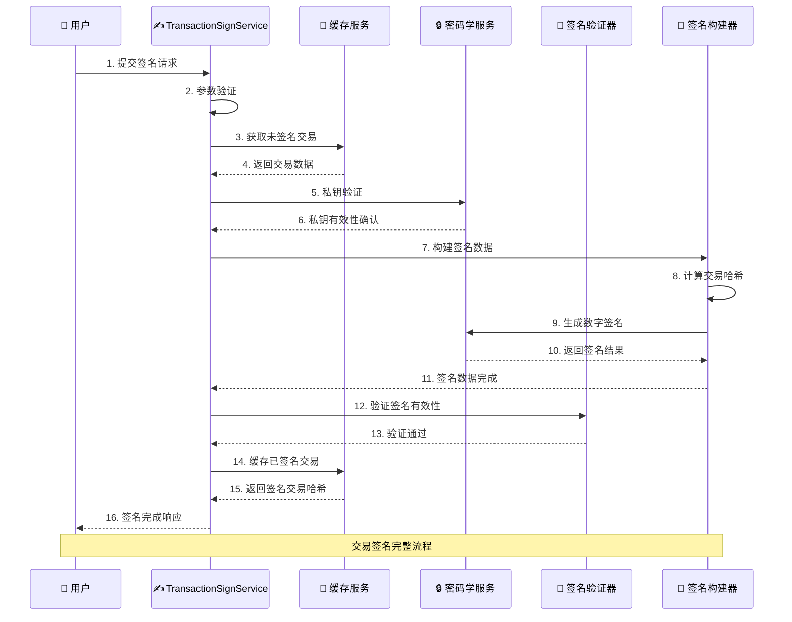
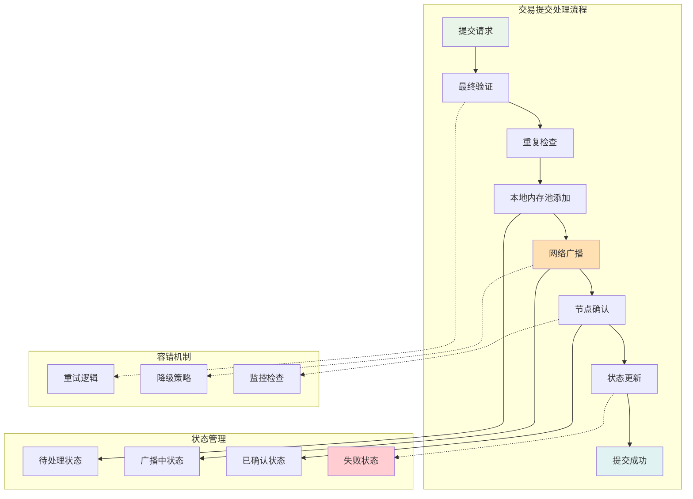
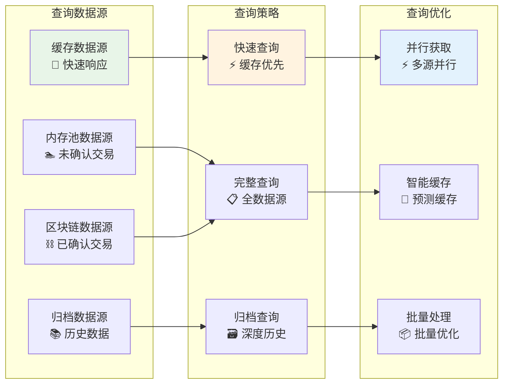
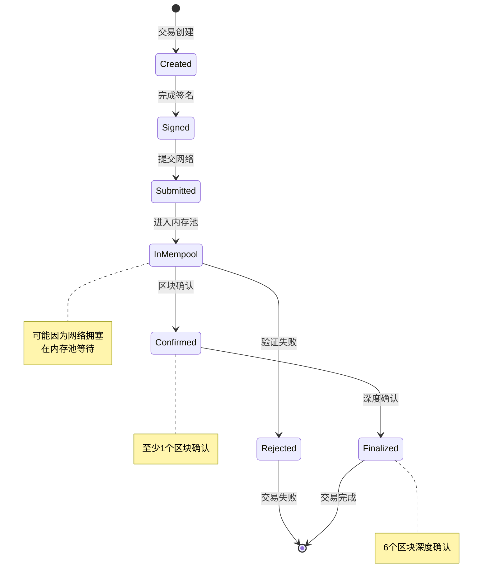
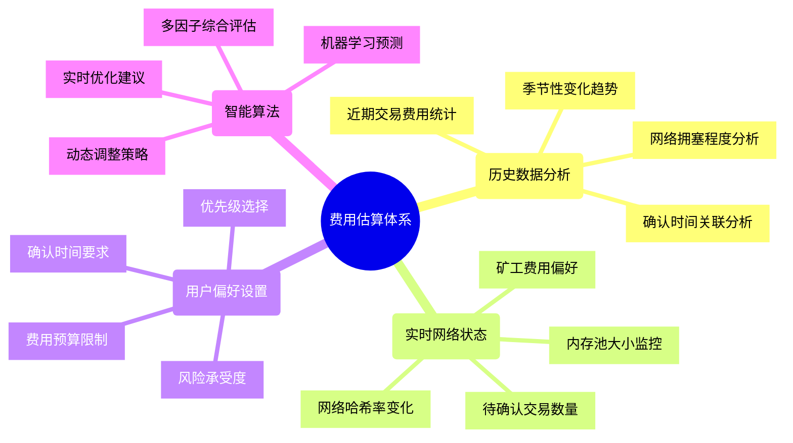
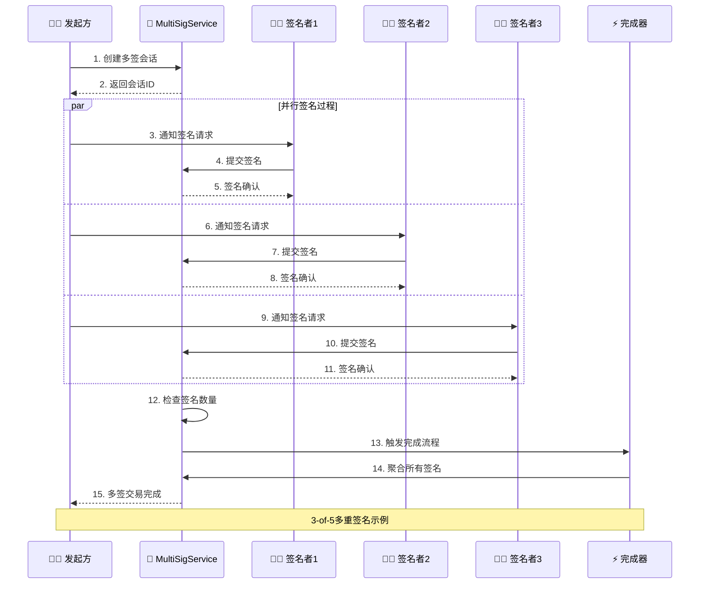

# 交易生命周期服务（internal/core/blockchain/transaction/lifecycle）

【模块定位】
　　交易生命周期服务是交易处理系统的核心控制模块，负责管理交易从签名、提交、到最终确认的完整生命周期。作为所有交易类型的统一处理中枢，提供签名验证、网络提交、状态跟踪、费用估算等关键服务，确保交易处理的安全性、可靠性和用户体验。

【核心职责】
- **交易签名管理**：处理单签名和多重签名的完整流程
- **网络提交控制**：管理交易到区块链网络的可靠提交
- **状态跟踪服务**：实时监控交易在网络中的确认状态
- **费用估算优化**：提供精确的交易费用预估算法
- **查询服务支持**：提供完整的交易数据查询能力
- **多签会话管理**：企业级多重签名协作工作流

---

## 🏗️ **模块架构**

【服务组织】



**架构特点说明：**

1. **完整生命周期覆盖**：从签名到确认的全程管理
2. **服务专业化分工**：每个服务专注特定生命周期阶段
3. **状态实时跟踪**：提供准确的交易状态信息
4. **企业级多签支持**：完整的多重签名协作流程

---

## ✍️ **交易签名服务**

【sign.go】

　　处理交易的数字签名验证和管理，支持单签名和复杂签名场景的统一处理。



**签名处理特性：**

1. **多算法支持**：
   - ECDSA secp256k1（比特币兼容）
   - ECDSA secp256r1（企业级标准）
   - Ed25519（高性能签名）
   - Schnorr（批量验证优化）

2. **安全验证机制**：
   - 私钥格式验证
   - 签名完整性检查
   - 重放攻击防护
   - 签名算法匹配验证

3. **性能优化**：
   - 签名结果缓存
   - 批量签名验证
   - 硬件加速支持
   - 并行签名处理

---

## 📤 **交易提交服务**

【submit.go】

　　管理交易到区块链网络的可靠提交，包括网络广播、重试机制、状态跟踪等功能。



**提交服务特性：**

1. **可靠性保证**：
   - 自动重试机制
   - 多节点广播
   - 超时处理策略
   - 异常自动恢复

2. **网络优化**：
   - 智能节点选择
   - 并行广播处理
   - 网络拥塞避免
   - 带宽使用优化

3. **状态实时更新**：
   - 提交状态实时跟踪
   - 异常状态及时通知
   - 状态变更历史记录
   - 用户友好状态展示

---

## 🔍 **交易查询服务**

【query.go】

　　提供完整的交易数据查询能力，支持多种查询模式和数据源。



**查询服务功能：**

1. **多层级查询**：
   - 缓存层：毫秒级响应
   - 内存池层：实时未确认数据
   - 区块链层：权威确认数据
   - 归档层：完整历史数据

2. **智能查询策略**：
   - 根据查询类型选择最优数据源
   - 自动缓存热点查询结果
   - 批量查询性能优化
   - 异常降级查询策略

3. **丰富查询选项**：
   - 按哈希精确查询
   - 按地址批量查询
   - 按时间范围查询
   - 按交易类型过滤

---

## 📊 **状态跟踪服务**

【status.go】

　　实时跟踪交易在区块链网络中的确认状态和执行结果。



**状态跟踪特性：**

1. **状态精确定义**：
   - Created：交易已创建但未签名
   - Signed：交易已签名但未提交
   - Submitted：已提交到网络
   - InMempool：在内存池等待确认
   - Confirmed：已被区块确认（1-5个确认）
   - Finalized：深度确认（6+个确认）
   - Rejected：验证失败或被拒绝

2. **实时状态更新**：
   - 网络状态主动推送
   - 定期轮询状态检查
   - 异常状态及时通知
   - 状态变更事件记录

3. **状态查询优化**：
   - 状态缓存加速查询
   - 批量状态查询支持
   - 状态变更历史追踪
   - 状态统计分析

---

## 💰 **费用估算服务**

【fee_estimation.go】

　　提供智能化的交易费用估算算法，帮助用户选择合适的费用策略。



**费用估算算法：**

| **估算模式** | **确认时间** | **费用水平** | **适用场景** |
|-------------|-------------|-------------|-------------|
| 经济模式 | 30-60分钟 | 低费用 | 非紧急转账 |
| 标准模式 | 10-30分钟 | 中等费用 | 日常交易 |
| 快速模式 | 1-10分钟 | 较高费用 | 重要交易 |
| 紧急模式 | < 1分钟 | 高费用 | 紧急场景 |

**智能估算特性：**

1. **多因子分析**：
   - 交易大小和复杂度
   - 网络当前拥塞状态
   - 历史确认时间数据
   - 用户确认时间需求

2. **动态调整机制**：
   - 实时网络状态感知
   - 费用市场供需分析
   - 自动调整估算策略
   - 用户反馈学习优化

3. **精确预测算法**：
   - 机器学习模型训练
   - 时间序列分析预测
   - 多维度特征提取
   - 预测准确度验证

---

## 🤝 **多签会话管理**

【multisig.go】

　　企业级多重签名协作工作流管理，支持复杂的多方签名场景。



**多签会话特性：**

1. **灵活会话配置**：
   - M-of-N签名需求配置
   - 签名者权限角色设置
   - 会话过期时间控制
   - 自定义审批流程

2. **异步协作支持**：
   - 签名者独立操作时间
   - 签名进度实时跟踪
   - 签名提醒和通知机制
   - 签名结果自动聚合

3. **企业级安全**：
   - 签名者身份严格验证
   - 签名内容防篡改保护
   - 会话状态完整审计
   - 异常情况自动处理

---

## 📈 **性能指标**

【关键性能指标】

| **服务类型** | **响应时间目标** | **吞吐量目标** | **成功率目标** | **优化重点** |
|-------------|----------------|--------------|--------------|-------------|
| 交易签名 | < 100ms | > 1000 TPS | > 99.9% | 签名算法优化、缓存策略 |
| 交易提交 | < 500ms | > 500 TPS | > 99.5% | 网络优化、重试机制 |
| 状态查询 | < 50ms | > 2000 QPS | > 99.9% | 缓存命中率、查询优化 |
| 费用估算 | < 200ms | > 800 QPS | > 95% | 算法优化、数据预处理 |
| 多签会话 | < 1000ms | > 100 Sessions/min | > 99% | 会话管理、通知优化 |

**监控仪表板：**

```mermaid
dashboard
    title 生命周期服务监控面板
    
    gauge "签名服务成功率" value 99.92 max 100 units "%"
    gauge "提交服务延迟" value 320 max 500 units "ms"  
    gauge "查询缓存命中率" value 94.5 max 100 units "%"
    gauge "费用估算准确度" value 87.3 max 100 units "%"
    gauge "多签会话活跃数" value 23 max 100 units "sessions"
```

---

## 🛠️ **故障诊断**

【常见问题和解决方案】

| **问题类型** | **症状** | **可能原因** | **解决方案** |
|-------------|----------|-------------|-------------|
| 签名失败 | 签名验证不通过 | 私钥格式错误、算法不匹配 | 检查私钥格式和签名算法 |
| 提交超时 | 交易长时间未确认 | 网络拥塞、费用过低 | 提高费用或等待网络恢复 |
| 查询无结果 | 无法查询到交易 | 交易未提交或哈希错误 | 验证哈希正确性和提交状态 |
| 费用估算异常 | 估算费用明显不合理 | 网络数据异常、算法bug | 重新获取网络数据、算法修复 |
| 多签会话超时 | 会话过期未完成 | 签名者响应慢、通知失败 | 延长超时时间、改进通知机制 |

**诊断工具：**

```go
// 生命周期服务诊断接口
type LifecycleDiagnostics interface {
    CheckSigningService() (*ServiceHealthReport, error)
    CheckSubmissionService() (*ServiceHealthReport, error)
    CheckQueryService() (*ServiceHealthReport, error)
    CheckStatusService() (*ServiceHealthReport, error)
    CheckFeeEstimationService() (*ServiceHealthReport, error)
    CheckMultiSigService() (*ServiceHealthReport, error)
    GetPerformanceMetrics() (*PerformanceMetrics, error)
}

type ServiceHealthReport struct {
    ServiceName    string                 `json:"service_name"`
    Status         string                 `json:"status"`          // healthy, degraded, unhealthy
    LastCheck      time.Time             `json:"last_check"`
    ResponseTime   time.Duration         `json:"response_time"`
    ErrorRate      float64               `json:"error_rate"`
    Issues         []string              `json:"issues,omitempty"`
    Recommendations []string             `json:"recommendations,omitempty"`
}
```

---

## 📋 **开发指南**

【最佳实践】

1. **签名安全**：
   - 永不在网络传输中暴露私钥
   - 使用硬件钱包或安全模块
   - 定期轮换签名密钥
   - 实施签名审计机制

2. **提交可靠性**：
   - 合理设置重试策略
   - 监控网络连接状态
   - 实施降级处理机制
   - 维护备用网络节点

3. **状态跟踪**：
   - 建立完整的状态定义
   - 实施状态变更通知
   - 保存状态变更历史
   - 提供状态查询API

4. **费用优化**：
   - 根据用户需求选择费用策略
   - 实时监控网络费用市场
   - 提供费用预测和建议
   - 支持费用策略个性化

5. **多签管理**：
   - 建立清晰的签名流程
   - 实施签名者权限管理
   - 提供签名进度跟踪
   - 支持签名策略灵活配置

【集成示例】

```go
// 完整的交易生命周期处理示例
func ProcessTransactionLifecycle(txHash []byte, privateKey []byte) error {
    // 1. 签名交易
    signedTxHash, err := lifecycleManager.SignTransaction(context.Background(), txHash, privateKey)
    if err != nil {
        return fmt.Errorf("签名失败: %v", err)
    }
    
    // 2. 提交交易
    err = lifecycleManager.SubmitTransaction(context.Background(), signedTxHash)
    if err != nil {
        return fmt.Errorf("提交失败: %v", err)
    }
    
    // 3. 跟踪状态
    for {
        status, err := lifecycleManager.GetTransactionStatus(context.Background(), signedTxHash)
        if err != nil {
            return fmt.Errorf("状态查询失败: %v", err)
        }
        
        if status == types.TransactionStatusFinalized {
            break // 交易完成
        }
        
        time.Sleep(30 * time.Second) // 等待30秒后重新检查
    }
    
    return nil
}
```

【参考文档】
- [交易管理接口规范](../../../../pkg/interfaces/blockchain/transaction.go)
- [交易数据结构定义](../../../../pb/blockchain/block/transaction/transaction.proto)
- [密码学服务接口](../../../../pkg/interfaces/infrastructure/crypto/README.md)
- [网络服务接口](../../../../pkg/interfaces/infrastructure/network/README.md)
