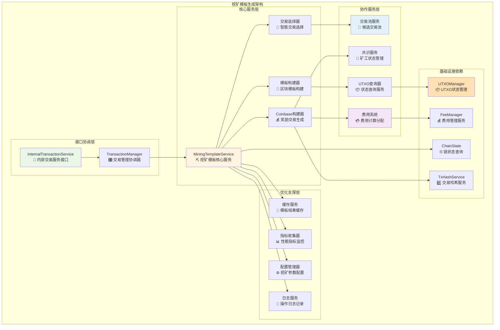
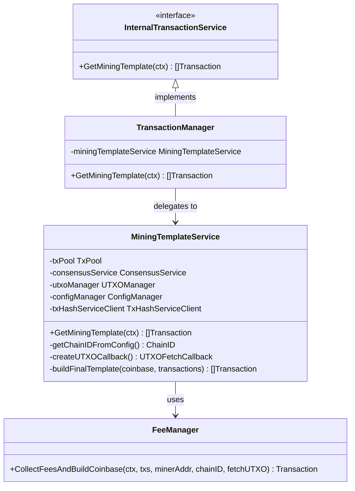

# 挖矿模板生成服务（internal/core/blockchain/transaction/mining）

【模块定位】
　　本模块是WES区块链系统的挖矿模板生成核心服务模块，负责为矿工提供完整的区块挖矿模板和Coinbase交易构建。作为InternalTransactionService接口的重要实现组件，通过深度集成交易池、费用系统和共识服务，提供高性能、智能化的挖矿模板生成能力，确保矿工能够获得最优的挖矿候选区块。

【设计原则】
- **专业化服务**：专注挖矿模板生成的单一核心职责
- **深度集成**：与交易池、费用系统、共识服务的深度集成协作
- **性能优先**：优化交易选择和UTXO查询的关键路径性能
- **智能选择**：基于费用和优先级的智能交易选择策略
- **容错恢复**：提供完整的错误处理和恢复机制

【核心职责】
1. **挖矿模板构建**：基于交易池候选交易构建完整的挖矿区块模板
2. **Coinbase交易生成**：集成费用系统生成包含奖励分配的Coinbase交易
3. **交易智能选择**：从交易池中选择最优的候选交易组合
4. **UTXO查询服务**：提供高效的UTXO查询回调支持费用计算
5. **矿工状态协调**：与共识服务协作获取当前矿工状态和配置
6. **性能优化管理**：实现缓存、批量处理等性能优化机制

【实现架构】

　　采用**服务协作 + 智能选择**的挖矿模板生成架构，确保生成最优的挖矿区块候选。



**架构层次说明：**

1. **接口协调层**：提供标准化的挖矿模板生成接口和请求协调
   - 统一的服务接口定义
   - 轻量级的请求协调逻辑
   - 标准化的错误处理和返回

2. **核心服务层**：实现挖矿模板生成的核心业务逻辑
   - 专业化的模板构建能力
   - 智能化的交易选择算法
   - 完整的Coinbase交易生成

3. **协作服务层**：与系统其他组件深度集成协作
   - 高效的交易池查询接口
   - 实时的矿工状态获取
   - 精确的费用计算和分配

---

## 📁 **模块组织结构**

【内部模块架构】

```
internal/core/blockchain/transaction/mining/
├── ⛏️ mining_template.go           # 挖矿模板服务核心实现
└── 📚 README.md                    # 本文档
```

### **🎯 组件职责分工**

| **组件** | **核心职责** | **对外接口** | **内部组件** | **复杂度** |
|---------|-------------|-------------|-------------|-----------|
| `mining_template.go` | 挖矿模板生成服务 | InternalTransactionService实现 | 模板构建、交易选择、Coinbase生成 | ⭐⭐⭐⭐⭐ |

## 🔄 **统一挖矿模板实现**

【实现策略】

　　所有挖矿模板生成均遵循**多服务协作 + 智能优化**模式，确保生成最优的挖矿区块候选。

```mermaid
flowchart TD
    subgraph "统一挖矿模板生成流程"
        subgraph "交易获取阶段"
            A[GetMiningTemplate请求] --> B[交易池候选获取]
            B --> C[矿工状态查询]
            C --> D[链配置获取]
        end
        
        subgraph "交易选择阶段"
            D --> E[交易优先级排序]
            E --> F[费用计算权重分析]
            F --> G[交易组合优化]
        end
        
        subgraph "Coinbase构建阶段"
            G --> H[UTXO查询回调创建]
            H --> I[费用系统调用]
            I --> J[Coinbase交易生成]
        end
        
        subgraph "模板组装阶段"
            J --> K[模板结构构建]
            K --> L[交易顺序优化]
            L --> M[最终模板生成]
        end
    end
```



**关键实现要点：**

1. **交易池智能集成**：
   - 从TxPool获取经过排序的候选交易
   - 基于费用优先级进行智能选择
   - 支持动态的交易组合优化

2. **Coinbase精确构建**：
   - 集成费用系统进行精确奖励计算
   - 支持多代币手续费聚合处理
   - 实现矿工奖励的公平分配

3. **UTXO高效查询**：
   - 热数据策略：直接从缓存获取TxOutput
   - 冷数据策略：通过区块链回溯获取历史数据
   - 智能缓存机制优化查询性能

---

## 🏗️ **依赖注入架构**

【fx框架集成】

　　全面采用fx依赖注入框架，实现挖矿模板服务与系统其他组件的松耦合集成。

```go
// 示例：挖矿模板模块依赖注入配置
package mining

import (
    "go.uber.org/fx"
    "github.com/weisyn/v1/internal/core/blockchain/interfaces"
)

// Module 挖矿模板模块
var Module = fx.Module("mining_template",
    // 导入核心组件
    fx.Provide(
        // 挖矿模板服务
        NewMiningTemplateService,
    ),
    
    // 导出内部接口实现
    fx.Provide(
        fx.Annotate(
            func(mts *MiningTemplateService) interfaces.MiningTemplateProvider {
                return mts
            },
            fx.As(new(interfaces.MiningTemplateProvider)),
        ),
    ),
)

// 服务构造函数
func NewMiningTemplateService(
    txPool TxPool,
    consensusService ConsensusService,
    utxoManager repository.UTXOManager,
    configManager config.ConfigManager,
    txHashServiceClient pb.TxHashServiceClient,
    logger log.Logger,
) *MiningTemplateService {
    return &MiningTemplateService{
        txPool:              txPool,
        consensusService:    consensusService,
        utxoManager:        utxoManager,
        configManager:      configManager,
        txHashServiceClient: txHashServiceClient,
        logger:             logger,
    }
}
```

**依赖管理特点：**
- **自动生命周期**：服务启动和停止由fx自动管理
- **接口导向**：通过接口而非具体类型进行依赖
- **层次清晰**：明确的依赖方向，避免循环依赖
- **测试友好**：支持依赖注入的单元测试

## 📊 **性能与监控**

【性能指标】

| **操作类型** | **目标延迟** | **吞吐量目标** | **成功率** | **监控方式** |
|-------------|-------------|---------------|-----------|------------|
| 模板生成 | < 500ms | > 200 模板/秒 | > 99% | 实时监控 |
| 交易选择 | < 200ms | > 1000 交易/秒 | > 99.5% | 批量统计 |
| Coinbase构建 | < 300ms | > 500 构建/秒 | > 99.9% | 关键路径监控 |
| UTXO查询 | < 50ms | > 2000 查询/秒 | > 99% | 异步监控 |
| 费用计算 | < 100ms | > 1000 计算/秒 | > 99.5% | 性能监控 |

**性能优化策略：**
- **缓存优化**：模板结果和UTXO查询结果的智能缓存
- **批量处理**：批量交易选择和费用计算处理
- **并发优化**：支持多协程并行处理不同阶段任务
- **资源管理**：动态调整内存使用和计算资源分配

---

## 🔗 **与公共接口的映射关系**

【接口实现映射】



**实现要点：**
- **接口契约**：严格遵循InternalTransactionService接口的方法签名和语义
- **错误处理**：标准化的错误返回和异常处理机制
- **日志记录**：完善的操作日志和性能指标记录
- **测试覆盖**：每个接口方法都有对应的单元测试和集成测试

---

## 🚀 **后续扩展规划**

【模块演进方向】

1. **智能化增强**
   - 基于机器学习的交易选择优化算法
   - 智能化的Coinbase奖励分配策略
   - 自适应的模板生成参数调优

2. **性能提升**
   - 更高效的交易池查询和筛选机制
   - 分布式UTXO查询支持
   - 并行化的模板构建处理能力

3. **功能扩展**
   - 支持更复杂的挖矿策略配置
   - 跨链挖矿模板的生成支持
   - 智能合约奖励的集成处理

4. **监控增强**
   - 更详细的挖矿模板生成指标
   - 实时的模板质量评估
   - 挖矿效率分析和优化建议

---

## 📋 **开发指南**

【挖矿模板服务开发规范】

1. **服务实现要求**：
   - 严格按照InternalTransactionService接口规范实现
   - 确保模板生成的原子性和一致性
   - 实现完整的错误处理和恢复机制
   - 提供详细的操作日志和性能指标

2. **集成协作要求**：
   - 与交易池服务的高效集成和数据获取
   - 与费用系统的深度集成和精确计算
   - 与共识服务的实时状态同步和协作
   - 与UTXO管理器的高性能查询集成

3. **性能优化要求**：
   - 模板生成延迟指标达标
   - 合理使用缓存和内存管理
   - 支持高并发模板生成场景
   - 实现智能的资源调度和优化

【参考文档】
- [内部交易服务接口](../../interfaces/transaction.go)
- [费用系统实现](../fee/README.md)
- [交易处理主模块](../README.md)
- [WES架构设计文档](../../../../docs/architecture/)

---

> 📝 **模块说明**：本模块是WES v0.0.1挖矿生态的核心支撑，通过高效的模板生成和智能的交易选择为矿工提供最优的挖矿候选区块。

> 🔄 **维护指南**：本文档应随着挖矿模板生成逻辑的演进及时更新，确保文档与代码实现的一致性。建议在每次重大挖矿策略调整后更新相应章节。
