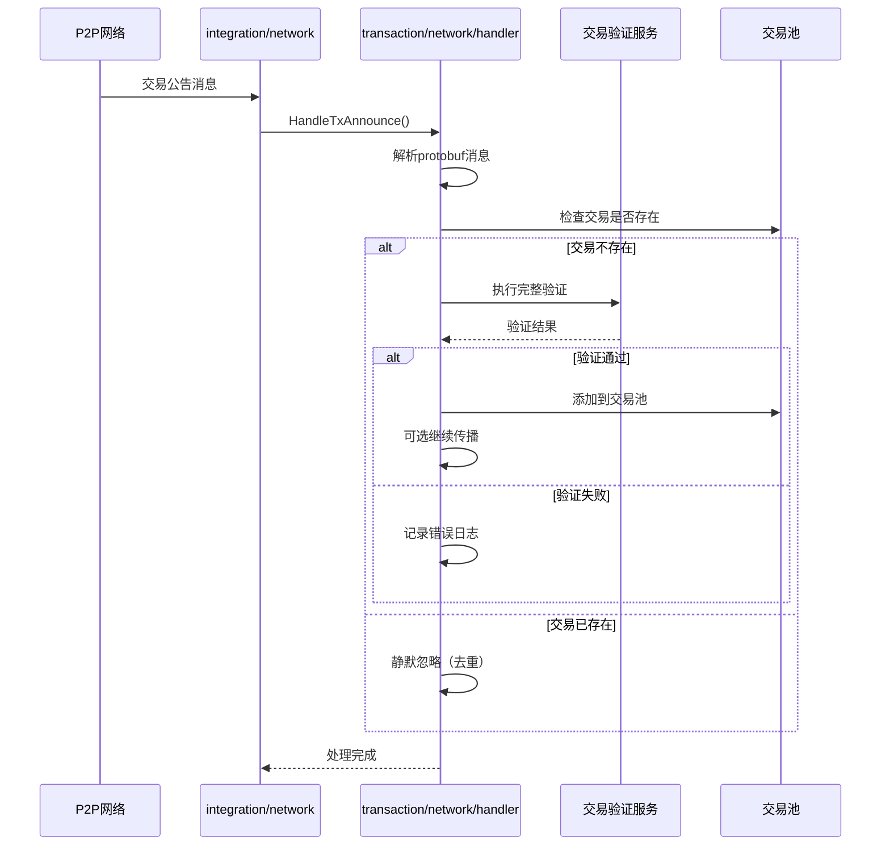

# 交易网络处理器 (Transaction Network Handler)

## 模块定位

　　本模块是区块链交易组件的网络消息处理器，负责处理来自P2P网络的交易传播相关消息。作为`transaction`组件的网络子模块，统一归口处理交易公告、交易中继等网络消息，执行完整的交易验证和入池流程。

## 设计原则

- **统一归口**：集中处理所有交易相关的网络消息
- **业务解耦**：将网络协议细节与交易业务逻辑分离
- **接口驱动**：实现integration/network定义的路由器接口
- **安全优先**：执行完整的交易验证和安全检查

## 核心职责

### 网络消息处理
- 处理交易公告消息（订阅协议）
- 处理交易中继请求（流式协议）
- 执行双重保障传播机制
- 实现交易去重和验证

### 业务安全验证
- 交易格式和签名验证
- UTXO状态检查和冲突检测
- 交易池去重检查
- 手续费和业务规则验证

### 传播策略执行
- GossipSub全网广播（fire-and-forget）
- 点对点流式传播（确保送达）
- K桶节点选择算法
- 失败节点退避机制

## 实现架构

### 文件结构
```
internal/core/blockchain/transaction/network/
├── handler.go          # 交易网络消息处理器实现
├── types.go           # 本地数据结构定义
└── README.md          # 本文档
```

### 接口实现

**实现的Router接口**：
- `TxAnnounceRouter` - 处理交易公告消息
- `TxProtocolRouter` - 处理交易协议消息（待完善）

**委托的业务接口**：
- `mempool.TxPool` - 交易池管理
- `lifecycle.TransactionValidationService` - 交易验证服务

## 消息流向



## 交易传播业务规则

### 双重保障传播机制

参考 [网络业务规则规范](../../../docs/standards/NETWORK_BUSINESS_RULES_SPECIFICATION.md) 中的交易传播规则：

**主要传播路径（GossipSub）**：
- 基于订阅模式进行全网广播
- fire-and-forget策略，无需等待确认
- 广播超时：5秒
- 支持并发传播提高效率

**备份传播路径（Stream RPC）**：
- 基于K桶选择2-3个邻近节点
- 点对点流式传播，等待确认
- 流式传播超时：8秒
- 确保关键节点送达

### K桶节点选择策略

**选择算法**：
- 基于Kademlia距离：XOR(txHash, peerID)
- 选择距离最近的2-3个活跃节点
- 确保节点来自不同子网
- 排除最近失败的节点

**容错配置**：
- 失败阈值：连续失败5次后排除节点
- 退避时长：10分钟（范围：1-30分钟）
- 节点选择延迟：不超过100ms
- 多样性要求：强制不同子网分布

## 消息类型处理

### 交易公告处理 (TransactionAnnouncement)

**消息来源**：GossipSub订阅 - `weisyn.transaction.announce.v1`

**处理流程**：
1. 解析protobuf消息（`TransactionAnnouncement`）
2. 提取交易哈希和完整交易数据
3. **去重检查**：检查本地TxPool是否已存在
4. **UTXO状态验证**：验证引用的UTXO是否可用
5. **完整交易验证**：委托给交易验证服务
6. **入池处理**：验证通过后添加到交易池
7. **可选传播**：继续向其他节点传播

**验证规则严格遵循**：
- 重复交易静默忽略，不报错不传播
- UTXO状态必须为AVAILABLE
- 执行完整的签名、余额、业务规则验证
- 验证失败记录详细错误信息

### 交易中继处理 (TransactionRelay) [待实现]

**消息来源**：Stream RPC - `/weisyn/transaction/relay/1.0.0`

**处理流程**：
1. 解析`TransactionRelayRequest`消息
2. 执行与公告相同的验证流程
3. 构造`TransactionRelayResponse`响应
4. 返回处理结果（接受/拒绝及原因）

## 错误处理与重试

### 错误分类处理

**解析错误**：
- protobuf消息格式错误
- 处理：记录ERROR日志，丢弃消息

**验证错误**：
- 交易签名验证失败
- UTXO状态不可用
- 业务规则违反
- 处理：记录详细错误上下文，拒绝交易

**系统错误**：
- 交易池服务不可用
- 验证服务异常
- 处理：记录CRITICAL日志，触发告警

### 资源回滚机制

**网络传播失败处理**：
- 解除已引用的UTXO（调用UnreferenceUTXO）
- 清理相关交易缓存数据
- 回滚超时设置：10-30秒
- 回滚失败记录ERROR日志但不影响主流程

**重试配置**：
- 最大重试次数：3次
- 基础延迟：2秒
- 最大延迟：30秒
- 退避乘数：2.0（指数退避）

## 性能指标与监控

### 关键指标
- **交易处理延迟**：从接收到入池的平均延迟
- **验证成功率**：交易验证通过的比例
- **去重命中率**：重复交易的检测比例
- **传播成功率**：交易传播到网络的成功率

### 监控告警
- 连续失败达到阈值（5次）时触发告警
- 处理延迟超过阈值时记录WARN日志
- 验证失败率异常时触发监控告警
- 定期上报性能统计到监控系统

## 配置参数

### 业务配置
- **最少节点数**：3个（K桶节点选择）
- **失败阈值**：5次（连续失败后排除节点）
- **退避时长**：10分钟（失败节点退避时间）
- **广播超时**：5秒（GossipSub广播超时）
- **流式超时**：8秒（Stream RPC超时）

### 验证配置
- **UTXO检查超时**：5秒
- **签名验证超时**：3秒
- **业务验证超时**：10秒
- **入池操作超时**：5秒

## 依赖关系

### 上游依赖
- `integration/network` - 网络协议注册和消息路由
- `pb/network/protocol/transaction` - 交易协议protobuf定义

### 下游依赖
- `mempool.TxPool` - 交易池管理服务
- `lifecycle.TransactionValidationService` - 交易验证服务  
- `pkg/interfaces/infrastructure/log.Logger` - 日志记录服务

---

**维护者**: WES 架构团队  
**最后更新**: 2025-01-11
