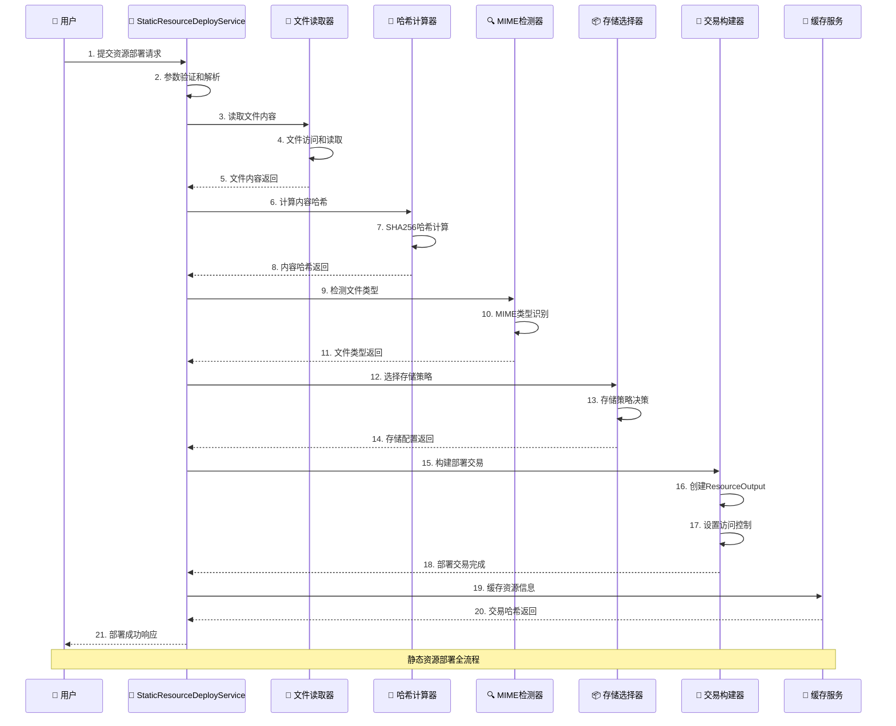
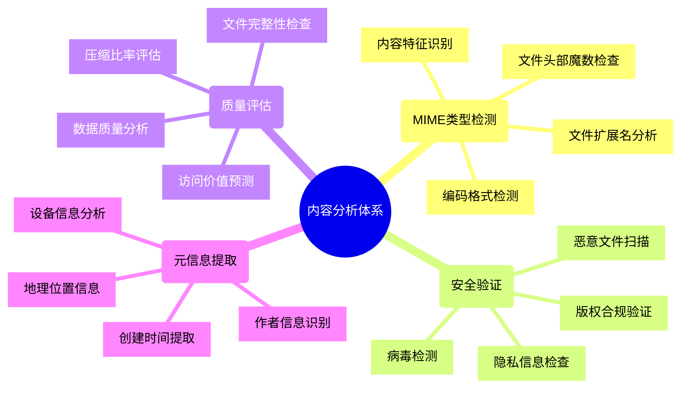
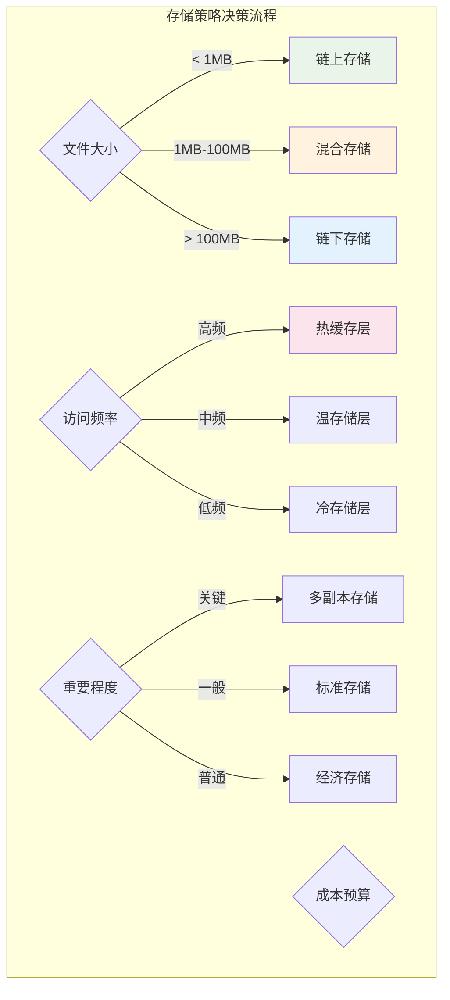
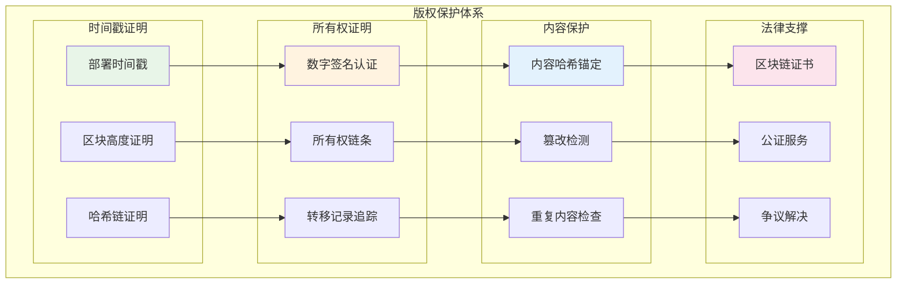
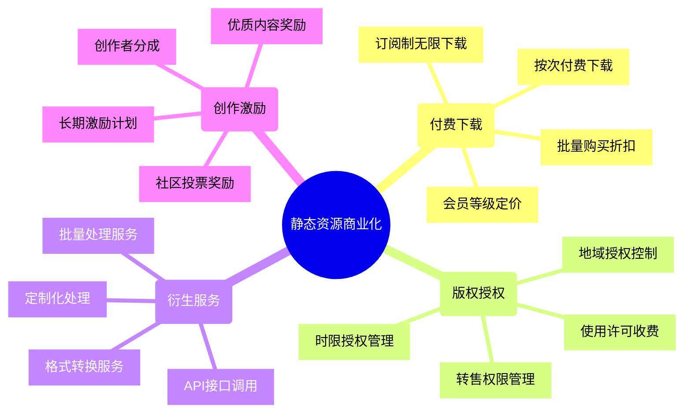

# 静态资源服务（internal/core/blockchain/transaction/resource）

【模块定位】
　　静态资源服务是交易处理系统中专门处理静态资源（文档、图片、视频、数据文件等）上链部署的基础模块。通过内容寻址和区块链锚定技术，实现数字资产的去中心化存储、版权保护和价值确认，为Web3内容经济提供基础设施支撑。

【核心职责】
- **静态资源部署**：支持各种格式的文件上链部署
- **内容哈希计算**：基于SHA256的内容寻址机制
- **MIME类型检测**：自动识别文件类型和格式
- **存储策略优化**：支持链上、链下、混合存储模式
- **版权保护**：时间戳证明和所有权确认

---

## 🏗️ **模块架构**

【服务组织】

```mermaid
graph TB
    subgraph "静态资源服务架构"
        subgraph "对外接口"
            DEPLOY["DeployStaticResource()<br/>📁 静态资源部署接口"]
        end
        
        subgraph "核心服务"
            DEPLOY_SVC["StaticResourceDeployService<br/>🚀 资源部署逻辑"]
        end
        
        subgraph "内容处理"
            FILE_READER["文件读取器<br/>📖 文件内容读取"]
            HASH_CALC["哈希计算器<br/>🔢 内容哈希计算"]
            MIME_DETECTOR["MIME检测器<br/>🔍 文件类型识别"]
        end
        
        subgraph "验证和优化"
            SIZE_VALIDATOR["大小验证器<br/>📏 文件大小检查"]
            FORMAT_VALIDATOR["格式验证器<br/>✅ 文件格式验证"]
            COMPRESS_ENGINE["压缩引擎<br/>🗜️ 文件压缩优化"]
        end
        
        subgraph "存储管理"
            STORAGE_SELECTOR["存储选择器<br/>📦 存储策略选择"]
            LOCATION_MGR["位置管理器<br/>📍 存储位置管理"]
            REPLICA_MGR["副本管理器<br/>🔄 数据冗余管理"]
        end
        
        subgraph "基础设施"
            CONTENT_STORE["内容存储<br/>💾 实际文件存储"]
            CACHE["缓存服务<br/>🧠 文件缓存"]
            CRYPTO["密码学服务<br/>🔐 哈希和签名"]
        end
    end
    
    DEPLOY --> DEPLOY_SVC
    
    DEPLOY_SVC --> FILE_READER
    FILE_READER --> HASH_CALC
    HASH_CALC --> MIME_DETECTOR
    
    MIME_DETECTOR --> SIZE_VALIDATOR
    SIZE_VALIDATOR --> FORMAT_VALIDATOR
    FORMAT_VALIDATOR --> COMPRESS_ENGINE
    
    COMPRESS_ENGINE --> STORAGE_SELECTOR
    STORAGE_SELECTOR --> LOCATION_MGR
    LOCATION_MGR --> REPLICA_MGR
    
    REPLICA_MGR --> CONTENT_STORE
    CONTENT_STORE --> CACHE
    CACHE --> CRYPTO
    
    style DEPLOY fill:#E8F5E8
    style DEPLOY_SVC fill:#E3F2FD
    style HASH_CALC fill:#FFF3E0
    style STORAGE_SELECTOR fill:#FCE4EC
```



**架构特点说明：**

1. **内容优先设计**：以内容哈希为核心的寻址机制
2. **存储策略灵活**：支持多种存储模式和优化策略
3. **自动化处理**：文件类型检测、压缩优化等自动化
4. **版权友好**：原生支持版权保护和所有权证明

---

## 📁 **静态资源部署服务**

【static_deploy.go】

　　处理静态资源的完整部署流程，从文件读取到区块链锚定的全流程自动化。



**部署处理阶段：**

1. **文件处理阶段**：
   - 文件路径验证和访问权限检查
   - 文件内容完整性读取
   - 文件大小合理性验证
   - 文件格式初步检查

2. **内容分析阶段**：
   - SHA256内容哈希计算
   - MIME类型自动检测
   - 文件元信息提取
   - 重复内容检查

3. **存储策略选择**：
   - 根据文件大小选择存储方式
   - 考虑访问频率和重要性
   - 配置数据冗余策略
   - 设置访问控制权限

4. **区块链锚定**：
   - 创建ResourceOutput UTXO
   - 设置ResourceCategory为STATIC
   - 配置适当的锁定条件
   - 完成链上部署确认

---

## 🔍 **内容识别和验证**

【智能内容分析】



**支持的文件类型：**

| **类别** | **格式支持** | **最大大小** | **特殊处理** |
|---------|------------|-------------|-------------|
| 文档 | PDF, DOC, TXT, MD | 100MB | OCR文本提取 |
| 图片 | JPG, PNG, GIF, SVG | 50MB | 缩略图生成 |
| 视频 | MP4, AVI, MOV | 1GB | 帧截图提取 |
| 音频 | MP3, WAV, FLAC | 200MB | 频谱分析 |
| 数据 | JSON, CSV, XML | 500MB | 结构验证 |
| 代码 | JS, PY, GO, SOL | 10MB | 语法高亮 |

**内容验证规则：**

```go
// 内容验证配置
type ContentValidationConfig struct {
    MaxFileSize     int64    `json:"max_file_size"`
    AllowedMimes    []string `json:"allowed_mimes"`
    ProhibitedWords []string `json:"prohibited_words"`
    RequireSignature bool    `json:"require_signature"`
    VirusScanEnabled bool    `json:"virus_scan_enabled"`
}

// 验证结果
type ValidationResult struct {
    IsValid     bool                   `json:"is_valid"`
    Errors      []string              `json:"errors"`
    Warnings    []string              `json:"warnings"`
    Metadata    map[string]interface{} `json:"metadata"`
    Suggestions []string              `json:"suggestions"`
}
```

---

## 📦 **存储策略管理**

【灵活的存储架构】



**存储模式对比：**

| **存储模式** | **优点** | **缺点** | **适用场景** | **成本** |
|-------------|----------|----------|-------------|----------|
| 链上存储 | 永久可用、高可信 | 成本高、容量限制 | 重要证书、合同 | ⭐⭐⭐⭐⭐ |
| 混合存储 | 平衡性能成本 | 复杂度中等 | 常用文档、图片 | ⭐⭐⭐ |
| 链下存储 | 成本低、容量大 | 可用性依赖第三方 | 视频、大数据集 | ⭐⭐ |

**智能存储选择算法：**

```go
// 存储策略选择器
type StorageStrategy struct {
    Size        int64  `json:"size"`
    AccessFreq  string `json:"access_frequency"`  // high, medium, low
    Importance  string `json:"importance"`        // critical, standard, economy
    Budget      string `json:"budget"`           // unlimited, standard, limited
}

func (s *StorageStrategy) SelectStrategy() string {
    if s.Size < 1024*1024 { // < 1MB
        return "on_chain"
    }
    
    if s.Size < 100*1024*1024 { // < 100MB
        if s.AccessFreq == "high" && s.Importance == "critical" {
            return "hybrid_premium"
        }
        return "hybrid_standard"
    }
    
    return "off_chain"
}
```

---

## 🔒 **版权保护机制**

【完善的知识产权保护】



**版权保护功能：**

1. **时间戳证明**：
   - 区块链不可篡改时间戳
   - 全球统一时间标准
   - 法院认可的有效证据
   - 自动化证明生成

2. **所有权确认**：
   - 数字签名身份认证
   - 完整的所有权转移链条
   - 多重签名共同所有权
   - 智能合约自动执行

3. **内容保护**：
   - 内容哈希唯一标识
   - 实时篡改检测
   - 重复上传检测
   - 版本控制管理

---

## 💰 **商业化模式**

【内容经济价值实现】



**盈利模式框架：**

| **模式类型** | **收费标准** | **目标用户** | **价值主张** |
|-------------|-------------|-------------|-------------|
| 免费展示 | 免费 | 普通用户 | 基础浏览和预览 |
| 付费下载 | 0.001-1原生币 | 个人用户 | 高清下载和使用 |
| 商业授权 | 10-1000原生币 | 企业用户 | 商用权限和技术支持 |
| 独家授权 | 1000+原生币 | 大型机构 | 独占使用权和定制服务 |

---

## 📊 **性能指标**

【服务质量保证】

| **性能指标** | **目标值** | **当前值** | **优化方向** |
|-------------|-----------|-----------|-------------|
| 文件上传速度 | > 10MB/s | ~12MB/s | 网络优化、并行上传 |
| 内容哈希计算 | < 100ms/MB | ~85ms/MB | 硬件加速、算法优化 |
| 存储选择延迟 | < 50ms | ~40ms | 策略缓存、预计算 |
| 部署成功率 | > 99% | ~99.2% | 异常处理、重试机制 |
| 缓存命中率 | > 80% | ~85% | 智能预取、LRU优化 |

**监控和优化：**

```go
// 性能监控指标
type ResourceMetrics struct {
    UploadSpeed      float64 `json:"upload_speed_mbps"`
    HashingSpeed     float64 `json:"hashing_speed_ms_per_mb"`
    DeploymentRate   float64 `json:"deployment_success_rate"`
    CacheHitRate     float64 `json:"cache_hit_rate"`
    StorageUtilization float64 `json:"storage_utilization"`
}

// 优化建议
type OptimizationSuggestion struct {
    Area        string `json:"area"`
    Current     float64 `json:"current_value"`
    Target      float64 `json:"target_value"`
    Action      string `json:"suggested_action"`
    Impact      string `json:"expected_impact"`
}
```

---

## 🛠️ **开发指南**

【使用最佳实践】

1. **文件准备建议**：
   - 文件大小控制在合理范围内
   - 使用标准格式和编码
   - 添加合适的元信息
   - 预先进行质量检查

2. **部署配置优化**：
   - 根据访问模式选择存储策略
   - 设置合适的访问控制权限
   - 配置适当的冗余级别
   - 考虑成本效益比

3. **版权保护强化**：
   - 使用数字签名确认所有权
   - 添加水印和版权信息
   - 设置合适的使用许可
   - 建立完整的权利证明链

4. **性能优化技巧**：
   - 预先压缩大型文件
   - 使用缓存减少重复上传
   - 批量处理相关文件
   - 监控和优化存储策略

【常见问题解决】

| **问题** | **原因** | **解决方案** |
|---------|----------|-------------|
| 上传失败 | 文件过大或格式不支持 | 检查文件大小和格式限制 |
| 哈希冲突 | 相同内容重复上传 | 使用现有资源地址 |
| 访问被拒绝 | 权限设置不当 | 检查锁定条件配置 |
| 存储异常 | 存储服务不可用 | 切换备用存储策略 |
| 费用过高 | 存储策略选择不当 | 优化存储策略配置 |

【参考文档】
- [静态资源接口规范](../../../../pkg/interfaces/blockchain/transaction.go)
- [资源数据结构](../../../../pb/blockchain/block/transaction/resource/README.md)
- [存储服务接口](../../../../pkg/interfaces/infrastructure/storage/README.md)
- [内容寻址原理](../../../../docs/architecture/content_addressing.md)
