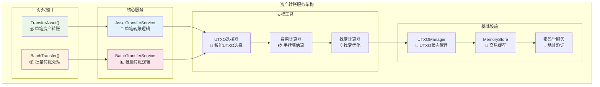
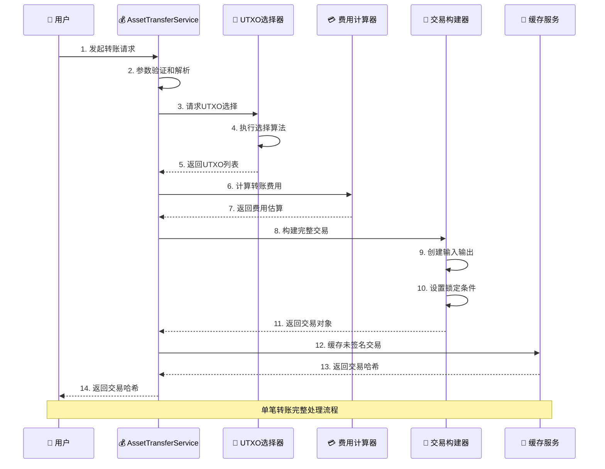
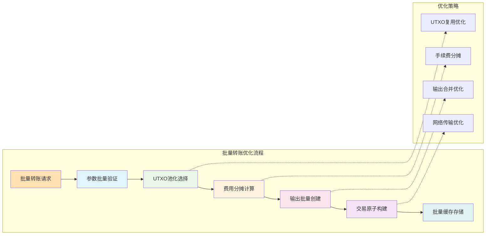
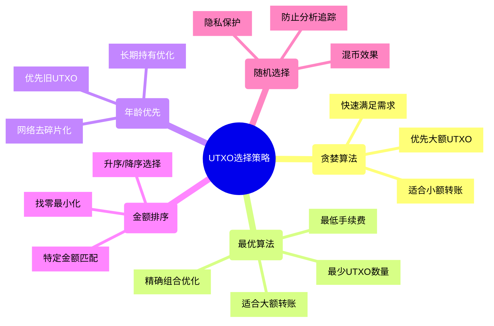
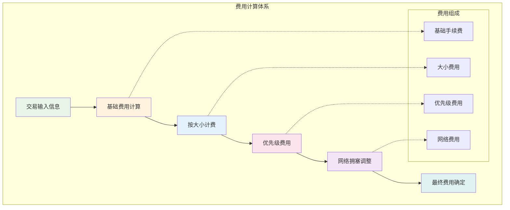
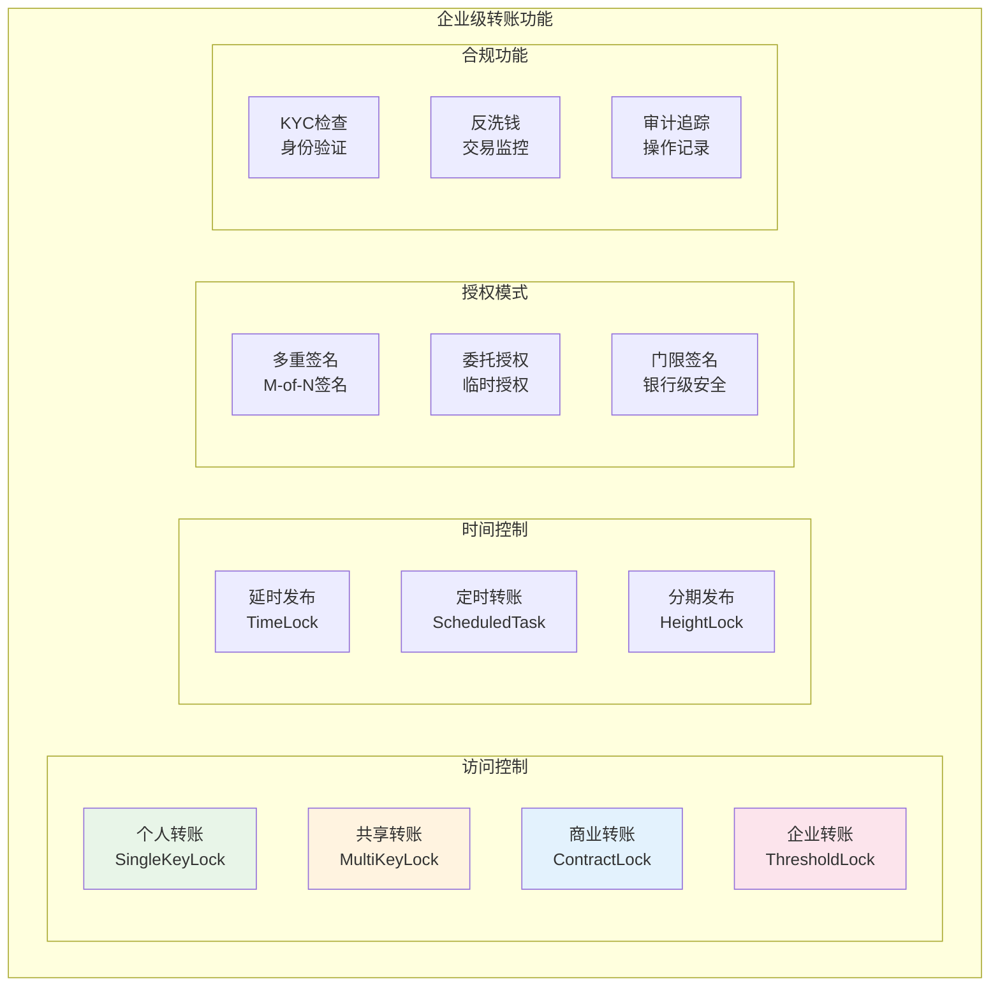

# 资产转账服务（internal/core/blockchain/transaction/transfer）

【模块定位】
　　资产转账服务是交易处理系统中专门负责AssetOutput创建和资产转移的核心模块。基于EUTXO模型实现高效的价值载体转换，支持原生代币、合约代币的单笔转账和批量转账，提供企业级的资产管理能力。

【核心职责】
- **价值载体创建**：生成AssetOutput类型的UTXO，实现价值权利的链上表达
- **UTXO智能选择**：基于多种策略选择最优UTXO组合，降低手续费
- **找零自动计算**：精确计算找零金额，确保价值守恒
- **批量转账优化**：支持一对多转账，优化网络资源和手续费
- **多代币支持**：统一处理原生代币和智能合约发行的代币

---

## 🏗️ **模块架构**

【服务组织】



**架构特点说明：**

1. **双服务设计**：单笔转账和批量转账使用不同的优化策略
2. **智能选择器**：基于贪婪、最优、年龄等多种算法选择UTXO
3. **费用优化**：精确计算手续费，支持多种费用策略
4. **缓存加速**：缓存计算结果和中间状态，提升响应速度

---

## 💰 **单笔转账服务**

【asset_transfer.go】

　　实现单笔资产转账的完整逻辑，从UTXO选择到交易构建的全流程处理。



**核心处理步骤：**

1. **参数验证**：
   - 接收地址格式验证
   - 转账金额合理性检查
   - 代币类型有效性确认
   - 高级选项参数解析

2. **UTXO选择**：
   - 查询用户可用UTXO
   - 按策略选择最优组合
   - 确保总额覆盖转账+费用
   - 优化UTXO数量以降低费用

3. **交易构建**：
   - 创建交易输入（消费选中的UTXO）
   - 创建接收方输出（AssetOutput）
   - 创建找零输出（如有必要）
   - 设置适当的锁定条件

4. **缓存存储**：
   - 计算交易哈希作为标识
   - 缓存未签名交易对象
   - 设置合理的TTL时间
   - 返回哈希供后续使用

---

## 📦 **批量转账服务**

【batch_transfer.go】

　　优化的批量转账实现，支持一对多的高效资产分发，适用于工资发放、空投分发等场景。



**批量转账优势：**

1. **费用优化**：
   - 多笔转账共享UTXO输入
   - 手续费按比例分摊
   - 减少网络交互次数
   - 整体费用显著降低

2. **性能提升**：
   - 批量参数验证
   - UTXO池化选择
   - 并行输出构建
   - 单次网络提交

3. **原子性保证**：
   - 全部成功或全部失败
   - 避免部分转账问题
   - 状态一致性保证
   - 异常自动回滚

---

## 🎯 **UTXO选择策略**

【智能选择算法】

　　提供多种UTXO选择策略，根据不同场景选择最优方案。



**选择策略对比：**

| **策略** | **优点** | **缺点** | **适用场景** | **性能** |
|---------|----------|----------|--------------|----------|
| 贪婪算法 | 快速、简单 | 费用可能较高 | 小额转账、快速处理 | ⚡⚡⚡ |
| 最优算法 | 费用最低 | 计算复杂 | 大额转账、费用敏感 | ⚡ |
| 年龄优先 | 网络友好 | 可能费用较高 | 网络维护、去碎片化 | ⚡⚡ |
| 金额排序 | 找零最小 | 选择有限 | 特定金额匹配 | ⚡⚡ |
| 随机选择 | 隐私保护 | 费用不可控 | 隐私需求、混币 | ⚡⚡⚡ |

---

## 💳 **费用计算机制**

【多层次费用计算】



**费用计算要素：**

1. **基础费用**：固定的最小费用，防止垃圾交易
2. **大小费用**：基于交易字节大小的线性费用
3. **优先级费用**：用户可选的加速费用
4. **网络费用**：基于网络拥塞的动态调整

---

## 🔒 **企业级功能支持**

【高级转账选项】

　　支持企业级的复杂转账需求，包括访问控制、时间管理、合规要求等。



**功能特性说明：**

1. **访问控制策略**：
   - 个人转账：标准单签名模式
   - 共享转账：多用户白名单控制
   - 商业转账：智能合约条件控制
   - 企业转账：门限签名高级安全

2. **时间管理功能**：
   - 延时发布：指定时间后才能使用资产
   - 定时转账：自动执行的周期性转账
   - 分期发布：基于区块高度的阶段释放

3. **多重签名支持**：
   - M-of-N企业级多签
   - 委托授权和临时权限
   - 门限密码学高级安全

---

## 📊 **性能优化**

【性能指标】

| **指标类型** | **目标值** | **当前值** | **优化方案** |
|-------------|-----------|-----------|-------------|
| 单笔转账延迟 | < 50ms | ~45ms | UTXO预选、缓存优化 |
| 批量转账延迟 | < 200ms | ~180ms | 并行处理、批量优化 |
| UTXO选择延迟 | < 20ms | ~15ms | 索引优化、算法改进 |
| 缓存命中率 | > 90% | ~92% | LRU策略、容量调优 |
| 并发处理能力 | > 500 TPS | ~520 TPS | 锁优化、连接池 |

**优化策略：**

1. **缓存优化**：
   - UTXO状态缓存
   - 费用计算结果缓存
   - 地址验证结果缓存
   - 交易模板缓存

2. **算法优化**：
   - UTXO选择算法优化
   - 并行计算利用
   - 批量处理逻辑
   - 内存访问优化

3. **网络优化**：
   - 连接复用
   - 压缩传输
   - 批量提交
   - 重试机制

---

## 🛠️ **错误处理**

【完善的错误处理机制】

```go
// 典型错误类型
type TransferError struct {
    Code    string `json:"code"`
    Message string `json:"message"`  
    Details map[string]interface{} `json:"details,omitempty"`
}

// 常见错误分类
const (
    ErrInsufficientBalance  = "INSUFFICIENT_BALANCE"
    ErrInvalidAddress      = "INVALID_ADDRESS"
    ErrUTXOSelectionFailed = "UTXO_SELECTION_FAILED" 
    ErrFeeCalculationFailed = "FEE_CALCULATION_FAILED"
    ErrTransactionBuildFailed = "TRANSACTION_BUILD_FAILED"
)
```

**错误处理原则：**

1. **详细错误信息**：提供具体的错误原因和解决建议
2. **分级错误处理**：区分可重试和不可重试错误
3. **错误追踪**：完整的错误调用栈记录
4. **用户友好**：将技术错误转换为用户可理解的消息

---

## 📋 **开发指南**

【添加新功能】

1. **新转账类型**：
   - 在对应服务文件中添加处理逻辑
   - 更新UTXO选择策略（如需要）
   - 添加相应的费用计算逻辑
   - 完善错误处理和日志记录

2. **优化算法**：
   - 在`internal/utxo_selector.go`中扩展算法
   - 进行性能基准测试
   - 更新算法选择逻辑
   - 添加配置参数支持

3. **测试要求**：
   - 单元测试覆盖率 > 90%
   - 集成测试覆盖关键流程
   - 性能测试验证指标
   - 边界条件和异常测试

【参考文档】
- [公共接口规范](../../../../pkg/interfaces/blockchain/transaction.go)
- [交易数据结构](../../../../pb/blockchain/block/transaction/transaction.proto)
- [费用系统文档](../fee/README.md)
- [UTXO管理接口](../../../../pkg/interfaces/repository/utxo.go)
