# 交易验证服务（internal/core/blockchain/transaction/validation）

【模块定位】
　　交易验证服务是区块链系统安全的核心守护模块，负责确保所有交易的合法性、完整性和一致性。基于EUTXO模型和统一权利载体理论，实现完整的7种解锁机制验证、业务逻辑校验和安全规则检查，为区块链网络提供可信的交易验证能力。

【核心职责】
- **单交易完整验证**：验证单个交易的所有安全规则和业务逻辑
- **区块级批量验证**：高效验证区块内所有交易的一致性
- **7种解锁机制验证**：完整支持所有锁定条件的解锁证明验证
- **业务规则校验**：确保交易符合系统业务规则和约束
- **安全威胁检测**：识别和阻止潜在的攻击和异常交易

---

## 🏗️ **模块架构**

【服务组织】


**架构特点说明：**

1. **分层验证设计**：从结构到业务的多层次验证保障
2. **专业化验证模块**：每种解锁机制都有专门的验证器
3. **缓存优化机制**：验证结果智能缓存提升性能
4. **安全优先原则**：多重验证确保系统安全性

---

## 🔍 **单交易验证器**

【single_validation.go】

　　完整验证单个交易的所有安全规则，包括结构检查、权限验证、业务逻辑校验等。


**验证层级详解：**

1. **结构完整性验证**：
   - 交易版本号检查
   - 必需字段存在性验证
   - 输入输出数量合理性
   - protobuf结构完整性

2. **输入UTXO验证**：
   - UTXO存在性检查
   - UTXO可用状态验证
   - 引用模式正确性验证
   - 双重消费检测

3. **输出合法性验证**：
   - 输出金额非负检查
   - 地址格式合法性验证
   - 锁定条件合理性检查
   - 输出类型正确性验证

4. **签名和解锁验证**：
   - 7种解锁机制完整验证
   - 数字签名正确性验证
   - 权限匹配性检查
   - 解锁条件满足验证

5. **业务逻辑验证**：
   - 价值守恒原则检查
   - 业务规则合规性验证
   - 系统约束条件检查
   - 安全威胁检测

---

## 📦 **区块级验证器**

【block_validation.go】

　　高效验证区块内所有交易的批量验证器，支持并行验证和批量优化。

```mermaid
flowchart TD
    subgraph "区块验证处理流程"
        BLOCK_INPUT[区块交易列表] --> COINBASE_CHECK[Coinbase交易检查]
        COINBASE_CHECK --> BATCH_STRUCTURE[批量结构验证]
        BATCH_STRUCTURE --> PARALLEL_VALIDATE[并行交易验证]
        PARALLEL_VALIDATE --> CONFLICT_CHECK[冲突检测]
        CONFLICT_CHECK --> AGGREGATE_RESULT[结果聚合]
        AGGREGATE_RESULT --> BLOCK_RULES[区块级规则检查]
        BLOCK_RULES --> SUCCESS[验证成功]
    end
    
    subgraph "并行验证策略"
        WORKER_1[验证工作者1]
        WORKER_2[验证工作者2]
        WORKER_3[验证工作者3]
        WORKER_N[验证工作者N]
    end
    
    subgraph "冲突检测机制"
        UTXO_CONFLICT[UTXO使用冲突]
        NONCE_CONFLICT[账户nonce冲突]
        RESOURCE_CONFLICT[资源竞争冲突]
    end
    
    PARALLEL_VALIDATE --> WORKER_1
    PARALLEL_VALIDATE --> WORKER_2
    PARALLEL_VALIDATE --> WORKER_3
    PARALLEL_VALIDATE --> WORKER_N
    
    CONFLICT_CHECK --> UTXO_CONFLICT
    CONFLICT_CHECK --> NONCE_CONFLICT
    CONFLICT_CHECK --> RESOURCE_CONFLICT
    
    style BLOCK_INPUT fill:#E8F5E8
    style PARALLEL_VALIDATE fill:#FFE0B2
    style CONFLICT_CHECK fill:#F3E5F5
    style SUCCESS fill:#E0F2F1
```



**区块验证特性：**

1. **Coinbase交易特殊处理**：
   - 区块第一笔交易必须是Coinbase
   - Coinbase交易无输入UTXO
   - 奖励金额计算验证
   - 矿工地址合法性检查

2. **并行验证优化**：
   - 交易独立性分析
   - 多线程并行验证
   - 验证结果聚合
   - 负载均衡策略

3. **冲突检测机制**：
   - UTXO双重消费检测
   - 账户nonce重复检查
   - 资源并发访问检测
   - 交易间依赖关系验证

4. **区块级规则验证**：
   - 交易总数限制检查
   - 区块大小限制验证
   - 执行费用总量限制检查
   - 费用总额验证

---

## 🔐 **7种解锁机制验证**

【完整的解锁证明验证体系】


### **SingleKeyLock验证**

**验证流程：**
1. **模式识别**：区分公钥锁定（P2PK）和地址哈希锁定（P2PKH）
2. **公钥验证**：验证公钥格式和算法匹配
3. **签名验证**：使用对应公钥验证数字签名
4. **地址匹配**：P2PKH模式下验证地址哈希匹配

### **MultiKeyLock验证**

**验证逻辑：**
```go
func (v *SingleTransactionValidator) validateMultiKeyProof(
    ctx context.Context,
    tx *transaction.Transaction,
    inputIndex int,
    proof *transaction.MultiKeyProof,
) error {
    // 1. 检查签名数量是否满足门限要求
    if len(proof.Signatures) < int(lock.RequiredSignatures) {
        return fmt.Errorf("签名数量不足: 需要%d个，实际%d个", 
            lock.RequiredSignatures, len(proof.Signatures))
    }
    
    // 2. 验证每个签名的有效性
    for _, sigEntry := range proof.Signatures {
        // 验证密钥索引有效性
        if sigEntry.KeyIndex >= uint32(len(lock.AuthorizedKeys)) {
            return fmt.Errorf("无效的密钥索引: %d", sigEntry.KeyIndex)
        }
        
        // 验证签名算法匹配
        if sigEntry.Algorithm != lock.RequiredAlgorithm {
            return fmt.Errorf("签名算法不匹配")
        }
        
        // 验证数字签名
        publicKey := lock.AuthorizedKeys[sigEntry.KeyIndex]
        valid, err := v.cryptoService.VerifySignature(
            publicKey.Value, 
            sigEntry.Signature.Value, 
            transactionHash,
            sigEntry.Algorithm,
        )
        if err != nil || !valid {
            return fmt.Errorf("签名验证失败")
        }
    }
    
    // 3. 检查签名重复性
    usedKeys := make(map[uint32]bool)
    for _, sigEntry := range proof.Signatures {
        if usedKeys[sigEntry.KeyIndex] {
            return fmt.Errorf("重复使用相同密钥签名")
        }
        usedKeys[sigEntry.KeyIndex] = true
    }
    
    return nil
}
```

### **ContractLock验证**

**智能合约解锁验证**：
1. **合约存在性验证**：确认合约地址存在且可调用
2. **执行结果验证**：验证合约执行结果哈希
3. **执行费用消耗验证**：确认执行费用使用在限制范围内
4. **状态转换验证**：验证状态变更的合法性

### **TimeLock和HeightLock递归验证**

**递归验证机制**：
```go
func (v *SingleTransactionValidator) validateTimeLock(
    ctx context.Context,
    tx *transaction.Transaction,
    inputIndex int,
    timeLock *transaction.TimeLock,
) error {
    // 1. 验证时间条件
    currentTime := getCurrentTimestamp(timeLock.TimeSource)
    if currentTime < timeLock.UnlockTimestamp {
        return fmt.Errorf("时间锁未到期: 当前%d, 解锁时间%d", 
            currentTime, timeLock.UnlockTimestamp)
    }
    
    // 2. 递归验证基础锁定条件
    return v.validateLockingCondition(ctx, tx, inputIndex, timeLock.BaseLock)
}
```

---

## ⚖️ **业务逻辑验证**

【核心业务规则检查】


**业务规则详解：**

1. **价值守恒验证**：
   - 输入UTXO总价值 ≥ 输出UTXO总价值 + 交易费
   - 支持多种代币类型的价值计算
   - 防止价值凭空产生或消失
   - 费用计算的准确性验证

2. **资源约束验证**：
   - 单笔交易UTXO数量限制
   - 交易字节大小限制
   - 智能合约执行费用使用限制
   - 账户交易频率限制

3. **安全规则验证**：
   - 基于nonce的重放攻击防护
   - 小额输出粉尘攻击检测
   - 高频垃圾交易识别
   - 资源耗尽DoS攻击防护

---

## 📊 **验证性能优化**

【高性能验证策略】

| **优化维度** | **策略** | **性能提升** | **适用场景** |
|-------------|----------|-------------|-------------|
| 结构验证 | 预编译模式匹配 | 3x加速 | 高频交易验证 |
| 签名验证 | 批量签名验证 | 2x加速 | 区块验证 |
| UTXO查询 | 智能缓存预取 | 5x加速 | 连续交易验证 |
| 业务规则 | 规则引擎优化 | 4x加速 | 复杂规则场景 |
| 并行验证 | 无锁并发算法 | 8x加速 | 多核环境 |

**验证缓存策略：**


**性能指标：**

```go
type ValidationMetrics struct {
    // 验证性能指标
    AverageValidationTime time.Duration `json:"avg_validation_time"`
    ValidationThroughput  float64       `json:"validation_throughput_tps"`
    CacheHitRate         float64       `json:"cache_hit_rate"`
    
    // 错误统计
    StructureErrors      int64 `json:"structure_errors"`
    SignatureErrors      int64 `json:"signature_errors"`
    BusinessRuleErrors   int64 `json:"business_rule_errors"`
    
    // 安全统计
    ReplayAttacks        int64 `json:"replay_attacks_detected"`
    DustAttacks          int64 `json:"dust_attacks_detected"`
    SpamTransactions     int64 `json:"spam_transactions_detected"`
}
```

---

## 🛡️ **安全威胁检测**

【主动安全防护】


**威胁检测算法：**

1. **重放攻击检测**：
   - 基于nonce的序列检查
   - 时间窗口重复交易检测
   - 跨链重放攻击识别
   - 历史交易哈希对比

2. **经济攻击检测**：
   - 粉尘攻击：大量小额输出检测
   - 费用攻击：异常高/低费用检测
   - 资源耗尽：过度复杂交易检测
   - 通胀攻击：价值创造异常检测

3. **行为异常检测**：
   - 机器学习异常检测模型
   - 统计学异常值识别
   - 时间序列异常分析
   - 网络拓扑异常检测

---

## 🔧 **故障诊断工具**

【验证问题排查】

| **验证失败类型** | **常见原因** | **诊断方法** | **解决方案** |
|----------------|-------------|-------------|-------------|
| 结构验证失败 | 字段缺失、格式错误 | 检查protobuf结构 | 修正交易结构 |
| 签名验证失败 | 私钥不匹配、算法错误 | 验证密钥对和算法 | 使用正确密钥签名 |
| UTXO验证失败 | UTXO不存在、已消费 | 查询UTXO状态 | 使用有效UTXO |
| 业务规则失败 | 价值不守恒、违反约束 | 检查业务逻辑 | 调整交易参数 |
| 权限验证失败 | 解锁条件不满足 | 检查锁定条件 | 提供正确解锁证明 |

**诊断接口：**

```go
// 验证诊断服务
type ValidationDiagnostics interface {
    DiagnoseTransaction(txHash []byte) (*ValidationDiagnosisReport, error)
    DiagnoseBlock(blockHash []byte) (*BlockValidationReport, error)
    GetValidationMetrics() (*ValidationMetrics, error)
    CheckValidationRules() (*RuleHealthReport, error)
}

type ValidationDiagnosisReport struct {
    TransactionHash     []byte                 `json:"transaction_hash"`
    ValidationResult    bool                   `json:"validation_result"`
    FailureReason       string                `json:"failure_reason,omitempty"`
    ValidationSteps     []ValidationStep       `json:"validation_steps"`
    SecurityFlags       []SecurityFlag         `json:"security_flags,omitempty"`
    PerformanceMetrics  PerformanceMetrics     `json:"performance_metrics"`
    Recommendations     []string               `json:"recommendations,omitempty"`
}
```

---

## 📋 **开发指南**

【验证规则开发最佳实践】

1. **验证规则设计原则**：
   - 安全性优先：宁可误报不可漏报
   - 性能考虑：避免过度复杂的验证逻辑
   - 可扩展性：支持新的验证规则添加
   - 可维护性：清晰的错误信息和日志

2. **自定义验证规则**：
   ```go
   // 自定义验证规则接口
   type CustomValidationRule interface {
       Validate(ctx context.Context, tx *transaction.Transaction) error
       GetRuleName() string
       GetRuleDescription() string
   }
   
   // 注册自定义规则
   func RegisterValidationRule(rule CustomValidationRule) {
       validationRules = append(validationRules, rule)
   }
   ```

3. **性能优化技巧**：
   - 使用验证结果缓存
   - 实施早期失败策略
   - 优化热点验证路径
   - 合理使用并行验证

4. **安全考虑**：
   - 所有输入都视为不可信
   - 实施深度防御策略
   - 定期更新威胁检测规则
   - 建立完整的审计日志

【测试验证】

```go
// 验证测试用例示例
func TestTransactionValidation(t *testing.T) {
    tests := []struct {
        name        string
        transaction *transaction.Transaction
        expectValid bool
        expectedErr string
    }{
        {
            name:        "正常转账交易",
            transaction: createValidTransferTx(),
            expectValid: true,
        },
        {
            name:        "签名无效交易",
            transaction: createInvalidSignatureTx(),
            expectValid: false,
            expectedErr: "签名验证失败",
        },
        // 更多测试用例...
    }
    
    for _, tt := range tests {
        t.Run(tt.name, func(t *testing.T) {
            valid, err := validator.ValidateTransaction(context.Background(), tt.transaction)
            assert.Equal(t, tt.expectValid, valid)
            if tt.expectedErr != "" {
                assert.Contains(t, err.Error(), tt.expectedErr)
            }
        })
    }
}
```

【参考文档】
- [交易验证接口规范](../../../../pkg/interfaces/blockchain/transaction.go)
- [交易数据结构定义](../../../../pb/blockchain/block/transaction/transaction.proto)
- [密码学服务接口](../../../../pkg/interfaces/infrastructure/crypto/README.md)
- [UTXO管理接口](../../../../pkg/interfaces/repository/utxo.go)
