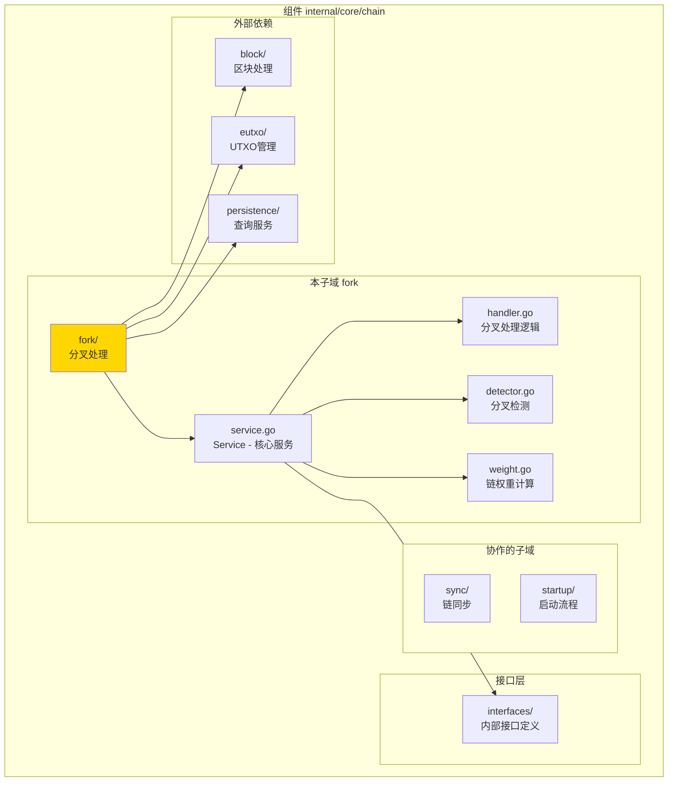
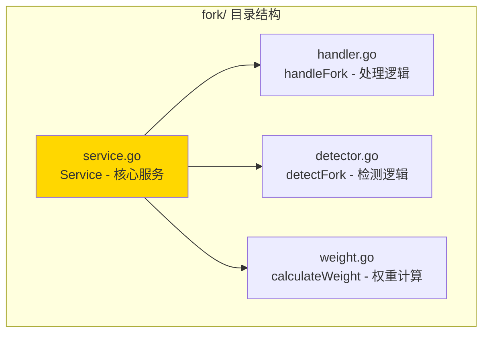

# fork - 分叉处理子域

---

## 📌 版本信息

- **版本**：1.0
- **状态**：stable
- **最后更新**：2025-11-XX
- **最后审核**：2025-11-XX
- **所有者**：Chain 开发组
- **适用范围**：分叉处理服务实现

---

## 🎯 子域定位

**路径**：`internal/core/chain/fork/`

**所属组件**：`chain`

**核心职责**：检测和处理区块链分叉，维护主链状态

**在组件中的角色**：
- 分叉检测的核心逻辑实现
- 链权重计算
- 链切换决策

---

## 🏗️ 架构设计

### 在组件中的位置

> **说明**：展示此子域在 Chain 组件内部的位置和协作关系



**位置说明**：

| 关系类型 | 目标 | 关系说明 |
|---------|------|---------|
| **依赖** | interfaces/ | 实现 InternalForkHandler 接口 |
| **依赖** | block/ | 通过 BlockProcessor 处理区块切换 |
| **依赖** | eutxo/ | 通过 UTXOSnapshot 恢复状态 |
| **依赖** | persistence/ | 通过 QueryService 查询链状态 |

---

### 内部组织

> **说明**：展示此子域内部的文件组织和类型关系



---

## 📁 目录结构

```
internal/core/chain/fork/
├── README.md                    # 本文档
├── service.go                   # Service - 核心服务实现
├── handler.go                   # handleFork - 分叉处理逻辑
├── detector.go                  # detectFork - 分叉检测逻辑
└── weight.go                    # calculateWeight - 链权重计算
```

---

## 🔧 核心实现

### 实现文件：`service.go`

**核心类型**：`Service`

**职责**：实现 ForkHandler 接口，提供分叉处理和检测服务

**关键字段**：

```go
type Service struct {
    // 依赖注入
    queryService    persistence.QueryService   // 查询服务
    blockProcessor  block.BlockProcessor       // 区块处理器（延迟注入）
    utxoSnapshot    eutxo.UTXOSnapshot        // UTXO快照服务（延迟注入）
    hashManager     crypto.HashManager         // 哈希管理器
    logger          log.Logger                 // 日志记录器
    
    // 延迟注入
    blockProcessorSet bool                     // 延迟注入标志
    
    // 指标收集
    metrics         *interfaces.ForkMetrics   // 分叉指标
    metricsMu       sync.Mutex                 // 指标锁
}
```

**关键方法**：

| 方法名 | 职责 | 可见性 | 备注 |
|-------|------|-------|-----|
| `NewService()` | 构造函数 | Public | 用于依赖注入 |
| `HandleFork()` | 处理分叉 | Public | 实现接口方法 |
| `DetectFork()` | 检测分叉 | Public | 实现接口方法 |
| `CalculateChainWeight()` | 计算链权重 | Public | 实现接口方法 |
| `GetForkMetrics()` | 获取分叉指标 | Public | 实现接口方法 |
| `SetBlockProcessor()` | 设置区块处理器 | Public | 延迟注入 |
| `SetUTXOSnapshot()` | 设置UTXO快照 | Public | 延迟注入 |

---

### 辅助文件

**handler.go** - 分叉处理逻辑：
- `handleFork()` - 完整的分叉处理流程
- 链切换决策
- 状态恢复

**detector.go** - 分叉检测逻辑：
- `detectFork()` - 检测是否存在分叉
- 比较区块哈希
- 确定分叉点

**weight.go** - 链权重计算：
- `calculateWeight()` - 计算链权重
- 基于区块难度和数量
- 用于链选择决策

---

## 🔗 协作关系

### 依赖的接口

| 接口 | 来源 | 用途 |
|-----|------|-----|
| `InternalForkHandler` | `internal/core/chain/interfaces/` | 实现分叉处理接口 |
| `persistence.QueryService` | `pkg/interfaces/persistence/` | 查询链状态 |
| `block.BlockProcessor` | `pkg/interfaces/block/` | 处理区块切换 |
| `eutxo.UTXOSnapshot` | `pkg/interfaces/eutxo/` | 快照恢复 |
| `crypto.HashManager` | `pkg/interfaces/infrastructure/crypto/` | 哈希计算 |

---

### 被依赖关系

**被以下模块使用**：
- `sync/` - 同步服务在检测到分叉时调用
- `network/` - 网络层在收到新区块时调用

**示例**：

```go
// 在其他模块中使用
import "github.com/weisyn/v1/pkg/interfaces/chain"

func OnNewBlock(forkHandler chainif.ForkHandler, block *core.Block) error {
    isFork, forkHeight, err := forkHandler.DetectFork(ctx, block)
    if err != nil {
        return err
    }
    
    if isFork {
        err = forkHandler.HandleFork(ctx, forkHeight)
        // ...
    }
}
```

---

## 🧪 测试

### 测试覆盖

| 测试类型 | 文件 | 覆盖率目标 | 当前状态 |
|---------|------|-----------|---------|
| 单元测试 | `fork_test.go` | ≥ 80% | ⏳ 待实施 |
| 集成测试 | `../integration/` | 核心场景 | ⏳ 待实施 |

---

### 测试示例

```go
func TestService_DetectFork(t *testing.T) {
    // Arrange
    mockQueryService := newMockQueryService()
    mockHasher := newMockHasher()
    service := fork.NewService(mockQueryService, mockHasher, logger)
    
    block := createTestBlock()
    
    // Act
    isFork, forkHeight, err := service.DetectFork(ctx, block)
    
    // Assert
    assert.NoError(t, err)
    assert.False(t, isFork)
}
```

---

## 📊 关键设计决策

### 决策 1：延迟依赖注入

**问题**：如何避免与 BlockProcessor 和 UTXOSnapshot 的循环依赖？

**方案**：使用延迟注入，通过 SetBlockProcessor() 和 SetUTXOSnapshot() 方法注入

**理由**：
- 避免循环依赖
- 保持依赖注入的灵活性
- 符合 fx 框架的延迟注入模式

**权衡**：
- ✅ 优点：解决循环依赖问题
- ⚠️ 缺点：需要在模块初始化时手动注入

---

### 决策 2：分叉检测算法

**问题**：如何检测分叉？

**方案**：比较新区块的父区块哈希与当前链的区块哈希

**理由**：
- 简单可靠
- 快速识别分叉点
- 易于实现和测试

**权衡**：
- ✅ 优点：算法简单，性能好
- ⚠️ 缺点：需要查询链状态

---

### 决策 3：链权重计算

**问题**：如何比较不同链的权重？

**方案**：基于区块难度和数量的链权重计算

**理由**：
- 符合PoW共识机制
- 公平比较不同链
- 支持主链选择

**权衡**：
- ✅ 优点：符合共识机制，公平可靠
- ⚠️ 缺点：计算开销较大

---

## 📚 相关文档

- [组件总览](../README.md)
- [内部接口](../interfaces/README.md)
- [公共接口](../../../../pkg/interfaces/chain/README.md)
- [接口与实现的组织架构](../../../../docs/system/standards/principles/code-organization.md)

---

## 📝 变更历史

| 版本 | 日期 | 变更内容 |

|-----|------|---------|
| 1.0 | 2025-11-XX | 初始版本 | Chain 开发组 |

---

## 🚧 待办事项

- [ ] 完善单元测试覆盖
- [ ] 优化分叉检测性能
- [ ] 支持更复杂的分叉策略
- [ ] 添加分叉回退机制

