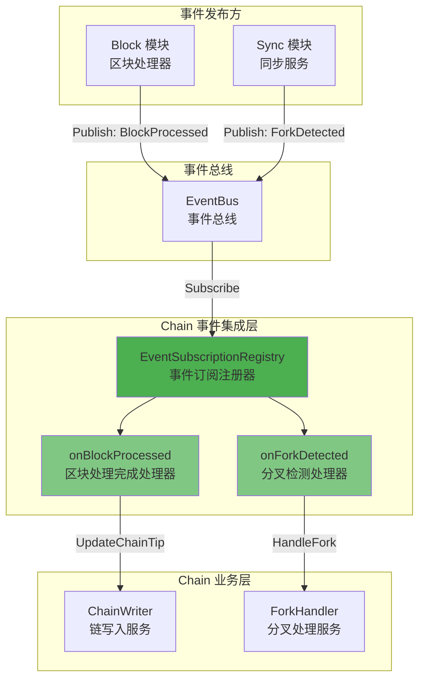
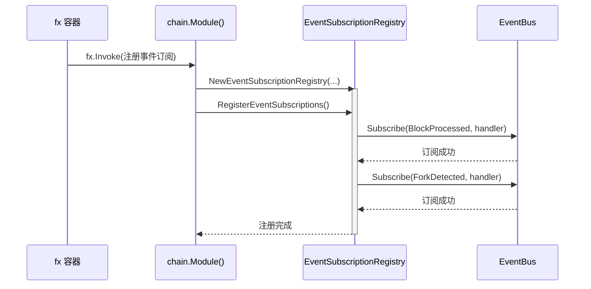
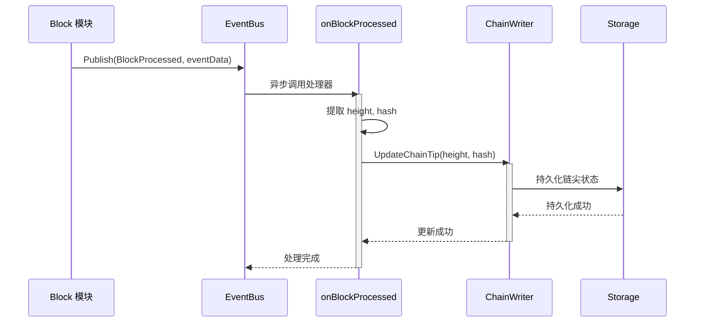
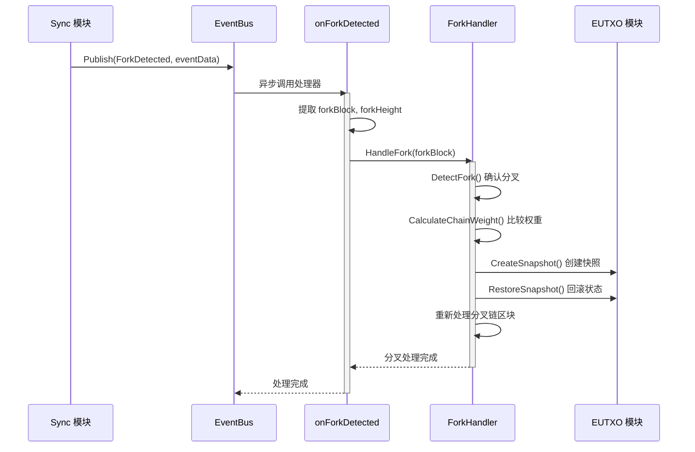

# Chain Event Integration（internal/core/chain/integration/event）

> **📌 模块类型**：`[x] 实现模块` `[ ] 接口定义` `[ ] 数据结构` `[ ] 工具/其他`

---

## 📍 **模块定位**

本模块是 WES 系统中 **Chain（链状态管理）模块** 的 **事件订阅集成层**，负责处理来自其他模块的事件通知，实现链状态的自动更新和分叉自动处理。

**解决什么问题**：
- 自动响应区块处理完成事件，更新链尖状态
- 自动响应分叉检测事件，触发分叉处理流程
- 实现模块间解耦通信（事件驱动架构）
- 提供统一的事件订阅注册入口

**不解决什么问题**（边界）：
- 不实现链尖更新的具体逻辑（由 `writer` 子模块负责）
- 不实现分叉处理的具体逻辑（由 `fork` 子模块负责）
- 不发布事件（Chain 模块暂不主动发布事件）
- 不定义事件数据结构（由 `pkg/types` 定义）

---

## 🎯 **设计原则与核心约束**

### **设计原则**

| 原则 | 说明 | 价值 | 实现策略 |
|------|------|------|---------|
| **事件驱动** | 通过事件总线实现模块间通信 | 解耦 | 订阅-发布模式 |
| **非阻塞处理** | 事件处理器异步执行 | 性能 | EventBus 异步分发 |
| **错误隔离** | 单个事件处理失败不影响其他 | 健壮性 | 独立错误处理 |
| **幂等性** | 相同事件多次处理结果一致 | 可靠性 | 状态检查 |
| **统一注册** | 所有订阅通过统一入口管理 | 可维护性 | RegisterEventSubscriptions |

### **核心约束** ⭐

**严格遵守**：
- ✅ 只订阅必要的跨模块事件（BlockProcessed, ForkDetected）
- ✅ 事件处理器不应阻塞（快速返回或异步处理）
- ✅ 使用标准事件类型常量（pkg/constants/events）
- ✅ 使用标准事件数据结构（pkg/types）
- ✅ 完整的错误处理和日志记录

**严格禁止**：
- ❌ 在事件处理器中执行长时间阻塞操作
- ❌ 在事件处理器中修改事件数据（只读）
- ❌ 订阅不必要的事件（增加耦合）
- ❌ 跳过错误处理（影响系统稳定性）

---

## 🏗️ **架构设计**

### **整体架构**



### **事件订阅清单**

| 事件类型 | 事件常量 | 来源模块 | 处理器 | 调用方法 | 优先级 |
|---------|---------|---------|--------|---------|--------|
| 区块处理完成 | `EventTypeBlockProcessed` | Block | `onBlockProcessed` | `ChainWriter.UpdateChainTip` | **高** ⭐ |
| 分叉检测 | `EventTypeForkDetected` | Block/Sync | `onForkDetected` | `ForkHandler.HandleFork` | **高** ⭐ |

---

## 📂 **文件结构**

```
internal/core/chain/integration/event/
├── subscribe_handlers.go    # 事件订阅注册器和处理器实现（约220行）
└── README.md                 # 本文档
```

---

## 🔄 **核心流程**

### **1. 事件订阅注册流程**



### **2. BlockProcessed 事件处理流程**



### **3. ForkDetected 事件处理流程**



---

## 🔌 **依赖关系**

### **依赖的接口**

| 接口 | 包路径 | 用途 |
|------|--------|------|
| `event.EventBus` | pkg/interfaces/infrastructure/event | 事件总线服务 |
| `log.Logger` | pkg/interfaces/infrastructure/log | 日志服务 |
| `interfaces.InternalChainWriter` | internal/core/chain/interfaces | 链写入服务 |
| `interfaces.InternalForkHandler` | internal/core/chain/interfaces | 分叉处理服务 |

### **依赖的类型**

| 类型 | 包路径 | 用途 |
|------|--------|------|
| `EventTypeBlockProcessed` | pkg/constants/events | 区块处理完成事件类型 |
| `EventTypeForkDetected` | pkg/constants/events | 分叉检测事件类型 |
| `BlockProcessedEventData` | pkg/types | 区块处理完成事件数据 |
| `ForkDetectedEventData` | pkg/types | 分叉检测事件数据 |

---

## 🚀 **使用示例**

### **在 module.go 中注册事件订阅**

```go
import (
    "go.uber.org/fx"
    "github.com/weisyn/v1/internal/core/chain/integration/event"
    "github.com/weisyn/v1/pkg/interfaces/infrastructure/event"
    "github.com/weisyn/v1/pkg/interfaces/infrastructure/log"
)

func Module() fx.Option {
    return fx.Module("chain",
        // ... 其他配置 ...
        
        // 注册事件订阅
        fx.Invoke(
            func(
                eventBus event.EventBus,
                logger log.Logger,
                chainWriter interfaces.InternalChainWriter,
                forkHandler interfaces.InternalForkHandler,
            ) error {
                if eventBus == nil {
                    if logger != nil {
                        logger.Warn("EventBus不可用，跳过chain模块事件订阅")
                    }
                    return nil
                }
                
                // 创建事件订阅注册器
                registry := eventIntegration.NewEventSubscriptionRegistry(
                    eventBus,
                    logger,
                    chainWriter,
                    forkHandler,
                )
                
                // 注册所有事件订阅
                if err := registry.RegisterEventSubscriptions(); err != nil {
                    if logger != nil {
                        logger.Errorf("chain模块事件订阅注册失败: %v", err)
                    }
                    return err
                }
                
                if logger != nil {
                    logger.Info("✅ chain模块事件订阅已注册")
                }
                
                return nil
            },
        ),
    )
}
```

---

## ⚠️ **注意事项**

### **性能考虑**

1. **事件处理器不应阻塞**
   - 区块处理完成事件的处理器应快速返回（更新链尖是轻量操作）
   - 分叉处理可能耗时较长（链重组、状态回滚），需评估是否异步处理

2. **事件顺序性**
   - EventBus 保证单个订阅者的事件顺序
   - 但不保证不同订阅者之间的顺序

3. **错误恢复**
   - 事件处理失败会记录日志，但不会重试
   - 如需重试机制，应在业务层实现

### **测试建议**

1. **单元测试**
   - Mock EventBus、ChainWriter、ForkHandler
   - 测试事件处理器的各种输入情况

2. **集成测试**
   - 测试真实的事件发布-订阅流程
   - 验证链尖更新和分叉处理的正确性

---

## 📚 **相关文档**

- [Chain 模块 README](../../README.md) - 模块总览
- [公共接口设计](../../../../../docs/system/designs/interfaces/public-interface-design.md) - 接口设计规范
- [事件系统设计](../../../../../docs/system/designs/event-system.md) - 事件总线架构
- [pkg/constants/events](../../../../../pkg/constants/events/system_events.go) - 事件类型定义

---

## 🔄 **变更历史**

| 版本 | 日期 | 变更内容 | 作者 |
|-----|------|---------|------|
| 1.0 | 2025-11-01 | 初始版本，实现 BlockProcessed 和 ForkDetected 事件订阅 | WES Chain 开发组 |

---

**状态**：✅ 已完成并可用

**维护者**：WES Chain 开发组

