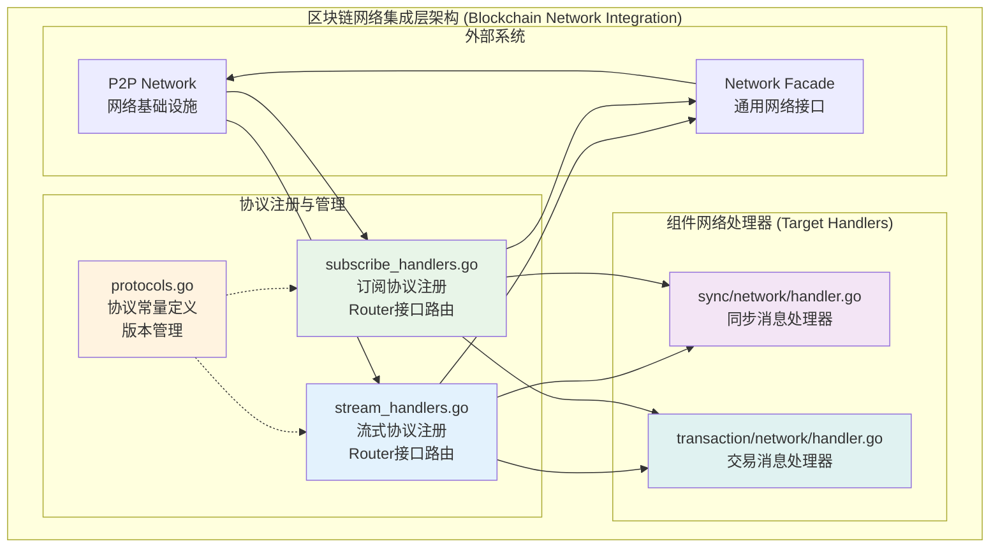
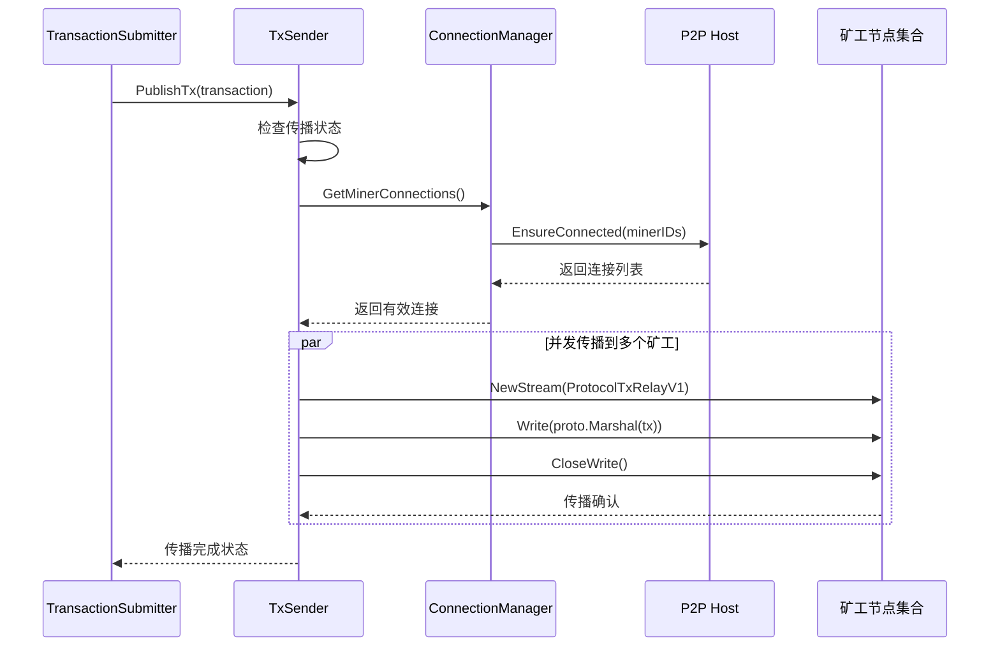
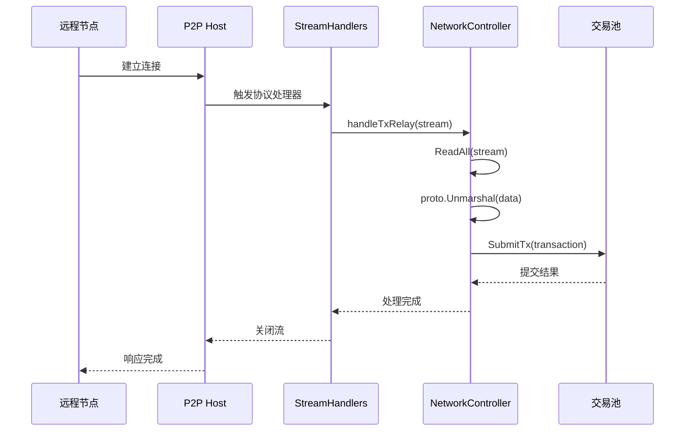
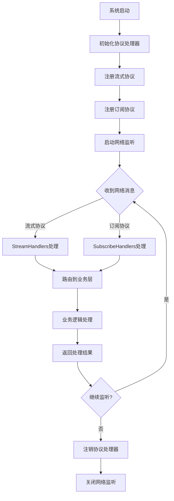

# 网络集成层 (Network Integration Layer)

## 【模块定位】

**网络集成层**是WES区块链集成层的核心网络适配模块，负责区块链组件与P2P网络的协议注册、消息路由和数据传输。采用纯粹的协议处理和路由转发模式，按协议类型组织架构，确保网络通信的高效性和可靠性。

## 【设计原则】

### 协议分离原则

- **协议导向**: 按协议类型组织架构，避免按方向划分的混乱
- **注册模式**: 采用协议注册和处理器模式实现网络适配
- **编解码边界**: 网络层仅负责协议处理，具体编解码由业务层负责

### 路由转发原则

- **纯粹转发**: 仅负责协议注册和消息路由，不包含业务逻辑
- **最小开销**: 最小化协议处理开销，提供高性能转发服务
- **错误隔离**: 网络错误与业务逻辑错误完全隔离

### 动态控制原则

- **事件驱动**: 基于矿工状态事件动态启停网络功能
- **智能适配**: 根据系统状态自动调整网络传播策略
- **资源管理**: 动态管理网络连接和传输资源

## 【核心职责】

### 协议注册与管理

- 注册和管理请求-响应流式协议处理器
- 注册和管理PubSub主题订阅处理器
- 维护协议常量和版本信息
- 提供协议有效性验证

### 消息路由转发

- **统一路由模式**：所有网络消息统一路由到组件级 `network/handler.go`
- **接口驱动路由**：通过Router接口实现类型安全的消息路由
- **协议解耦转发**：仅负责协议处理和消息转发，不包含业务逻辑
- **错误隔离处理**：网络错误与业务逻辑错误完全隔离

### 网络适配服务

- 提供P2P网络与业务组件间的适配桥梁
- 实现网络协议到业务接口的标准化转换
- 支持多协议的统一消息处理框架
- 提供网络状态监控和错误处理

## 【架构组件】



### 架构关键特点

**统一路由模式**：
- 所有网络消息通过integration层统一路由
- 路由目标为各组件的 `network/handler.go` 文件
- 通过Router接口实现类型安全的消息分发

**协议注册驱动**：
- `protocols.go` 定义所有协议常量和版本信息
- `stream_handlers.go` 注册流式协议和对应的Router
- `subscribe_handlers.go` 注册订阅协议和对应的Router

**业务逻辑解耦**：
- integration层仅负责协议注册和消息路由转发
- 具体业务处理完全委托给组件级 `network/handler.go`
- 网络错误与业务错误完全分离处理

## 【目录结构说明】

```text
network/
├── stream_handlers.go      # 流式协议处理器 - 请求响应协议处理
├── subscribe_handlers.go   # 订阅协议处理器 - PubSub主题处理
└── README.md              # 本文档
```

## 【依赖关系】

### 上层集成依赖

- **integration**: 集成层主模块和协调服务
- **domains/transaction**: 交易业务逻辑和验证服务
- **domains/block**: 区块业务逻辑和同步服务

### 下层网络依赖

- **pkg/interfaces/network**: P2P网络接口定义
- **pkg/interfaces/mempool**: 交易池接口定义
- **pkg/interfaces/infrastructure/log**: 日志记录接口

### 外部系统依赖

- **libp2p**: P2P网络通信库
- **protobuf**: 消息序列化和反序列化
- **context**: Go上下文传递和控制

## 【系统特性】

### 高性能协议处理

- **并发处理**: 每个入站连接独立协程处理
- **连接复用**: 高效复用已建立的P2P连接
- **流式传输**: 支持大数据量的流式传输协议

### 精准网络传播

- **矿工定向**: 仅向矿工节点传播，避免全网泛洪
- **并发发送**: 向多个矿工节点并行发送数据
- **智能路由**: 基于网络拓扑的智能路由选择

### 协议扩展支持

- **多协议支持**: 支持多种网络协议的统一处理
- **动态注册**: 支持运行时协议处理器的动态注册
- **版本兼容**: 支持协议版本的向后兼容

### 容错恢复机制

- **错误隔离**: 单个节点错误不影响整体传播
- **自动重试**: 网络传输失败的智能重试机制
- **状态恢复**: 网络恢复后自动重新建立连接

## 【工作流程】

### 交易出站传播流程



### 交易入站接收流程



### 协议注册管理流程



## 【配置管理】

### 网络协议配置

```yaml
protocols:
  tx_relay:
    protocol_id: "/blockchain/txrelay/v1"
    max_message_size: "1MB"
    timeout: "30s"
    
  block_sync:
    protocol_id: "/blockchain/blocksync/v1"
    max_message_size: "10MB"
    timeout: "60s"
    
  node_discovery:
    protocol_id: "/blockchain/discovery/v1"
    max_message_size: "64KB"
    timeout: "10s"
```

### 传播控制配置

```yaml
propagation:
  tx_broadcast:
    enabled: true                 # 启用交易广播
    max_concurrent_sends: 100     # 最大并发发送数
    send_timeout: "10s"           # 发送超时时间
    retry_attempts: 3             # 重试次数
    retry_delay: "1s"             # 重试延迟
    
  miner_targeting:
    enabled: true                 # 启用矿工定向传播
    connection_timeout: "5s"      # 连接超时
    keep_alive: "300s"            # 连接保活时间
```

### 性能优化配置

```yaml
performance:
  connection_pool:
    max_connections: 200          # 最大连接数
    idle_timeout: "300s"          # 空闲连接超时
    cleanup_interval: "60s"       # 连接清理间隔
    
  buffer_management:
    read_buffer_size: "64KB"      # 读缓冲区大小
    write_buffer_size: "64KB"     # 写缓冲区大小
    stream_buffer_size: "32KB"    # 流缓冲区大小
    
  concurrency:
    max_goroutines: 1000          # 最大协程数
    worker_pool_size: 50          # 工作池大小
```

## 【外部接口】

### 协议处理接口

- **StreamHandlers**: 流式协议处理
  - `RegisterTxRelayHandler() error`
  - `RegisterBlockSyncHandler() error`
  - `UnregisterHandler(protocolID) error`

- **SubscribeHandlers**: 订阅协议处理
  - `SubscribeToTopic(topic) error`
  - `UnsubscribeFromTopic(topic) error`
  - `PublishToTopic(topic, data) error`

### 网络控制接口

- **NetworkController**: 网络控制器
  - `EnableTxRelay() error`
  - `DisableTxRelay() error`
  - `GetActiveConnections() []ConnectionInfo`

- **TxSender**: 交易发送器
  - `PublishTx(ctx, tx) error`
  - `EnablePropagation(minerNodes) error`
  - `DisablePropagation() error`

### 连接管理接口

- **ConnectionManager**: 连接管理器
  - `EnsureConnection(peerID) error`
  - `CloseConnection(peerID) error`
  - `GetConnectionStatus(peerID) Status`

## 【相关文档】

- **集成层总览**: `internal/core/blockchain/integration/README.md`
- **P2P网络接口**: `pkg/interfaces/network/README.md`
- **交易池接口**: `pkg/interfaces/mempool/README.md`
- **协议定义**: `pb/blockchain/network/`
- **网络架构设计**: `docs/architecture/network-design.md`

## 【使用策略】

### 协议开发策略

- **协议优先**: 优先定义清晰的网络协议规范
- **向后兼容**: 确保新协议版本的向后兼容性
- **性能优化**: 根据数据特征选择最优的传输协议

### 网络优化策略

- **连接管理**: 合理管理P2P连接，避免连接泄漏
- **负载均衡**: 在多个矿工节点间实现负载均衡
- **拥塞控制**: 根据网络状况动态调整传输策略

### 扩展策略

- **协议扩展**: 支持新网络协议的无缝添加
- **功能模块化**: 将不同功能拆分为独立模块
- **插件机制**: 支持第三方协议处理器的插件式接入

### 监控策略

- **性能监控**: 监控网络传输性能和连接状态
- **错误跟踪**: 跟踪网络错误和异常情况
- **容量规划**: 基于监控数据进行容量规划

## 【错误处理】

### 网络传输错误

- **ConnectionTimeout**: 网络连接超时
- **SendTimeout**: 数据发送超时
- **ReceiveTimeout**: 数据接收超时
- **NetworkUnavailable**: 网络不可用

### 协议处理错误

- **ProtocolMismatch**: 协议版本不匹配
- **MessageTooLarge**: 消息大小超限
- **DecodingError**: 消息解码失败
- **HandlerNotFound**: 协议处理器未找到

### 业务路由错误

- **RoutingFailure**: 消息路由失败
- **TargetUnavailable**: 目标服务不可用
- **ValidationFailure**: 消息验证失败
- **ProcessingError**: 业务处理失败

### 错误恢复机制

- **自动重连**: 连接断开后自动重新建立连接
- **消息重发**: 发送失败的消息自动重发
- **降级处理**: 在网络异常时提供降级服务
- **状态同步**: 网络恢复后自动同步状态信息
