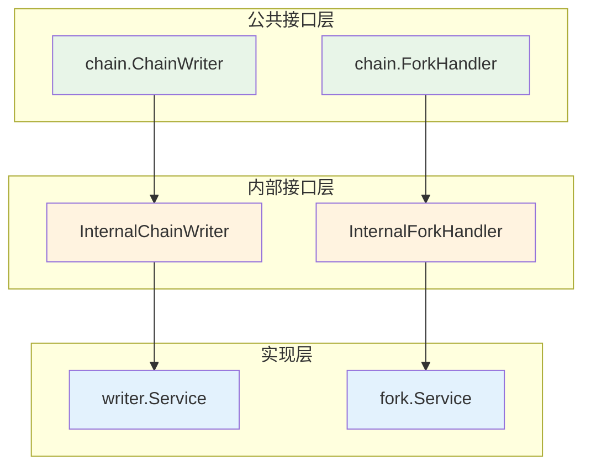

# Chain 模块内部接口定义

---

## 📌 接口概述

本目录定义了 chain 模块的内部接口，这些接口继承公共接口并扩展内部管理能力。

### 设计原则

1. **接口继承**：所有内部接口都继承对应的公共接口
2. **能力扩展**：添加内部管理方法，支持系统协调
3. **指标提供**：提供详细的指标接口，支持监控和调试
4. **职责清晰**：每个接口职责单一，边界清晰

---

## 📋 接口清单

### 1. InternalChainWriter

**文件**：`writer.go`

**继承**：`pkg/interfaces/chain.ChainWriter`

**职责**：
- ✅ 提供链状态写入能力（UpdateChainTip, UpdateSyncStatus）
- ✅ 提供性能指标收集（GetWriterMetrics）
- ✅ 提供数据验证能力（ValidateChainTip）

**扩展方法**：
```go
// 获取写入服务指标
GetWriterMetrics(ctx context.Context) (*WriterMetrics, error)

// 验证链尖数据一致性
ValidateChainTip(ctx context.Context) error
```

**使用场景**：
- 区块处理模块需要更新链尖状态
- 同步服务需要更新同步状态
- 监控系统需要收集性能指标
- 故障诊断需要验证数据一致性

---

### 2. InternalForkHandler

**文件**：`fork.go`

**继承**：`pkg/interfaces/chain.ForkHandler`

**职责**：
- ✅ 提供分叉处理能力（HandleFork, GetActiveChain）
- ✅ 提供分叉检测能力（DetectFork）
- ✅ 提供分叉指标收集（GetForkMetrics）
- ✅ 提供链权重计算（CalculateChainWeight）

**扩展方法**：
```go
// 检测是否存在分叉
DetectFork(ctx context.Context, block *core.Block) (isFork bool, forkHeight uint64, err error)

// 获取分叉处理指标
GetForkMetrics(ctx context.Context) (*ForkMetrics, error)

// 计算链权重
CalculateChainWeight(ctx context.Context, fromHeight, toHeight uint64) (*types.ChainWeight, error)
```

**使用场景**：
- 区块处理前检测潜在分叉
- 网络层收到新区块时检测分叉
- 监控系统收集分叉统计
- 分叉选择时比较链权重

---

## 🎯 接口层次关系



---

## 📊 指标数据结构

### WriterMetrics

链写入服务指标，包含：
- **统计指标**：UpdateCount, SuccessCount, FailureCount
- **时间指标**：LastUpdateTime, AverageUpdateTime, MaxUpdateTime
- **数据指标**：CurrentHeight, LastBlockHash
- **状态指标**：IsHealthy, ErrorMessage

### ForkMetrics

分叉处理指标，包含：
- **分叉统计**：TotalForks, ResolvedForks, PendingForks
- **重组统计**：TotalReorgs, MaxReorgDepth, AvgReorgDepth
- **时间统计**：LastForkTime, AvgResolutionTime
- **状态信息**：IsProcessing, CurrentForkHeight

---

## 🔗 依赖关系

### 对外依赖

```go
// 公共接口
"github.com/weisyn/v1/pkg/interfaces/chain"

// 类型定义
"github.com/weisyn/v1/pkg/types"

// 协议定义
"github.com/weisyn/v1/pb/blockchain/block"
```

### 实现要求

实现这些接口的服务需要：
1. ✅ 实现所有公共接口方法
2. ✅ 实现所有内部扩展方法
3. ✅ 保证并发安全
4. ✅ 提供完整的错误处理
5. ✅ 记录详细的日志

---

## 📝 使用示例

### 示例1：使用 InternalChainWriter

```go
// 创建服务
writer, err := writer.NewService(storage, logger)
if err != nil {
    log.Fatal(err)
}

// 更新链尖
err = writer.UpdateChainTip(ctx, 1000, blockHash)
if err != nil {
    log.Errorf("更新链尖失败: %v", err)
}

// 获取指标
metrics, err := writer.GetWriterMetrics(ctx)
if err == nil {
    log.Printf("平均更新耗时: %.2fms", metrics.AverageUpdateTime*1000)
    log.Printf("成功率: %.2f%%", float64(metrics.SuccessCount)/float64(metrics.UpdateCount)*100)
}

// 验证数据
if err := writer.ValidateChainTip(ctx); err != nil {
    log.Errorf("链尖数据异常: %v", err)
}
```

### 示例2：使用 InternalForkHandler

```go
// 创建服务
forkHandler, err := fork.NewService(queryService, logger)
if err != nil {
    log.Fatal(err)
}

// 检测分叉
isFork, forkHeight, err := forkHandler.DetectFork(ctx, newBlock)
if err != nil {
    log.Errorf("分叉检测失败: %v", err)
} else if isFork {
    log.Infof("检测到分叉，分叉点高度: %d", forkHeight)
    
    // 处理分叉
    if err := forkHandler.HandleFork(ctx, newBlock); err != nil {
        log.Errorf("分叉处理失败: %v", err)
    }
}

// 获取指标
metrics, err := forkHandler.GetForkMetrics(ctx)
if err == nil {
    log.Printf("总分叉数: %d, 已解决: %d", metrics.TotalForks, metrics.ResolvedForks)
    log.Printf("最大重组深度: %d", metrics.MaxReorgDepth)
}
```

---

## 🧪 测试要求

### 接口测试

每个接口的实现都需要：

1. **单元测试**：
   - 测试所有公共方法
   - 测试所有内部方法
   - 覆盖正常和异常场景

2. **并发测试**：
   - 测试并发读写安全
   - 测试竞态条件
   - 验证锁机制正确性

3. **性能测试**：
   - 基准测试（Benchmark）
   - 压力测试
   - 延迟统计

4. **集成测试**：
   - 测试接口间协作
   - 测试完整业务流程
   - 验证数据一致性

---

## 📚 相关文档

- [公共接口设计](../../../../docs/system/designs/interfaces/public-interface-design.md)
- [Chain 组件文档](../../../../docs/components/core/chain/README.md)
- [实施计划](../IMPLEMENTATION_PLAN.md)
- [技术设计](../TECHNICAL_DESIGN.md)

---

## 🔄 变更历史

| 版本 | 日期 | 变更内容 | 作者 |
|-----|------|---------|------|
| 1.0 | 2025-11-01 | 初始版本，定义内部接口 | WES Chain 开发组 |

