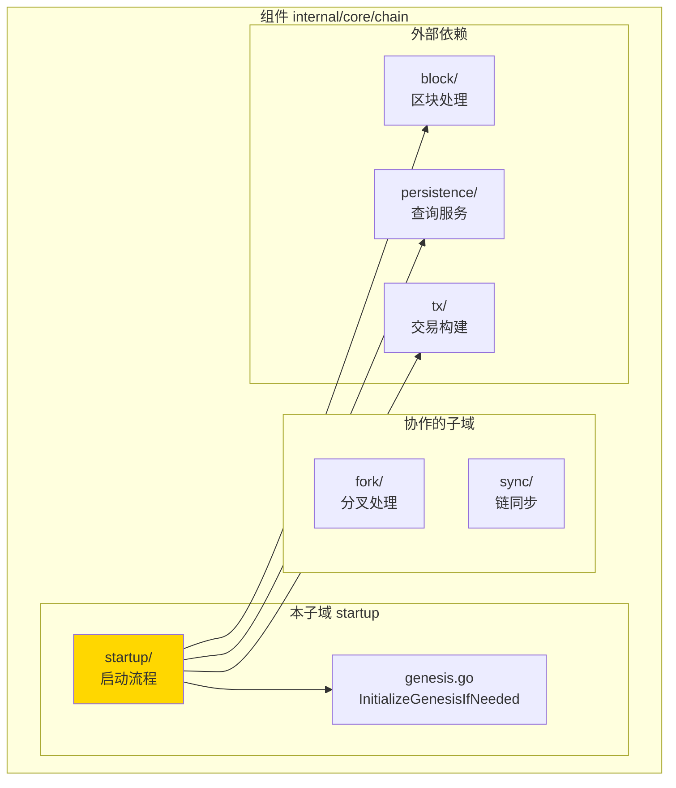
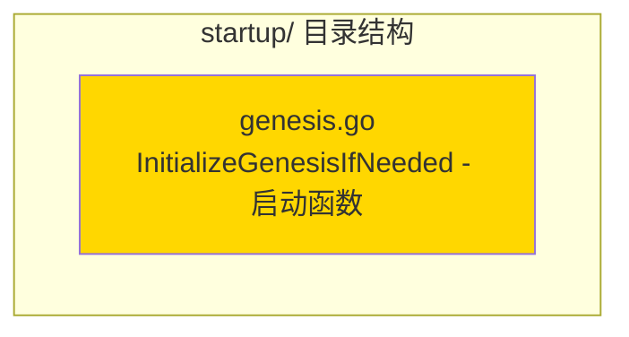

# startup - 启动流程子域

---

## 📌 版本信息

- **版本**：1.0
- **状态**：stable
- **最后更新**：2025-11-XX
- **最后审核**：2025-11-XX
-  **所有者**：Chain 开发组
- **适用范围**：区块链启动流程实现

---

## 🎯 子域定位

**路径**：`internal/core/chain/startup/`

**所属组件**：`chain`

**核心职责**：实现区块链启动时的初始化逻辑，包括创世区块检查和初始化

**在组件中的角色**：
- 启动流程的核心逻辑实现
- 创世区块初始化
- 启动时同步触发

---

## 🏗️ 架构设计

### 在组件中的位置

> **说明**：展示此子域在 Chain 组件内部的位置和协作关系



**位置说明**：

| 关系类型 | 目标 | 关系说明 |
|---------|------|---------|
| **依赖** | block/ | 通过 GenesisBlockBuilder 构建创世区块 |
| **依赖** | persistence/ | 通过 QueryService 检查链状态 |
| **依赖** | tx/ | 通过 TxBuilder 构建创世交易 |

---

### 内部组织

> **说明**：展示此子域内部的文件组织和类型关系



---

## 📁 目录结构

```
internal/core/chain/startup/
├── README.md                    # 本文档
└── genesis.go                   # InitializeGenesisIfNeeded - 启动函数
```

---

## 🔧 核心实现

### 实现文件：`genesis.go`

**核心函数**：`InitializeGenesisIfNeeded`

**职责**：启动时检查并初始化创世区块

**函数签名**：

```go
func InitializeGenesisIfNeeded(
    ctx context.Context,
    queryService persistence.QueryService,
    blockProcessor block.BlockProcessor,
    genesisBuilder blockif.GenesisBlockBuilder,
    addressManager crypto.AddressManager,
    genesisConfig *types.GenesisConfig,
    logger log.Logger,
) (bool, error)
```

**关键参数**：

| 参数 | 类型 | 用途 |
|-----|------|-----|
| `queryService` | `persistence.QueryService` | 检查链状态，判断是否需要初始化 |
| `blockProcessor` | `block.BlockProcessor` | 处理创世区块，统一入口 |
| `genesisBuilder` | `blockif.GenesisBlockBuilder` | 构建创世区块 |
| `addressManager` | `crypto.AddressManager` | 构建创世交易地址 |
| `genesisConfig` | `*types.GenesisConfig` | 创世配置 |

**返回值**：
- `bool` - true表示创建了创世区块，false表示跳过
- `error` - 处理过程中的错误

**实现流程**：
1. 检查链是否已初始化（通过查询区块高度）
2. 如果已初始化，跳过
3. 如果未初始化，构建创世区块
4. 处理创世区块（通过 BlockProcessor）
5. 返回初始化结果

---

## 🔗 协作关系

### 依赖的接口

| 接口 | 来源 | 用途 |
|-----|------|-----|
| `persistence.QueryService` | `pkg/interfaces/persistence/` | 检查链状态 |
| `block.BlockProcessor` | `pkg/interfaces/block/` | 处理创世区块 |
| `blockif.GenesisBlockBuilder` | `pkg/interfaces/block/` | 构建创世区块 |
| `crypto.AddressManager` | `pkg/interfaces/infrastructure/crypto/` | 地址管理 |

---

### 被依赖关系

**被以下模块使用**：
- `chain/module.go` - 在 fx.Invoke 中调用，启动时执行

**示例**：

```go
// 在 chain/module.go 中使用
import "github.com/weisyn/v1/internal/core/chain/startup"

fx.Invoke(
    func(
        queryService persistence.QueryService,
        blockProcessor block.BlockProcessor,
        genesisBuilder blockif.GenesisBlockBuilder,
        addressManager crypto.AddressManager,
        genesisConfig *types.GenesisConfig,
        logger log.Logger,
    ) error {
        created, err := startup.InitializeGenesisIfNeeded(
            ctx, queryService, blockProcessor, genesisBuilder,
            addressManager, genesisConfig, logger,
        )
        if err != nil {
            return err
        }
        if created {
            logger.Info("创世区块已初始化")
        }
        return nil
    },
)
```

---

## 🧪 测试

### 测试覆盖

| 测试类型 | 文件 | 覆盖率目标 | 当前状态 |
|---------|------|-----------|---------|
| 单元测试 | `startup_test.go` | ≥ 80% | ⏳ 待实施 |
| 集成测试 | `../integration/` | 核心场景 | ⏳ 待实施 |

---

### 测试示例

```go
func TestInitializeGenesisIfNeeded(t *testing.T) {
    // Arrange
    mockQueryService := newMockQueryService()
    mockBlockProcessor := newMockBlockProcessor()
    mockGenesisBuilder := newMockGenesisBuilder()
    mockAddressManager := newMockAddressManager()
    genesisConfig := &types.GenesisConfig{...}
    
    // Act
    created, err := startup.InitializeGenesisIfNeeded(
        ctx, mockQueryService, mockBlockProcessor, mockGenesisBuilder,
        mockAddressManager, genesisConfig, logger,
    )
    
    // Assert
    assert.NoError(t, err)
    assert.True(t, created)
}
```

---

## 📊 关键设计决策

### 决策 1：函数式设计

**问题**：为什么使用函数而不是服务？

**方案**：使用函数 `InitializeGenesisIfNeeded`，而不是创建服务实例

**理由**：
- 启动逻辑是一次性操作，不需要包含服务的长期运行
- 函数式设计更简洁，避免创建不必要的服务实例
- 易于测试和维护

**权衡**：
- ✅ 优点：简洁，避免不必要的复杂性
- ⚠️ 缺点：如果未来需要支持多次调用，可能需要重构为服务

---

### 决策 2：统一入口处理

**问题**：创世区块如何与普通区块保持一致的处理流程？

**方案**：创世区块通过 BlockProcessor 处理，使用统一入口

**理由**：
- 保证创世区块和普通区块的处理流程一致
- 利用现有的区块处理逻辑
- 避免重复代码

**权衡**：
- ✅ 优点：代码复用，逻辑一致
- ⚠️ 缺点：需要确保 BlockProcessor 支持创世区块

---

## 📚 相关文档

- [组件总览](../README.md)
- [内部接口](../interfaces/README.md)
- [公共接口](../../../../pkg/interfaces/chain/README.md)
- [接口与实现的组织架构](../../../../docs/system/standards/principles/code-organization.md)

---

## 📝 变更历史

| 版本 | 日期 | 变更内容 | 作者 |
|-----|------|---------|------|
| 1.0 | 2025-11-XX | 初始版本 | Chain 开发组 |

---

## 🚧 待办事项

- [ ] 完善单元测试覆盖
- [ ] 支持自定义创世配置验证
- [ ] 添加创世区块回退机制

