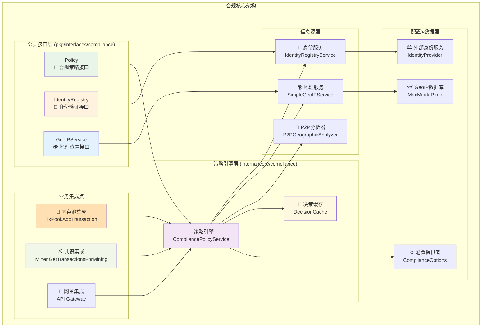
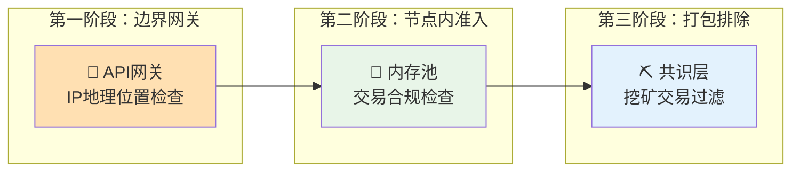

# 合规核心模块（internal/core/compliance）

## 🛡️ 模块概述

**合规核心模块** 是 WES 区块链系统的监管合规实现层，负责在交易处理和区块生产的关键节点实施合规策略检查。本模块通过多信息源融合的决策引擎，在不影响现有业务接口的前提下，为系统提供透明、高效的监管合规能力。

【设计原则】
- **透明集成**：不修改现有proto定义和公共业务接口
- **三阶段控制**：边界网关拦截+节点内策略准入+打包阶段排除  
- **多源决策**：身份凭证+GeoIP查询+P2P地理特征的融合判定
- **配置驱动**：支持热重载的策略配置和精确的操作控制
- **事件可观测**：完整的合规决策日志和事件发布机制

【核心职责】
1. **合规策略引擎**：基于配置规则的智能决策判定
2. **多源信息融合**：身份凭证、地理位置、连接特征的综合分析  
3. **透明业务集成**：在现有交易流程中无缝嵌入合规检查
4. **决策可追溯**：完整的合规决策记录和审计能力
5. **性能优化**：决策结果缓存和批量处理优化
6. **配置热重载**：运行时策略更新无需重启节点

【实现架构】

　　采用**策略引擎 → 信息融合 → 决策执行**的三层合规架构，确保监管要求的准确执行。



**架构层次说明：**

1. **公共接口层**：标准化的合规服务接口
   - 策略决策接口，支持交易和操作级检查
   - 身份验证接口，管理地址到属地的映射
   - 地理位置接口，提供IP到国家的查询

2. **策略引擎层**：合规决策的核心逻辑
   - 多信息源融合的智能决策引擎
   - 决策结果缓存，提升性能和一致性
   - 配置驱动的策略规则执行

3. **信息源层**：多维度的合规信息采集
   - 身份凭证验证和缓存管理
   - GeoIP数据库查询和更新
   - P2P连接地理特征分析

---

## 📁 **模块组织结构**

【合规模块架构组织】

```
internal/core/compliance/
├── module.go                     # 🎯 Fx依赖注入装配
├── policy.go                     # 🧠 合规策略引擎实现
├── identity_registry.go          # 🎫 身份凭证验证服务  
├── geoip_service.go              # 🌍 地理位置查询服务
└── README.md                     # 📖 模块文档
```

**文件职责说明：**

- **`module.go`** - Fx模块装配入口，统一提供Policy接口
- **`policy.go`** - 核心策略引擎，实现多源信息融合决策  
- **`identity_registry.go`** - 身份凭证管理，支持外部身份服务集成
- **`geoip_service.go`** - 地理位置服务，支持多种GeoIP数据源

---

## 🎯 **核心功能特性**

### 1. 智能合规决策引擎

**多信息源融合决策**
- 🎫 **身份凭证优先**：基于数字签名的可信身份属地证明
- 🌍 **GeoIP辅助判定**：支持MaxMind、IPInfo等主流GeoIP数据库
- 🔗 **P2P特征分析**：基于连接模式的地理特征推断
- ⚙️ **配置规则覆盖**：支持手动配置的地址白名单/黑名单

**决策优先级排序**
```
身份凭证 > 配置规则 > GeoIP查询 > P2P特征 > 默认策略
```

### 2. 精准操作控制

**操作类型识别**
- 💸 **普通转账**：`transfer` - 基于交易输出类型判定
- 📜 **合约调用**：`contract.*` - 基于合约地址和方法识别
- 🏛️ **治理操作**：`contract.governance.*` - 精确到具体治理方法
- 💰 **支付相关**：`contract.payments.*` - 涵盖各类支付场景

**地理区域限制**
- 🚫 **国家级封禁**：基于ISO-3166-1 alpha-2国家代码
- ✅ **操作级授权**：不同操作类型的差异化地理限制
- ❓ **未知地区处理**：可配置的未知属地处理策略

### 3. 业务透明集成

**三阶段合规控制**


**集成特点**
- ⚡ **性能优先**：合规检查在哈希计算前进行
- 🔄 **缓存复用**：决策结果缓存避免重复计算
- 📊 **统计透明**：详细的过滤统计和性能指标
- 🚫 **优雅降级**：合规服务异常时的降级策略

### 4. 配置管理与热重载

**配置结构**
```json
{
  "compliance": {
    "enabled": true,
    "banned_countries": ["XX", "YY"],
    "banned_operations": ["transfer", "contract.payments.*"],
    "reject_on_unknown_country": false,
    "identity_provider": {
      "url": "https://identity.example.com/api/verify",
      "public_key_pem": "-----BEGIN PUBLIC KEY-----...",
      "cache_ttl": "5m",
      "request_timeout": "10s"
    },
    "geoip": {
      "database_path": "/data/GeoLite2-Country.mmdb",
      "update_url": "https://download.maxmind.com/...",
      "cache_ttl": "1h"
    },
    "hot_reload": {
      "enabled": true,
      "config_check_interval": "30s",
      "policy_update_timeout": "5s"
    }
  }
}
```

**热重载机制**
- 🔄 **配置监听**：文件系统监听和定时检查
- 🚀 **原子更新**：策略配置的原子性更新
- 📋 **版本管理**：配置版本跟踪和回滚支持
- 🔔 **变更通知**：配置变更的事件通知机制

---

## 🚀 **使用示例**

### 1. 配置启用合规检查

**在应用配置中启用合规功能：**
```json
{
  "compliance": {
    "enabled": true,
    "banned_countries": ["US", "CN"],
    "banned_operations": ["transfer"],
    "reject_on_unknown_country": true
  }
}
```

### 2. 检查交易合规性

**内存池中的自动合规检查：**
```go
// 在 TxPool.AddTransaction 中自动执行
func (p *TxPool) AddTransaction(tx *transaction.Transaction) ([]byte, error) {
    // 🔒 合规性检查（在哈希计算前）
    if p.compliancePolicy != nil {
        if err := p.checkTransactionCompliance(tx); err != nil {
            p.logger.Warnf("交易合规检查失败: %v", err)
            return nil, WrapTxPoolError(ErrCodeComplianceViolation, "合规检查失败", err)
        }
    }
    // ... 继续正常处理
}
```

### 3. 挖矿阶段过滤

**共识层的合规交易过滤：**
```go
// 在 GetTransactionsForMining 中自动过滤
func (p *TxPool) GetTransactionsForMining() ([]*transaction.Transaction, error) {
    // 获取候选交易并过滤合规
    var validTxs []*transaction.Transaction
    for _, tx := range candidates {
        if p.compliancePolicy != nil {
            if err := p.checkTransactionCompliance(tx); err != nil {
                continue // 跳过不合规交易
            }
        }
        validTxs = append(validTxs, tx)
    }
    return validTxs, nil
}
```

### 4. 外部身份服务集成

**配置外部身份验证服务：**
```json
{
  "compliance": {
    "identity_provider": {
      "url": "https://kyc.example.com/api/verify-address",
      "public_key_pem": "-----BEGIN PUBLIC KEY-----\nMIIBIjANBg...\n-----END PUBLIC KEY-----",
      "cache_ttl": "5m",
      "request_timeout": "10s"
    }
  }
}
```

---

## 📊 **性能与监控**

### 合规检查性能指标

- **⚡ 决策延迟**：平均 < 10ms（缓存命中），< 100ms（外部查询）
- **🧠 缓存命中率**：身份凭证 > 90%，GeoIP查询 > 95%
- **🔄 并发处理**：支持 > 1000 TPS 的合规检查吞吐量
- **💾 内存占用**：缓存开销 < 100MB（1万活跃地址）

### 监控与日志

**合规决策日志示例：**
```
[INFO] 交易通过合规检查: 国家=SG, 信息源=identity_credential
[WARN] 交易被合规策略拒绝: 原因=country_banned, 详情=Country US is banned for transfer operations, 国家=US, 信息源=geoip_lookup
[INFO] 🔒 [合规过滤] 挖矿阶段过滤了 5 笔不合规交易
```

**事件发布**
- `compliance:transaction_rejected` - 交易合规拒绝事件
- `compliance:policy_updated` - 策略配置更新事件
- `compliance:identity_verified` - 身份验证成功事件

---

## 🔧 **故障排除**

### 常见问题解决

**Q1: 合规检查影响性能？**
- ✅ 启用决策缓存：`cache_ttl: "5m"`
- ✅ 优化检查顺序：身份凭证优先
- ✅ 调整检查范围：只检查关键操作类型

**Q2: 外部身份服务不可用？**
- ✅ 配置降级策略：`reject_on_unknown_country: false`
- ✅ 启用本地缓存：延长 `cache_ttl`
- ✅ 监控服务可用性：设置合理的 `request_timeout`

**Q3: 合规规则需要紧急更新？**
- ✅ 使用热重载功能：`hot_reload.enabled: true`
- ✅ 直接修改配置文件，30秒内自动生效
- ✅ 通过事件监听确认更新成功

---

## 🤝 **开发协作**

### 扩展合规策略

**添加新的信息源：**
1. 在 `pkg/interfaces/compliance` 中定义接口
2. 在 `internal/core/compliance` 中实现服务
3. 在 `policy.go` 中集成到决策引擎
4. 更新 `module.go` 的依赖注入配置

**添加新的操作类型：**
1. 在 `compliance.go` 中添加操作常量
2. 在 `policy.go` 的 `extractOperationType` 中添加识别逻辑
3. 在配置中添加新操作类型的限制规则
4. 更新文档和示例

### 测试策略

- **单元测试**：每个服务的独立功能测试
- **集成测试**：多信息源融合决策的端到端测试  
- **性能测试**：高并发场景下的决策延迟测试
- **故障测试**：外部服务不可用时的降级测试

---

*🛡️ WES 合规核心模块 - 为区块链系统提供透明、高效的监管合规能力*
