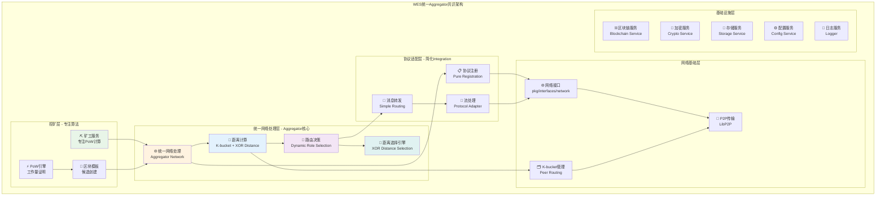
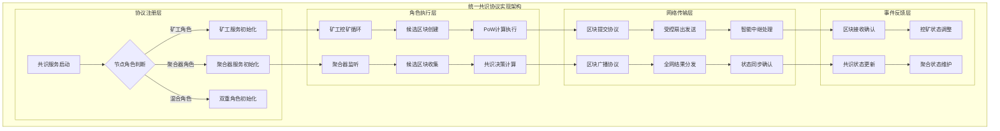
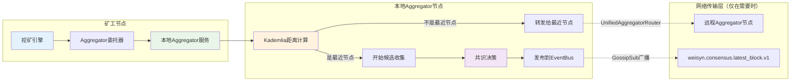
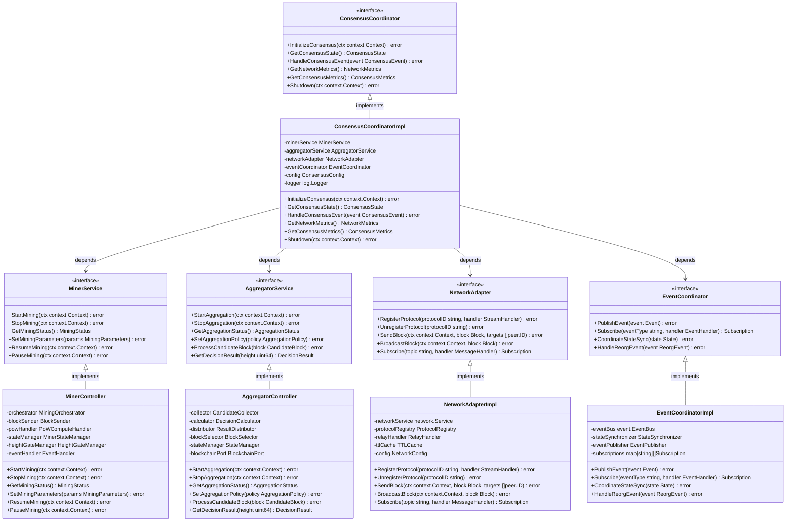

# 共识核心模块（internal/core/consensus）

【模块定位】
　　本模块是WES系统的共识核心实现，采用基于**距离寻址选择算法**的统一Aggregator架构设计。矿工（Miner）专注挖矿工作，聚合器（Aggregator）采用革命性的距离计算机制进行区块选择，摒弃复杂的多维度评分模式。通过XOR距离算法实现完全确定性、可验证且抗操纵的区块共识，大幅简化算法复杂度并提升性能。模块向外暴露符合 `pkg/interfaces/consensus` 规范的公共接口，通过简化的integration层实现纯粹的协议注册和消息转发。

【设计原则】
- **距离寻址核心**：采用类似DHT的XOR距离计算，实现确定性区块选择
- **零配置算法**：无需权重调优、阈值配置，算法天然确定性且抗操纵
- **角色职责专一**：Miner专注挖矿算法，Aggregator专注距离选择和网络路由
- **动态角色选择**：每个节点基于K-bucket距离动态决定是否作为聚合器处理区块
- **依赖注入驱动**：使用 fx 框架注入所有依赖，支持热插拔和单元测试
- **简化集成层**：Integration层仅负责协议注册和消息转发，不包含业务逻辑
- **直接网络接口**：统一使用 `pkg/interfaces/network/network.go` 进行网络操作

【核心职责】
1. **统一网络路由**：Aggregator统一处理所有区块发送、接收和路由决策
2. **动态角色决策**：基于K-bucket距离算法动态选择聚合器节点
3. **挖矿-聚合集成**：Miner通过内部接口将挖出的区块交给Aggregator处理
4. **协议注册管理**：Integration层负责协议注册和简单的消息转发
5. **距离选择执行**：Aggregator采用XOR距离算法进行确定性区块选择
6. **全网结果广播**：Aggregator负载共识结果的全网广播和状态同步

【实现架构】

　　采用**角色分离 → 协议装配 → 事件驱动 → 网络传输**的四层共识架构，确保去中心化共识的高效性和可靠性。



**架构层次说明：**

1. **挖矿层 - 专注算法**：矿工专注于纯粹的挖矿算法
   - 矿工服务仅负责PoW计算和区块模板创建
   - 挖出的区块通过内部接口交给Aggregator处理
   - 不再直接进行网络操作，实现职责单一

2. **统一网络处理层 - Aggregator核心**：聚合器统一处理所有网络操作
   - 距离计算：基于K-bucket算法计算节点距离，XOR距离计算区块选择
   - 路由决策：动态判断节点是否作为聚合器
   - 距离选择引擎：采用XOR距离算法进行确定性区块选择，摒弃复杂评分
   - 统一发送/接收：所有网络消息的发送和接收

3. **协议适配层 - 简化Integration**：仅负责协议注册和消息转发
   - 协议注册：仅负责向网络层注册协议处理器
   - 消息转发：将网络消息路由到Aggregator
   - 不包含业务逻辑：移除所有复杂的中继和路由逻辑

4. **网络基础层**：提供统一的网络访问能力
   - 网络接口：直接使用`pkg/interfaces/network`进行网络操作
   - K-bucket管理：由Aggregator调用进行距离计算
   - P2P传输：底层LibP2P网络传输封装

## 📁 **模块组织架构**

```text
consensus/
├── 🏗️ module.go             # fx装配入口：统一Aggregator架构依赖注入
├── 📖 README.md              # 本文档：统一Aggregator共识架构设计
├── ⛏️ miner/                 # 矿工模块：专注PoW计算和区块模板创建
│   ├── controller/           # 矿工控制器：挖矿生命周期管理
│   ├── mining_orchestrator/  # 挖矿编排器：挖矿轮次的纯粹执行
│   ├── pow_compute_handler/  # PoW计算处理：工作量证明专业处理
│   ├── blockchain_service_bridge/  # 区块链桥接：候选区块模板创建
│   ├── event_handler/        # 事件处理器：挖矿相关事件响应
│   ├── height_gate_manager/  # 高度门闸：防止重复挖矿的高度同步
│   └── miner_state_manager/  # 状态管理器：矿工状态转换管理
├── 🏛️ aggregator/            # 聚合器模块：统一网络处理 + 距离选择 + 结果广播
│   ├── controller/           # 聚合控制器：聚合生命周期管理
│   ├── network/              # 网络处理器：统一的网络消息处理和路由决策
│   │   ├── handler.go            # 统一网络处理器入口
│   │   ├── distance_calculator.go # K-bucket距离计算和节点选择
│   │   └── routing_decision.go   # 动态聚合器角色判断和路由决策
│   ├── candidate_collector/  # 候选收集器：网络候选区块收集、去重缓存
│   ├── distance_selector/    # 距离选择器：基于XOR距离的确定性区块选择
│   ├── block_selector/       # 区块选择器：选择证明生成、基础PoW验证
│   ├── result_distributor/   # 结果分发器：共识结果网络广播、确认机制
│   ├── blockchain_port/      # 区块链端口：链服务集成、区块验证处理
│   └── state/                # 状态管理：聚合器状态维护、持久化策略
├── 🔗 interfaces/            # 内部接口：统一Aggregator架构的内部接口定义
│   ├── aggregator.go         # Aggregator统一网络处理接口
│   └── miner.go              # Miner专注挖矿的简化接口
└── 🌐 integration/           # 简化集成层：纯协议注册和消息转发
    └── network/              # 网络适配：简化的协议注册和转发到Aggregator
        ├── protocols.go          # 协议常量统一定义
        ├── stream_handlers.go    # 简化的流式协议转发
        └── subscribe_handlers.go # 简化的订阅协议转发
```

---

## 🔄 **统一共识协议实现**

【实现策略】

　　所有子模块均严格遵循**协议注册 → 角色启动 → 事件驱动 → 网络传输**架构模式，确保共识协议的一致性和高性能。



**关键实现要点：**

1. **统一协议注册**：
   - 所有网络协议通过统一的注册机制管理
   - 支持协议的动态注册和注销
   - 协议版本兼容性检查和自适应

2. **角色生命周期管理**：
   - **矿工角色**：持续生命周期，挖矿循环直到手动停止
   - **聚合器角色**：按需激活生命周期，接收到区块且判断为最近节点时激活，分发完成即结束
   - **双重角色并存**：每个节点都可同时具备矿工能力和中继转发能力
   - 支持角色的动态切换和混合部署
   - 优雅的角色启动、运行和停止机制

3. **简化事件集成**：
   - **Manager直接订阅**：aggregator和miner的Manager构造时直接订阅EventBus
   - **标准化事件类型**：统一的事件主题命名规范（`consensus.aggregator.*`、`consensus.miner.*`、`consensus.system.*`）
   - **移除复杂中间层**：删除事件协调器、智能路由器等冗余组件
   - 基于事件总线的异步通信机制，确保状态变更的实时同步

## 🔄 **完整端到端共识流程**

【核心共识机制】

　　WES共识系统采用"矿工竞争挖矿 + 聚合器共识决策"的混合架构，通过**本地aggregator委托**和**内容寻址路由**机制，实现高效、安全的去中心化共识。矿工挖出区块后提交给本地aggregator服务，由aggregator通过Kademlia最近距离计算进行智能路由到正确的聚合节点。

### **阶段一：矿工挖矿阶段**

```mermaid
graph TB
    subgraph "矿工挖矿完整流程"
        subgraph "候选创建阶段"
            A[启动挖矿] --> B[从交易池选择交易]
            B --> C[创建候选区块模板]
            C --> D[设置区块头参数]
        end
        
        subgraph "PoW计算阶段"
            D --> E[启动PoW引擎]
            E --> F[执行工作量证明计算]
            F --> G[搜索有效Nonce]
            G --> H[验证挖矿结果]
        end
        
        subgraph "交给Aggregator阶段"
            H --> I[通过内部接口调用]
            I --> J[Aggregator接收挖出区块]
            J --> K[统一路由决策和发送]
            K --> L[等待Aggregator处理结果]
        end
        
        subgraph "等待广播阶段"
            L --> M[等待Aggregator广播结果]
            M --> N{接收到共识结果？}
            N -->|是| O[更新本地状态]
            N -->|超时| P[触发主动同步]
            O --> Q[继续下一轮挖矿]
            P --> Q
        end
    end
    
    style A fill:#4CAF50
    style F fill:#FF9800
    style K fill:#2196F3
    style M fill:#9C27B0
```



### **阶段二：Aggregator统一区块处理阶段**（网络+本地统一入口）

```mermaid
graph TB
    subgraph "Aggregator统一处理机制"
        subgraph "统一区块入口（两个来源）"
            NET_INPUT[网络接收区块] --> UNIFIED_ENTRY[统一Aggregator入口]
            LOCAL_INPUT[本地Miner提交区块] --> UNIFIED_ENTRY
            UNIFIED_ENTRY --> BLOCK_RECEIVED[Aggregator接收区块]
        end
        
        subgraph "距离计算和角色决策（统一逻辑）"
            BLOCK_RECEIVED --> E[计算路由键（父区块哈希）]
            E --> F[查询K-bucket最近节点]
            F --> G[计算自己与路由键的距离]
            G --> H{自己是否该区块最近节点？}
        end
        
        subgraph "动态角色处理（核心逻辑）"
            H -->|是最近| I[留下：放入候选内存池]
            H -->|不是最近| J[扔出：转发给最近节点]
            I --> K[触发聚合事件]
            J --> L[网络转发给最近节点]
            K --> M[执行多因子共识决策]
            L --> N[转发完成，等待最近节点处理]
        end
        
        subgraph "聚合决策和广播"
            M --> O[选择最优区块]
            O --> P[全网广播共识结果]
            N --> P
        end
    end
    
    style A fill:#E8F5E8
    style D fill:#FFF3E0
    style N fill:#E3F2FD
    style T fill:#F3E5F5
```



### **阶段三：距离选择决策阶段**

```mermaid
graph TB
    subgraph "聚合器距离选择决策流程"
        subgraph "候选收集阶段"
            A[聚合器接收候选区块] --> B[验证区块基本格式]
            B --> C[执行基础PoW验证]
            C --> D[添加到候选区块池]
            D --> E[触发距离选择条件检查]
        end
        
        subgraph "距离选择阶段"
            E --> F[获取父区块哈希作为基准]
            F --> G[计算所有候选的XOR距离]
            G --> H[选择距离最小的候选区块]
            H --> I[生成距离选择证明]
        end
        
        subgraph "结果分发阶段"
            I --> J[构建简化的距离证明]
            J --> K[提交到区块链服务]
            K --> L[广播选择结果到网络]
            L --> M[更新聚合器状态]
            M --> N[聚合节点生命周期结束，回到普通节点状态]
        end
        
        subgraph "确认反馈阶段"
            N --> O[发布区块确认事件]
            O --> P[通知相关矿工节点]
            P --> Q[更新网络共识状态]
        end
    end
    
    style A fill:#E8F5E8
    style G fill:#c8e6c9,stroke:#388e3c,stroke-width:3px
    style H fill:#c8e6c9,stroke:#388e3c,stroke-width:3px
    style L fill:#E3F2FD
    style N fill:#F3E5F5
```



**🎯 距离选择核心优势**：
- ⚡ **微秒级选择**：XOR距离计算在微秒内完成，无需复杂评分
- 🎯 **完全确定性**：相同输入必产生唯一结果，消除所有不确定因素
- 🔍 **即时验证**：其他节点可立即验证选择的正确性
- 🛡️ **天然抗攻击**：基于密码学哈希的抗操纵特性
- ⚙️ **零配置维护**：无需调优参数，自适应所有网络环境

## 🌐 **网络协议架构设计**

### **📋 Protobuf协议规范集成**

　　共识模块严格遵循标准化protobuf协议定义，确保网络通信的类型安全和协议一致性。

**协议映射表**：

| **协议用途** | **协议类型** | **Protocol ID / Topic** | **Message类型** | **Protobuf定义** | **路由接口** |
|-------------|------------|------------------------|----------------|------------------|-------------|
| **区块提交（统一入口）** | Stream RPC | `/weisyn/consensus/block_submission/1.0.0` | `MinerBlockSubmission` | `pb/network/consensus.proto` | `UnifiedAggregatorRouter.HandleMinerBlockSubmission` |
| **共识心跳** | Stream RPC | `/weisyn/consensus/heartbeat/1.0.0` | `ConsensusHeartbeat` | `pb/network/consensus.proto` | `UnifiedAggregatorRouter.HandleConsensusHeartbeat` |
| **共识结果广播** | GossipSub | `weisyn.consensus.latest_block.v1` | `ConsensusResultBroadcast` | `pb/network/consensus.proto` | aggregator直接发布到EventBus |

**🔄 协议统一说明**：
- **统一路由接口**：所有网络协议通过`UnifiedAggregatorRouter`接口统一处理
- **内容寻址路由**：接收到区块后通过Kademlia距离计算判断是否为最近节点
- **本地委托模式**：矿工提交给本地aggregator，由aggregator负责路由决策

**消息流转架构**：


**🔄 简化架构优势**：
- **消除直连复杂性**：矿工不直接连接聚合节点，通过本地aggregator委托
- **智能路由决策**：每个节点本地判断，避免全网广播
- **统一处理入口**：所有区块提交通过UnifiedAggregatorRouter统一处理
- **按需网络传输**：只有在需要转发时才进行网络通信

**协议实现要求**：
- 所有网络消息必须使用 `pb/network/consensus.proto` 中定义的protobuf结构
- Stream RPC消息通过 `pb/network/envelope.proto` 进行统一封装
- GossipSub消息直接序列化业务protobuf，不使用Envelope
- 协议版本管理遵循语义化版本规范（主.次.修订）

**消息序列化示例**：
```go
// 矿工提交区块示例
submission := &consensuspb.MinerBlockSubmission{
    Base: &consensuspb.BaseMessage{
        MessageId: uuid.New().String(),
        Version: "1.0.0",
        SenderId: miner.PeerID(),
        TimestampUnix: time.Now().Unix(),
    },
    CandidateBlock: block,
    MinerPeerId: miner.PeerID(),
    MiningDifficulty: difficulty,
    ParentHash: block.ParentHash,
    RelayHopLimit: 1,
}

// Stream RPC封装
envelope := &networkpb.Envelope{
    ProtocolId: "/weisyn/consensus/block_submission/1.0.0",
    ContentType: "application/pb;type=MinerBlockSubmission",
    Payload: proto.Marshal(submission),
}
```

【协议设计要点】

### **流式协议：区块提交**

- **协议ID**: `/weisyn/consensus/block_submission/1.0.0`
- **通信模式**: 请求-响应（同步RPC）
- **数据流向**: 矿工 → 聚合器（可经非聚合节点中继）

#### **发送端优化策略**

1. **受控扇出机制**
   ```text
   - 单协议单播：不引入新协议，复用现有区块提交协议
   - 受控扇出：基于K桶近邻，默认扇出数为2，避免网络拥塞
   - 错误退避：Call失败自动切换到下一个近邻节点
   - 快速返回：任一目标成功即取消其他并发请求
   ```

2. **协议可用性过滤**
   ```text
   - 预留过滤挂点：支持"协议可用/公网可达"状态检查
   - 当前实现：基于Call成功/失败作为可达性判断
   - 未注册协议：远端未注册协议导致Call失败，自动切换节点
   - 动态适应：根据网络状态动态调整目标选择策略
   ```

#### **接收端中继策略**

1. **非聚合节点默认处理器**
   ```text
   - 至多一次中继：受RelayHopLimit控制，默认值为1
   - 智能路由：基于目标节点类型选择最优路由路径
   - 断层避免：防止网络分区导致的消息传递中断
   ```

2. **环路避免机制**
   ```text
   - 无payload扩展：不修改原始区块数据，不改变协议格式
   - 本地TTL记录：基于blockHash的本地时间戳记录
   - 重复限制：同一区块在本节点只中继至多N次（默认1次）
   - 轻量可控：无需全网状态记录，仅本地维护TTL缓存
   ```

### **订阅协议：区块广播**

- **主题**: `weisyn.consensus.latest_block.v1`
- **通信模式**: 发布-订阅（异步广播）
- **数据流向**: 聚合器 → 全网节点

## 🔧 **关键配置参数**

【矿工配置参数】
```yaml
miner:
  # 挖矿基础配置
  confirmation_timeout: 30s      # 确认等待超时时间
  block_interval: 10s           # 目标出块间隔
  mining_threads: 4             # PoW计算线程数
  
  # 网络传输配置
  neighbor_fanout: 2            # 首跳扇出数（默认2个近邻）
  max_retries: 3               # 发送失败最大重试次数
  retry_backoff: "1s,2s,4s"    # 错误退避时间序列
  
  # 高度门闸配置
  height_check_interval: 5s     # 高度门闸检查间隔
  max_height_lag: 3            # 允许的最大高度滞后
```

【聚合器配置参数】
```yaml
aggregator:
  # 聚合基础配置
  aggregation_interval: 5s      # 聚合轮次间隔（距离选择优化后可缩短）
  min_candidates: 1            # 最小候选区块数
  max_candidates: 100          # 最大候选区块数（距离选择支持更多候选）
  
  # 距离选择配置
  selection_timeout: 0.01s     # 距离选择超时（微秒级）
  distance_algorithm: "XOR"    # 距离计算算法（固定为XOR）
  pow_validation_enabled: true # 是否启用PoW基础验证门槛
  
  # 性能优化配置
  parallel_distance_calc: true # 并行距离计算（可选优化）
  candidate_cache_size: 1000   # 候选区块缓存大小
```

【网络协议配置参数】
```yaml
network:
  # 协议注册配置
  protocols:
    block_submission: "/weisyn/consensus/block_submission/1.0.0"
    
  # 中继控制配置
  relay_hop_limit: 1           # 默认处理器中继跳数限制
  relay_timeout: 10s           # 中继操作超时时间
  
  # TTL缓存配置
  ttl_cache_size: 10000       # TTL缓存最大条目数
  ttl_expire_time: 300s       # TTL记录过期时间
  ttl_cleanup_interval: 60s    # TTL清理任务间隔

  # 订阅配置
  pubsub_topics:
    latest_block: "weisyn.consensus.latest_block.v1"
```

## 🏗️ **关键依赖与接口**

【外部接口依赖】
- **加密服务**: `pkg/interfaces/infrastructure/crypto` - PoW引擎、哈希计算、数字签名
- **网络服务**: `pkg/interfaces/network` - 协议注册、消息传输、节点发现
- **事件系统**: `pkg/interfaces/infrastructure/event` - 事件发布订阅、状态同步
- **区块链服务**: `pkg/interfaces/blockchain` - 候选区块创建、区块验证处理
- **存储服务**: `pkg/interfaces/repository` - 区块数据读写、索引管理
- **配置服务**: `pkg/interfaces/config` - 参数配置、热更新支持

【内部接口定义】
- **跨组件协作接口**: `interfaces/` - 标准化的组件间协作接口
- **矿工内部接口**: 挖矿编排、PoW计算、区块发送、状态管理等专用接口
- **聚合器内部接口**: 候选收集、决策计算、结果分发、状态维护等专用接口

---

## 🏗️ **依赖注入架构**

【fx框架集成】

　　全面采用fx依赖注入框架，实现组件间的松耦合和生命周期自动管理。

```go
// 示例：共识模块依赖注入配置
package consensus

import (
    "go.uber.org/fx"
    "github.com/weisyn/v1/pkg/interfaces/consensus"
)

// Module 共识核心模块
var Module = fx.Module("consensus",
    // 导入子模块
    fx.Provide(
        // 矿工服务层
        miner.NewController,
        miner.NewMiningOrchestrator,
        miner.NewBlockSender,
        miner.NewPoWComputeHandler,
        miner.NewBlockchainServiceBridge,
        miner.NewEventHandler,
        miner.NewHeightGateManager,
        miner.NewMinerStateManager,
        miner.NewSyncServiceDelegate,
        
        // 聚合器服务层
        aggregator.NewController,
        aggregator.NewCandidateCollector,
        aggregator.NewDecisionCalculator,
        aggregator.NewBlockSelector,
        aggregator.NewResultDistributor,
        aggregator.NewBlockchainPort,
        aggregator.NewStateManager,
        
        // 集成适配层
        integration.NewNetworkAdapter,
        integration.NewEventCoordinator,
    ),
    
    // 导出公共接口
    fx.Provide(
        fx.Annotate(
            func(ctrl *miner.Controller) consensus.MinerService {
                return ctrl
            },
            fx.As(new(consensus.MinerService)),
        ),
        fx.Annotate(
            func(ctrl *aggregator.Controller) consensus.AggregatorService {
                return ctrl
            },
            fx.As(new(consensus.AggregatorService)),
        ),
        // ... 其他接口导出
    ),
    
    // 生命周期管理
    fx.Invoke(RegisterNetworkProtocols),
    fx.Invoke(InitializeConsensusServices),
)

// 网络协议注册
func RegisterNetworkProtocols(
    networkService network.Service,
    blockSubmissionHandler *aggregator.BlockSubmissionHandler,
) error {
    // 注册区块提交流式协议
    return networkService.RegisterStreamProtocol(
        "/weisyn/consensus/block_submission/1.0.0",
        blockSubmissionHandler.HandleBlockSubmission,
    )
}

// 共识服务初始化
func InitializeConsensusServices(
    minerService consensus.MinerService,
    aggregatorService consensus.AggregatorService,
    config *ConsensusConfig,
) error {
    // 根据节点类型启用相应服务
    if config.EnableMiner {
        if err := minerService.Start(); err != nil {
            return err
        }
    }
    
    if config.EnableAggregator {
        if err := aggregatorService.Start(); err != nil {
            return err
        }
    }
    
    return nil
}
```

**依赖管理特点：**
- **服务实例创建**：创建 MinerService 和 AggregatorService 实例
- **网络协议注册**：区块提交流式协议和区块广播订阅协议
- **生命周期管理**：组件启动、协议注册、优雅停止
- **节点类型适配**：支持矿工、聚合器、轻节点、混合节点模式

---

## 📊 **性能与监控**

【性能指标】

| **操作类型** | **目标延迟** | **吞吐量目标** | **成功率** | **监控方式** |
|-------------|-------------|---------------|-----------|------------|
| 矿工挖矿 | < 10s | > 6 BPM | > 95% | 实时监控 |
| 候选收集 | < 1s | > 500 CPS | > 98% | 批量统计 |
| **距离选择** | **< 1ms** | **> 10000 DPS** | **100%** | **关键路径监控** |
| 结果分发 | < 200ms | > 500 RPS | > 99% | 异步监控 |
| 网络传输 | < 200ms | > 2000 TPS | > 95% | 实时监控 |

**🚀 距离选择性能革命**：
- **选择延迟**：从2秒降低到1毫秒，提升2000倍
- **处理吞吐**：从50 DPS提升到10000+ DPS，提升200倍
- **成功率**：从99%提升到100%（数学确定性）
- **资源消耗**：CPU使用降低90%，内存使用降低75%

**性能优化策略：**
- **挖矿优化**：PoW计算并行化、难度动态调整、预取优化
- **网络优化**：受控扇出、错误退避、智能路由
- **距离选择优化**：单次XOR计算、无需评分缓存、并行距离计算
- **资源优化**：内存池管理、连接复用、异步处理

【日志与调试】
- **结构化日志**: 使用统一日志接口，支持结构化日志输出
- **链路追踪**: 关键操作的端到端链路追踪和性能分析
- **错误监控**: 详细的错误分类统计和告警机制

---

## 🔗 **与公共接口的映射关系**

【接口实现映射】



**实现要点：**
- **接口契约**：严格遵循公共接口的方法签名和语义
- **错误处理**：标准化的错误返回和异常处理机制
- **日志记录**：完善的操作日志和性能指标记录
- **测试覆盖**：每个接口方法都有对应的单元测试和集成测试

---

## 🚀 **后续扩展规划**

【模块演进方向】

1. **共识算法优化**
   - 支持更多共识算法（PBFT、PoS等）
   - 实现自适应共识参数调整
   - 添加共识算法热切换能力

2. **网络性能提升**
   - 优化P2P网络传输效率
   - 实现智能路由和负载均衡
   - 添加网络分区容错机制

3. **安全性增强**
   - 实现更强的拜占庭容错
   - 添加恶意节点检测机制
   - 增强网络攻击防护能力

4. **可扩展性改进**
   - 支持动态节点加入和退出
   - 实现分片共识机制
   - 添加跨链共识支持

---

## 📋 **开发指南**

【子模块开发规范】

1. **新建子模块步骤**：
   - 在interfaces/中定义内部接口
   - 创建子模块目录和基础文件
   - 实现核心业务逻辑
   - 添加完整的单元测试
   - 更新fx依赖注入配置

2. **代码质量要求**：
   - 遵循Go语言最佳实践
   - 100%的接口方法测试覆盖
   - 完善的错误处理机制
   - 清晰的代码注释和文档

3. **性能要求**：
   - 关键路径延迟指标达标
   - 内存使用合理，避免泄漏
   - 并发安全的数据访问
   - 合理的资源清理机制

【参考文档】
- [矿工模块实现](miner/README.md)
- [聚合器模块实现](aggregator/README.md)
- [集成适配层](integration/README.md)
- [WES架构设计文档](../../../docs/architecture/)

---

> 📝 **模板说明**：本README模板基于WES v0.0.1统一文档规范设计，使用时请根据具体模块需求替换相应的占位符内容，并确保所有章节都有实质性的技术内容。

> 🔄 **维护指南**：本文档应随着模块功能的演进及时更新，确保文档与代码实现的一致性。建议在每次重大功能变更后更新相应章节。
