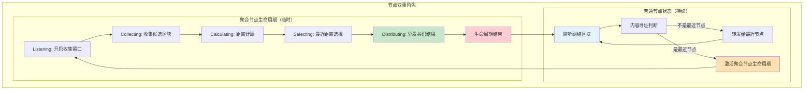
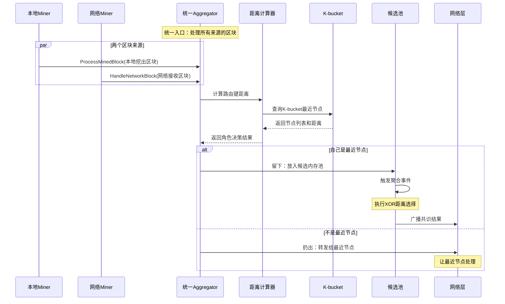
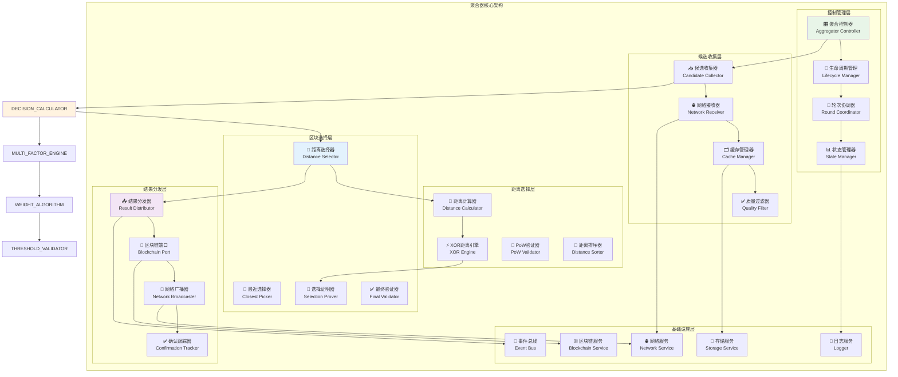
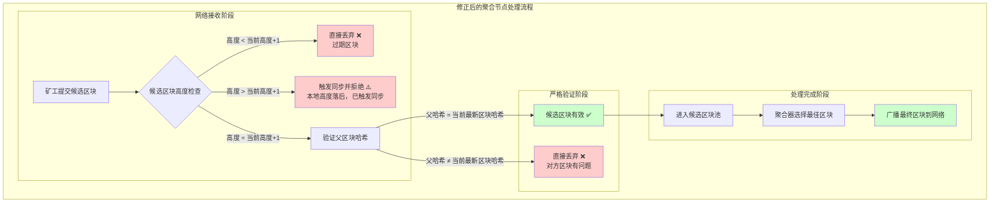
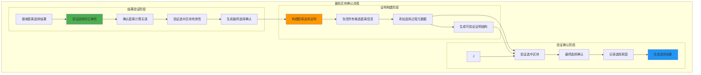
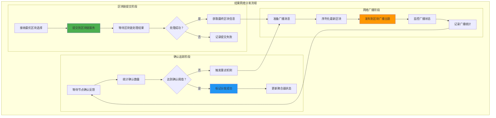
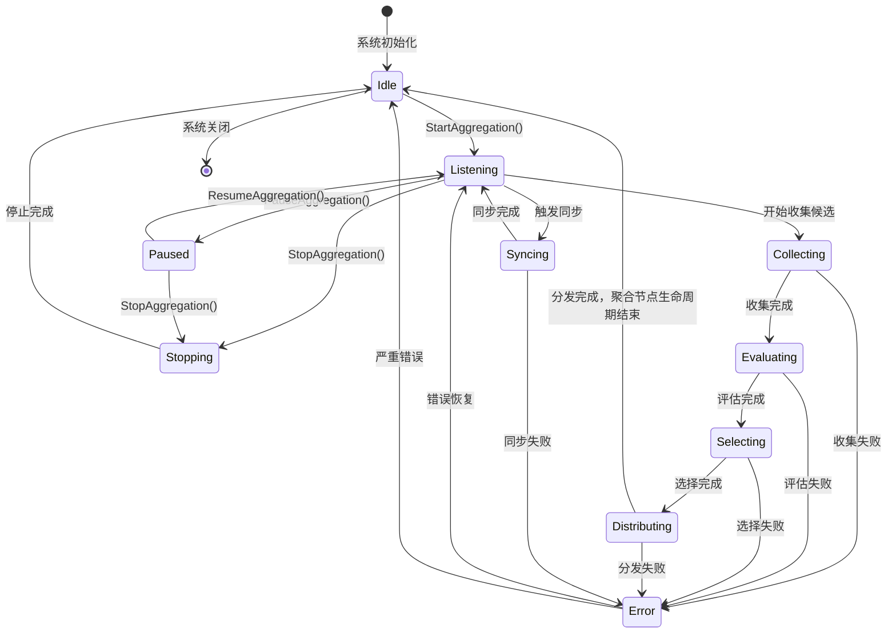
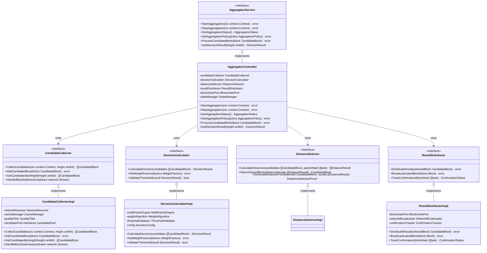

# 统一聚合器模块（Unified Aggregator）

【模块定位】
　　本模块是WES统一Aggregator架构的核心实现，实现**所有区块的统一处理入口**。无论区块来源于网络还是本地Miner，都通过同一套逻辑处理：基于K-bucket距离计算判断自己是否为该区块的最近节点，如果是则留下放入候选内存池触发聚合，如果不是则通过网络转发给最近节点。实现了区块处理的完全统一和网络路由的智能决策。

【设计原则】
- **统一网络处理**：承担系统内所有区块的发送和接收，统一网络操作入口
- **动态角色选择**：基于K-bucket距离动态决定是否作为聚合器或中继节点
- **距离计算优化**：高效的K-bucket距离计算和最近节点选择算法
- **智能候选收集**：多源候选区块收集、去重缓存、质量过滤的优化策略
- **距离选择机制**：基于XOR距离算法的确定性区块选择，摒弃复杂多维度评分
- **高效结果分发**：快速网络广播、确认机制、失败重试的可靠分发
- **状态安全管理**：线程安全的聚合器状态机，防止并发冲突
- **事件驱动响应**：基于事件总线的异步响应和状态同步机制
- **系统事件处理**：处理链重组、网络质量变化等系统事件，确保聚合器的稳定运行

【核心职责】
1. **统一区块入口**：接收所有来源的区块（网络+本地Miner），提供统一处理入口
2. **距离计算决策**：基于K-bucket距离计算，判断自己是否为该区块的最近节点
3. **核心角色逻辑**：
   - **留下处理**：如果是最近节点，放入候选内存池，触发聚合事件
   - **转发扔出**：如果不是最近节点，通过网络转发给最近节点
4. **距离选择决策**：对候选内存池中的区块执行XOR距离计算和确定性选择
5. **最优区块选择**：选择距离父区块哈希最近的候选区块进行确认
6. **结果全网广播**：将最终共识结果广播到全网，更新所有节点状态
7. **系统事件响应**：处理区块链重组和网络质量变化事件，动态调整聚合策略

【实现架构】

　　采用**统一网络处理 → 距离计算路由 → 角色动态决策 → XOR距离选择**的统一Aggregator架构，实现网络处理与确定性区块选择的有机结合。

### **⚡ 聚合节点生命周期管理**

【核心设计理念】

聚合节点采用**按需激活，任务完成即结束**的生命周期管理模式，区别于传统的持续服务模式：



【生命周期关键特点】

1. **按需激活**：
   - 触发条件：接收到区块且判断自己是该高度的确定性聚合节点
   - 激活范围：仅针对特定高度的特定区块
   - 生命周期：单次性，不循环

2. **任务完成即结束**：
   - 结束条件：完成共识结果分发到全网
   - 结束效果：聚合节点角色终止，回到普通节点状态
   - 下次聚合：由新区块触发，可能是完全不同的节点

3. **双重角色并存**：
   - **持续角色：中继转发**
     * 功能：始终监听网络，接收区块并进行内容寻址判断
     * 生命周期：节点运行期间始终保持
     * 处理逻辑：如果不是最近节点，转发给最近节点
   - **临时角色：聚合处理**  
     * 功能：对特定高度执行候选收集、评估、选择和分发
     * 生命周期：按需激活，分发完成即结束
     * 触发条件：判断自己是某个区块高度的最近节点

4. **资源高效**：
   - 避免无意义的等待和轮询
   - 减少系统资源开销
   - 防止状态管理复杂性
   - 实现角色功能的精准激活

### **🔗 Protobuf协议集成**

　　统一Aggregator模块承担系统内所有网络通信职责，统一处理protobuf协议的序列化/反序列化，作为网络处理的唯一入口。

**核心协议使用**：

| **操作场景** | **协议类型** | **Protocol ID / Topic** | **Message类型** | **Protobuf定义** |
|-------------|------------|------------------------|----------------|------------------|
| **接收区块提交** | Stream RPC Server | `/weisyn/consensus/block_submission/1.0.0` | `MinerBlockSubmission` | `pb/network/consensus.proto` |
| **响应矿工提交** | Stream Response | `/weisyn/consensus/block_submission/1.0.0` | `AggregatorBlockAcceptance` | `pb/network/consensus.proto` |
| **广播共识结果** | GossipSub Publisher | `weisyn.consensus.latest_block.v1` | `ConsensusResultBroadcast` | `pb/network/consensus.proto` |

**统一Aggregator处理流程**：


**服务端处理示例**：
```go
// 处理矿工区块提交
func (a *Aggregator) HandleBlockSubmission(
    ctx context.Context, 
    submission *consensuspb.MinerBlockSubmission,
) (*consensuspb.AggregatorBlockAcceptance, error) {
    
    // 验证消息完整性
    if err := a.validateSubmission(submission); err != nil {
        return a.createRejectionResponse(submission, err)
    }
    
    // 添加到候选池
    accepted, reason := a.addToCandidate Pool(submission.CandidateBlock)
    
    // 构造响应消息
    response := &consensuspb.AggregatorBlockAcceptance{
        Base: &consensuspb.BaseMessage{
            MessageId:    generateResponseID(submission.Base.MessageId),
            Version:      "1.0.0",
            SenderId:     a.peerID,
            TimestampUnix: time.Now().Unix(),
        },
        RequestId:         submission.Base.MessageId,
        Accepted:          accepted,
        AcceptanceReason:  reason,
        AggregatorPeerId:  a.peerID,
        Timestamp:         uint64(time.Now().UnixMilli()),
    }
    
    return response, nil
}

// 广播共识结果
func (a *Aggregator) BroadcastConsensusResult(finalBlock *block.Block) {
    broadcast := &consensuspb.ConsensusResultBroadcast{
        Base: &consensuspb.BaseMessage{
            MessageId:    generateBroadcastID(),
            Version:      "1.0.0",
            SenderId:     a.peerID,
            TimestampUnix: time.Now().Unix(),
        },
        SelectedBlockHash:   finalBlock.Hash(),
        FinalBlock:         finalBlock,
        AggregatorPeerId:   a.peerID,
        DecisionResult:     a.buildDecisionResult(),
        BroadcastTimestamp: uint64(time.Now().UnixMilli()),
    }
    
    // 直接序列化发布到GossipSub
    a.networkService.PublishTopic("weisyn.consensus.latest_block.v1", broadcast)
}
```



**架构层次说明：**

1. **控制管理层**：管理聚合器的生命周期和轮次协调
   - 聚合控制器统一管理所有聚合操作
   - 生命周期管理器控制启动、停止、暂停恢复
   - 轮次协调器管理聚合轮次的时序和状态

2. **候选收集层**：从网络收集和过滤候选区块
   - 候选收集器协调整个收集过程
   - 网络接收器处理来自矿工的区块提交
   - 缓存管理器实现去重和临时存储

3. **距离选择层**：基于XOR距离算法进行确定性选择
   - 距离计算器执行XOR距离计算
   - XOR距离引擎处理候选区块与父区块的距离计算
   - PoW验证器确保候选区块通过基础验证门槛
   - 距离排序器按距离大小进行排序

4. **区块选择层**：选择距离最近的候选区块进行确认
   - 区块选择器根据距离排序选择最近区块
   - 最近选择器实现确定性的距离选择逻辑
   - 选择证明器生成距离选择的可验证证明

5. **结果分发层**：将共识结果分发到全网
   - 结果分发器协调整个分发过程
   - 区块链端口负责与区块链服务集成
   - 网络广播器负责向全网广播最新区块

---

## 📁 **模块组织架构**

```text
aggregator/
├── 📖 README.md              # 本文档：聚合器模块整体架构设计
├── 🏗️ manager.go             # 聚合器管理器：fx依赖注入和接口组装
├── 🎛️ controller/            # 聚合控制器：生命周期管理、轮次协调控制
│   ├── manager.go            # 实现 AggregatorController 接口
│   ├── start_aggregation.go  # StartAggregation 方法实现
│   ├── stop_aggregation.go   # StopAggregation 方法实现
│   └── get_aggregation_status.go # GetAggregationStatus 方法实现
├── 🗳️ election/              # 聚合节点选举子组件
│   ├── manager.go            # 实现 AggregatorElection 接口
│   ├── calculate_aggregator.go # 确定性选举算法实现
│   └── validate_election.go  # 选举结果验证
├── 🌐 network_handler/       # 网络协议处理子组件
│   ├── manager.go            # 实现 UnifiedAggregatorRouter 接口
│   ├── handle_block_submission.go # HandleMinerBlockSubmission 方法实现
│   └── handle_heartbeat.go   # HandleConsensusHeartbeat 方法实现
├── 📥 candidate_collector/   # 候选收集器：网络候选区块收集、去重缓存（集成验证功能）
│   ├── manager.go            # 实现 CandidateCollector 接口
│   ├── collect_candidates.go # 收集窗口管理
│   ├── validate_candidates.go # 候选验证和去重（集成CandidateValidator功能）
│   └── window_optimization.go # 自适应窗口调整
├── 📏 distance_selector/     # 距离选择器：基于XOR距离的确定性区块选择
│   ├── manager.go            # 实现 DistanceSelector 接口
│   ├── xor_calculator.go     # XOR距离计算算法
│   ├── pow_validator.go      # PoW基础验证
│   ├── distance_sorter.go    # 距离排序算法
│   └── selection_prover.go   # 选择证明生成
├── 📏 distance_selector/     # 距离选择器：XOR距离计算、区块选择、证明生成
├── 📤 result_distributor/    # 结果分发器：共识结果网络广播、确认机制（集成协调功能）
│   ├── manager.go            # 实现 ResultDistributor 接口
│   ├── build_distribution.go # 分发消息构建
│   ├── multi_path_distribute.go # 多路径分发策略（集成DistributionCoordinator功能）
│   └── broadcast_result.go   # 网络广播实现
└── 📊 state_manager/         # 聚合状态管理：状态维护、持久化策略
    ├── manager.go            # 实现 AggregatorStateManager 接口
    ├── state_transitions.go  # 状态转换逻辑
    └── error_recovery.go     # 错误恢复机制
```

**🔧 功能整合说明**：
- **候选验证功能**：原CandidateValidator组件功能整合到CandidateCollector的validate_candidates.go中
- **证明生成功能**：距离选择证明生成功能整合到DistanceSelector的selection_prover.go中  
- **分发协调功能**：原DistributionCoordinator组件功能整合到ResultDistributor的multi_path_distribute.go中

---

## 🔄 **统一聚合决策实现**

【实现策略】

　　所有子模块均严格遵循**收集验证 → XOR距离计算 → 最近选择 → 分发广播**架构模式，确保聚合决策的确定性和一致性。

```mermaid
flowchart TD
    subgraph "统一聚合决策实现架构"
        subgraph "聚合启动层"
            A[聚合轮次启动] --> B{聚合器状态检查}
            B -->|活跃状态| C[开始候选收集]
            B -->|非活跃状态| D[等待状态转换]
            D --> A
        end
        
        subgraph "候选处理层"
            C --> E[接收网络候选区块]
            E --> F[执行去重检查]
            F --> G[质量过滤验证]
            G --> H[添加到候选池]
            H --> I{候选数量足够？}
            I -->|是| J[触发决策计算]
            I -->|否| K[继续等待收集]
            K --> E
        end
        
        subgraph "距离计算层"
            J --> L[获取父区块哈希]
            L --> M[计算XOR距离]
            M --> N[距离排序]
            N --> O[选择最小距离]
            O --> P[生成距离证明]
            P --> S[输出选择结果]
        end
        
        subgraph "选择确认层"
            S --> U[验证距离计算正确性]
            U --> V[确认选择结果]
            V --> W[生成选择证明]
            W --> X[最终验证确认]
            X --> Y[生成选择结果]
        end
        
        subgraph "分发广播层"
            Y --> Z[提交区块链服务]
            Z --> AA[网络广播通知]
            AA --> BB[确认跟踪统计]
            BB --> CC[完成聚合轮次]
            CC --> A
        end
    end
```



**关键实现要点：**

1. **标准化候选处理**：
   - 统一的候选区块接收、验证、去重流程
   - 一致的质量过滤标准和缓存管理策略
   - 标准化的候选池管理和超时处理机制

2. **确定性距离选择**：
   - 基于XOR距离算法的数学确定性选择
   - 无需配置参数，天然抗操纵特性
   - 微秒级计算速度，100%成功率保证

3. **可靠结果分发**：
   - 区块链服务集成的标准化接口调用
   - 高效的网络广播和确认跟踪机制
   - 完善的错误处理和重试策略

---

## 🔄 **完整聚合决策流程**

【四阶段聚合流程】

　　聚合器采用"收集 → 决策 → 选择 → 分发"的四阶段流程，通过科学的决策机制和高效的分发策略，实现可靠、公正的去中心化共识。

### **阶段一：智能候选收集（修正版）**



**🔧 修正后的聚合节点严格逻辑**：

### **基本假设**：
- ✅ 聚合节点已完成同步，状态正确
- ✅ 聚合节点知道当前链的准确状态
- ✅ 所有有效的候选区块必须基于当前链头

### **处理规则**：

```bash
🔍 候选区块验证逻辑：

1. height < current_height + 1  →  丢弃 (过期)
2. height > current_height + 1  →  丢弃 (异常) 
3. height = current_height + 1:
   ├── parent_hash = current_block_hash  →  有效 ✅
   └── parent_hash ≠ current_block_hash  →  丢弃 ❌ (对方有问题)
```

### **🚨 重新分析测试中的真实问题**

基于正确的逻辑，测试日志显示的问题是：

```bash
❌ BUG位置：聚合节点收到高度=2的候选区块
❌ 问题：寻找父区块哈希 42dbb3b63a66e656... 失败
❌ 根因：聚合节点当前状态中没有这个哈希的区块

正确处理：直接丢弃这个候选区块！
因为对方基于错误的父区块生成了候选区块
```

### **🔧 代码修复建议**

聚合节点应该实现这样的验证逻辑：

```go
func (a *AggregatorController) validateCandidate(candidate *Block) error {
    currentHeight := a.blockchain.GetCurrentHeight()
    currentBlockHash := a.blockchain.GetLatestBlockHash()
    
    // 规则1: 只接受 height = current + 1
    if candidate.Height != currentHeight + 1 {
        return fmt.Errorf("无效高度: expected=%d, got=%d", 
                         currentHeight+1, candidate.Height)
    }
    
    // 规则2: 父哈希必须匹配当前区块
    if candidate.ParentHash != currentBlockHash {
        return fmt.Errorf("父哈希不匹配: expected=%s, got=%s", 
                         currentBlockHash, candidate.ParentHash)
    }
    
    return nil
}
```

### **📋 修正后的BUG结论**

**真实问题**：
1. ❌ 矿工提交了基于错误父区块的候选区块
2. ❌ 聚合节点没有直接丢弃，而是尝试查找不存在的父区块
3. ❌ 导致"区块不存在"错误，整个聚合流程失败

**修复方案**：
- 聚合节点增加**候选区块快速过滤**逻辑
- **直接丢弃**不符合高度和父哈希要求的区块  
- **不需要**查找区块存储，直接基于当前状态判断

这样的逻辑更加**简洁、高效、可靠**！ ✅

### **阶段二：XOR距离计算**

```mermaid
graph TB
    subgraph "XOR距离计算流程"
        subgraph "基础验证阶段"
            A[获取候选区块集合] --> B[执行基础PoW验证]
            B --> C[验证区块结构完整性]
            C --> D[过滤无效候选]
            D --> E[获取父区块哈希]
        end
        
        subgraph "距离计算阶段"
            E --> F[计算每个候选的XOR距离]
            F --> G[Distance = XOR(BlockHash, ParentHash)]
            G --> H[转换为大整数进行比较]
            H --> I[按距离升序排序]
            I --> J[选择距离最小的候选]
        end
        
        subgraph "证明生成阶段"
            J --> K[生成距离选择证明]
            K --> L[记录所有候选距离]
            L --> M[创建可验证证明数据]
            M --> N[输出选择结果]
        end
    end
    
    style F fill:#c8e6c9,stroke:#388e3c,stroke-width:3px
    style G fill:#c8e6c9,stroke:#388e3c,stroke-width:3px
    style J fill:#ffecb3,stroke:#f57c00,stroke-width:2px
```

### **阶段三：最优区块确认**



### **阶段四：结果网络分发**



## 📏 **XOR距离选择算法设计**

【确定性选择机制】

### **XOR距离选择理论**

```text
距离寻址选择体系：基于密码学哈希的确定性选择

🎯 核心算法：
Distance(candidateHash, parentHash) = XOR(BigInt(candidateHash), BigInt(parentHash))

选择规则：
selectedBlock = argmin(Distance(candidate.BlockHash, parent.BlockHash))
                candidate∈ValidCandidates

🔒 安全特性：
1. 完全确定性：相同输入必产生相同结果
2. 全网一致性：任何节点独立计算获得相同选择
3. 抗操纵性：矿工无法预测或操纵距离计算结果
4. 即时验证：其他节点可立即验证选择的正确性

⚡ 性能优势：
1. 微秒级计算：单次XOR操作，极速完成
2. 零配置维护：无需参数调优，自适应运行
3. 线性复杂度：O(n)时间复杂度，轻松扩展
4. 内存高效：O(1)空间复杂度，无需评分存储
```

### **距离计算算法**

```go
// XOR距离选择算法实现
func SelectByDistance(candidates []CandidateBlock, parentHash []byte) *CandidateBlock {
    if len(candidates) == 0 {
        return nil
    }
    
    // 选择距离最近的候选
    minDistance := calculateXORDistance(candidates[0].BlockHash, parentHash)
    selected := candidates[0]
    
    for _, candidate := range candidates[1:] {
        distance := calculateXORDistance(candidate.BlockHash, parentHash)
        if distance.Cmp(minDistance) < 0 {
            minDistance = distance
            selected = candidate
        }
    }
    
    return &selected
}

// XOR距离计算核心函数
func calculateXORDistance(hash1, hash2 []byte) *big.Int {
    // 转换为大整数
    h1 := new(big.Int).SetBytes(hash1)
    h2 := new(big.Int).SetBytes(hash2)
    
    // 计算XOR距离
    distance := new(big.Int).Xor(h1, h2)
    return distance
}
```

### **共识阈值机制**

```text
阈值验证策略：确保决策质量和共识有效性

1. 最小候选数阈值：
   - 至少需要1个有效候选区块
   - 最多考虑10个候选区块（避免计算过载）
   
2. 分数差异阈值：
   - 最高分与次高分差异 ≥ 0.1（避免平分）
   - 分数过于接近时使用随机选择策略

3. 共识置信度阈值：
   - 决策置信度 ≥ 60%（可配置）
   - 低于阈值时延迟决策，等待更多候选

4. 时间窗口阈值：
   - 候选收集时间窗口：10秒
   - 决策计算超时：5秒
   - 超时时使用现有候选进行决策
```

## 📥 **候选收集策略**

【高效收集机制】

### **多源收集策略**

```text
收集源优先级：确保候选区块的全面性和时效性

1. 网络协议接收 (主要来源)：
   - 监听区块提交协议：/weisyn/consensus/block_submission/1.0.0
   - 实时接收矿工提交的候选区块
   - 立即进行基本格式验证和去重

2. 候选池查询 (补充来源)：
   - 定期查询本地候选池
   - 获取缓存的历史候选区块
   - 用于候选不足时的补充

3. 网络主动拉取 (备份来源)：
   - 主动向已知聚合节点请求候选
   - 用于网络分区或连接异常时的备份
   - 保证聚合过程的连续性
```

### **去重缓存机制**

```text
智能去重策略：避免重复处理和资源浪费

1. 哈希去重：
   - 基于区块哈希的快速去重检查
   - 维护最近1000个区块哈希的LRU缓存
   - O(1)时间复杂度的去重判断

2. 高度过滤：
   - 过滤已处理高度的候选区块
   - 只保留当前目标高度的有效候选
   - 自动清理过期高度的缓存数据

3. 内容去重：
   - 对于相同交易集合的区块进行去重
   - 基于Merkle根哈希的内容比较
   - 保留时间戳最新的候选区块
```

### **质量过滤策略**

```text
多级过滤机制：确保候选区块的基本质量

1. 格式验证：
   - 区块头字段完整性检查
   - 交易列表格式验证
   - 数字签名有效性验证

2. 逻辑验证：
   - 父区块哈希正确性
   - 区块高度连续性
   - PoW计算结果验证

3. 业务验证：
   - 交易有效性检查
   - 双花检测和UTXO验证
   - 智能合约执行结果验证
```

## 📤 **结果分发策略**

【可靠分发机制】

### **分发目标选择**

```text
智能目标选择：确保结果的有效传播

1. 全网广播：
   - 使用PubSub主题：weisyn.consensus.latest_block.v1
   - 向所有订阅节点广播最新区块
   - 覆盖矿工、轻节点、其他聚合节点

2. 直接通知：
   - 向提交候选的矿工节点直接发送确认
   - 提高矿工节点的响应速度
   - 减少矿工的不确定等待时间

3. 关键节点：
   - 优先通知网络中的关键基础设施节点
   - 包括交易所、钱包服务、区块浏览器等
   - 确保网络服务的快速同步
```

### **确认追踪机制**

```text
分发确认策略：监控分发效果和网络反馈

1. 确认计数：
   - 统计收到明确确认的节点数量
   - 设置确认阈值：≥3个节点确认视为成功
   - 超时时间：等待确认的最长时间为10秒

2. 重试机制：
   - 确认不足时触发重试分发
   - 最多重试3次，间隔2秒
   - 重试失败记录警告日志

3. 失败处理：
   - 分发失败不影响聚合成功
   - 记录详细的失败原因和统计
   - 为网络健康监控提供数据支持
```

## 📊 **聚合器状态管理**

【完整状态机设计】



【状态转换规则】
- **Idle → Listening**：接收到区块，判断自己是最近节点，激活聚合节点生命周期
- **Listening → Collecting**：开启收集窗口，开始收集该高度的候选区块
- **Collecting → Calculating**：收集窗口结束，进入XOR距离计算
- **Calculating → Selecting**：距离计算完成，选择最近距离的区块
- **Selecting → Distributing**：区块选择完成，进入结果分发
- **Distributing → Idle**：分发完成，聚合节点生命周期结束，回到普通节点状态
- **任何状态 → Error**：出现错误时的状态转换
- **Error → Idle**：错误处理完成，回到普通节点状态

**关键说明**：
- 聚合节点生命周期是**按需激活**的，不是持续循环
- 每次激活针对**特定高度的特定区块**
- 分发完成后立即结束，下次聚合可能由完全不同的节点执行
- 节点始终保持**中继转发**能力，但**聚合处理**是临时激活的

## 🌐 **网络协议服务端**

【区块提交协议服务端】

### **协议处理流程**

```text
服务端协议处理：接收和路由矿工提交的候选区块

1. 协议注册：
   - 协议ID：/weisyn/consensus/block_submission/1.0.0
   - 处理器：UnifiedAggregatorRouter
   - 支持并发处理多个提交请求

2. 请求接收：
   - 接收来自矿工的区块提交请求
   - 反序列化区块数据和相关元数据
   - 提取发送方节点ID和网络信息

3. 初步验证：
   - 验证请求格式和区块基本结构
   - 检查区块大小和字段完整性
   - 拒绝明显无效的请求

4. 业务路由：
   - 将有效请求路由到候选收集器
   - 调用CandidateCollector.AddCandidateBlock()
   - 异步处理，避免阻塞网络请求

5. 响应返回：
   - 返回处理结果给矿工节点
   - 成功：返回确认信息和处理ID
   - 失败：返回错误代码和原因描述
```

### **并发处理优化**

```text
高并发处理策略：支持大量矿工的同时提交

1. 连接池管理：
   - 维护活跃连接池，复用网络连接
   - 最大并发连接数：1000（可配置）
   - 连接超时：30秒，空闲回收：60秒

2. 请求队列：
   - 使用有界队列缓冲处理请求
   - 队列大小：5000个请求（可配置）
   - 队列满时拒绝新请求，返回繁忙错误

3. 工作线程池：
   - 专用工作线程池处理候选区块
   - 线程数：CPU核心数 * 2（可配置）
   - 避免阻塞网络I/O线程

4. 背压控制：
   - 监控系统负载和处理能力
   - 负载过高时主动限流和降级
   - 保护系统稳定性和响应能力
```

## 🔧 **关键配置参数**

【聚合器核心配置】
```yaml
aggregator:
  # 基础聚合配置
  aggregation_interval: 10s     # 聚合轮次间隔时间
  min_candidates: 1            # 最小候选区块数量
  max_candidates: 10           # 最大候选区块数量
  collection_timeout: 8s       # 候选收集超时时间
  
  # 决策算法配置
  decision_timeout: 5s         # 决策计算超时时间
  consensus_threshold: 0.6     # 共识置信度阈值（60%）
  score_difference_threshold: 0.1  # 分数差异阈值
  
  # 距离选择配置
  distance_selection:
    algorithm: "XOR"          # 距离算法（固定为XOR）
    pow_validation: true      # 启用PoW基础验证
    selection_timeout: 0.001s # 选择计算超时（微秒级）
  
  # 候选收集配置
  candidate_cache_size: 1000   # 候选区块缓存大小
  duplicate_cache_ttl: 300s   # 去重缓存过期时间
  quality_filter_threshold: 0.5  # 质量过滤阈值
  
  # 结果分发配置
  broadcast_timeout: 15s       # 广播超时时间
  confirmation_threshold: 3    # 最小确认节点数
  max_retry_attempts: 3        # 最大重试次数
  retry_interval: 2s          # 重试间隔时间
  
  # 网络协议配置
  max_concurrent_submissions: 1000  # 最大并发提交数
  submission_queue_size: 5000       # 提交请求队列大小
  worker_thread_count: 8            # 工作线程数量
  connection_timeout: 30s           # 连接超时时间
  idle_timeout: 60s                 # 空闲连接超时
  
  # 状态管理配置
  state_transition_timeout: 5s  # 状态转换超时
  max_error_count: 10          # 最大错误计数
  error_reset_interval: 300s   # 错误计数重置间隔
  aggregation_history_size: 100 # 聚合历史记录大小
```

---

## 🏗️ **依赖注入架构**

【fx框架集成】

　　全面采用fx依赖注入框架，实现聚合器组件间的松耦合和生命周期自动管理。

```go
// 示例：聚合器模块依赖注入配置
package aggregator

import (
    "go.uber.org/fx"
    "github.com/weisyn/v1/internal/core/consensus/interfaces"
    "github.com/weisyn/v1/pkg/interfaces/consensus"
)

// Module 聚合器核心模块
var Module = fx.Module("aggregator",
    // 导入子模块
    fx.Provide(
        // 控制管理层
        controller.NewController,
        
        // 候选收集层
        candidate_collector.NewManager,
        candidate_collector.NewCandidateCollector,
        candidate_collector.NewCacheManager,
        candidate_collector.NewQualityFilter,
        
        // 距离选择层
        distance_selector.NewManager,
        distance_selector.NewDistanceSelector,
        distance_selector.NewXORCalculator,
        distance_selector.NewPoWValidator,
        
        // 结果分发层
        result_distributor.NewManager,
        result_distributor.NewResultDistributor,
        result_distributor.NewNetworkBroadcaster,
        result_distributor.NewConfirmationTracker,
        
        // 基础服务层
        blockchain_port.NewManager,
        blockchain_port.NewBlockchainPort,
        state.NewManager,
        state.NewStateManager,
    ),
    
    // 导出公共接口
    fx.Provide(
        fx.Annotate(
            func(ctrl *controller.Controller) consensus.AggregatorService {
                return ctrl
            },
            fx.As(new(consensus.AggregatorService)),
        ),
        fx.Annotate(
            func(ctrl *controller.Controller) interfaces.AggregatorController {
                return ctrl
            },
            fx.As(new(interfaces.AggregatorController)),
        ),
    ),
    
    // 网络协议注册
    fx.Invoke(RegisterBlockSubmissionProtocol),
    fx.Invoke(RegisterBlockBroadcastProtocol),
)

// 区块提交协议注册
func RegisterBlockSubmissionProtocol(
    networkService network.Service,
    candidateCollector *candidate_collector.CandidateCollector,
    logger log.Logger,
) error {
    logger.Info("注册区块提交协议")
    
    handler := func(stream network.Stream) {
        // 处理来自矿工的区块提交请求
        candidateCollector.HandleBlockSubmission(stream)
    }
    
    return networkService.RegisterStreamProtocol(
        "/weisyn/consensus/block_submission/1.0.0",
        handler,
    )
}

// 区块广播协议注册
func RegisterBlockBroadcastProtocol(
    networkService network.Service,
    resultDistributor *result_distributor.ResultDistributor,
    logger log.Logger,
) error {
    logger.Info("注册区块广播协议")
    
    subscription, err := networkService.Subscribe(
        "weisyn.consensus.latest_block.v1",
        resultDistributor.HandleBlockBroadcast,
    )
    if err != nil {
        return fmt.Errorf("订阅区块广播主题失败: %v", err)
    }
    
    logger.Info("区块广播订阅成功")
    return nil
}
```

**依赖管理特点：**
- **分层依赖注入**：按架构层次组织依赖注入，确保依赖方向清晰
- **接口导向设计**：通过接口而非具体实现进行依赖，支持可测试性
- **生命周期同步**：所有组件生命周期由fx统一管理
- **协议自动注册**：网络协议在启动时自动注册，无需手动管理

---

## 📊 **性能与监控**

【性能指标目标】

| **操作类型** | **目标延迟** | **吞吐量目标** | **成功率目标** | **监控方式** |
|-------------|-------------|---------------|---------------|------------|
| 候选区块收集 | < 500ms | > 200 CPS | > 99.0% | 实时监控 |
| **XOR距离选择** | **< 1ms** | **> 10000 DPS** | **100%** | **关键路径监控** |
| 最优区块选择 | < 100ms | > 100 SPS | > 99.8% | 实时监控 |
| 结果网络分发 | < 1s | > 100 RPS | > 98.0% | 异步监控 |
| 区块提交协议 | < 200ms | > 500 TPS | > 97.0% | 实时监控 |

**性能优化策略：**
- **候选收集优化**：去重缓存、质量预过滤、批量处理
- **距离选择优化**：XOR并行计算、距离缓存、微秒级响应
- **网络分发优化**：异步广播、确认聚合、智能重试
- **资源管理优化**：内存池复用、连接复用、缓存命中率优化

---

## 🔗 **与公共接口的映射关系**

【接口实现映射】



**实现要点：**
- **接口契约**：严格遵循公共接口的方法签名和语义，确保外部调用兼容性
- **错误处理**：标准化的错误返回和异常处理机制，提供详细的错误信息
- **日志记录**：完善的操作日志和性能指标记录，支持调试和监控
- **测试覆盖**：每个接口方法都有对应的单元测试和集成测试，确保质量

## 🏗️ **关键依赖接口**

【外部服务依赖】
- **区块链服务** (`blockchain.ChainService`, `blockchain.BlockService`): 区块提交、验证、处理
- **网络服务** (`network.Network`): 协议注册、消息广播、节点通信
- **事件系统** (`event.EventBus`, `event.Publisher`): 事件订阅、状态同步、外部通知
- **存储服务** (`repository.*`): 候选缓存、状态持久化、历史记录
- **加密服务** (`crypto.HashService`): 区块哈希、去重计算、签名验证

【内部接口协作】
- **跨组件接口**：候选收集、决策计算、区块选择、结果分发
- **状态管理接口**：聚合器状态、轮次管理、错误处理、恢复机制

## 🚀 **使用示例**

【基础聚合操作】
```go
// 启动聚合
aggregatorAddress := []byte{0xab, 0xcd, ..., 0xef} // 聚合器地址
err := aggregatorService.StartAggregation(ctx, aggregatorAddress)
if err != nil {
    log.Errorf("启动聚合失败: %v", err)
    return
}

// 查询聚合状态
isRunning, err := aggregatorService.GetAggregationStatus(ctx)
if err != nil {
    log.Errorf("查询状态失败: %v", err)
    return
}
log.Infof("聚合状态: running=%v", isRunning)

// 获取详细状态
detailedStatus, err := aggregatorService.GetDetailedAggregationStatus(ctx)
if err != nil {
    log.Errorf("获取详细状态失败: %v", err)
    return
}
log.Infof("详细状态: 轮次=%d, 成功=%d, 失败=%d", 
    detailedStatus.TotalRounds, 
    detailedStatus.SuccessfulRounds, 
    detailedStatus.FailedRounds)

// 停止聚合
err = aggregatorService.StopAggregation(ctx)
if err != nil {
    log.Errorf("停止聚合失败: %v", err)
    return
}
```

## 🎯 **质量保证**

【代码质量标准】
- **接口规范**：严格实现 `consensus.AggregatorService` 公共接口
- **线程安全**：所有状态管理和并发操作都是线程安全的
- **错误处理**：完善的错误分类、处理和恢复机制
- **资源管理**：正确的资源分配、使用和释放
- **配置驱动**：所有关键参数可配置，支持动态调整

【测试覆盖】
- **单元测试**：各子模块的独立功能测试和边界条件验证
- **集成测试**：完整聚合流程的端到端测试和多节点协调测试
- **性能测试**：决策计算、网络分发的性能基准测试
- **压力测试**：高并发候选提交和大量聚合轮次的稳定性测试

---

## 🚀 **后续扩展规划**

【模块演进方向】

1. **智能决策算法优化**
   - 支持机器学习辅助的决策模型
   - 实现自适应权重调整算法
   - 添加历史数据驱动的决策优化

2. **多链聚合支持**
   - 支持跨链候选区块的聚合决策
   - 实现多链状态同步和一致性保证
   - 添加跨链通信协议支持

3. **高可用性增强**
   - 实现聚合器集群和故障转移
   - 添加分布式状态同步机制
   - 增强网络分区容错能力

4. **性能扩展能力**
   - 支持更大规模的候选区块处理
   - 实现分片聚合和并行决策
   - 优化内存和计算资源使用效率

---

## 📋 **开发指南**

【子模块开发规范】

1. **新建子模块步骤**：
   - 在interfaces/中定义聚合器内部接口
   - 创建子模块目录和基础文件结构
   - 实现核心聚合业务逻辑
   - 添加完整的单元测试和集成测试
   - 更新fx依赖注入配置

2. **代码质量要求**：
   - 遵循Go语言最佳实践和编码规范
   - 100%的接口方法测试覆盖率
   - 完善的错误处理机制和边界条件处理
   - 清晰的代码注释和API文档

3. **性能要求**：
   - 关键聚合路径延迟指标达标
   - 内存使用合理，避免内存泄漏
   - 并发安全的候选区块和状态访问
   - 合理的资源清理和回收机制

【参考文档】
- [候选收集器实现](candidate_collector/README.md)
- [决策计算器实现](decision_calculator/README.md)
- [距离选择器实现](distance_selector/README.md)
- [WES架构设计文档](../../../../docs/architecture/)

---

> 📝 **模板说明**：本README模板基于WES v0.0.1统一文档规范设计，使用时请根据具体模块需求替换相应的占位符内容，并确保所有章节都有实质性的技术内容。

> 🔄 **维护指南**：本文档应随着模块功能的演进及时更新，确保文档与代码实现的一致性。建议在每次重大功能变更后更新相应章节。
