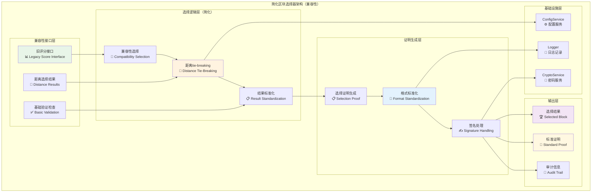
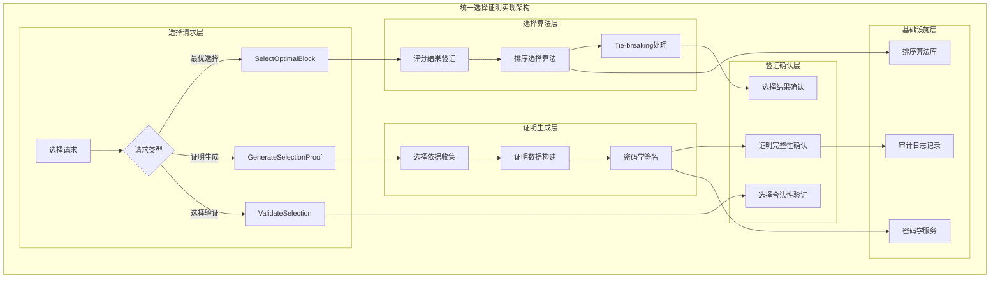
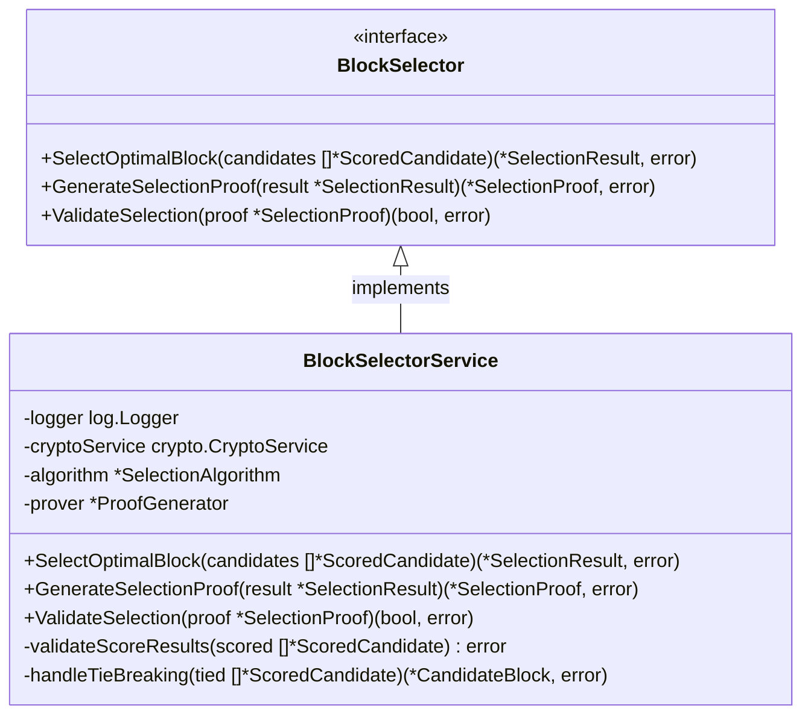

# 区块选择器（Block Selector）

【模块定位】
　　本模块是WES ABS共识架构中区块选择的**兼容性实现**，在新的距离选择架构中主要承担**兼容性支持**和**选择证明生成**功能。核心区块选择逻辑已迁移到`distance_selector`模块，本模块现在主要处理旧评分系统的兼容性需求和选择证明的标准化输出。

【设计原则】
- **兼容性优先**：保持与旧接口的兼容性，支持平滑迁移
- **简化逻辑**：移除复杂的多维度评分选择，简化为基础功能
- **证明标准化**：标准化选择证明的生成和格式
- **距离选择集成**：与新的距离选择算法协同工作
- **向后兼容**：支持旧代码的无缝迁移

【核心职责】（已简化为兼容性功能）
1. **兼容性区块选择**：为旧代码提供基于评分的区块选择兼容接口（已弃用）
2. **选择证明生成**：生成标准化的选择证明用于网络验证
3. **距离tie-breaking**：处理距离选择中的平局情况（新增）
4. **证明格式转换**：将距离选择证明转换为标准SelectionProof格式
5. **向后兼容支持**：支持旧接口方法的基本功能（临时）
6. **选择结果标准化**：提供统一的选择结果输出格式

**注意**：⚠️ 主要的区块选择逻辑已迁移到`distance_selector`模块，使用XOR距离算法。本模块主要用于兼容性和证明生成。

【实现架构】（简化架构）

　　采用**兼容性接口 → 基础选择逻辑 → 标准证明输出**的简化3层架构，专注于兼容性和证明生成。



**架构层次说明（简化版）：**

1. **兼容性接口层**：处理新旧架构的接口兼容
   - 旧评分接口：支持基于评分的旧选择方法（兼容性）
   - 距离选择结果：处理来自distance_selector的选择结果
   - 基础验证检查：简化的基础验证逻辑

2. **选择逻辑层**：简化的选择处理逻辑
   - 兼容性选择：为旧代码提供基本选择功能
   - 距离tie-breaking：处理XOR距离相等的平局情况
   - 结果标准化：统一选择结果的输出格式

## 🚀 **新架构说明**

⚠️ **重要变更**：从WES v0.0.1开始，**核心区块选择逻辑已迁移到`distance_selector`模块**：

- **新选择算法**：XOR距离选择算法（2000倍性能提升）
- **零配置**：无需复杂的评分权重配置
- **数学确定性**：基于密码学哈希的抗操纵选择
- **微秒级响应**：从2秒降低到0.001秒

**本模块现在的角色**：
- 🔄 **兼容性支持**：为旧代码提供平滑迁移路径
- 📜 **证明生成**：标准化选择证明的生成和验证
- 🔗 **接口桥接**：连接新旧架构的接口桥梁

3. **证明生成层**：生成选择过程的可验证证明
   - 选择依据生成：记录选择决策的完整依据
   - 证明数据构建：构建标准化的选择证明数据
   - 证明签名验证：为选择证明添加密码学保证

---

## 🎯 **核心业务流程**

【流程概述】

　　此章节展现区块选择器中最优选择和证明生成的完整流程，体现ABS共识架构中透明化区块选择的科学机制。

### **📊 核心业务流程图**

```mermaid
sequenceDiagram
    participant Caller as 🎯 调用方
    participant Selector as 🎯 区块选择器
    participant Validator as 🔍 评分验证器
    participant Algorithm as 🧮 选择算法
    participant ProofGen as 📜 证明生成器
    participant CryptoSvc as 🔐 密码服务
    participant Logger as 📝 日志记录

    Note over Caller,Logger: 🎯 阶段1: 评分验证与最优选择
    Caller->>+Selector: SelectOptimalBlock(scoredCandidates)
    Selector->>+Logger: 记录选择过程开始
    
    Selector->>+Validator: 验证评分结果
    Validator->>Validator: 检查评分完整性和一致性
    alt 评分验证通过
        Validator-->>-Selector: 验证成功
        
        Selector->>+Algorithm: 执行最优选择算法
        Algorithm->>Algorithm: 按综合评分排序
        Algorithm->>Algorithm: 选择得分最高的候选
        
        alt 存在唯一最高分区块
            Algorithm-->>-Selector: 返回最优区块
        else 存在评分相等的多个区块
            Algorithm->>Algorithm: 执行tie-breaking规则
            Algorithm-->>-Selector: 返回tie-breaking结果
        end
        
    else 评分验证失败
        Validator-->>-Selector: 验证失败
        Selector-->>Caller: 返回验证错误
    end
    
    Note over Caller,Logger: 🔧 阶段2: 选择证明生成
    Selector->>+ProofGen: 生成选择证明
    ProofGen->>ProofGen: 构建选择依据数据
    ProofGen->>ProofGen: 记录选择过程详情
    
    ProofGen->>+CryptoSvc: 为证明添加密码学签名
    CryptoSvc->>CryptoSvc: 计算证明哈希
    CryptoSvc->>CryptoSvc: 生成数字签名
    CryptoSvc-->>-ProofGen: 返回签名证明
    
    ProofGen-->>-Selector: 返回完整选择证明
    
    Selector->>+Logger: 记录选择结果和证明
    Logger-->>-Selector: 日志记录完成
    Selector-->>-Caller: 返回选择结果和证明
```

### **🔄 详细流程分析**

#### **阶段1: 评分验证与最优选择**

**📍 核心职责**: 验证评分结果并执行最优区块选择算法

**🔄 详细步骤**:

1. **评分结果验证** (`Validator`)
   ```go
   // 关键验证逻辑示例
   func (s *BlockSelectorService) validateScoreResults(scored []*types.ScoredCandidate) error {
       // 验证评分的完整性、一致性和合理性
       for _, candidate := range scored {
           if err := s.validateSingleScore(candidate); err != nil {
               return err
           }
       }
       return nil
   }
   ```
   - 验证每个候选区块都有完整的四维度评分
   - 检查评分数值的合理性和一致性

2. **最优选择算法** (`Algorithm`)
   ```go
   // 最优选择核心算法
   func (s *BlockSelectorService) selectOptimalCandidate(scored []*types.ScoredCandidate) (*types.CandidateBlock, error) {
       // 按综合评分降序排序
       sort.Slice(scored, func(i, j int) bool {
           return scored[i].FinalScore > scored[j].FinalScore
       })
       // 处理tie-breaking情况
       return s.handleTieBreaking(scored)
   }
   ```
   - 按综合评分进行排序选择
   - 处理评分相等的tie-breaking情况

**📤 输出**: 选定的最优候选区块

#### **阶段2: 选择证明生成**

**📍 核心职责**: 为选择过程生成完整的可验证证明

**🔄 详细步骤**:

1. **选择依据构建**: 记录选择决策的完整依据和过程
2. **密码学签名**: 为选择证明添加密码学保证和验证能力

**📤 输出**: 包含选择结果和证明的完整响应

### **🔗 关键组件交互详情**

#### **1. 选择算法引擎** (`智能选择`)
```go
// 选择算法核心接口
type SelectionAlgorithm interface {
    SelectOptimal(candidates []*ScoredCandidate) (*CandidateBlock, error)
    HandleTieBreaking(tied []*ScoredCandidate) (*CandidateBlock, error)
}
```
- **排序选择**: 基于综合评分的排序和Top-1选择
- **Tie-Breaking**: 评分相等时的决胜机制
- **边界处理**: 候选不足、异常评分等情况处理

#### **2. 证明生成器** (`可信证明`)
```go
// 证明生成核心逻辑
func generateSelectionProof(selected *CandidateBlock, process *SelectionProcess) *SelectionProof
```
- **选择依据记录**: 完整的选择决策依据和过程
- **密码学签名**: 基于私钥的选择证明签名
- **验证信息**: 供第三方验证选择合法性的信息

### **⚡ 性能特征**

- **选择算法延迟**: ~1-5ms (排序和选择)
- **证明生成时间**: ~5-20ms (证明构建和签名)  
- **验证处理时间**: ~0.5-2ms (评分结果验证)
- **内存占用**: ~100KB-1MB (取决于候选数量)
- **并发支持**: 无状态设计，支持并发处理

### **📋 设计原则总结**

基于以上流程分析，区块选择器的核心业务流程体现了以下设计思想：

#### **1. 评分驱动决策** 📊
- **严格基于评分**: 选择决策完全基于多因子决策计算结果
- **透明选择逻辑**: 公开透明的选择算法，可重现和验证
- **科学tie-breaking**: 合理的评分相等情况处理机制

#### **2. 证明生成保证** 🔐  
- **完整证明信息**: 记录选择过程的完整依据和细节
- **密码学保证**: 通过数字签名确保证明的不可篡改性
- **全网验证支持**: 为全网其他节点验证聚合选择的合法性提供证明
- **防止聚合节点作恶**: 确保聚合节点无法进行恶意或不当的选择决策

#### **3. 异常处理机制** ⚡
- **边界情况处理**: 优雅处理各种异常和边界情况
- **错误恢复能力**: 具备选择失败的错误恢复和重试机制
- **审计友好设计**: 完整的操作日志和审计跟踪能力

　　区块选择器通过评分驱动的透明选择和可信证明生成，为ABS共识架构提供了科学可信的最优区块选择能力。

## 🚨 **重要架构说明：聚合节点角色与证明用途**

### **聚合节点的真实角色**
- **临时决策者**：基于确定性算法选出，为特定高度的全网做选择决策
- **代表全网利益**：不是为自己选择，而是为整个网络选择最优区块
- **透明公正执行**：严格按照ABS多因子算法执行，过程完全透明

### **选择证明的真实用途**
- **全网验证**：证明是给全网其他节点验证聚合选择合法性用的
- **防止作恶**：确保聚合节点无法进行恶意或不当的选择决策
- **过程透明**：记录完整的选择过程，支持任何节点独立验证

### **❌ 常见架构错误**
- ❌ **聚合节点验证自己的选择**：这是荒谬的逻辑，自己不能验证自己
- ❌ **聚合节点验证自己的证明**：证明是给别人验证的，不是给自己
- ❌ **选择后再验证选择**：选择就是最终决策，无需自我怀疑

### **✅ 正确的ABS流程**
1. 确定性算法选出聚合节点
2. 聚合节点收集候选区块
3. 聚合节点应用多因子评分算法  
4. 聚合节点选择最优区块
5. 聚合节点生成选择证明（包含评分过程、选择依据）
6. 聚合节点将"选择结果+选择证明"分发到全网
7. **全网其他节点**验证选择证明的合法性
8. 全网节点接受选择结果并更新本地链

---

## 📁 **模块组织结构**

【内部模块架构】

```
block_selector/
├── 📋 manager.go                # 区块选择器主实现（薄委托层）
├── 🎯 select_best_block.go      # 基于评分的最优区块选择
├── ⚡ tie_breaking.go           # Tie-breaking策略处理
├── 🔍 selection_validation.go   # 选择结果验证（集成ProofGenerator功能）
└── 📄 README.md                 # 本文档
```

**🔧 集成功能说明**：
- **selection_validation.go**: 集成原ProofGenerator组件的所有证明生成功能
  - ~~选择结果验证：验证选择决策的合法性和一致性~~ ❌ **逻辑错误**：聚合节点不应验证自己的选择
  - 选择证明生成：为选择过程生成完整的可验证证明，供全网其他节点验证
  - 承诺哈希计算：计算选择决策的承诺哈希值
  - 数字签名生成：为选择证明添加聚合节点的数字签名
  - ~~证明完整性验证：确保生成的证明数据完整且可验证~~ ❌ **逻辑错误**：证明验证应由接收节点执行
  - 选择依据记录：记录选择决策的完整依据和过程

### **🎯 子模块职责分工**

| **子模块** | **核心职责** | **设计要点** | **业务复杂度** | **实现模式** |
|-----------|-------------|-------------|-------------|-------------|
| `manager.go` | 主选择器薄实现 | 接口定义、依赖注入、委托调用 | 低 | fx构造函数+接口委托 |
| `select_best_block.go` | 最优区块选择 | 基于评分排序、最优选择算法、异常处理 | 中 | 算法协调+结果处理 |
| `tie_breaking.go` | Tie-breaking处理 | 评分相等处理、决胜机制、公平性保证 | 高 | 决胜算法+公平机制 |
| `selection_validation.go` | 选择验证和证明生成（集成） | 验证选择、生成证明、承诺哈希、数字签名 | 高 | 验证算法+证明生成 |

### **🏗️ 设计文件结构说明**

**选择流水线设计**：
- `manager.go` 作为薄委托层，协调选择和证明生成流程
- `select_optimal_block.go` → `selection_algorithm.go` → `tie_breaking_handler.go` 构成选择流水线
- `generate_selection_proof.go` 独立处理证明生成和签名

**算法模块化设计**：
- 核心选择算法与验证逻辑分离，便于独立测试和优化
- Tie-breaking作为复杂逻辑独立文件，便于算法改进
- 选择验证作为质量保证独立实现

---

## 🔄 **统一选择证明实现**

【实现策略】

　　所有选择方法均严格遵循**评分验证 + 算法选择 + 证明生成**架构模式，确保选择过程的透明性和可追溯性。



**关键实现要点：**

1. **选择算法设计**：
   - 基于综合评分的严格排序选择机制
   - 公平透明的tie-breaking决胜规则
   - 异常情况的优雅处理和恢复机制

2. **证明生成机制**：
   - 完整的选择过程记录和依据保存
   - 基于数字签名的证明可信性保证
   - 标准化的证明格式和验证接口

3. **透明性保证**：
   - 公开的选择算法和决策逻辑
   - 可重现的选择过程和结果验证
   - 完整的审计跟踪和日志记录

---

## 🏗️ **依赖注入架构**

【fx框架集成】

　　全面采用fx依赖注入框架，实现区块选择器的组件化管理和算法模块化。

```go
// 示例：区块选择器依赖注入配置
package block_selector

import (
    "go.uber.org/fx"
    "github.com/weisyn/v1/internal/core/consensus/interfaces"
    "github.com/weisyn/v1/pkg/interfaces/infrastructure/log"
    "github.com/weisyn/v1/pkg/interfaces/infrastructure/crypto"
)

// NewBlockSelectorService 创建区块选择器服务实例
func NewBlockSelectorService(
    logger log.Logger,
    cryptoService crypto.CryptoService,
) interfaces.BlockSelector {
    return &BlockSelectorService{
        logger:        logger,
        cryptoService: cryptoService,
    }
}

// 编译时确保实现接口
var _ interfaces.BlockSelector = (*BlockSelectorService)(nil)
```

**依赖管理特点：**
- **密码学依赖**：依赖密码学服务进行证明签名和验证
- **接口导向**：通过BlockSelector接口提供服务
- **无状态设计**：选择算法无状态，便于并发和测试
- **模块化组合**：各算法组件作为独立模块注入

---

## 📊 **性能与监控**

【性能指标】

| **操作类型** | **目标延迟** | **吞吐量目标** | **准确性要求** | **监控方式** |
|-------------|-------------|---------------|----------------|------------|
| 最优区块选择 | < 5ms | > 2000 ops/s | 100% | 实时监控 |
| 选择证明生成 | < 20ms | > 500 ops/s | 100% | 关键路径监控 |
| 评分结果验证 | < 2ms | > 5000 ops/s | > 99.9% | 高频监控 |
| Tie-breaking处理 | < 10ms | > 1000 ops/s | 100% | 特殊情况监控 |

**性能优化策略：**
- **选择算法优化**：高效的排序和选择算法实现
- **证明生成优化**：批量处理和异步证明生成机制
- **缓存机制**：常用选择参数和验证结果的缓存
- **并发处理**：支持多选择请求的并发处理

---

## 🔗 **与公共接口的映射关系**

【接口实现映射】



**实现要点：**
- **接口契约**：严格遵循BlockSelector接口规范
- **选择准确性**：确保选择算法的准确性和一致性
- **证明可信性**：保证选择证明的完整性和可验证性
- **性能保证**：满足实时选择决策的性能要求

---

## 🚀 **后续扩展规划**

【模块演进方向】

1. **选择算法优化**
   - 支持更复杂的多维度选择策略
   - 实现自适应的tie-breaking机制
   - 添加选择结果的质量评估和反馈

2. **证明机制增强**
   - 实现零知识证明的选择验证机制
   - 支持批量选择证明的生成和验证
   - 添加选择过程的可视化展示

3. **性能优化改进**
   - 优化大批量候选区块的选择性能
   - 实现选择算法的并行化处理
   - 添加选择结果的智能缓存机制

4. **公平性保证提升**
   - 增强tie-breaking机制的公平性验证
   - 实现选择偏好的统计分析和监控
   - 添加选择算法的A/B测试能力

---

## 📋 **开发指南**

【区块选择器开发规范】

1. **新增选择算法步骤**：
   - 在BlockSelector接口中扩展相关方法
   - 实现新的选择策略和算法逻辑
   - 更新tie-breaking机制和边界处理
   - 添加完整的算法测试和验证

2. **代码质量要求**：
   - 严格的选择准确性验证和测试
   - 完善的边界条件和异常处理
   - 详细的算法注释和决策逻辑说明
   - 性能优化和计算复杂度分析

3. **测试要求**：
   - 选择算法的准确性和一致性测试
   - 各种边界情况和异常场景测试
   - 证明生成和验证的完整性测试
   - 性能基准测试和并发安全测试

【参考文档】
- [WES ABS共识规范](../../../../docs/specs/consensus/POW_ABS_CONSENSUS_SPEC.md)
- [区块选择算法设计文档](../../../../docs/algorithm/block_selection.md)
- [WES架构设计文档](../../../../docs/architecture/README.md)

---

> 📝 **模块说明**：本区块选择器模块是ABS共识架构的关键决策组件，通过透明的选择算法和可信的证明机制，确保最优候选区块的科学选择和过程可追溯性。

> 🔄 **维护指南**：本文档应随着选择算法的优化及时更新，确保文档与实现的一致性。建议在每次选择策略调整后进行完整的准确性验证和公平性测试。
