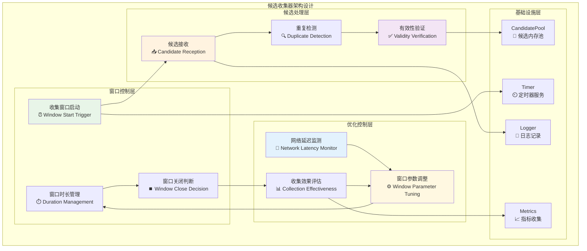
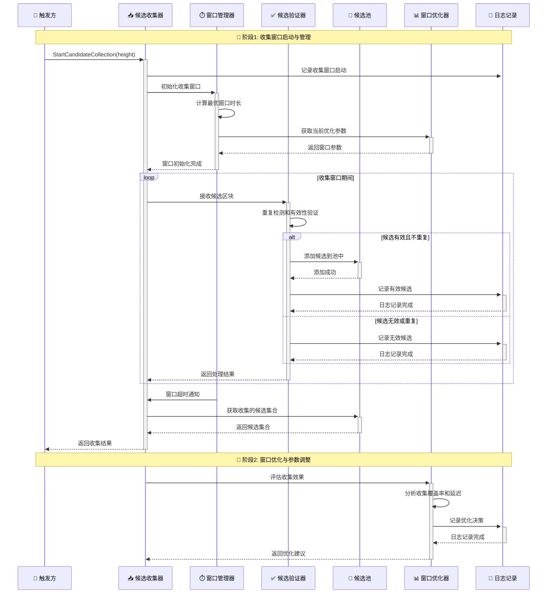
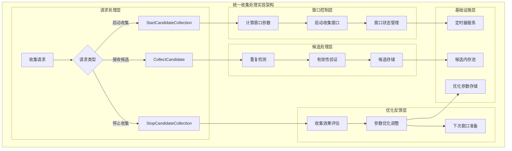
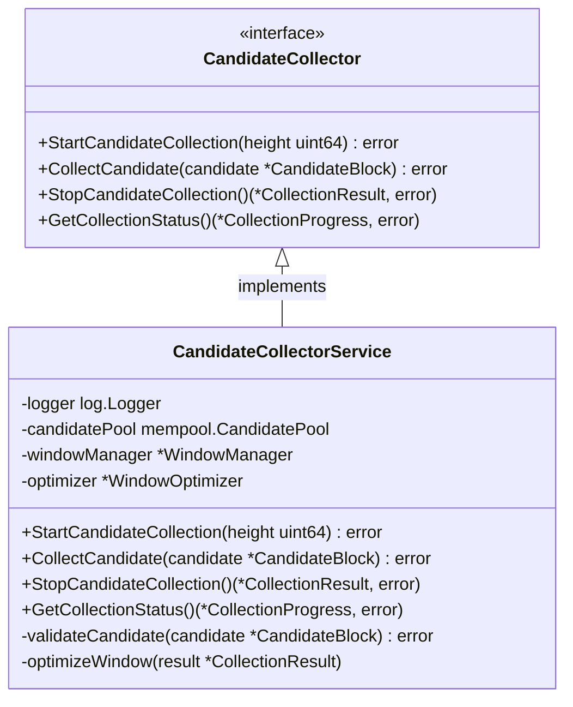

# 候选收集器（Candidate Collector）

## 🚨 **架构修正声明**

**✅ 正确的架构**：
候选收集器采用**完全被动接收**模式

【模块定位】
　　本模块是WES PoW+XOR共识架构中候选收集期的核心实现，负责**被动接收**其他节点提交的候选区块。当本节点通过确定性算法被选为特定高度的聚合节点时，开启收集窗口**被动等待**候选区块提交，通过严格的验证机制为距离选择算法提供高质量的候选区块集合。

【设计原则】
- ~~**时间窗口控制**：基于网络延迟和区块间隔的自适应窗口调整~~ ❌ **架构错误**
- **候选质量过滤**：严格的候选区块验证和重复性检测
- **高效收集管理**：优化的内存使用和候选区块存储机制
- ~~**窗口优化算法**：动态调整收集窗口以平衡效率和覆盖率~~ ❌ **无意义的优化**
- **并发安全收集**：支持多矿工并发提交的线程安全处理
- **✅ 被动接收模式**：完全被动等待候选区块提交，不主动联系网络
- **✅ 真实验证逻辑**：使用POWEngine进行真实POW验证，使用protobuf计算真实区块大小
- **✅ 固定时间窗口**：基于简单固定时间的收集窗口，无需复杂优化

【核心职责】
1. ~~**收集窗口管理**：控制候选收集的时间窗口，实现最优的收集时长~~ → **简单窗口管理**：固定时间窗口，无需优化
2. **候选区块接收**：**被动接收**来自其他节点提交的候选区块
3. **候选验证过滤**：使用真实POW验证和protobuf大小计算验证候选区块
4. **质量阈值过滤**：基于预设阈值过滤低质量候选区块
5. **结构完整性验证**：使用gRPC区块哈希服务验证区块结构和哈希
6. ~~**窗口自适应优化**：基于网络状态动态调整收集窗口参数~~ ❌ **删除：无意义的优化**
7. **收集状态管理**：管理收集过程的状态和收集完成的判断
8. **候选集合输出**：为决策算法提供验证过的候选区块集合

## 🔧 **重构任务清单**

**需要删除的错误实现**：
- ✅ `window_optimization.go` - 基于错误架构的网络延迟监测
- ✅ 所有主动网络联系的代码逻辑  
- ✅ 动态窗口优化算法

**需要修复的伪实现**：
- ✅ `validatePoWQuality()` - 实现真实的POW验证
- ✅ `estimateBlockSize()` - 使用protobuf真实大小计算
- 🔧 区块哈希验证 - 集成gRPC BlockHashServiceClient

**🚨 新发现的架构问题**：
- ❌ **未使用的验证方法** - `checkDuplicate()`, `markProcessed()`, `clearCache()` 未被调用
- ❌ **错误的内存池管理** - 缺少选择完成后的内存池清理机制
- ❌ **重复的去重逻辑** - 收集管理器和验证器都在做重复检测

## 📋 **正确的ABS候选收集业务流程**

### **阶段1：候选区块提交**
```
矿工挖出区块 → 本地aggregator → 内容寻址判断 → 
├─ 自己是聚合节点：存入内存池，开启收集窗口
└─ 自己不是聚合节点：转发给正确聚合节点
```

### **阶段2：被动候选收集**  
```
聚合节点开启收集窗口 → 被动接收其他节点提交的候选 → 
验证候选(POW+大小+哈希) → 存入收集窗口 → 等待窗口超时
```

### **阶段3：选择与清理**
```
收集窗口关闭 → 基础验证 → XOR距离选择 → 生成距离选择证明 → 
分发到全网 → 🔥 **清空整个内存池** → 开始下一轮收集
```

## 🎯 **内存池清理机制修正**

**❌ 错误设计**：标记候选区块"已处理"，维护复杂状态
**✅ 正确设计**：选择完成后调用 `candidatePool.ClearCandidates()` 清空所有候选

**清理时机**：
- ✅ 聚合选择完成并分发后
- ✅ 接收到其他聚合节点的最终区块后  
- ✅ 定期清理超时/过时候选区块

【实现架构】

　　采用**固定时间窗口 → 被动候选接收 → 真实验证过滤 → 候选集合输出**的简化3层架构，符合ABS被动接收的设计原则。



**架构层次说明：**

1. **窗口控制层**：管理候选收集的时间窗口机制
   - 收集窗口启动：响应聚合轮次触发，启动收集窗口
   - 窗口时长管理：根据优化参数控制收集时长
   - 窗口关闭判断：基于时间或收集条件判断窗口关闭

2. **候选处理层**：处理候选区块的接收、验证和存储
   - 候选接收：并发接收来自多个矿工的候选区块
   - 重复检测：识别和过滤重复的候选区块
   - 有效性验证：验证候选区块的格式和有效性

3. **优化控制层**：实现收集窗口的自适应优化
   - 网络延迟监测：监控当前网络传播延迟
   - 收集效果评估：评估当前窗口设置的收集效果
   - 窗口参数调整：基于评估结果动态调整窗口参数

---

## 🎯 **核心业务流程**

【流程概述】

　　此章节展现候选收集器中收集窗口管理和候选处理的完整流程，体现ABS共识架构中候选收集期的智能管理机制。

### **📊 核心业务流程图**



### **🔄 详细流程分析**

#### **阶段1: 收集窗口启动与管理**

**📍 核心职责**: 启动候选收集窗口并管理收集过程

**🔄 详细步骤**:

1. **窗口参数计算** (`WindowManager`)
   ```go
   // 关键设计示例
   func (s *CandidateCollectorService) calculateOptimalWindow() time.Duration {
       // Δt* = α × Network_Delay + β × Block_Interval
       // 典型参数：α ∈ [2, 5]，β ∈ [0.1, 0.3]
   }
   ```
   - 基于当前网络延迟和区块间隔计算最优窗口时长
   - 考虑历史收集效果进行参数微调

2. **并发候选接收** (`Validator`)
   - 并发处理来自多个矿工的候选区块提交
   - 实时进行重复检测和基础有效性验证

**📤 输出**: 验证过的候选区块集合

#### **阶段2: 窗口优化与参数调整**

**📍 核心职责**: 基于收集效果优化窗口参数

**🔄 详细步骤**:

1. **收集效果评估**: 分析收集到的候选数量和质量分布
2. **参数调整策略**: 基于评估结果调整下次窗口的参数设置

**📤 输出**: 优化后的窗口参数和收集策略

### **🔗 关键组件交互详情**

#### **1. 窗口管理器** (`时间控制`)
```go
// 窗口控制核心接口
type WindowManager interface {
    StartWindow(height uint64) error
    IsWindowActive() bool
    GetRemainingTime() time.Duration
}
```
- **动态时长**: 基于网络状态动态计算窗口时长
- **超时控制**: 精确的窗口超时检测和通知
- **状态管理**: 窗口的启动、运行、关闭状态管理

#### **2. 候选验证器** (`质量保证`)
```go
// 候选验证核心逻辑
func (s *CandidateCollectorService) ValidateCandidate(candidate *types.CandidateBlock) error
```
- **重复检测**: 基于区块哈希的快速重复检测
- **有效性验证**: PoW难度、时间戳、格式等基础验证
- **质量过滤**: 过滤明显低质量的候选区块

### **⚡ 性能特征**

- **窗口启动延迟**: ~1-5ms (参数计算和初始化)
- **候选接收处理**: ~0.5-2ms (单个候选验证)  
- **重复检测时间**: ~0.1-0.5ms (哈希表查找)
- **内存占用**: ~1-10MB (取决于候选数量)
- **并发支持**: 支持100+并发候选提交

### **📋 设计原则总结**

基于以上流程分析，候选收集器的核心业务流程体现了以下设计思想：

#### **1. 智能窗口管理** ⏰
- **自适应调整**: 基于网络状态动态优化收集窗口
- **效率平衡**: 在收集覆盖率和处理效率间找到平衡
- **参数学习**: 通过历史数据不断优化窗口参数

#### **2. 质量优先过滤** ✅  
- **严格验证**: 确保只有有效候选进入决策阶段
- **重复消除**: 高效的重复检测机制
- **快速处理**: 优化的验证流程确保实时性

#### **3. 并发友好设计** 🚀
- **无锁设计**: 尽可能使用无锁数据结构
- **并发安全**: 线程安全的候选存储和状态管理
- **资源优化**: 合理的内存使用和及时的资源清理

　　候选收集器通过固定窗口管理和质量优先的设计，为PoW+XOR共识架构提供了高效可靠的候选收集能力。

---

## 📁 **模块组织结构**

【内部模块架构】

```
candidate_collector/
├── 📋 manager.go                 # 候选收集器主实现（薄委托层）
├── 📥 collect_candidates.go      # 收集窗口管理和候选接收
├── ✅ validate_candidates.go     # 候选验证和去重（集成CandidateValidator功能）
├── 📊 window_optimization.go     # 自适应窗口调整算法
└── 📄 README.md                  # 本文档
```

**🔧 集成功能说明**：
- **validate_candidates.go**: 集成原CandidateValidator组件的所有验证功能
  - 基础验证功能：候选区块的格式和完整性验证
  - PoW验证功能：工作量证明的有效性验证
  - 结构验证功能：区块头、交易列表的结构验证  
  - 质量过滤功能：基于质量阈值的候选过滤
  - 重复检测功能：基于哈希的快速去重检测
  - 完整性检查：候选区块数据的完整性验证

### **🎯 子模块职责分工**

| **子模块** | **核心职责** | **设计要点** | **业务复杂度** | **实现模式** |
|-----------|-------------|-------------|-------------|-------------|
| `manager.go` | 主收集器薄实现 | 接口定义、依赖注入、委托调用 | 低 | fx构造函数+接口委托 |
| `collect_candidates.go` | 候选收集和窗口管理 | 启动窗口、并发接收、窗口控制、结果整理 | 高 | 窗口控制+并发处理 |
| `validate_candidates.go` | 候选验证核心（集成） | 结构验证、PoW验证、质量过滤、重复检测、完整性检查 | 高 | 多层验证+快速缓存 |
| `window_optimization.go` | 自适应优化 | 效果评估、参数调整、学习算法 | 高 | 统计分析+参数优化 |

### **🏗️ 设计文件结构说明**

**分层实现模式**：
- `manager.go` 作为薄委托层，负责接口实现和依赖注入
- 核心业务逻辑按功能模块分离到专门文件
- 复杂算法（验证、优化）独立文件实现，便于测试和优化

**窗口生命周期设计**：
- `start_collection.go` → `collect_candidates.go` → `stop_collection.go` 构成完整生命周期
- `window_management.go` 提供横切的窗口控制能力
- `window_optimization.go` 提供持续的参数优化能力

---

## 🔄 **统一收集处理实现**

【实现策略】

　　所有收集方法均严格遵循**窗口控制 + 并发验证 + 自适应优化**架构模式，确保收集过程的效率和质量。



**关键实现要点：**

1. **窗口自适应算法**：
   - 基于网络延迟和区块间隔的动态窗口计算
   - 历史收集效果的反馈优化机制
   - 多因子权重的窗口参数调整策略

2. **高并发候选处理**：
   - 无锁或细粒度锁的并发验证机制
   - 高效的重复检测数据结构（如布隆过滤器）
   - 流水线式的候选验证和存储流程

3. **质量驱动过滤**：
   - 基于PoW难度的候选质量评估
   - 时间戳合理性和区块格式验证
   - 候选区块的完整性和一致性检查

---

## 🏗️ **依赖注入架构**

【fx框架集成】

　　全面采用fx依赖注入框架，实现候选收集器的组件化管理和生命周期自动控制。

```go
// 示例：候选收集器依赖注入配置
package candidate_collector

import (
    "go.uber.org/fx"
    "github.com/weisyn/v1/internal/core/consensus/interfaces"
    "github.com/weisyn/v1/pkg/interfaces/infrastructure/log"
    "github.com/weisyn/v1/pkg/interfaces/mempool"
)

// NewCandidateCollectorService 创建候选收集器服务实例
func NewCandidateCollectorService(
    logger log.Logger,
    candidatePool mempool.CandidatePool,
) interfaces.CandidateCollector {
    return &CandidateCollectorService{
        logger:        logger,
        candidatePool: candidatePool,
    }
}

// 编译时确保实现接口
var _ interfaces.CandidateCollector = (*CandidateCollectorService)(nil)
```

**依赖管理特点：**
- **核心依赖**：依赖候选内存池进行候选存储管理
- **接口导向**：通过CandidateCollector接口提供服务
- **状态管理**：维护收集窗口和优化参数的内部状态
- **生命周期管理**：支持收集器的启停和资源清理

---

## 📊 **性能与监控**

【性能指标】

| **操作类型** | **目标延迟** | **吞吐量目标** | **窗口效率** | **监控方式** |
|-------------|-------------|---------------|---------------|------------|
| 启动收集窗口 | < 5ms | > 1000 ops/s | > 85% | 实时监控 |
| 候选接收处理 | < 2ms | > 5000 ops/s | > 90% | 高频监控 |
| 重复检测 | < 0.5ms | > 10000 ops/s | > 99% | 批量统计 |
| 窗口参数优化 | < 100ms | > 100 ops/s | N/A | 定期分析 |

**性能优化策略：**
- **窗口算法优化**：高效的窗口参数计算和调整算法
- **验证流程优化**：并行的候选验证和快速重复检测
- **内存使用优化**：合理的候选缓存大小和过期清理
- **网络适应优化**：基于实时网络状态的窗口动态调整

---

## 🔗 **与公共接口的映射关系**

【接口实现映射】



**实现要点：**
- **接口契约**：严格遵循CandidateCollector接口规范
- **错误处理**：完善的收集失败和候选验证错误处理
- **状态管理**：精确的收集窗口状态和进度管理
- **性能监控**：详细的收集性能和效果指标记录

---

## 🚀 **后续扩展规划**

【模块演进方向】

1. **窗口算法优化**
   - 引入机器学习的窗口参数自动调优
   - 支持多维度网络状态的窗口适应
   - 实现预测性的窗口参数调整

2. **收集效率提升**
   - 优化候选验证的并行度和吞吐量
   - 实现更高效的重复检测算法
   - 添加候选质量的预筛选机制

3. **智能收集策略**
   - 基于矿工历史质量的候选优先级
   - 网络拓扑感知的收集策略优化
   - 动态的收集覆盖率控制

4. **监控和分析增强**
   - 收集效果的实时可视化监控
   - 窗口参数调整的效果分析
   - 候选质量分布的统计分析

---

## 📋 **开发指南**

【候选收集器开发规范】

1. **新增收集功能步骤**：
   - 在CandidateCollector接口中定义新方法
   - 创建对应的实现文件和核心逻辑
   - 确保窗口管理和并发安全
   - 添加完整的单元和集成测试

2. **代码质量要求**：
   - 严格的并发安全性验证
   - 完善的边界条件和异常处理
   - 详细的算法注释和性能分析
   - 优化的内存使用和资源管理

3. **测试要求**：
   - 多并发场景的收集测试
   - 窗口参数的边界值测试
   - 网络异常情况的鲁棒性测试
   - 收集效果和性能的基准测试

【参考文档】
- [WES PoW+XOR共识规范](../../../../docs/specs/consensus/POW_XOR_CONSENSUS_SPEC.md)
- [候选内存池接口文档](../../../../pkg/interfaces/mempool/README.md)
- [WES架构设计文档](../../../../docs/architecture/README.md)

---

> 📝 **模块说明**：本候选收集器模块是PoW+XOR共识架构的核心组件，通过固定窗口管理和质量优先的候选收集，为距离选择算法提供高质量的候选区块集合。

> 🔄 **维护指南**：本文档应随着收集算法的优化及时更新，确保文档与实现的一致性。建议在每次窗口算法调整后验证收集效果和性能指标。
