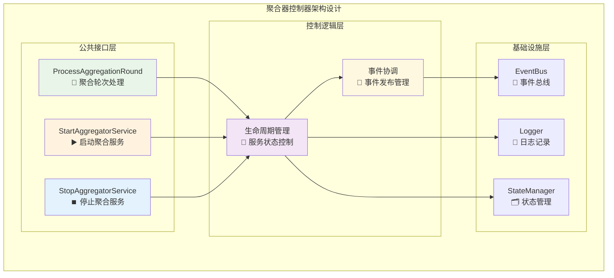
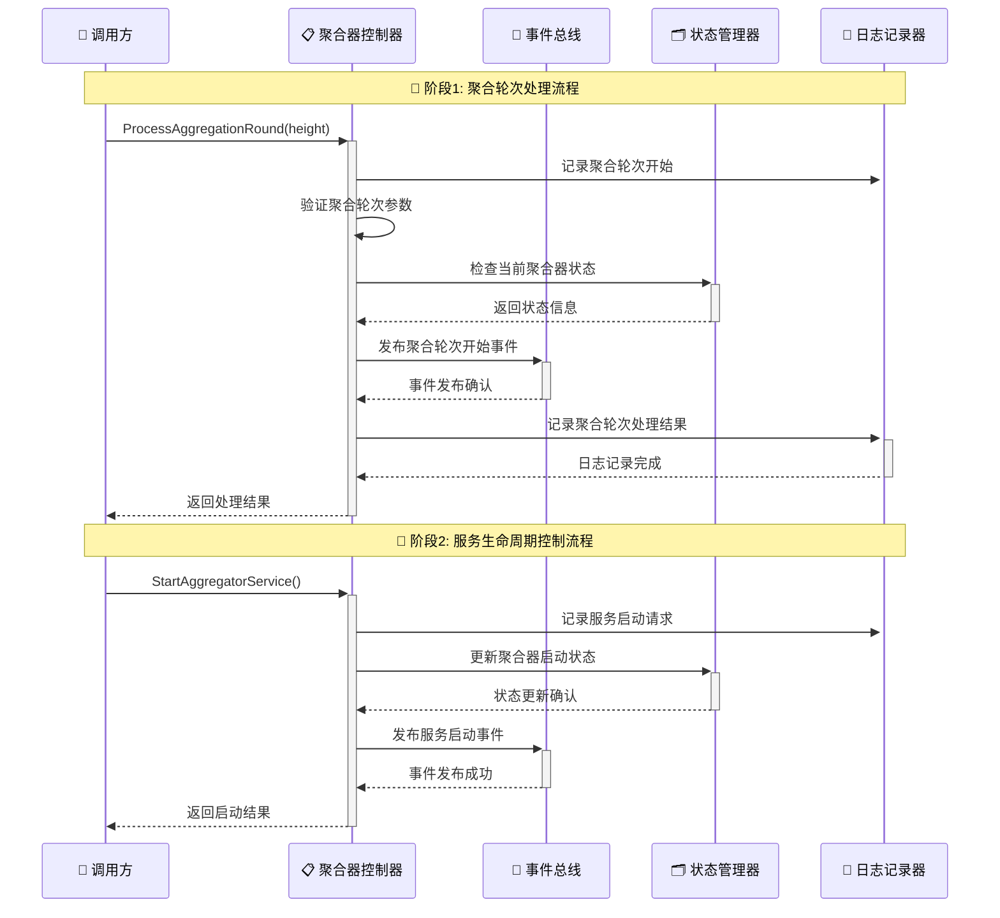
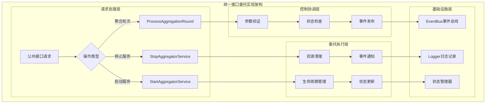
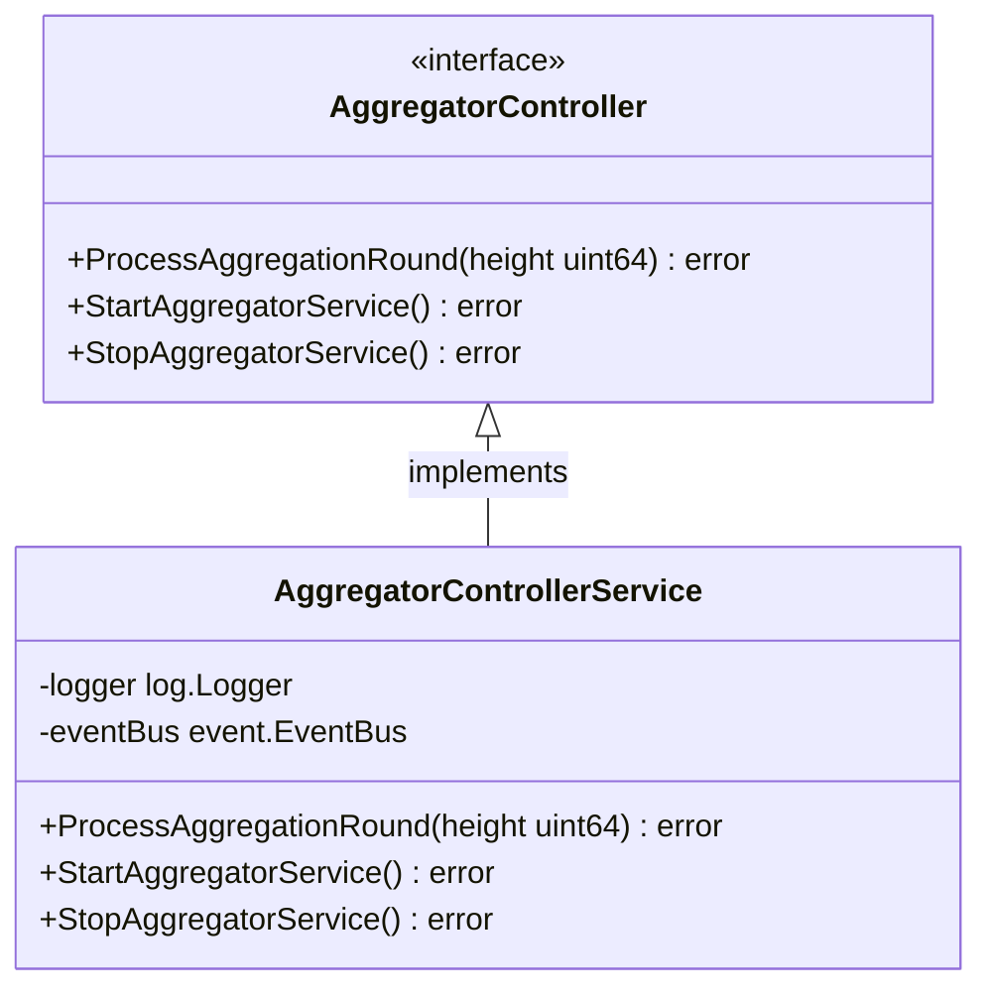

# 聚合器控制器（Aggregator Controller）

【模块定位】
　　本模块是WES聚合器系统中控制层的核心实现，负责聚合器服务的生命周期管理和公共接口控制。作为聚合器对外服务的统一入口，提供标准化的控制接口，支撑PoW+XOR共识架构中聚合器角色的按需激活和任务完成即结束的生命周期模式，确保聚合器服务的可控性和可靠性。

【设计原则】
- **统一入口控制**：作为聚合器所有公共接口的统一控制入口
- **生命周期管理**：管理聚合器服务的启动、停止和状态查询
- **薄实现委托**：遵循薄实现原则，将具体业务逻辑委托给其他专业组件
- **按需激活支持**：配合ABS架构的按需激活生命周期模式
- **事件驱动协调**：通过事件总线协调与其他聚合器组件的交互

【核心职责】
1. **聚合轮次处理**：接收并处理特定高度的聚合轮次请求
2. **服务生命周期控制**：管理聚合器服务的启动和停止操作
3. **状态统一管理**：提供聚合器整体运行状态的查询接口
4. **接口标准化**：确保所有公共接口遵循统一的调用规范
5. **错误处理协调**：统一处理和传播聚合器运行过程中的错误信息
6. **事件发布管理**：协调聚合器生命周期相关的事件发布

【实现架构】

　　采用**薄控制器 + 事件驱动委托**的2层实现架构，确保控制逻辑的简洁性和扩展性。



**架构层次说明：**

1. **公共接口层**：提供标准化的聚合器控制接口
   - ProcessAggregationRound：处理特定高度的聚合轮次
   - StartAggregatorService：启动聚合器服务
   - StopAggregatorService：停止聚合器服务

2. **控制逻辑层**：实现薄控制器的核心逻辑
   - 生命周期管理：控制聚合器服务的启停状态
   - 事件协调：管理聚合器相关的事件发布和订阅
   - 委托调用：将具体业务逻辑委托给专业组件

---

## 🎯 **核心业务流程**

【流程概述】

　　此章节展现聚合器控制器中关键控制操作的完整流程，体现ABS共识架构中按需激活生命周期的控制特点。

### **📊 核心业务流程图**



### **🔄 详细流程分析**

#### **阶段1: 聚合轮次处理流程**

**📍 核心职责**: 接收特定高度的聚合轮次请求，启动ABS共识处理流程

**🔄 详细步骤**:

1. **参数验证** (`Controller`)
   ```go
   // 关键代码示例
   func (s *AggregatorControllerService) ProcessAggregationRound(ctx context.Context, height uint64) error {
       s.logger.Info("处理聚合轮次")
       // 验证高度参数的合法性
       return nil
   }
   ```
   - 验证区块高度参数的合法性和有效性
   - 检查当前聚合器是否已处于激活状态

2. **状态协调** (`StateManager`)
   - 检查聚合器当前运行状态
   - 确保聚合器处于可接受聚合轮次的状态

**📤 输出**: 聚合轮次处理结果和状态更新通知

#### **阶段2: 服务生命周期控制流程**

**📍 核心职责**: 管理聚合器服务的启动和停止，配合按需激活模式

**🔄 详细步骤**:

1. **启动控制**: 初始化聚合器服务并设置就绪状态
2. **停止控制**: 安全停止聚合器服务并清理资源

**📤 输出**: 服务生命周期状态变更和相关事件通知

### **🔗 关键组件交互详情**

#### **1. EventBus事件总线** (`事件驱动`)
```go
// 核心事件发布接口
func (s *AggregatorControllerService) publishEvent(eventType string, data interface{})
```
- **生命周期事件**: 发布聚合器启动、停止状态变更事件
- **轮次处理事件**: 通知聚合轮次的开始和结束
- **错误处理事件**: 广播控制过程中的异常情况

#### **2. Logger日志记录** (`监控追踪`)
```go
// 标准日志接口调用
s.logger.Info("处理聚合轮次")
```
- **操作日志**: 记录所有控制器关键操作
- **状态变更日志**: 追踪服务生命周期状态变化
- **性能监控**: 记录控制操作的执行时间

### **⚡ 性能特征**

- **轮次处理延迟**: ~1-5ms (参数验证和事件发布)
- **服务启动时间**: ~10-50ms (状态初始化)  
- **服务停止时间**: ~5-20ms (资源清理)
- **内存占用**: <1MB (轻量级控制器)
- **并发支持**: 线程安全的状态管理

### **📋 设计原则总结**

基于以上流程分析，聚合器控制器的核心业务流程体现了以下设计思想：

#### **1. 薄实现原则** 🎯
- **轻量控制**: 只负责接口标准化和状态协调，不包含复杂业务逻辑
- **委托调用**: 将具体处理委托给专业的业务组件
- **快速响应**: 确保控制接口的快速响应和低延迟

#### **2. 按需激活支持** 🔄  
- **生命周期配合**: 配合聚合器按需激活的生命周期模式
- **状态管理**: 精确管理聚合器的激活和终止状态
- **资源优化**: 避免不必要的资源占用和状态维护

#### **3. 事件驱动协调** 📡
- **事件发布**: 及时发布聚合器状态变更和业务事件
- **异步通知**: 通过事件总线实现与其他组件的异步协调
- **状态同步**: 确保系统各组件对聚合器状态的一致理解

　　聚合器控制器通过薄实现和事件驱动的设计，为ABS共识架构提供了可靠的控制入口和生命周期管理能力。

---

## 📁 **模块组织结构**

【内部模块架构】

```
controller/
├── 📋 manager.go                    # 聚合器控制器主实现（薄委托层）
├── 🔄 process_aggregation_round.go  # ProcessAggregationRound 方法实现
├── ▶️ start_aggregator_service.go   # StartAggregatorService 方法实现
├── ⏹️ stop_aggregator_service.go    # StopAggregatorService 方法实现
└── 📄 README.md                     # 本文档
```

### **🎯 子模块职责分工**

| **子模块** | **核心职责** | **设计要点** | **业务复杂度** | **实现模式** |
|-----------|-------------|-------------|-------------|-------------|
| `manager.go` | 主控制器薄实现 | 接口定义、依赖注入、委托调用 | 低 | fx构造函数+接口委托 |
| `process_aggregation_round.go` | 聚合轮次处理 | 高度验证、状态检查、事件触发 | 中 | 参数验证+事件驱动 |
| `start_aggregator_service.go` | 聚合服务启动 | 初始化检查、状态设置、启动事件 | 低 | 状态转换+事件发布 |
| `stop_aggregator_service.go` | 聚合服务停止 | 安全停止、资源清理、停止事件 | 中 | 优雅停止+资源清理 |

### **🏗️ 设计文件结构说明**

**薄实现委托模式**：
- `manager.go` 作为薄委托层，只包含fx构造函数和接口方法的简单委托
- 每个接口方法对应一个专门的实现文件，职责单一
- 所有具体逻辑在专门文件中实现，便于测试和维护

**方法分离设计**：
- 每个AggregatorController接口方法都有独立的实现文件
- 便于并行开发和独立测试
- 降低单个文件的复杂度，提升代码可读性

---

## 🔄 **统一接口委托实现**

【实现策略】

　　所有控制器方法均严格遵循**薄实现委托**架构模式，确保控制逻辑的简洁性和业务处理的专业化分工。



**关键实现要点：**

1. **接口标准化**：
   - 所有公共接口遵循统一的调用规范和错误处理机制
   - 确保接口签名与业务语义的一致性
   - 提供完整的接口文档和使用示例

2. **薄实现委托**：
   - 控制器只负责接口层的协调和管理
   - 具体业务逻辑委托给专业的业务组件处理
   - 保持控制器代码的简洁性和可维护性

3. **事件驱动协调**：
   - 通过事件总线实现与其他组件的解耦协调
   - 及时发布服务状态和业务处理事件
   - 支持异步事件处理和状态同步

---

## 🏗️ **依赖注入架构**

【fx框架集成】

　　全面采用fx依赖注入框架，实现聚合器控制器的组件化管理和生命周期自动控制。

```go
// 示例：聚合器控制器依赖注入配置
package controller

import (
    "go.uber.org/fx"
    "github.com/weisyn/v1/internal/core/consensus/interfaces"
    "github.com/weisyn/v1/pkg/interfaces/infrastructure/event"
    "github.com/weisyn/v1/pkg/interfaces/infrastructure/log"
)

// NewAggregatorControllerService 创建聚合器控制器服务实例
func NewAggregatorControllerService(
    logger log.Logger,
    eventBus event.EventBus,
) interfaces.AggregatorController {
    return &AggregatorControllerService{
        logger:   logger,
        eventBus: eventBus,
    }
}

// 编译时确保 AggregatorControllerService 实现了 AggregatorController 接口
var _ interfaces.AggregatorController = (*AggregatorControllerService)(nil)
```

**依赖管理特点：**
- **自动生命周期**：控制器启动和停止由fx自动管理
- **接口导向**：通过接口而非具体类型进行依赖
- **层次清晰**：明确的依赖方向，避免循环依赖
- **测试友好**：支持依赖注入的单元测试

---

## 📊 **性能与监控**

【性能指标】

| **操作类型** | **目标延迟** | **吞吐量目标** | **成功率** | **监控方式** |
|-------------|-------------|---------------|-----------|------------|
| 聚合轮次处理 | < 5ms | > 1000 ops/s | > 99.9% | 实时监控 |
| 服务启动 | < 50ms | > 100 ops/s | > 99.9% | 生命周期监控 |
| 服务停止 | < 20ms | > 100 ops/s | > 99.9% | 生命周期监控 |
| 状态查询 | < 1ms | > 10000 ops/s | N/A | 高频监控 |

**性能优化策略：**
- **快速响应**：薄实现确保控制接口的快速响应
- **异步处理**：通过事件总线实现异步状态协调
- **资源优化**：最小化控制器的资源占用
- **并发安全**：确保多并发场景下的线程安全

---

## 🔗 **与公共接口的映射关系**

【接口实现映射】



**实现要点：**
- **接口契约**：严格遵循AggregatorController接口的方法签名和语义
- **错误处理**：标准化的错误返回和异常处理机制
- **日志记录**：完善的操作日志和性能指标记录
- **测试覆盖**：每个接口方法都有对应的单元测试和集成测试

---

## 🚀 **后续扩展规划**

【模块演进方向】

1. **高级生命周期管理**
   - 支持聚合器的暂停和恢复功能
   - 实现聚合器的健康检查和自恢复机制
   - 添加聚合器状态的详细监控和告警

2. **性能优化增强**
   - 优化控制接口的响应性能
   - 实现更高效的事件发布机制
   - 添加控制器的性能指标收集

3. **错误处理改进**
   - 完善错误分类和处理机制
   - 实现智能错误恢复策略
   - 添加错误信息的结构化记录

4. **配置管理支持**
   - 支持聚合器控制参数的动态配置
   - 实现配置变更的热更新机制
   - 添加配置验证和回滚功能

---

## 📋 **开发指南**

【聚合器控制器开发规范】

1. **新增接口方法步骤**：
   - 在AggregatorController接口中定义新方法
   - 在AggregatorControllerService中实现具体逻辑
   - 遵循薄实现原则，避免复杂业务逻辑
   - 添加完整的单元测试

2. **代码质量要求**：
   - 遵循Go语言最佳实践
   - 100%的接口方法测试覆盖
   - 完善的错误处理机制
   - 清晰的代码注释和文档

3. **性能要求**：
   - 控制接口延迟指标达标
   - 内存使用合理，避免泄漏
   - 并发安全的数据访问
   - 合理的资源清理机制

【参考文档】
- [WES聚合器重构分析](../REFACTORING_ANALYSIS.md)
- [WES聚合器模块文档](../README.md)
- [WES架构设计文档](../../../../docs/architecture/README.md)

---

> 📝 **模块说明**：本聚合器控制器模块严格遵循WES ABS共识架构的按需激活生命周期模式，通过薄实现和事件驱动为聚合器系统提供可靠的控制入口。

> 🔄 **维护指南**：本文档应随着控制器功能的演进及时更新，确保文档与代码实现的一致性。建议在每次重大功能变更后更新相应章节。
