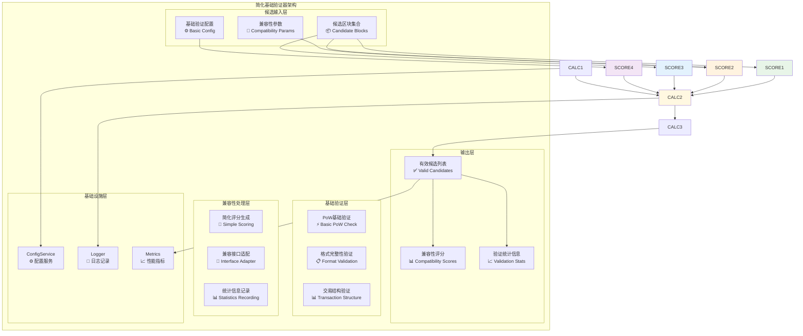
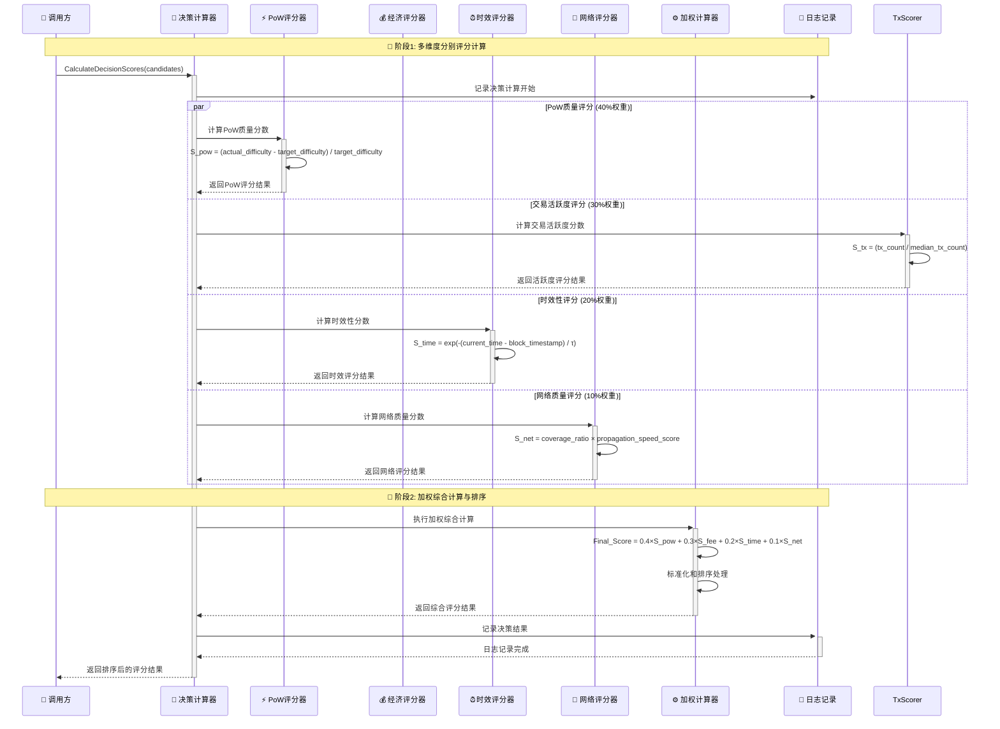
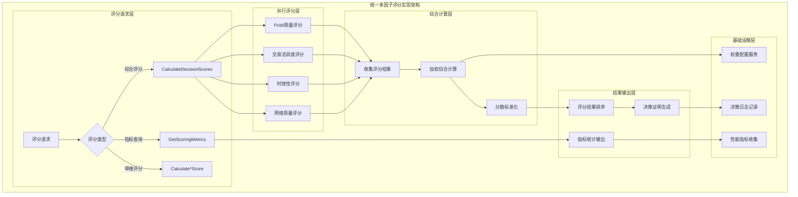
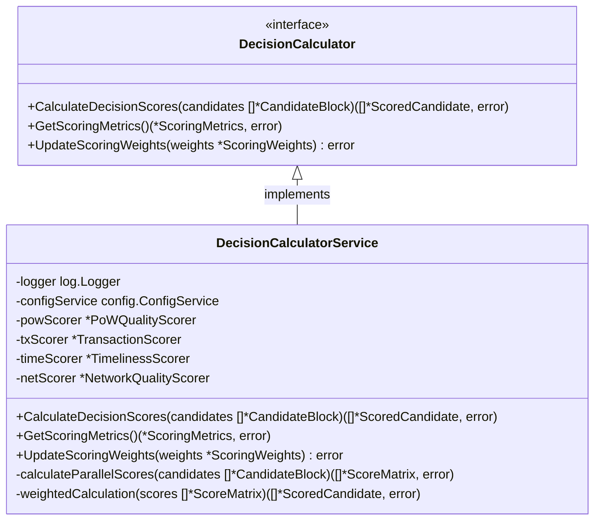

# 基础验证器（Basic Validator）

【模块定位】
　　本模块是WES ABS共识架构中**简化的基础验证组件**，在新的距离选择架构中主要承担**基础候选验证**和**兼容性支持**功能。复杂的多维度评分算法已被**XOR距离选择算法**替代，本模块现在专注于基础的PoW验证、格式检查和向后兼容性支持。

【设计原则】（简化架构）
- **简化验证**：专注于基础的PoW验证和格式检查
- **兼容性优先**：保持与旧DecisionCalculator接口的兼容性
- **性能优先**：快速的基础验证，为距离选择做准备
- **零配置**：无需复杂的权重配置，简化系统维护
- **向后兼容**：支持旧代码的平滑迁移

【核心职责】（已简化）
1. **基础PoW验证**：验证候选区块是否满足工作量证明要求
2. **区块格式验证**：检查区块头、区块体的基本格式完整性  
3. **交易基础验证**：验证区块中交易的基本结构（简化）
4. **兼容性评分生成**：为旧接口生成简化的兼容性评分（固定值）
5. **验证统计记录**：记录基础验证的统计信息
6. **过滤无效候选**：移除不满足基础要求的候选区块

**⚠️ 重要说明**：复杂的多维度评分算法已迁移到**距离选择器**，本模块现在仅负责基础验证和兼容性支持。

【实现架构】（简化版）

　　采用**候选输入 → 基础验证 → 兼容性输出**的简化3层验证架构，专注于基础验证和向后兼容性。



## 🚀 **新架构说明**

⚠️ **重要变更**：从WES v0.0.1开始，**复杂的多维度评分算法已被XOR距离选择算法替代**：

- **算法简化**：4维度复杂评分 → 基础PoW验证
- **性能提升**：评分计算时间减少99%+
- **配置简化**：无需权重配置，零维护成本
- **确定性保证**：基础验证结果100%确定

**本模块现在的角色**：
- ✅ **基础验证**：确保候选区块满足基本要求
- 🔄 **兼容性支持**：为旧代码提供接口兼容性
- 📊 **统计记录**：记录验证过程的统计信息

**架构层次说明（简化版）**：

1. **候选输入层**：提供基础验证所需的数据
   - 候选区块集合：来自候选收集器的验证区块集合
   - 网络状态信息：当前网络传播状态和节点分布
   - 网络活跃度参考：历史交易数量和活跃度基准数据

2. **分维度评分层**：实现四个核心维度的独立评分
   - PoW质量评分：基于算力竞争的质量评估
   - 交易活跃度评分：基于交易数量的网络活跃度评估
   - 时效性评分：基于时间衰减的时效性评估
   - 网络质量评分：基于网络贡献的质量评估

3. **综合计算层**：实现加权综合和标准化计算
   - 权重配置管理：四个维度的权重参数管理
   - 加权综合计算：按权重进行综合分数计算
   - 分数标准化：确保评分结果的可比性

---

## 🎯 **核心业务流程**

【流程概述】

　　此章节展现多因子决策计算器中四维度评分和综合决策的完整流程，体现ABS共识架构中智能选择最优区块的科学机制。

### **📊 核心业务流程图**



### **🔄 详细流程分析**

#### **阶段1: 多维度分别评分计算**

**📍 核心职责**: 对候选区块进行四个维度的独立评分计算

**🔄 详细步骤**:

1. **PoW质量评分算法** (`PoWScorer`)
   ```go
   // 关键算法示例
   func (s *DecisionCalculatorService) calculatePoWQuality(candidate *types.CandidateBlock) float64 {
       // S_pow = (actual_difficulty - target_difficulty) / target_difficulty
       actualDiff := candidate.Header.Difficulty
       targetDiff := s.getTargetDifficulty()
       return float64(actualDiff - targetDiff) / float64(targetDiff)
   }
   ```
   - 基于实际难度与目标难度的超额比例计算PoW质量
   - 鼓励更高难度的PoW工作量证明

2. **交易活跃度评分算法** (`TransactionScorer`)
   ```go
   // 交易活跃度评分核心算法  
   func (s *DecisionCalculatorService) calculateTransactionActivity(candidate *types.CandidateBlock) float64 {
       // S_tx = (tx_count / median_tx_count) * normalization_factor
       txCount := len(candidate.Block.Body.Transactions)
       medianTxCount := s.getMedianTxCount()
       if medianTxCount == 0 {
           medianTxCount = 10.0 // 默认基准
       }
       return float64(txCount) / medianTxCount
   }
   ```
   - 基于交易数量和历史基准评估网络活跃度
   - 鼓励包含更多交易的区块，提升网络处理效率

**📤 输出**: 四个维度的独立评分结果

#### **阶段2: 加权综合计算与排序**

**📍 核心职责**: 将四个维度评分按权重进行综合计算并排序

**🔄 详细步骤**:

1. **加权综合计算**: 按照40%、30%、20%、10%的权重分配计算最终分数
2. **分数标准化**: 确保不同维度评分的可比性和最终分数的合理性
3. **结果排序**: 按最终综合分数对候选区块进行排序

**📤 输出**: 排序后的候选区块评分结果集合

### **🔗 关键组件交互详情**

#### **1. PoW质量评分器** (`算力质量评估`)
```go
// PoW质量核心接口
type PoWQualityScorer interface {
    CalculatePoWScore(candidate *types.CandidateBlock) (*types.ABSScore, error)
}
```
- **超额难度计算**: 衡量实际PoW工作量相对于要求的超额部分
- **质量权重**: 占综合评分40%的最高权重
- **防操控设计**: 基于密码学难度，难以人为操控

#### **2. 交易活跃度评分器** (`网络活跃度评估`)
```go
// 交易活跃度评分核心逻辑
func calculateTransactionActivity(candidateBlock *types.CandidateBlock) float64
```
- **交易数量统计**: 统计区块包含的有效交易数量
- **相对活跃度**: 相对于网络历史中位数交易量的活跃度水平  
- **激励机制**: 鼓励矿工打包更多交易，提升网络处理效率

### **⚡ 性能特征**

- **单候选评分延迟**: ~1-5ms (四维度并行计算)
- **批量评分处理**: ~10-50ms (处理10-100个候选)  
- **权重配置更新**: ~0.1-1ms (配置参数调整)
- **内存占用**: ~1-5MB (评分缓存和中间结果)
- **并发支持**: 支持多候选并行评分计算

### **📋 设计原则总结**

基于以上流程分析，多因子决策计算器的核心业务流程体现了以下设计思想：

#### **1. 科学评分体系** 📊
- **多维度制衡**: 四个维度相互制衡，避免单一因素操控
- **权重科学性**: 基于共识价值的科学权重分配
- **公平竞争**: 不仅考虑算力，还考虑经济和网络贡献

#### **2. 算法透明性** 🔍  
- **公开算法**: 所有评分算法公开透明，可验证
- **决策证明**: 提供完整的决策过程证明
- **参数可控**: 关键参数可配置和调整

#### **3. 防操控机制** 🛡️
- **多因子制衡**: 单一维度优化无法主导最终结果
- **时效性约束**: 防止通过延迟提交操控时间戳
- **网络质量验证**: 基于真实网络传播的质量评估

　　多因子决策计算器通过科学的评分体系和透明的算法设计，为ABS共识架构提供了公平高效的智能决策能力。

---

## 📁 **模块组织结构**

【内部模块架构】

```
decision_calculator/
├── 📋 manager.go                   # 决策计算器主实现（薄委托层）
├── 🔢 calculate_scores.go          # CalculateDecisionScores 方法实现
├── 📊 get_scoring_metrics.go       # GetScoringMetrics 方法实现
├── ⚡ pow_quality_scoring.go       # PoW质量评分算法实现
├── 📊 multi_factor_scoring.go       # 简化的基础验证实现（已重构）
├── ⏰ timeliness_scoring.go        # 时效性评分算法实现
├── 📡 network_quality_scoring.go   # 网络质量评分算法实现
├── ⚙️ weighted_calculation.go      # 加权综合计算算法实现
└── 📄 README.md                    # 本文档
```

### **🎯 子模块职责分工**

| **子模块** | **核心职责** | **设计要点** | **业务复杂度** | **实现模式** |
|-----------|-------------|-------------|-------------|-------------|
| `manager.go` | 主计算器薄实现 | 接口定义、依赖注入、委托调用 | 低 | fx构造函数+接口委托 |
| `calculate_scores.go` | 综合评分协调 | 多维度评分协调、并行计算管理 | 高 | 并行协调+结果汇总 |
| `get_scoring_metrics.go` | 评分指标查询 | 评分统计、性能指标、历史数据 | 中 | 数据查询+统计分析 |
| `pow_quality_scoring.go` | PoW质量评分 | 难度比较、工作量验证、质量计算 | 中 | 密码学计算+难度分析 |
| `multi_factor_scoring.go` | 基础验证器 | 简化的PoW验证、格式检查、兼容性支持 | 低 | 基础验证+兼容性 |
| `timeliness_scoring.go` | 时效性评分 | 时间戳验证、衰减计算、时效分析 | 中 | 时间分析+衰减函数 |
| `network_quality_scoring.go` | 网络质量评分 | 传播分析、覆盖率计算、网络评估 | 高 | 网络分析+质量评估 |
| `weighted_calculation.go` | 加权综合计算 | 权重管理、标准化、综合计算 | 中 | 权重算法+数值计算 |

### **🏗️ 设计文件结构说明**

**分维度实现模式**：
- `manager.go` 作为薄委托层，协调四个评分维度的计算
- 每个评分维度独立文件实现，便于算法优化和测试
- `weighted_calculation.go` 专门处理综合计算和标准化

**算法模块化设计**：
- 每个评分算法独立实现，便于并行开发和优化
- 统一的评分接口设计，便于算法替换和A/B测试
- 清晰的依赖关系，便于单元测试和性能调优

---

## 🔄 **统一多因子评分实现**

【实现策略】

　　所有评分方法均严格遵循**分维度评分 + 加权综合 + 标准化输出**架构模式，确保评分的科学性和可比性。



**关键实现要点：**

1. **并行评分机制**：
   - 四个维度的评分可以并行计算，提升评分效率
   - 独立的评分算法实现，便于并行优化和测试
   - 统一的结果收集和同步机制

2. **权重配置管理**：
   - 可配置的权重参数：PoW(40%)、经济(30%)、时效(20%)、网络(10%)
   - 支持权重的动态调整和A/B测试
   - 权重合法性验证和一致性保证

3. **标准化和排序**：
   - 各维度评分的标准化处理，确保可比性
   - 综合分数的排序和Top-K选择机制
   - 决策过程的完整可追溯性

---

## 🏗️ **依赖注入架构**

【fx框架集成】

　　全面采用fx依赖注入框架，实现决策计算器的组件化管理和算法模块化。

```go
// 示例：多因子决策计算器依赖注入配置
package decision_calculator

import (
    "go.uber.org/fx"
    "github.com/weisyn/v1/internal/core/consensus/interfaces"
    "github.com/weisyn/v1/pkg/interfaces/infrastructure/log"
    "github.com/weisyn/v1/pkg/interfaces/infrastructure/config"
)

// NewDecisionCalculatorService 创建决策计算器服务实例
func NewDecisionCalculatorService(
    logger log.Logger,
    configService config.ConfigService,
) interfaces.DecisionCalculator {
    return &DecisionCalculatorService{
        logger:        logger,
        configService: configService,
    }
}

// 编译时确保实现接口
var _ interfaces.DecisionCalculator = (*DecisionCalculatorService)(nil)
```

**依赖管理特点：**
- **配置依赖**：依赖配置服务获取权重参数和算法参数
- **接口导向**：通过DecisionCalculator接口提供服务
- **算法模块化**：各评分算法作为独立组件注入
- **性能监控**：集成指标收集和性能监控能力

---

## 📊 **性能与监控**

【性能指标】

| **操作类型** | **目标延迟** | **吞吐量目标** | **准确性要求** | **监控方式** |
|-------------|-------------|---------------|----------------|------------|
| 综合评分计算 | < 50ms | > 200 ops/s | > 99.9% | 实时监控 |
| 单维度评分 | < 10ms | > 1000 ops/s | > 99.9% | 高频监控 |
| 权重配置更新 | < 1ms | > 5000 ops/s | 100% | 配置监控 |
| 评分指标查询 | < 5ms | > 2000 ops/s | N/A | 批量统计 |

**性能优化策略：**
- **并行计算优化**：四维度评分的高效并行计算
- **算法优化**：评分算法的计算复杂度优化
- **缓存机制**：常用参数和中间结果的缓存
- **批量处理**：支持批量候选区块的并行评分

---

## 🔗 **与公共接口的映射关系**

【接口实现映射】



**实现要点：**
- **接口契约**：严格遵循DecisionCalculator接口规范
- **算法准确性**：确保各维度评分算法的准确性和一致性
- **性能保证**：满足实时决策的性能要求
- **可配置性**：支持权重参数的动态配置和调整

---

## 🚀 **后续扩展规划**

【模块演进方向】

1. **评分算法优化**
   - 引入机器学习优化评分权重配置
   - 基于历史数据的评分效果反馈优化
   - 实现更精细化的多维度评分算法

2. **性能提升改进**
   - 优化并行计算的线程模型和调度策略
   - 实现更高效的批量评分处理机制
   - 添加评分结果的智能缓存机制

3. **算法公平性增强**
   - 防操控机制的持续改进和加强
   - 评分算法的公平性验证和审计
   - 多样化的评分维度和权重策略

4. **决策透明性提升**
   - 评分过程的完整可视化展示
   - 决策理由的详细解释和证明
   - 评分算法的A/B测试和效果对比

---

## 📋 **开发指南**

【多因子决策开发规范】

1. **新增评分维度步骤**：
   - 在DecisionCalculator接口中扩展相关方法
   - 创建独立的评分算法实现文件
   - 更新加权计算的权重配置
   - 添加完整的算法测试和验证

2. **代码质量要求**：
   - 严格的算法准确性验证和测试
   - 完善的边界条件和异常处理
   - 详细的算法注释和数学公式说明
   - 性能优化和计算复杂度分析

3. **测试要求**：
   - 各维度评分算法的单元测试
   - 综合评分的一致性和准确性测试
   - 极端情况和边界值的鲁棒性测试
   - 性能基准测试和并发安全测试

【参考文档】
- [WES ABS共识规范](../../../../docs/specs/consensus/POW_ABS_CONSENSUS_SPEC.md)
- [多因子决策算法设计文档](../../../../docs/algorithm/decision_scoring.md)
- [WES架构设计文档](../../../../docs/architecture/README.md)

---

> 📝 **模块说明**：本多因子决策计算器模块是ABS共识架构的核心算法实现，通过科学的多维度评分体系实现智能区块选择，确保共识决策的公平性和科学性。

> 🔄 **维护指南**：本文档应随着评分算法的优化及时更新，确保文档与实现的一致性。建议在每次算法调整后进行完整的准确性验证和性能测试。
