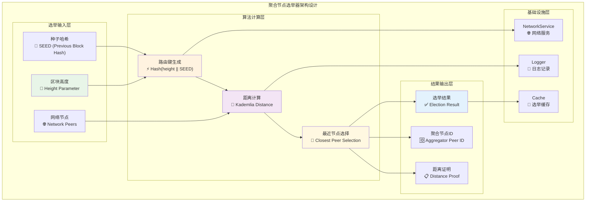
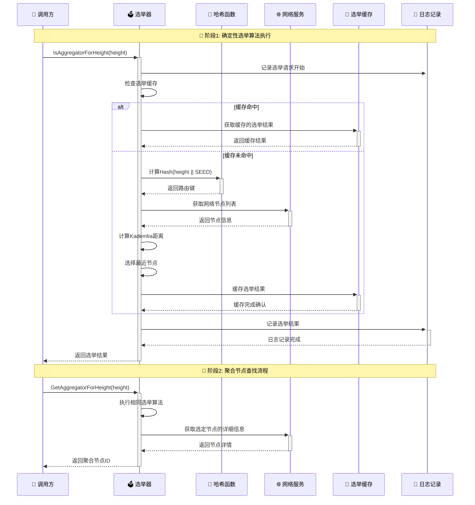
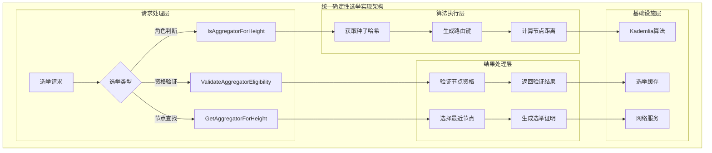
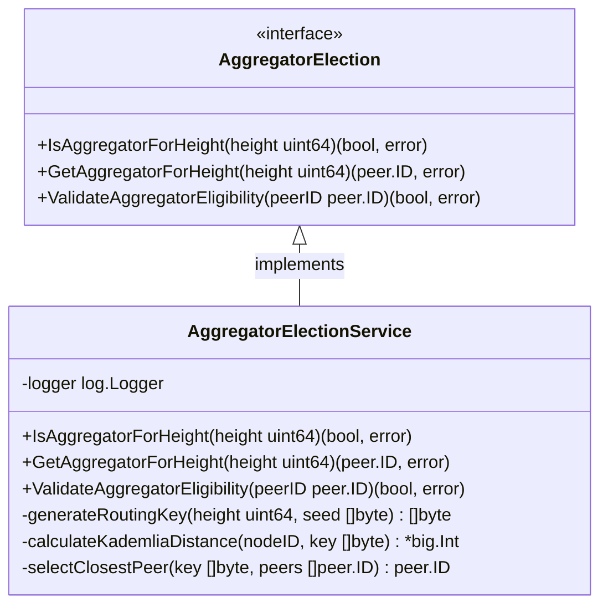

# 聚合节点选举器（Aggregator Election）

【模块定位】
　　本模块是WES PoW+XOR共识架构中确定性聚合节点选举的核心实现，负责基于Hash(height || SEED) + KademliaClosestPeer算法确定每个区块高度的唯一聚合节点。通过内容寻址机制实现分布式环境下的确定性角色选择，支撑PoW+XOR架构中"每高度唯一聚合者"的关键约束，确保全网共识的一致性和防分叉特性。

【设计原则】
- **确定性算法**：基于密码学哈希确保同一高度全网计算结果一致
- **内容寻址路由**：采用Kademlia距离计算实现分布式最近节点选择
- **每高度重选**：每个区块高度重新执行选举，动态分配聚合职责
- **无中心协调**：去中心化的选举算法，无需全网协调和投票
- **快速判断**：高效的距离计算和角色判断，支持实时选举需求

【核心职责】
1. **确定性选举算法**：执行Hash(height || SEED) + KademliaClosestPeer的标准选举流程
2. **聚合节点判断**：判断当前节点是否为指定高度的确定性聚合节点
3. **最近节点查找**：基于Kademlia距离算法查找指定高度的聚合节点
4. **节点资格验证**：验证节点是否具备成为聚合节点的基本条件
5. **选举结果缓存**：优化重复查询的性能，减少重复计算开销
6. **选举状态管理**：维护选举过程的状态和历史记录

【实现架构】

　　采用**密码学哈希 → 距离计算 → 最近节点选择**的3层确定性选举架构，确保选举结果的唯一性和可验证性。



**架构层次说明：**

1. **选举输入层**：提供选举算法所需的基础数据
   - 区块高度：作为选举的标识参数
   - 种子哈希：前一个已确定区块的哈希值，确保确定性
   - 网络节点：参与选举的候选聚合节点集合

2. **算法计算层**：执行确定性选举的核心算法
   - 路由键生成：基于高度和种子生成唯一路由标识
   - 距离计算：计算各节点到路由键的Kademlia距离
   - 最近节点选择：选择距离最近的节点作为聚合节点

3. **结果输出层**：提供选举结果和证明信息
   - 选举结果：当前节点是否为选定的聚合节点
   - 聚合节点ID：选定聚合节点的网络标识
   - 距离证明：选举过程的可验证性证明

---

## 🎯 **核心业务流程**

【流程概述】

　　此章节展现聚合节点选举中确定性选举算法的完整流程，体现ABS共识架构中每高度唯一聚合者的选举机制。

### **📊 核心业务流程图**



### **🔄 详细流程分析**

#### **阶段1: 确定性选举算法执行**

**📍 核心职责**: 基于密码学确定性算法选择指定高度的唯一聚合节点

**🔄 详细步骤**:

1. **路由键生成** (`HashFunc`)
   ```go
   // 关键代码示例
   func (s *AggregatorElectionService) generateRoutingKey(height uint64, seed []byte) []byte {
       // routing_key = Hash(height || SEED)
       data := append(heightToBytes(height), seed...)
       return sha256.Sum256(data)
   }
   ```
   - 将区块高度和种子哈希组合生成唯一标识
   - 确保同一高度下全网节点计算结果一致

2. **距离计算与选择** (`Kademlia算法`)
   ```go
   // Kademlia距离计算示例
   func (s *AggregatorElectionService) calculateClosestPeer(routingKey []byte, peers []peer.ID) peer.ID {
       // 计算各节点到路由键的XOR距离
       // 返回距离最近的节点
   }
   ```
   - 计算所有候选节点到路由键的Kademlia距离
   - 选择距离最小的节点作为聚合节点

**📤 输出**: 当前节点的聚合角色判断结果

#### **阶段2: 聚合节点查找流程**

**📍 核心职责**: 为区块转发场景提供确定的聚合节点标识

**🔄 详细步骤**:

1. **选举算法复用**: 执行相同的确定性选举算法
2. **节点信息获取**: 从网络服务获取选定节点的详细信息

**📤 输出**: 选定聚合节点的网络标识和连接信息

### **🔗 关键组件交互详情**

#### **1. 哈希函数** (`密码学确定性`)
```go
// 路由键生成接口
func generateRoutingKey(height uint64, seed []byte) []byte
```
- **确定性保证**: 相同输入始终产生相同输出
- **哈希算法**: 使用SHA-256确保安全性和分布性
- **全网一致**: 所有节点计算相同的路由键

#### **2. Kademlia距离计算** (`分布式路由`)
```go
// 距离计算核心逻辑
func calculateKademliaDistance(nodeID, routingKey []byte) *big.Int
```
- **XOR距离**: 基于节点ID和路由键的XOR运算
- **对数尺度**: 距离值按对数尺度分布
- **最近选择**: 确保选择真正的最近节点

### **⚡ 性能特征**

- **选举延迟**: ~1-10ms (本地计算为主)
- **缓存命中**: ~0.1-1ms (缓存查询)  
- **网络查询**: ~10-50ms (节点信息获取)
- **内存占用**: ~10-100KB (选举缓存)
- **并发支持**: 完全并发安全的算法实现

### **📋 设计原则总结**

基于以上流程分析，聚合节点选举器的核心业务流程体现了以下设计思想：

#### **1. 确定性算法** 🔐
- **密码学保证**: 基于哈希函数的不可操控性
- **全网一致**: 相同输入在所有节点上产生相同结果
- **无争议选举**: 避免分布式环境下的选举争议

#### **2. 高效计算** ⚡  
- **本地计算**: 选举过程主要为本地计算，延迟极低
- **结果缓存**: 避免同一高度的重复计算
- **并发友好**: 支持多高度并发选举请求

#### **3. 分布式友好** 🌐
- **无需协调**: 去中心化的选举过程
- **网络容错**: 对网络分区和节点故障有良好容错性
- **动态适应**: 能够适应网络拓扑的动态变化

　　聚合节点选举器通过确定性算法和高效计算，为ABS共识架构提供了可靠的聚合节点选择机制。

---

## 📁 **模块组织结构**

【内部模块架构】

```
election/
├── 📋 manager.go              # 聚合节点选举服务实现
└── 📄 README.md               # 本文档
```

### **🎯 子模块职责分工**

| **子模块** | **核心职责** | **对外接口** | **内部组件** | **复杂度** |
|-----------|-------------|-------------|-------------|-----------|
| `manager.go` | 选举算法实现 | AggregatorElection接口 | 哈希计算、距离选择、缓存管理 | 中 |

---

## 🔄 **统一确定性选举实现**

【实现策略】

　　所有选举方法均严格遵循**确定性哈希 + Kademlia距离**算法模式，确保选举结果的唯一性和全网一致性。



**关键实现要点：**

1. **确定性哈希生成**：
   - 使用SHA-256哈希算法确保安全性
   - 严格的输入格式：height || SEED
   - 全网一致的字节序和编码方式

2. **Kademlia距离计算**：
   - 标准的XOR距离计算方法
   - 高精度的距离比较算法
   - 处理距离相等的边界情况

3. **选举结果缓存**：
   - 基于高度的选举结果缓存
   - 合理的缓存过期和清理策略
   - 线程安全的缓存访问机制

---

## 🏗️ **依赖注入架构**

【fx框架集成】

　　全面采用fx依赖注入框架，实现选举器组件的自动化管理和依赖解析。

```go
// 示例：聚合节点选举器依赖注入配置
package election

import (
    "go.uber.org/fx"
    "github.com/weisyn/v1/internal/core/consensus/interfaces"
    "github.com/weisyn/v1/pkg/interfaces/infrastructure/log"
)

// NewAggregatorElectionService 创建聚合节点选举服务实例
func NewAggregatorElectionService(
    logger log.Logger,
) interfaces.AggregatorElection {
    return &AggregatorElectionService{
        logger: logger,
    }
}

// 编译时确保实现接口
var _ interfaces.AggregatorElection = (*AggregatorElectionService)(nil)
```

**依赖管理特点：**
- **轻量依赖**：只依赖日志服务，算法主要为纯函数
- **接口导向**：通过AggregatorElection接口提供服务
- **无状态设计**：选举算法无状态，便于测试和复用
- **并发安全**：支持多并发选举请求

---

## 📊 **性能与监控**

【性能指标】

| **操作类型** | **目标延迟** | **吞吐量目标** | **缓存命中率** | **监控方式** |
|-------------|-------------|---------------|----------------|------------|
| 角色判断 | < 10ms | > 1000 ops/s | > 80% | 实时监控 |
| 节点查找 | < 50ms | > 500 ops/s | > 70% | 批量统计 |
| 资格验证 | < 5ms | > 2000 ops/s | N/A | 关键路径监控 |
| 缓存查询 | < 1ms | > 10000 ops/s | > 90% | 高频监控 |

**性能优化策略：**
- **算法优化**：高效的哈希计算和距离比较算法
- **缓存策略**：智能的选举结果缓存机制
- **并发处理**：支持多高度并发选举
- **内存优化**：合理的缓存大小和过期策略

---

## 🔗 **与公共接口的映射关系**

【接口实现映射】



**实现要点：**
- **接口契约**：严格遵循AggregatorElection接口规范
- **错误处理**：完善的选举失败和异常情况处理
- **日志记录**：详细的选举过程和结果日志
- **测试覆盖**：完整的单元测试和选举场景测试

---

## 🚀 **后续扩展规划**

【模块演进方向】

1. **选举算法优化**
   - 支持加权Kademlia距离计算
   - 实现多因子聚合节点评估
   - 添加选举性能的动态优化

2. **容错机制增强**
   - 处理网络分区下的选举一致性
   - 实现选举冲突的解决机制
   - 添加选举结果的验证和纠错

3. **监控和分析**
   - 选举分布性的统计分析
   - 聚合节点负载均衡监控
   - 选举性能的实时指标收集

4. **安全性提升**
   - 防止选举操控的安全机制
   - 选举过程的密码学增强
   - 聚合节点身份的额外验证

---

## 📋 **开发指南**

【选举算法开发规范】

1. **新增选举方法步骤**：
   - 在AggregatorElection接口中定义新方法
   - 实现确定性的算法逻辑
   - 确保全网计算结果一致
   - 添加完整的单元和集成测试

2. **代码质量要求**：
   - 严格的算法正确性验证
   - 完善的边界情况处理
   - 详细的算法注释和文档
   - 性能和内存使用优化

3. **测试要求**：
   - 多节点选举一致性测试
   - 边界条件和异常情况测试
   - 性能和并发安全性测试
   - 选举分布性的统计验证

【参考文档】
- [WES ABS共识规范](../../../../docs/specs/consensus/POW_ABS_CONSENSUS_SPEC.md)
- [Kademlia距离算法文档](../../../../docs/architecture/kademlia.md)
- [WES架构设计文档](../../../../docs/architecture/README.md)

---

> 📝 **模块说明**：本聚合节点选举器模块严格遵循ABS共识架构的确定性选举要求，通过密码学哈希和Kademlia距离算法确保每高度唯一聚合者的可靠选举。

> 🔄 **维护指南**：本文档应随着选举算法的优化及时更新，确保文档与实现的一致性。建议在每次算法调整后验证选举结果的一致性和性能指标。
