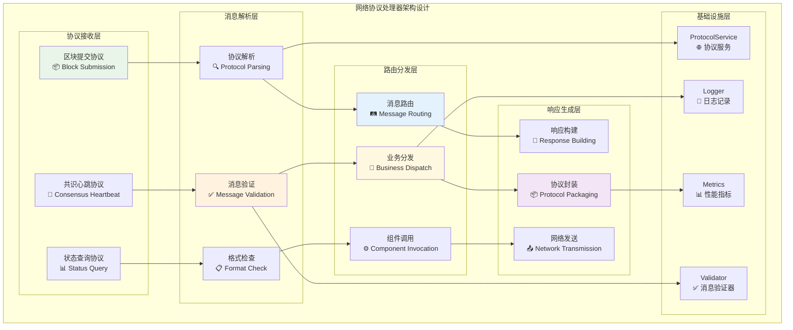
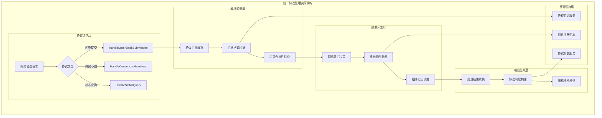

# 网络协议处理器（Network Protocol Handler）

【模块定位】
　　本模块是WES PoW+XOR共识架构中聚合器网络协议处理的核心实现，负责处理来自矿工和其他节点的网络消息。作为聚合器与网络层交互的统一入口，通过标准化的协议处理和消息路由机制，支撑内容寻址路由和聚合器按需激活的关键网络交互，确保PoW+XOR共识流程的网络通信可靠性。

【设计原则】
- **统一协议入口**：作为聚合器所有网络协议的统一处理入口
- **消息路由分发**：基于消息类型的智能路由和业务组件分发
- **协议标准化**：严格遵循WES网络协议规范和消息格式
- **异步处理机制**：高效的异步消息处理和响应机制
- **错误处理容错**：完善的网络异常和协议错误处理

【核心职责】
1. **矿工区块提交处理**：接收和处理矿工提交的候选区块消息
2. **共识心跳处理**：处理网络节点间的共识心跳和状态同步消息
3. **消息路由分发**：将网络消息路由到相应的业务处理组件
4. **协议验证确认**：验证网络消息的格式和协议合规性
5. **响应消息生成**：生成标准化的协议响应和确认消息
6. **网络状态监控**：监控网络连接状态和消息处理性能

【实现架构】

　　采用**协议解析 → 消息验证 → 路由分发 → 响应生成**的4层网络处理架构，确保网络协议处理的高效性和可靠性。



**架构层次说明：**

1. **协议接收层**：接收来自网络的各种协议消息
   - 区块提交协议：处理矿工提交的候选区块消息
   - 共识心跳协议：处理节点间的心跳和状态同步
   - 状态查询协议：处理聚合器状态的查询请求

2. **消息解析层**：解析和验证网络协议消息
   - 协议解析：解析网络消息的协议格式和内容
   - 消息验证：验证消息的合法性和完整性
   - 格式检查：检查消息格式的协议合规性

3. **路由分发层**：将消息路由到相应的业务组件
   - 消息路由：基于消息类型的智能路由决策
   - 业务分发：将消息分发到对应的业务处理组件
   - 组件调用：调用具体的业务组件处理方法

4. **响应生成层**：生成和发送协议响应消息
   - 响应构建：构建标准化的协议响应消息
   - 协议封装：按照协议规范封装响应数据
   - 网络发送：通过网络服务发送响应消息

---

## 🎯 **核心业务流程**

【流程概述】

　　此章节展现网络协议处理器中矿工区块提交和共识心跳处理的完整流程，体现ABS共识架构中网络消息处理的高效机制。

### **📊 核心业务流程图**

```mermaid
sequenceDiagram
    participant Miner as ⛏️ 矿工节点
    participant NetHandler as 🌐 网络处理器
    participant Parser as 🔍 协议解析器
    participant Validator as ✅ 消息验证器
    participant Router as 🛤️ 消息路由器
    participant Collector as 📥 候选收集器
    participant Logger as 📝 日志记录

    Note over Miner,Logger: 🎯 阶段1: 矿工区块提交处理流程
    Miner->>+NetHandler: HandleMinerBlockSubmission(blockData)
    NetHandler->>+Logger: 记录区块提交请求
    
    NetHandler->>+Parser: 解析区块提交协议
    Parser->>Parser: 解析protobuf消息格式
    Parser->>Parser: 提取区块数据和元信息
    Parser-->>-NetHandler: 返回解析结果
    
    NetHandler->>+Validator: 验证消息合法性
    Validator->>Validator: 检查消息格式和签名
    Validator->>Validator: 验证区块基础信息
    
    alt 验证通过
        Validator-->>-NetHandler: 验证成功
        
        NetHandler->>+Router: 路由到候选收集器
        Router->>+Collector: 提交候选区块
        Collector->>Collector: 执行聚合节点选举判断
        
        alt 是当前高度聚合节点
            Collector->>Collector: 添加到候选收集
            Collector-->>-Router: 收集成功
            Router-->>-NetHandler: 路由成功
            
            NetHandler->>NetHandler: 构建成功响应
            NetHandler-->>-Miner: 返回提交成功确认
        else 不是当前高度聚合节点
            Collector->>Collector: 转发给正确聚合节点
            Collector-->>-Router: 转发完成
            Router-->>-NetHandler: 路由完成
            
            NetHandler->>NetHandler: 构建转发响应
            NetHandler-->>-Miner: 返回转发确认
        end
        
    else 验证失败
        Validator-->>-NetHandler: 验证失败(原因)
        NetHandler->>+Logger: 记录验证失败
        Logger-->>-NetHandler: 日志记录完成
        NetHandler-->>-Miner: 返回验证错误
    end
    
    Note over Miner,Logger: 🔧 阶段2: 共识心跳处理流程
    Miner->>+NetHandler: HandleConsensusHeartbeat(heartbeatData)
    NetHandler->>+Parser: 解析心跳协议
    Parser-->>-NetHandler: 返回心跳信息
    
    NetHandler->>NetHandler: 更新节点状态信息
    NetHandler->>+Logger: 记录心跳处理
    Logger-->>-NetHandler: 日志记录完成
    NetHandler-->>-Miner: 返回心跳响应
```

### **🔄 详细流程分析**

#### **阶段1: 矿工区块提交处理流程**

**📍 核心职责**: 处理矿工提交的候选区块，执行聚合节点判断和路由

**🔄 详细步骤**:

1. **协议解析和验证** (`Parser & Validator`)
   ```go
   // 关键解析逻辑示例
   func (s *NetworkProtocolHandlerService) HandleMinerBlockSubmission(ctx context.Context, req *pb.MinerBlockSubmission) (*pb.AggregatorBlockAcceptance, error) {
       s.logger.Info("处理矿工区块提交")
       // 解析协议消息
       candidateBlock, err := s.parseBlockSubmission(req)
       if err != nil {
           return nil, err
       }
       // 验证消息合法性
       return s.routeToCollector(candidateBlock)
   }
   ```
   - 解析protobuf格式的区块提交消息
   - 验证消息格式、签名和区块基础信息

2. **聚合节点判断和路由** (`Router & Collector`)
   - 通过候选收集器执行聚合节点选举判断
   - 如果是聚合节点则收集候选，否则转发给正确节点

**📤 输出**: 区块提交确认或转发完成响应

#### **阶段2: 共识心跳处理流程**

**📍 核心职责**: 处理网络节点间的心跳消息，维护网络状态

**🔄 详细步骤**:

1. **心跳信息处理**: 解析心跳消息并更新节点状态信息
2. **响应生成**: 构建标准化的心跳响应消息

**📤 输出**: 心跳处理确认和节点状态更新

### **🔗 关键组件交互详情**

#### **1. 协议解析引擎** (`消息解析`)
```go
// 协议解析核心接口
type ProtocolParser interface {
    ParseBlockSubmission(req *pb.MinerBlockSubmission) (*types.CandidateBlock, error)
    ParseConsensusHeartbeat(req *pb.ConsensusHeartbeat) (*types.HeartbeatInfo, error)
}
```
- **消息解析**: 解析各种网络协议消息格式
- **数据提取**: 提取消息中的关键业务数据
- **格式转换**: 将网络消息转换为内部数据结构

#### **2. 消息路由器** (`智能路由`)
```go
// 消息路由核心逻辑
func (s *NetworkProtocolHandlerService) routeMessage(msgType string, data interface{}) error
```
- **路由决策**: 基于消息类型的智能路由决策
- **组件分发**: 将消息分发到相应的业务组件
- **响应协调**: 协调各组件的响应和结果汇总

### **⚡ 性能特征**

- **消息解析延迟**: ~0.5-2ms (protobuf解析和验证)
- **路由分发延迟**: ~1-5ms (路由决策和组件调用)  
- **响应生成延迟**: ~0.5-2ms (响应构建和发送)
- **并发处理能力**: ~1000-5000 msgs/s (取决于消息复杂度)
- **内存占用**: ~1-10MB (消息缓冲和处理状态)

### **📋 设计原则总结**

基于以上流程分析，网络协议处理器的核心业务流程体现了以下设计思想：

#### **1. 统一协议处理** 🌐
- **协议标准化**: 严格遵循WES网络协议规范
- **消息统一入口**: 作为聚合器所有网络消息的统一入口
- **格式一致性**: 确保所有协议消息的格式一致性

#### **2. 智能路由分发** 🛤️  
- **类型路由**: 基于消息类型的智能路由机制
- **业务分离**: 网络处理与业务逻辑的清晰分离
- **组件解耦**: 通过路由实现网络层与业务层的解耦

#### **3. 高效异步处理** ⚡
- **异步处理**: 高效的异步消息处理机制
- **并发友好**: 支持高并发的网络消息处理
- **错误容错**: 完善的网络异常和协议错误处理

　　网络协议处理器通过统一的协议处理和智能路由机制，为ABS共识架构提供了高效可靠的网络通信支撑能力。

---

## 📁 **模块组织结构**

【内部模块架构】

```
network_handler/
├── 📋 manager.go                   # 网络协议处理器主实现（薄委托层）
├── 📦 handle_block_submission.go   # HandleMinerBlockSubmission 方法实现
├── 💓 handle_consensus_heartbeat.go # HandleConsensusHeartbeat 方法实现
├── 📊 handle_status_query.go       # HandleStatusQuery 方法实现
├── 🔍 protocol_parser.go           # 协议消息解析逻辑
├── ✅ message_validator.go         # 消息验证和格式检查
├── 🛤️ message_router.go            # 消息路由和业务分发
├── 📤 response_generator.go        # 协议响应生成逻辑
└── 📄 README.md                    # 本文档
```

### **🎯 子模块职责分工**

| **子模块** | **核心职责** | **设计要点** | **业务复杂度** | **实现模式** |
|-----------|-------------|-------------|-------------|-------------|
| `manager.go` | 主处理器薄实现 | 接口定义、依赖注入、委托调用 | 低 | fx构造函数+接口委托 |
| `handle_block_submission.go` | 区块提交处理 | 协议解析、验证路由、响应生成 | 高 | 协议处理+业务路由 |
| `handle_consensus_heartbeat.go` | 心跳消息处理 | 心跳解析、状态更新、响应构建 | 中 | 消息处理+状态管理 |
| `handle_status_query.go` | 状态查询处理 | 查询解析、信息收集、响应构建 | 中 | 查询处理+信息汇总 |
| `protocol_parser.go` | 协议解析核心 | 消息解析、格式转换、数据提取 | 中 | 解析算法+格式转换 |
| `message_validator.go` | 消息验证逻辑 | 格式验证、签名检查、合法性验证 | 中 | 验证算法+安全检查 |
| `message_router.go` | 消息路由核心 | 路由决策、组件分发、调用协调 | 高 | 路由算法+组件协调 |
| `response_generator.go` | 响应生成逻辑 | 响应构建、协议封装、网络发送 | 中 | 响应构建+协议封装 |

### **🏗️ 设计文件结构说明**

**协议处理流水线设计**：
- `manager.go` 作为薄委托层，协调网络协议处理流程
- `handle_*.go` 文件负责具体协议的业务处理逻辑
- `protocol_parser.go` → `message_validator.go` → `message_router.go` → `response_generator.go` 构成处理流水线

**协议与业务分离**：
- 协议解析和验证独立于具体业务逻辑
- 消息路由作为中间层，连接协议层和业务层
- 响应生成统一处理各种协议响应的格式化

---

## 🔄 **统一协议处理实现**

【实现策略】

　　所有协议处理方法均严格遵循**解析 → 验证 → 路由 → 响应**架构模式，确保协议处理的一致性和可靠性。



**关键实现要点：**

1. **协议标准化处理**：
   - 统一的protobuf消息解析和验证机制
   - 标准化的协议错误处理和响应格式
   - 一致的消息日志记录和性能监控

2. **智能消息路由**：
   - 基于消息类型的高效路由决策算法
   - 灵活的业务组件注册和发现机制
   - 支持动态路由规则配置和调整

3. **异步响应处理**：
   - 高效的异步消息处理和响应生成
   - 支持批量消息处理和响应优化
   - 完善的超时处理和错误恢复机制

---

## 🏗️ **依赖注入架构**

【fx框架集成】

　　全面采用fx依赖注入框架，实现网络协议处理器的组件化管理和服务集成。

```go
// 示例：网络协议处理器依赖注入配置
package network_handler

import (
    "go.uber.org/fx"
    "github.com/weisyn/v1/internal/core/consensus/interfaces"
    "github.com/weisyn/v1/pkg/interfaces/infrastructure/log"
)

// NewNetworkProtocolHandlerService 创建网络协议处理器服务实例
func NewNetworkProtocolHandlerService(
    logger log.Logger,
) interfaces.NetworkProtocolHandler {
    return &NetworkProtocolHandlerService{
        logger: logger,
    }
}

// 编译时确保实现接口
var _ interfaces.NetworkProtocolHandler = (*NetworkProtocolHandlerService)(nil)
```

**依赖管理特点：**
- **轻量化依赖**：最小化的外部依赖，专注于协议处理
- **接口导向**：通过NetworkProtocolHandler接口提供服务
- **组件集成**：与其他聚合器组件的松耦合集成
- **服务发现**：支持业务组件的动态发现和路由

---

## 📊 **性能与监控**

【性能指标】

| **操作类型** | **目标延迟** | **吞吐量目标** | **成功率要求** | **监控方式** |
|-------------|-------------|---------------|----------------|------------|
| 区块提交处理 | < 10ms | > 1000 msgs/s | > 99.9% | 实时监控 |
| 心跳消息处理 | < 5ms | > 2000 msgs/s | > 99.9% | 高频监控 |
| 状态查询处理 | < 2ms | > 5000 msgs/s | > 99.9% | 批量统计 |
| 协议解析验证 | < 2ms | > 10000 msgs/s | > 99.9% | 关键路径监控 |

**性能优化策略：**
- **协议解析优化**：高效的protobuf解析和缓存机制
- **异步处理优化**：优化的异步消息处理和并发控制
- **路由算法优化**：高效的消息路由决策和组件查找
- **响应生成优化**：批量响应生成和网络发送优化

---

## 🔗 **与公共接口的映射关系**

【接口实现映射】

```mermaid
classDiagram
    class NetworkProtocolHandler {
        <<interface>>
        +HandleMinerBlockSubmission(ctx context.Context, req *MinerBlockSubmission) (*BlockAcceptance, error)
        +HandleConsensusHeartbeat(ctx context.Context, req *ConsensusHeartbeat) (*HeartbeatResponse, error)
        +HandleStatusQuery(ctx context.Context, req *StatusQuery) (*StatusResponse, error)
    }
    
    class NetworkProtocolHandlerService {
        -logger log.Logger
        -protocolParser *ProtocolParser
        -messageValidator *MessageValidator
        -messageRouter *MessageRouter
        -responseGenerator *ResponseGenerator
        +HandleMinerBlockSubmission(ctx context.Context, req *MinerBlockSubmission) (*BlockAcceptance, error)
        +HandleConsensusHeartbeat(ctx context.Context, req *ConsensusHeartbeat) (*HeartbeatResponse, error)
        +HandleStatusQuery(ctx context.Context, req *StatusQuery) (*StatusResponse, error)
        -parseAndValidateMessage(msg interface{}) (interface{}, error)
        -routeToBusinessComponent(msgType string, data interface{}) (interface{}, error)
    }
    
    NetworkProtocolHandler <|-- NetworkProtocolHandlerService : implements
```

**实现要点：**
- **接口契约**：严格遵循NetworkProtocolHandler接口规范
- **协议兼容性**：确保与WES网络协议的完全兼容
- **处理可靠性**：保证网络消息处理的可靠性和一致性
- **性能保证**：满足高频网络消息处理的性能要求

---

## 🚀 **后续扩展规划**

【模块演进方向】

1. **协议功能扩展**
   - 支持更多类型的网络协议和消息格式
   - 实现协议版本兼容和动态升级机制
   - 添加协议消息的压缩和优化处理

2. **处理性能优化**
   - 优化高并发场景下的消息处理性能
   - 实现更高效的协议解析和验证算法
   - 添加消息处理的批量优化和缓存机制

3. **路由机制增强**
   - 实现更智能的消息路由和负载均衡
   - 支持动态路由规则配置和热更新
   - 添加路由性能的监控和自动调优

4. **监控和分析**
   - 网络协议处理性能的实时监控和分析
   - 消息处理异常和错误的统计分析
   - 协议兼容性和版本使用的监控报告

---

## 📋 **开发指南**

【网络协议处理器开发规范】

1. **新增协议处理步骤**：
   - 在NetworkProtocolHandler接口中定义新方法
   - 创建对应的协议处理实现文件
   - 更新协议解析器和消息路由器
   - 添加完整的协议处理测试用例

2. **代码质量要求**：
   - 严格的协议兼容性验证和测试
   - 完善的网络异常和错误处理机制
   - 详细的协议处理注释和文档说明
   - 网络消息处理的性能优化分析

3. **测试要求**：
   - 各种网络协议消息的完整性测试
   - 高并发网络消息处理的压力测试
   - 网络异常和协议错误的鲁棒性测试
   - 协议兼容性和版本兼容的验证测试

【参考文档】
- [WES网络协议规范](../../../../docs/specs/network/protocol_spec.md)
- [Protobuf消息定义文档](../../../../pb/network/README.md)
- [WES架构设计文档](../../../../docs/architecture/README.md)

---

> 📝 **模块说明**：本网络协议处理器模块是ABS共识架构的网络入口，通过统一的协议处理和智能消息路由，确保聚合器与网络层的高效可靠交互。

> 🔄 **维护指南**：本文档应随着网络协议的扩展及时更新，确保文档与实现的一致性。建议在每次协议变更后验证协议兼容性和处理性能。
