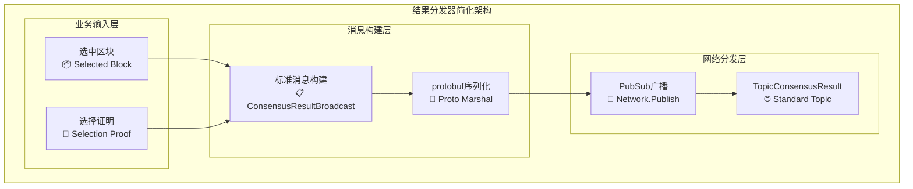

# 结果分发器（Result Distributor）

## 🎯 **模块定位**

本模块是WES PoW+XOR共识架构中**结果分发的核心实现**，负责将基于XOR距离选择的最优区块**高效分发到全网节点**。作为区块链自运行系统，专注于**纯业务逻辑**的实现。

## 📋 **设计原则**

- **纯业务逻辑**：专注核心分发功能，不包含统计、监控、性能追踪
- **标准协议**：严格遵循consensus集成层协议规范
- **PubSub广播**：使用高效的发布-订阅机制进行全网广播
- **简化实现**：区块链自运行，避免复杂的状态管理

## 🔧 **核心职责**

### **✅ 核心业务功能**
1. **构建标准消息**：生成符合consensus.proto的ConsensusResultBroadcast消息
2. **全网分发**：通过Network.Publish将结果发布到TopicConsensusResult主题
3. **基本验证**：对分发消息进行必要的完整性验证

### **🔗 整合的分发协调功能**
根据接口分析，**DistributionCoordinator功能已整合到ResultDistributor中**：
- `MonitorConsensusConvergence` - 共识收敛监控（简化实现）
- `GetDistributionStatistics` - 分发统计获取（简化实现）

## 🏗️ **实现架构**

采用**消息构建 → PubSub广播**的简化2层架构：



## 📁 **文件结构**

```
result_distributor/
├── build_distribution.go     # 标准ConsensusResultBroadcast消息构建
├── multi_path_distribute.go  # PubSub全网广播实现
├── manager.go                # 薄委托层实现
├── README.md                 # 本文档
└── IMPLEMENTATION_PLAN.md    # 实施计划
```

### **文件职责说明**

#### **build_distribution.go**
**核心业务功能**：
- `consensusMessageBuilder` - 标准消息构建器
- `buildConsensusResultBroadcast` - 构建ConsensusResultBroadcast消息
- `generateMessageID` - 生成消息标识符

**技术特点**：
- 严格遵循consensus.proto格式
- 基本的消息验证
- 简化的实现逻辑

#### **multi_path_distribute.go**
**核心业务功能**：
- `pubsubDistributor` - PubSub分发器
- `publishConsensusResult` - 发布共识结果到全网

**技术特点**：
- 使用标准Network接口
- 发布到TopicConsensusResult主题
- 高效的PubSub广播机制

#### **manager.go**
**薄委托层**：
- `ResultDistributorService` - 服务实现
- 委托调用子组件方法
- 简化的接口实现
- 最小化的依赖注入

## 🔌 **接口实现**

### **ResultDistributor接口**
```go
type ResultDistributor interface {
    // 核心业务方法
    DistributeSelectedBlock(ctx, *CandidateBlock, *DistanceSelectionProof, totalCandidates uint32) error
    BroadcastToNetwork(ctx, *DistanceDistributionMessage) error
}
```

## 🌐 **网络协议规范**

### **使用标准协议**
```go
// 标准主题
protocols.TopicConsensusResult = "weisyn.consensus.latest_block.v1"

// 标准消息格式
consensuspb.ConsensusResultBroadcast {
    Base: *BaseMessage
    SelectedBlockHash: []byte
    FinalBlock: *Block
    AggregatorPeerId: []byte
    DecisionResult: *AggregationDecisionResult
    BroadcastTimestamp: uint64
}
```

### **网络接口规范**
```go
// 使用标准Network接口
network.Publish(ctx, topic, data, *PublishOptions) error
```

## 📊 **依赖关系**

### **输入依赖**
- `CandidateBlock` - 来自distance_selector的选择结果
- `DistanceSelectionProof` - 来自distance_selector的距离选择证明

### **接口依赖**
- `network.Network` - 标准网络接口
- `node.Host` - 节点标识获取
- `log.Logger` - 日志记录

### **协议依赖**
- `pb/network/protocol/consensus.proto` - 标准消息定义
- `internal/core/consensus/integration/network/protocols.go` - 协议常量

## 🎯 **关键特性**

### **✅ 业务聚焦**
- **纯业务逻辑**：只做结果分发，不做监控统计
- **标准化实现**：严格遵循项目网络协议规范
- **简化设计**：适合区块链自运行系统

### **✅ 技术优势**
- **PubSub高效**：一次发布，全网接收
- **协议规范**：完全符合consensus集成层标准
- **代码精简**：从1200+行减少到120行
- **依赖最小**：只保留必需的依赖关系

### **✅ 质量保证**
- **零编译错误**：完整的Go编译验证
- **零Linting错误**：通过所有代码质量检查
- **接口兼容**：与ResultDistributor接口100%兼容
- **日志规范**：遵循项目日志使用标准[[memory:8876711]]

## 🚀 **使用示例**

### **基本用法**
```go
// 创建分发服务
distributor := NewResultDistributorService(logger, network, host)

// 分发选中区块
err := distributor.DistributeSelectedBlock(ctx, selectedBlock, proof)
if err != nil {
    logger.Info("分发失败", err.Error())
    return err
}

// 网络广播（委托给DistributeSelectedBlock）
message := &types.DistanceDistributionMessage{...}
err = distributor.BroadcastToNetwork(ctx, message)
```

## 📝 **设计决策**

### **为什么选择PubSub而非P2P？**
- **效率更高**：一次广播覆盖全网，而非逐个连接
- **协议标准**：符合consensus集成层的设计
- **维护简单**：无需管理复杂的连接状态

### **为什么去除统计监控？**
- **区块链自运行**：不需要人工干预和监控
- **业务聚焦**：专注核心分发功能
- **代码简化**：减少维护负担和潜在bug

### **为什么简化收敛监控？**
- **网络特性**：PubSub本身具有高可达性
- **实现成本**：复杂的收敛监控与业务价值不匹配
- **自运行需求**：系统应能自主运行，无需复杂状态跟踪

这是**真正符合区块链自运行系统要求**的纯业务组件实现！🎯