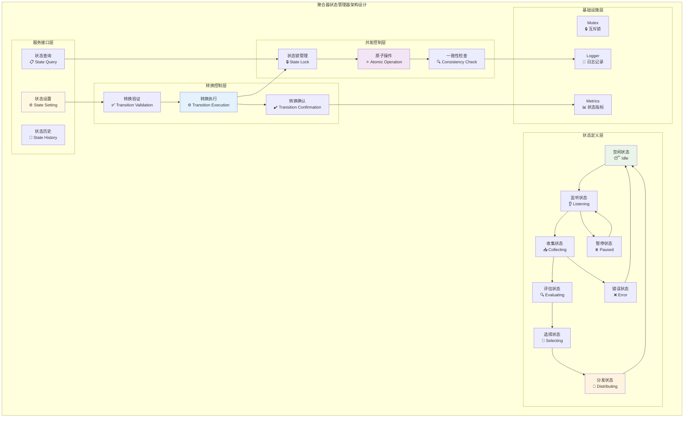
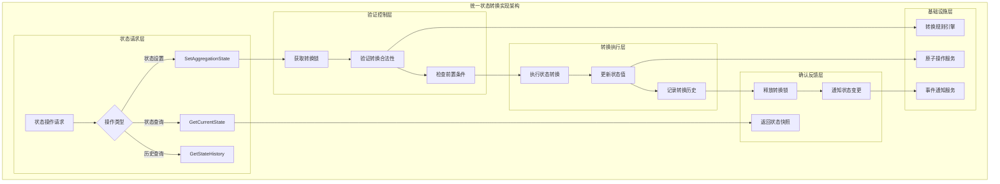
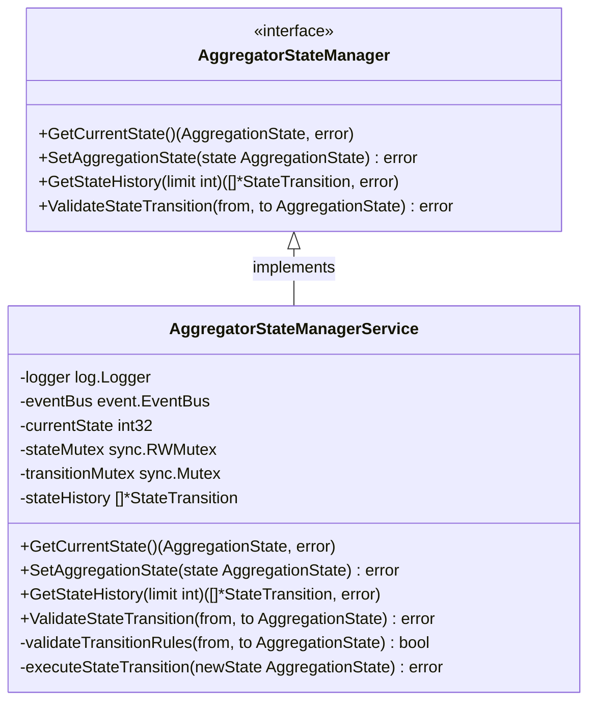

# 聚合器状态管理器（Aggregator State Manager）

【模块定位】
　　本模块是WES ABS共识架构中聚合器状态机的核心实现，负责管理聚合器在ABS共识流程中的8个核心状态转换。作为聚合器内部协调的中枢组件，通过严格的状态转换控制和一致性验证，确保聚合器各个业务组件的有序协作，支撑ABS架构中"按需激活，任务完成即结束"的生命周期模式。

【设计原则】
- **严格状态机控制**：基于有限状态机的严格状态转换管理
- **并发安全保证**：线程安全的状态访问和修改机制
- **状态一致性验证**：确保状态转换的合法性和业务逻辑一致性
- **转换原子性**：状态转换操作的原子性和事务性保证
- **异常状态处理**：完善的异常状态检测和恢复机制

【核心职责】
1. **状态机管理**：维护聚合器的8个核心状态和转换规则
2. **状态转换控制**：执行合法的状态转换并验证转换条件
3. **状态查询服务**：提供当前状态和历史状态的查询接口
4. **状态一致性验证**：确保状态转换符合ABS业务逻辑
5. **并发访问控制**：保证多并发场景下状态操作的线程安全
6. **异常状态恢复**：处理状态异常和不一致情况的恢复

【实现架构】

　　采用**有限状态机 + 并发控制 + 一致性验证**的3层状态管理架构，确保状态转换的安全性和可靠性。



**架构层次说明：**

1. **状态定义层**：定义聚合器的8个核心状态
   - Idle：聚合器空闲状态，等待聚合任务触发
   - Listening：监听新区块高度信号，准备开始收集
   - Collecting：收集候选区块的活跃状态
   - Evaluating：评估和评分候选区块的计算状态
   - Selecting：选择最优候选区块的决策状态
   - Distributing：分发共识结果的广播状态
   - Paused：暂停状态，用于异常情况的临时停止
   - Error：错误状态，处理异常和错误恢复

2. **转换控制层**：管理状态转换的控制逻辑
   - 转换验证：验证状态转换的合法性和前置条件
   - 转换执行：执行状态转换并更新相关状态信息
   - 转换确认：确认状态转换完成并通知相关组件

3. **并发控制层**：保证状态操作的线程安全
   - 状态锁管理：管理状态访问的互斥锁机制
   - 原子操作：确保状态转换的原子性执行
   - 一致性检查：验证状态的一致性和完整性

---

## 🎯 **核心业务流程**

【流程概述】

　　此章节展现聚合器状态管理器中状态转换控制和并发安全管理的完整流程，体现ABS共识架构中严格的状态机管理机制。

### **📊 核心业务流程图**

```mermaid
sequenceDiagram
    participant Client as 🎯 调用方
    participant StateMgr as 🗂️ 状态管理器
    participant Validator as ✅ 转换验证器
    parameter Lock as 🔒 状态锁
    participant Executor as ⚙️ 转换执行器
    participant Logger as 📝 日志记录
    participant Metrics as 📊 状态指标

    Note over Client,Metrics: 🎯 阶段1: 状态转换请求与验证
    Client->>+StateMgr: SetAggregationState(newState)
    StateMgr->>+Logger: 记录状态转换请求
    
    StateMgr->>+Lock: 获取状态锁
    Lock-->>-StateMgr: 锁获取成功
    
    StateMgr->>StateMgr: 获取当前状态
    StateMgr->>+Validator: 验证状态转换合法性
    Validator->>Validator: 检查转换规则
    Validator->>Validator: 验证前置条件
    
    alt 转换验证通过
        Validator-->>-StateMgr: 验证成功
        
        StateMgr->>+Executor: 执行状态转换
        Executor->>Executor: 更新状态值
        Executor->>Executor: 记录转换时间
        Executor->>+Metrics: 更新状态指标
        Metrics-->>-Executor: 指标更新完成
        Executor-->>-StateMgr: 转换执行成功
        
        StateMgr->>+Logger: 记录状态转换完成
        Logger-->>-StateMgr: 日志记录完成
        
        StateMgr->>Lock: 释放状态锁
        StateMgr-->>-Client: 返回转换成功
        
    else 转换验证失败
        Validator-->>-StateMgr: 验证失败(原因)
        StateMgr->>+Logger: 记录转换失败
        Logger-->>-StateMgr: 日志记录完成
        StateMgr->>Lock: 释放状态锁
        StateMgr-->>-Client: 返回转换失败
    end
    
    Note over Client,Metrics: 🔧 阶段2: 状态查询与一致性检查
    Client->>+StateMgr: GetCurrentState()
    StateMgr->>+Lock: 获取读锁
    Lock-->>-StateMgr: 读锁获取成功
    
    StateMgr->>StateMgr: 读取当前状态
    StateMgr->>StateMgr: 执行一致性检查
    
    StateMgr->>Lock: 释放读锁
    StateMgr-->>-Client: 返回当前状态
```

### **🔄 详细流程分析**

#### **阶段1: 状态转换请求与验证**

**📍 核心职责**: 处理状态转换请求并执行严格的验证和转换控制

**🔄 详细步骤**:

1. **转换合法性验证** (`Validator`)
   ```go
   // 关键验证逻辑示例
   func (s *AggregatorStateManagerService) validateTransition(from, to types.AggregationState) error {
       // 检查转换规则表
       if !s.transitionRules[from][to] {
           return errors.New("illegal state transition")
       }
       // 验证业务前置条件
       return s.validateBusinessConditions(from, to)
   }
   ```
   - 基于状态转换规则表验证转换的合法性
   - 检查业务逻辑的前置条件和约束

2. **原子状态转换执行** (`Executor`)
   ```go
   // 原子状态转换核心逻辑
   func (s *AggregatorStateManagerService) executeTransition(newState types.AggregationState) error {
       // 原子更新状态
       atomic.StoreInt32(&s.currentState, int32(newState))
       // 记录转换时间
       s.lastTransitionTime = time.Now()
       // 更新状态历史
       s.stateHistory = append(s.stateHistory, StateTransition{
           From: s.previousState,
           To: newState,
           Timestamp: s.lastTransitionTime,
       })
       return nil
   }
   ```
   - 使用原子操作确保状态更新的线程安全
   - 维护状态转换的完整历史记录

**📤 输出**: 状态转换成功确认或失败原因

#### **阶段2: 状态查询与一致性检查**

**📍 核心职责**: 提供线程安全的状态查询和一致性验证

**🔄 详细步骤**:

1. **并发安全查询**: 使用读写锁机制确保查询的线程安全
2. **一致性检查**: 验证状态的内部一致性和完整性

**📤 输出**: 当前状态信息和一致性验证结果

### **🔗 关键组件交互详情**

#### **1. 状态转换验证器** (`合法性保证`)
```go
// 转换规则核心定义
var transitionRules = map[types.AggregationState]map[types.AggregationState]bool{
    types.AggregationStateIdle: {
        types.AggregationStateListening: true,
    },
    types.AggregationStateListening: {
        types.AggregationStateCollecting: true,
        types.AggregationStatePaused: true,
    },
    // ... 其他转换规则
}
```
- **转换规则表**: 定义所有合法的状态转换路径
- **前置条件验证**: 检查状态转换的业务前置条件
- **约束条件检查**: 验证状态转换的约束和限制

#### **2. 并发控制管理器** (`线程安全`)
```go
// 并发控制核心机制
type StateManager struct {
    currentState    int32  // 原子操作的当前状态
    stateMutex      sync.RWMutex  // 读写锁
    transitionMutex sync.Mutex    // 转换操作锁
}
```
- **读写锁**: 支持多读单写的高效并发访问
- **原子操作**: 状态值的原子性读取和更新
- **转换锁**: 确保状态转换操作的原子性

### **⚡ 性能特征**

- **状态查询延迟**: ~0.1-1ms (原子读取和锁操作)
- **状态转换延迟**: ~1-5ms (验证和转换执行)  
- **并发读取吞吐**: ~10000+ ops/s (读写锁优化)
- **内存占用**: ~1-10KB (状态历史和元数据)
- **锁竞争延迟**: ~0.1-10ms (取决于并发程度)

### **📋 设计原则总结**

基于以上流程分析，聚合器状态管理器的核心业务流程体现了以下设计思想：

#### **1. 严格状态机控制** 🗂️
- **有限状态机**: 基于严格定义的8状态有限状态机
- **转换规则表**: 明确的状态转换规则和路径定义
- **合法性验证**: 严格的状态转换合法性检查机制

#### **2. 并发安全保证** 🔒  
- **读写锁机制**: 支持高并发读取和安全的状态修改
- **原子操作**: 状态值的原子性访问和更新
- **死锁预防**: 合理的锁获取顺序和超时机制

#### **3. 一致性验证** ✅
- **状态一致性**: 确保状态转换的逻辑一致性
- **历史记录**: 完整的状态转换历史追踪
- **异常检测**: 状态异常和不一致情况的检测恢复

　　聚合器状态管理器通过严格的状态机控制和并发安全机制，为ABS共识架构提供了可靠的状态协调和管理能力。

---

## 📁 **模块组织结构**

【内部模块架构】

```
state_manager/
├── 📋 manager.go                # 状态管理器主实现（薄委托层）
├── 🗂️ get_current_state.go      # GetCurrentState 方法实现
├── ⚙️ set_aggregation_state.go  # SetAggregationState 方法实现
├── 📜 get_state_history.go      # GetStateHistory 方法实现
├── 🔄 state_transition.go       # 状态转换核心逻辑
├── ✅ state_validation.go       # 状态转换验证逻辑
├── 🔒 concurrency_control.go    # 并发控制和锁管理
├── 🔍 consistency_checker.go    # 状态一致性检查逻辑
└── 📄 README.md                 # 本文档
```

### **🎯 子模块职责分工**

| **子模块** | **核心职责** | **设计要点** | **业务复杂度** | **实现模式** |
|-----------|-------------|-------------|-------------|-------------|
| `manager.go` | 主状态管理薄实现 | 接口定义、依赖注入、委托调用 | 低 | fx构造函数+接口委托 |
| `get_current_state.go` | 当前状态查询 | 原子读取、并发安全、状态快照 | 低 | 原子操作+读锁 |
| `set_aggregation_state.go` | 状态设置控制 | 转换协调、验证执行、确认反馈 | 高 | 验证控制+转换执行 |
| `get_state_history.go` | 状态历史查询 | 历史记录、时间范围、状态统计 | 中 | 历史管理+查询过滤 |
| `state_transition.go` | 状态转换核心 | 转换执行、原子操作、历史记录 | 中 | 状态机+原子操作 |
| `state_validation.go` | 转换验证逻辑 | 规则验证、条件检查、业务约束 | 高 | 规则引擎+条件验证 |
| `concurrency_control.go` | 并发控制管理 | 锁管理、原子操作、死锁预防 | 中 | 锁机制+并发控制 |
| `consistency_checker.go` | 一致性检查 | 状态验证、完整性检查、异常检测 | 中 | 一致性算法+检查机制 |

### **🏗️ 设计文件结构说明**

**状态机核心设计**：
- `manager.go` 作为薄委托层，协调状态机的各个组件
- `state_transition.go` + `state_validation.go` 构成状态机的核心转换逻辑
- `concurrency_control.go` 提供横切的并发安全保证

**查询与控制分离**：
- `get_current_state.go`、`get_state_history.go` 专注于查询操作
- `set_aggregation_state.go` 专注于状态控制操作
- 读写分离设计，便于性能优化和并发控制

---

## 🔄 **统一状态转换实现**

【实现策略】

　　所有状态操作均严格遵循**验证 → 转换 → 确认**架构模式，确保状态转换的安全性和一致性。



**关键实现要点：**

1. **严格验证机制**：
   - 基于转换规则表的合法性验证
   - 业务前置条件和约束的完整检查
   - 状态一致性和完整性的验证保证

2. **并发安全控制**：
   - 读写锁支持的高并发访问模式
   - 原子操作确保的状态值安全更新
   - 锁获取顺序和超时的死锁预防机制

3. **转换原子性**：
   - 状态转换操作的原子性执行保证
   - 转换失败的完整回滚和恢复机制
   - 状态历史记录的事务性一致性

---

## 🏗️ **依赖注入架构**

【fx框架集成】

　　全面采用fx依赖注入框架，实现状态管理器的组件化管理和生命周期自动控制。

```go
// 示例：状态管理器依赖注入配置
package state_manager

import (
    "go.uber.org/fx"
    "github.com/weisyn/v1/internal/core/consensus/interfaces"
    "github.com/weisyn/v1/pkg/interfaces/infrastructure/log"
    "github.com/weisyn/v1/pkg/interfaces/infrastructure/event"
)

// NewAggregatorStateManagerService 创建状态管理器服务实例
func NewAggregatorStateManagerService(
    logger log.Logger,
    eventBus event.EventBus,
) interfaces.AggregatorStateManager {
    return &AggregatorStateManagerService{
        logger:       logger,
        eventBus:     eventBus,
        currentState: int32(types.AggregationStateIdle),
    }
}

// 编译时确保实现接口
var _ interfaces.AggregatorStateManager = (*AggregatorStateManagerService)(nil)
```

**依赖管理特点：**
- **事件总线集成**：通过事件总线通知状态变更
- **接口导向**：通过AggregatorStateManager接口提供服务
- **状态初始化**：确保状态管理器以正确的初始状态启动
- **生命周期管理**：支持状态管理器的完整生命周期管理

---

## 📊 **性能与监控**

【性能指标】

| **操作类型** | **目标延迟** | **吞吐量目标** | **并发安全性** | **监控方式** |
|-------------|-------------|---------------|----------------|------------|
| 状态查询操作 | < 1ms | > 10000 ops/s | 多读并发 | 高频监控 |
| 状态转换操作 | < 5ms | > 2000 ops/s | 排他写入 | 实时监控 |
| 历史查询操作 | < 10ms | > 1000 ops/s | 多读并发 | 批量统计 |
| 一致性检查 | < 2ms | > 5000 ops/s | 读操作 | 定期检查 |

**性能优化策略：**
- **读写锁优化**：优化读写锁的获取和释放性能
- **原子操作优化**：使用高效的原子操作减少锁竞争
- **状态缓存**：合理的状态信息缓存和快照机制
- **历史管理优化**：高效的状态历史存储和查询机制

---

## 🔗 **与公共接口的映射关系**

【接口实现映射】



**实现要点：**
- **接口契约**：严格遵循AggregatorStateManager接口规范
- **状态安全性**：确保所有状态操作的线程安全性
- **转换正确性**：保证状态转换的逻辑正确性和一致性
- **性能保证**：满足高频状态访问的性能要求

---

## 🚀 **后续扩展规划**

【模块演进方向】

1. **状态机功能增强**
   - 支持更复杂的状态转换条件和规则
   - 实现状态机的可视化监控和调试
   - 添加状态转换的性能分析和优化

2. **并发性能优化**
   - 优化高并发场景下的锁竞争和性能
   - 实现无锁或细粒度锁的状态访问机制
   - 添加状态操作的批量处理和优化

3. **状态持久化**
   - 实现状态信息的持久化存储和恢复
   - 支持状态管理器的快照和备份机制
   - 添加状态历史的长期存储和分析

4. **监控和分析增强**
   - 状态转换模式的统计分析和监控
   - 状态管理性能的实时监控和告警
   - 状态异常和不一致情况的自动检测

---

## 📋 **开发指南**

【状态管理器开发规范】

1. **新增状态转换规则步骤**：
   - 在状态定义中添加新的状态类型
   - 更新状态转换规则表和验证逻辑
   - 添加新状态的业务逻辑和处理代码
   - 完善状态转换的测试用例和验证

2. **代码质量要求**：
   - 严格的并发安全性验证和测试
   - 完善的状态转换逻辑验证和边界处理
   - 详细的状态机注释和转换规则说明
   - 状态一致性和性能的综合测试

3. **测试要求**：
   - 各种状态转换场景的完整性测试
   - 高并发状态访问的压力和安全测试
   - 状态异常和恢复机制的鲁棒性测试
   - 状态转换性能和锁竞争的基准测试

【参考文档】
- [WES ABS共识规范](../../../../docs/specs/consensus/POW_ABS_CONSENSUS_SPEC.md)
- [聚合器状态机设计文档](../../../../docs/architecture/aggregator_state_machine.md)
- [WES架构设计文档](../../../../docs/architecture/README.md)

---

> 📝 **模块说明**：本聚合器状态管理器模块是ABS共识架构的协调中枢，通过严格的状态机控制和并发安全机制，确保聚合器各组件的有序协作和状态一致性。

> 🔄 **维护指南**：本文档应随着状态机逻辑的优化及时更新，确保文档与实现的一致性。建议在每次状态转换规则调整后进行完整的状态转换和并发安全测试。
