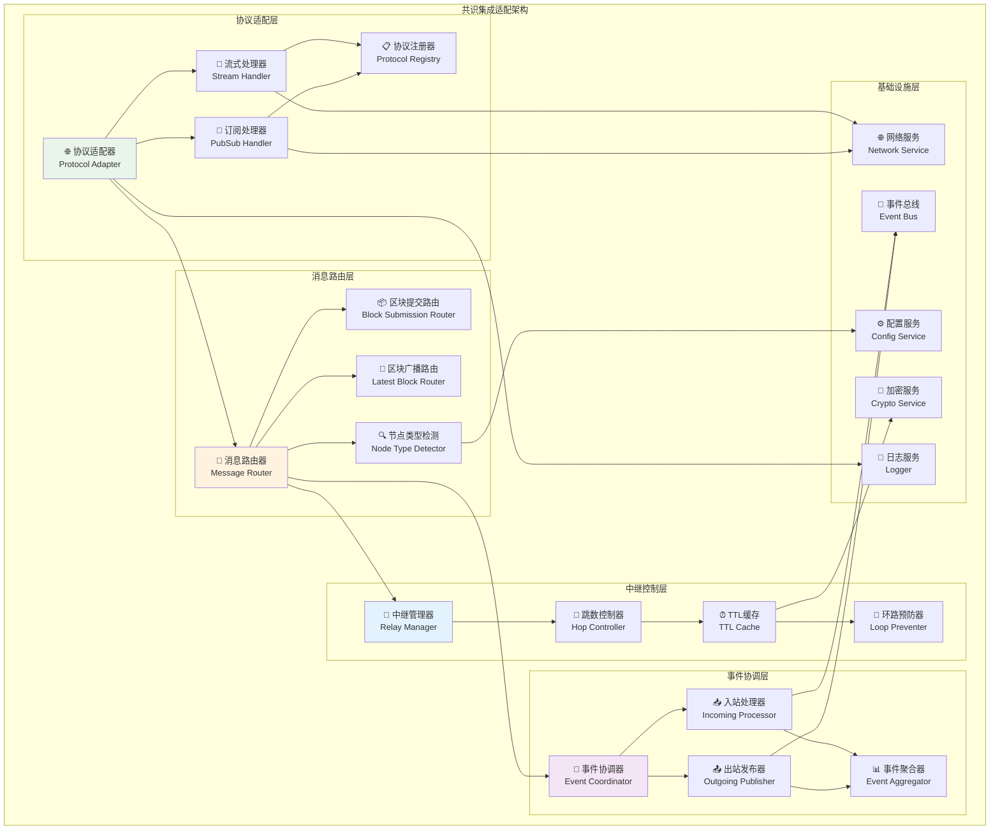
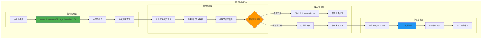
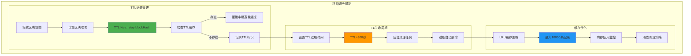
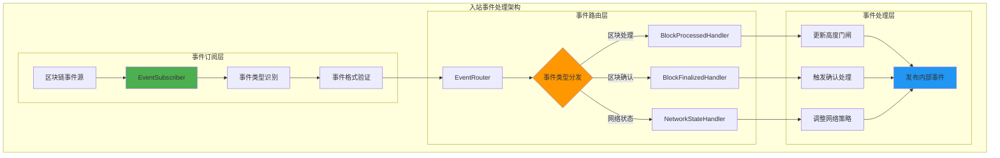
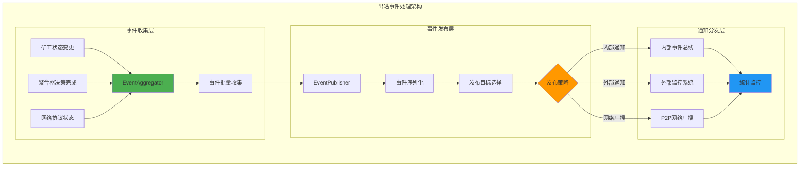
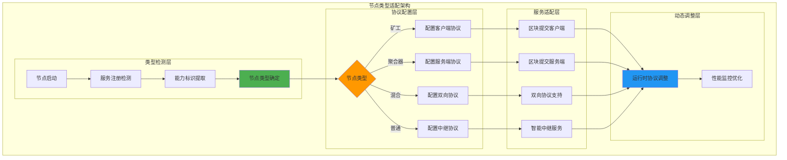

# 共识系统集成层（Consensus Integration）

【模块定位】
　　本模块是WES共识系统的统一集成层核心实现，为整个共识系统提供统一的网络协议集成和事件系统集成能力。通过标准化的协议注册、消息路由和事件协调机制，支撑矿工(Miner)和聚合器(Aggregator)的业务协作，确保共识系统的高效运行和松耦合架构。

【设计原则】
- **系统级集成能力**：为整个共识系统提供统一的网络和事件集成服务，不局限于单一业务模块
- **协议标准化管理**：统一管理所有共识协议的注册、版本控制和路由规则
- **双模块服务支持**：网络集成主要服务aggregator，事件集成同时支持aggregator和miner
- **接口抽象解耦**：通过标准化Router接口实现与业务层的完全解耦
- **轻量级适配设计**：专注于协议适配和消息转发，业务逻辑由具体业务模块实现

【核心职责】
1. **网络协议集成**：向网络层注册共识相关的流式协议和订阅协议处理器
2. **统一消息路由**：将网络消息标准化后路由到对应的业务Router接口
3. **事件系统集成**：为miner和aggregator提供统一的事件发布订阅和协调服务
4. **协议版本管理**：维护协议版本信息，支持协议演进和向后兼容
5. **系统状态协调**：协调共识系统各模块的状态同步和生命周期管理

【实现架构】

　　采用**协议注册 → 消息转换 → 简单转发**的简化集成架构，确保网络协议与Aggregator的轻量级对接。



**架构层次说明：**

1. **协议适配层**：管理网络协议的注册和适配
   - 协议适配器统一管理所有协议接入
   - 流式处理器处理请求-响应协议
   - 订阅处理器处理发布-订阅协议

2. **消息路由层**：实现智能消息路由和分发
   - 消息路由器根据节点类型进行智能路由
   - 区块提交路由处理候选区块提交
   - 区块广播路由处理最新区块广播

3. **中继控制层**：实现智能中继和环路避免
   - 中继管理器协调所有中继操作
   - 跳数控制器限制中继跳数
   - TTL缓存实现基于哈希的去重

4. **事件协调层**：协调内外部事件处理
   - 事件协调器统一管理事件流
   - 入站处理器处理外部事件
   - 出站发布器发布内部事件

---

## 📁 **模块组织架构**

```text
integration/
├── 📖 README.md              # 本文档：共识系统集成层整体设计
├── 🌐 network/               # 网络协议集成：统一协议注册和消息路由（主要服务aggregator）
│   ├── README.md             # 网络集成详细设计文档
│   ├── stream_handlers.go    # 流式协议注册：区块提交协议注册和路由
│   ├── subscribe_handlers.go # 订阅协议注册：区块广播协议注册和路由
│   ├── protocol_constants.go # 协议常量：统一的协议ID、版本管理
│   └── router_interfaces.go  # 路由接口：UnifiedAggregatorRouter接口定义
└── 📢 event/                 # 事件系统集成：统一事件协调（同时服务aggregator和miner）
    ├── README.md             # 事件集成详细设计文档
    ├── event_coordinator.go  # 事件协调器：统一的事件发布订阅管理
    ├── event_types.go        # 事件类型：标准化的共识事件类型定义
    └── subscription_manager.go # 订阅管理：事件订阅生命周期管理
```

---

## 🔄 **统一系统集成实现**

【实现策略】

　　所有子模块均严格遵循**协议注册 → 消息接收 → 标准化路由 → 业务分发 → 事件协调**架构模式，确保系统级集成的一致性和高效性。注意：中继、TTL、扇出等具体业务决策由aggregator模块负责，集成层仅负责标准化适配。

```mermaid
flowchart TD
    subgraph "统一系统集成实现架构"
        subgraph "协议注册层"
            A[系统启动] --> B[协议注册中心]
            B --> C[流式协议注册]
            C --> D[订阅协议注册]
            D --> E[Router接口绑定]
        end
        
        subgraph "消息处理层"
            E --> F[消息接收监听]
            F --> G[协议类型识别]
            G --> H[消息格式验证]
            H --> I[消息反序列化]
        end
        
        subgraph "标准化路由层"
            I --> J[UnifiedAggregatorRouter]
            J --> K{协议类型分发}
            K -->|区块提交协议| L[HandleMinerBlockSubmission]
            K -->|心跳协议| M[HandleConsensusHeartbeat]
            K -->|区块广播协议| N[HandleLatestBlock]
        end
        
        subgraph "业务分发层"
            L --> O[Aggregator业务处理]
            M --> O
            N --> P[全系统状态同步]
            O --> Q[具体业务逻辑执行]
            P --> R[事件系统通知]
        end
        
        subgraph "事件协调层"
            Q --> S[业务事件生成]
            R --> T[系统事件生成]
            S --> U[事件统一协调]
            T --> U
            U --> V[双模块事件分发]
            V --> W[Miner事件订阅]
            V --> X[Aggregator事件订阅]
        end
    end
```



**关键实现要点：**

1. **系统级协议注册**：
   - 统一的协议ID管理和版本控制
   - 一致的Router接口注册和生命周期管理
   - 标准化的协议参数配置和兼容性检查

2. **标准化消息路由**：
   - 基于UnifiedAggregatorRouter的统一路由策略
   - 高效的消息序列化反序列化和路由分发
   - 完善的路由错误处理和业务层透传机制

3. **双模块事件协调**：
   - 统一的事件协调器为miner和aggregator提供事件服务
   - 标准化的事件类型和订阅管理
   - 高效的事件分发和生命周期管理

---

## 🌐 **网络协议架构设计**

【双协议通信模式】

　　采用"流式协议 + 订阅协议"的双模式设计，支持请求-响应和发布-订阅两种网络通信模式，实现高效、可靠的共识网络传输。

### **流式协议：区块提交**



#### **协议处理流程**

```text
完整的区块提交协议处理流程

1. 协议注册阶段：
   - 协议ID：/weisyn/consensus/block_submission/1.0.0
   - 通信模式：请求-响应（同步RPC）
   - 数据格式：Protocol Buffer序列化
   - 超时设置：30秒请求超时，10秒响应超时

2. 请求接收阶段：
   - 并发连接管理：最大1000个并发连接
   - 请求队列：5000个请求的有界队列
   - 背压控制：队列满时拒绝新连接
   - 消息大小限制：最大10MB区块数据

3. 节点类型识别：
   - 聚合节点：注册了BlockSubmissionRouter
   - 非聚合节点：使用默认处理器
   - 轻节点：不处理区块提交请求
   - 动态检测：运行时节点类型检测

4. 业务路由分发：
   - 聚合节点：直接路由到候选收集器
   - 非聚合节点：执行智能中继逻辑
   - 响应处理：同步返回处理结果
   - 错误传播：透明的错误信息传递
```

### **订阅协议：区块广播**

```mermaid
graph TB
    subgraph "订阅协议架构"
        subgraph "主题管理层"
            A[主题注册] --> B["weisyn.consensus.latest_block.v1"]
            B --> C[订阅者管理]
            C --> D[消息分发控制]
        end
        
        subgraph "消息处理层"
            D --> E[接收区块广播]
            E --> F[验证消息格式]
            F --> G[提取区块信息]
            G --> H[检查消息完整性]
        end
        
        subgraph "路由分发层"
            H --> I[LatestBlockRouter]
            I --> J[区块链状态更新]
            J --> K[本地缓存同步]
            K --> L[事件触发通知]
        end
        
        subgraph "性能优化层"
            L --> M[批量处理优化]
            M --> N[消息去重]
            N --> O[延迟统计监控]
        end
    end
    
    style B fill:#4CAF50
    style H fill:#FF9800
    style N fill:#2196F3
```



## 🔄 **~~智能中继机制设计~~** ⚠️ **已迁移至业务层**

> **架构变更说明**：以下中继控制、TTL缓存、受控扇出等业务逻辑已从Integration层迁移至Aggregator业务模块实现。Integration层现在仅负责协议注册、消息路由和事件协调等系统级集成功能。

【~~RelayHopLimit控制策略~~ - 已迁移至aggregator模块】

### **中继决策算法**

```text
智能中继决策：确保消息传递效率和网络稳定性

算法：基于跳数限制和TTL检查的中继决策
输入：区块提交请求、发送方节点信息、RelayHopLimit配置
输出：中继决策（中继/拒绝）和目标节点选择

1. 跳数检查：
   current_hops = 从请求头提取当前跳数
   max_hops = RelayHopLimit配置值（默认1）
   if current_hops >= max_hops:
       return 拒绝中继

2. TTL去重检查：
   block_hash = 计算区块内容哈希
   ttl_key = "relay:" + block_hash
   if TTLCache.exists(ttl_key):
       return 拒绝中继（已中继过）
   
3. 目标选择：
   aggregators = 查询已知聚合节点列表
   closest_aggregators = Kademlia最近邻查询(block_hash, aggregators)
   target = 选择最近的可达聚合节点

4. 中继执行：
   TTLCache.set(ttl_key, true, 300秒)
   relay_request = 构建中继请求（跳数+1）
   result = 发送到目标聚合节点
   return 中继结果
```

### **环路避免机制**



#### **TTL管理策略**

```text
基于blockHash的TTL记录：轻量级环路避免

1. TTL Key设计：
   - 格式："relay:" + hex(blockHash)
   - 示例：relay:a1b2c3d4e5f6...
   - 唯一性：基于区块内容哈希保证唯一

2. 缓存实现：
   - 数据结构：LRU缓存（最近最少使用）
   - 容量限制：10000条记录（约1MB内存）
   - 过期时间：300秒（5分钟）
   - 清理策略：定时清理 + LRU淘汰

3. 并发安全：
   - 读写锁：sync.RWMutex保护缓存操作
   - 原子操作：atomic包实现计数统计
   - 无锁设计：读多写少的优化策略

4. 监控统计：
   - 命中率：TTL缓存命中率统计
   - 内存使用：缓存内存占用监控
   - 清理频率：过期清理和LRU淘汰统计
   - 性能指标：查询延迟和吞吐量监控
```

## 📢 **事件系统集成架构**

【事件驱动协调机制】

### **入站事件处理**



### **出站事件处理**



#### **事件处理流程**

```text
完整的事件处理和协调流程

1. 事件订阅管理：
   - 订阅源：区块链核心事件、网络状态事件
   - 事件类型：BlockProcessed, BlockFinalized, NetworkChanged
   - 过滤策略：按组件需求过滤相关事件
   - 缓冲机制：事件缓冲队列，防止处理阻塞

2. 事件路由分发：
   - 类型识别：基于事件类型的智能路由
   - 多播分发：同一事件可路由到多个处理器
   - 异步处理：非阻塞的异步事件处理
   - 错误隔离：单个处理器错误不影响其他处理器

3. 事件发布协调：
   - 事件聚合：收集来自不同组件的事件
   - 批量处理：批量发布提高效率
   - 目标选择：根据事件类型选择发布目标
   - 可靠发布：失败重试和错误处理机制
```

## 🏗️ **节点类型适配策略**

【差异化协议服务】

### **节点类型识别**

```text
动态节点类型识别：运行时自动检测和适配

1. 矿工节点识别：
   - 特征：注册了MinerService，启动了挖矿功能
   - 协议角色：区块提交协议客户端
   - 处理策略：发送候选区块，订阅区块广播
   - 中继行为：不执行中继，仅转发

2. 聚合节点识别：
   - 特征：注册了AggregatorService，启动了聚合功能
   - 协议角色：区块提交协议服务端
   - 处理策略：接收候选区块，发布区块广播
   - 中继行为：不需要中继，直接处理

3. 混合节点识别：
   - 特征：同时注册了MinerService和AggregatorService
   - 协议角色：既是客户端又是服务端
   - 处理策略：同时支持发送和接收
   - 中继行为：根据请求类型动态选择

4. 普通节点识别：
   - 特征：只订阅区块广播，不参与挖矿和聚合
   - 协议角色：纯中继节点
   - 处理策略：执行智能中继，转发消息
   - 中继行为：基于RelayHopLimit的受控中继
```

### **协议服务适配**



## 🔧 **关键配置参数**

【集成适配核心配置】
```yaml
consensus_integration:
  # 网络协议配置
  network:
    # 流式协议配置
    stream_protocols:
      block_submission:
        id: "/weisyn/consensus/block_submission/1.0.0"
        timeout: 30s              # 协议调用超时
        max_concurrent: 1000      # 最大并发连接数
        queue_size: 5000          # 请求队列大小
        max_message_size: 10485760 # 最大消息大小（10MB）
    
    # 订阅协议配置
    pubsub_protocols:
      latest_block:
        topic: "weisyn.consensus.latest_block.v1"
        buffer_size: 1000         # 消息缓冲区大小
        batch_size: 100           # 批量处理大小
        batch_timeout: 1s         # 批量超时时间
    
    # 中继控制配置
    relay_control:
      hop_limit: 1               # 最大中继跳数
      ttl_duration: 300s         # TTL过期时间（5分钟）
      cache_size: 10000          # TTL缓存大小
      cleanup_interval: 60s      # TTL清理间隔
      enable_stats: true         # 启用统计监控
    
    # 节点类型适配
    node_adaptation:
      auto_detection: true       # 自动节点类型检测
      capability_check_interval: 30s  # 能力检查间隔
      protocol_switch_delay: 5s  # 协议切换延迟
  
  # 事件系统配置
  event:
    # 入站事件配置
    incoming:
      subscription_buffer: 1000  # 订阅缓冲区大小
      processing_workers: 4      # 处理工作线程数
      batch_processing: true     # 启用批量处理
      error_retry_count: 3       # 错误重试次数
      retry_backoff: "1s,2s,4s"  # 重试退避策略
    
    # 出站事件配置
    outgoing:
      publish_buffer: 500        # 发布缓冲区大小
      batch_publish_size: 50     # 批量发布大小
      publish_timeout: 10s       # 发布超时时间
      max_retry_attempts: 3      # 最大重试次数
      notification_targets:      # 通知目标配置
        - internal_bus           # 内部事件总线
        - external_monitoring    # 外部监控系统
    
    # 事件过滤配置
    filtering:
      enable_type_filter: true   # 启用类型过滤
      enable_source_filter: true # 启用来源过滤
      priority_events:           # 高优先级事件类型
        - "BlockProcessed"
        - "BlockFinalized"
        - "MinerStateChanged"
  
  # 性能监控配置
  monitoring:
    metrics_collection: true     # 启用指标收集
    performance_sampling: 0.1    # 性能采样率（10%）
    latency_histogram: true      # 启用延迟直方图
    throughput_tracking: true    # 启用吞吐量跟踪
    error_rate_alerting: true    # 启用错误率告警
    
  # 错误处理配置
  error_handling:
    protocol_errors:
      log_level: "warn"          # 协议错误日志级别
      retry_policy: "exponential" # 重试策略
      circuit_breaker: true      # 熔断器保护
    
    business_errors:
      log_level: "error"         # 业务错误日志级别
      propagate_upstream: true   # 向上传播错误
      error_classification: true # 错误分类统计
```

## 📊 **性能优化与监控**

【性能监控指标】
- **协议性能**：协议调用延迟、成功率、并发连接数、消息吞吐量
- **中继效率**：中继成功率、TTL缓存命中率、环路避免效果
- **事件处理**：事件处理延迟、发布成功率、批量处理效率
- **资源使用**：内存占用、CPU使用率、网络带宽、缓存大小

【可观测性支持】
- **结构化日志**：详细的协议交互日志和事件处理链路追踪
- **性能指标**：实时性能数据收集和监控大盘展示
- **健康检查**：协议状态、中继功能、事件系统的自动健康检查
- **调试接口**：运行时状态查询、协议统计、缓存状态调试接口

## 🏗️ **关键依赖接口**

【外部接口依赖】
- **网络服务** (`pkg/interfaces/network`): 协议注册、消息传输、节点发现
- **事件系统** (`pkg/interfaces/infrastructure/event`): 事件订阅、发布、总线管理
- **日志服务** (`pkg/interfaces/infrastructure/log`): 结构化日志记录和输出
- **配置服务** (`pkg/interfaces/config`): 配置参数获取和热更新支持
- **加密服务** (`pkg/interfaces/infrastructure/crypto`): 消息哈希和签名验证

【内部接口定义】
- **路由器接口**: `BlockSubmissionRouter`, `LatestBlockRouter`
- **事件处理接口**: `EventHandler`, `EventPublisher`
- **中继管理接口**: `RelayManager`, `TTLManager`

## 🎯 **质量保证**

【代码质量标准】
- **接口规范**：严格的接口抽象和路由器模式实现
- **线程安全**：并发安全的缓存管理和事件处理
- **错误处理**：完善的错误分类、传播和恢复机制
- **资源管理**：正确的连接管理、内存使用和清理
- **配置驱动**：所有关键参数可配置，支持动态调整

【测试覆盖】
- **单元测试**：协议处理、中继逻辑、事件路由的独立功能测试
- **集成测试**：完整消息流的端到端测试和多节点协调测试
- **性能测试**：高并发协议处理和大量事件处理的性能基准测试
- **容错测试**：网络异常、节点故障、协议错误的容错能力测试
