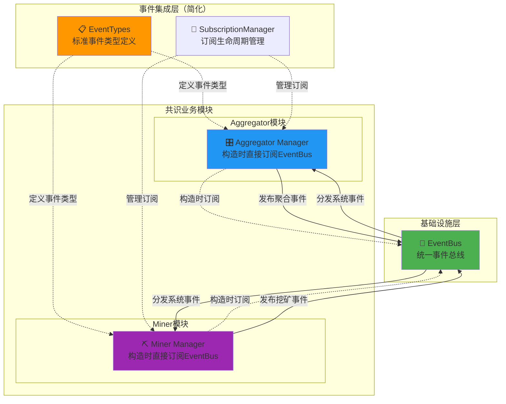

# 共识系统事件集成（Consensus Event Integration）

【模块定位】
　　本模块是WES共识系统的事件集成组件，为整个共识系统提供统一的事件类型定义和订阅管理服务。通过标准化的事件主题和简化的订阅模式，同时支持aggregator和miner模块的事件通信需求，确保共识系统的事件一致性和架构简洁性。

【架构重构完成】✅
　　经过全面重构，本模块已完美对齐network模块的成功架构模式：
- **常量归口管理**：events.go 完全对齐 protocols.go 模式
- **订阅统一注册**：subscribe_handlers.go 提供统一的事件订阅管理
- **接口标准继承**：aggregator/miner通过接口继承实现事件处理
- **依赖注入集中**：所有fx逻辑统一在consensus/module.go中管理

【设计原则】
- **系统级事件集成**：为整个共识系统提供统一的事件类型定义和订阅服务
- **双模块支持**：同时服务aggregator和miner模块的事件通信需求
- **简化订阅模式**：约定：Manager构造中直接订阅EventBus，不需要复杂的事件协调器
- **标准化事件主题**：定义清晰、一致的事件主题命名规范
- **最小化集成层**：不包含业务逻辑，仅提供事件类型和订阅管理

【核心职责】
1. **标准化事件类型定义**：定义共识系统所有标准事件类型和数据结构
2. **事件主题管理**：维护清晰、一致的事件主题命名规范
3. **订阅管理器**：提供统一的订阅生命周期管理工具
4. **双模块事件支持**：确保事件类型同时适用于aggregator和miner

## 📁 **模块组织架构**

```text
event/
├── 📖 README.md                # 本文档：共识系统事件集成设计  
├── 🎯 events.go                # 事件常量：完全对齐protocols.go模式的事件类型定义
├── 📋 subscribe_handlers.go    # 订阅处理：统一的事件订阅接口和注册管理
└── 🔄 实际事件处理委托给子模块  # aggregator/event_handler + miner/event_handler

✅ **重构完成的简化架构**：
├── ✅ events.go              # 标准化事件常量（对齐network/protocols.go）
├── ✅ subscribe_handlers.go   # 统一订阅接口（对齐network模式）
└── ✅ 委托实现模式            # 由aggregator/miner子模块实现具体处理

🗑️  **已简化移除的复杂组件**：
├── ~~🎯 incoming/~~           # ❌ 已删除：复杂的入站事件处理
├── ~~📤 outgoing/~~           # ❌ 已删除：复杂的出站事件处理  
├── ~~🎛️ coordinator.go~~      # ❌ 已删除：事件协调器
├── ~~📔 provider.go~~         # ❌ 已删除：重复的依赖注入逻辑
├── ~~🔀 router.go~~           # ❌ 已删除：智能路由器
├── ~~📊 statistics.go~~       # ❌ 已删除：统计监控
├── ~~🔄 priority_queue.go~~   # ❌ 已删除：优先级队列
└── ~~🛠️ health_checker.go~~   # ❌ 已删除：健康检查

**简化原因**：Manager直接订阅EventBus，不需要复杂的协调器架构
```

## 🏗️ **重构后的完整架构**

### 事件类型常量管理
```go
// events.go - 完全对齐protocols.go模式
package event

// EventType 共识事件类型别名，完全兼容标准事件接口
type EventType = event.EventType

// 矿工事件 (3个)
const (
    EventTypeMinerStateChanged  EventType = "consensus.miner.state_changed"
    EventTypeMinerBlockProduced EventType = "consensus.miner.block_produced"  
    EventTypeMinerBlockSent     EventType = "consensus.miner.block_sent"
)

// 聚合器事件 (9个)
const (
    EventTypeAggregatorStateChanged       EventType = "consensus.aggregator.state_changed"
    EventTypeAggregatorCandidateReceived  EventType = "consensus.aggregator.candidate_received"
    // ... 更多事件类型
)
```

### 订阅接口与注册
```go  
// subscribe_handlers.go - 统一订阅管理
package event

// AggregatorEventSubscriber 聚合器事件订阅接口
type AggregatorEventSubscriber interface {
    HandleChainReorganized(ctx context.Context, eventData *types.ChainReorganizedEventData) error
    HandleNetworkQualityChanged(ctx context.Context, eventData *types.NetworkQualityChangedEventData) error
}

// MinerEventSubscriber 矿工事件订阅接口  
type MinerEventSubscriber interface {
    HandleForkDetected(ctx context.Context, eventData *types.ForkDetectedEventData) error
    HandleForkProcessing(ctx context.Context, eventData *types.ForkProcessingEventData) error
    HandleForkCompleted(ctx context.Context, eventData *types.ForkCompletedEventData) error
}

// RegisterEventSubscriptions 统一注册事件订阅
func RegisterEventSubscriptions(
    eventBus event.EventBus,
    aggregatorSubscriber AggregatorEventSubscriber,
    minerSubscriber MinerEventSubscriber,
    logger log.Logger,
) error
```

### 实现委托模式
```text
📁 consensus/
├── aggregator/
│   ├── manager.go           ✅ 实现AggregatorEventHandler，委托给event_handler
│   └── event_handler/       ✅ 具体事件处理实现
│       ├── manager.go       
│       ├── chain_reorganized_handler.go
│       └── network_quality_handler.go
└── miner/  
    ├── manager.go           ✅ 实现MinerEventHandler，委托给event_handler
    └── event_handler/       ✅ 具体事件处理实现
        ├── manager.go
        └── fork_events_handler.go
```

## 🏗️ **简化的直接订阅架构**

**核心设计理念**：Manager构造时直接订阅EventBus，无需复杂的事件协调器



**❌ 已移除的复杂架构**：
- 事件协调器（EventCoordinator）
- 智能路由器（SmartRouter）
- 优先级队列（PriorityQueue）
- 入站/出站事件处理器
- 健康检查和统计收集器
- 双事件总线架构

**✅ 简化后的架构优势**：
- Manager直接订阅，减少中间层
- 标准化事件类型，确保一致性
- 统一订阅管理，简化生命周期
- 架构清晰，易于理解和维护

## 📋 **标准化事件类型定义**

### **聚合器事件类型**

```go
// event_types.go - 聚合器相关事件类型
const (
    // 聚合节点生命周期事件
    EventAggregatorActivated      = "consensus.aggregator.activated"
    EventAggregatorDeactivated    = "consensus.aggregator.deactivated"
    
    // 聚合处理流程事件
    EventCandidateCollected       = "consensus.aggregator.candidate_collected"
    EventCandidateEvaluated       = "consensus.aggregator.candidate_evaluated"
    EventBlockSelected            = "consensus.aggregator.block_selected"
    EventConsensusDistributed     = "consensus.aggregator.consensus_distributed"
    
    // 聚合器状态变更事件
    EventAggregatorStateChanged   = "consensus.aggregator.state_changed"
    EventAggregatorError          = "consensus.aggregator.error"
)
```

### **矿工事件类型**

```go
// event_types.go - 矿工相关事件类型  
const (
    // 挖矿生命周期事件
    EventMiningStarted         = "consensus.miner.mining_started"
    EventMiningStopped         = "consensus.miner.mining_stopped"
    
    // 挖矿处理流程事件
    EventBlockMined            = "consensus.miner.block_mined"
    EventBlockSubmitted        = "consensus.miner.block_submitted"
    
    // 矿工状态变更事件
    EventMinerStateChanged     = "consensus.miner.state_changed"
    EventMinerError           = "consensus.miner.error"
)
```

### **系统级事件类型**

```go
// event_types.go - 系统级事件类型
const (
    // 共识系统事件
    EventConsensusStarted      = "consensus.system.started"
    EventConsensusStopped      = "consensus.system.stopped"
    EventSyncTriggered         = "consensus.system.sync_triggered"
    
    // 网络级事件
    EventNetworkConnected      = "consensus.system.network_connected"
    EventNetworkDisconnected   = "consensus.system.network_disconnected"
    EventPeerDiscovered        = "consensus.system.peer_discovered"
    
    // 区块链状态事件
    EventNewBlockReceived      = "consensus.system.new_block_received"
    EventChainStateUpdated     = "consensus.system.chain_state_updated"
    EventHeightChanged         = "consensus.system.height_changed"
)
```

## 🎯 **简化的订阅管理**

### **订阅管理器实现**

```go
// subscription_manager.go - 统一的订阅生命周期管理

type SubscriptionManager struct {
    eventBus      interfaces.EventBus
    subscriptions map[string]interfaces.Subscription
    mutex         sync.RWMutex
    logger        log.Logger
}

func (s *SubscriptionManager) Subscribe(topic string, handler func(interface{})) error {
    s.mutex.Lock()
    defer s.mutex.Unlock()
    
    subscription, err := s.eventBus.Subscribe(topic, handler)
    if err != nil {
        s.logger.Info("事件订阅失败")
        return err
    }
    
    s.subscriptions[topic] = subscription
    s.logger.Info("事件订阅成功")
    return nil
}
```

### **Manager中的直接订阅模式**

**Aggregator Manager订阅示例**：

```go
// aggregator/manager.go - 聚合器管理器构造时直接订阅

func NewAggregatorManager(
    eventBus interfaces.EventBus,
    logger log.Logger,
) *Manager {
    mgr := &Manager{
        eventBus: eventBus,
        logger:   logger,
    }
    
    // 构造时直接订阅相关事件
    mgr.setupEventSubscriptions()
    return mgr
}

func (m *Manager) setupEventSubscriptions() {
    // 订阅系统级事件
    m.eventBus.Subscribe(EventNewBlockReceived, m.handleNewBlockReceived)
    m.eventBus.Subscribe(EventChainStateUpdated, m.handleChainStateUpdated)
    
    // 订阅矿工事件（用于接收候选区块）
    m.eventBus.Subscribe(EventBlockMined, m.handleBlockMined)
    
    m.logger.Info("聚合器事件订阅完成")
}
```

**Miner Manager订阅示例**：

```go
// miner/manager.go - 矿工管理器构造时直接订阅

func NewMinerManager(
    eventBus interfaces.EventBus,
    logger log.Logger,
) *Manager {
    mgr := &Manager{
        eventBus: eventBus,
        logger:   logger,
    }
    
    // 构造时直接订阅相关事件
    mgr.setupEventSubscriptions()
    return mgr
}

func (m *Manager) setupEventSubscriptions() {
    // 订阅系统级事件
    m.eventBus.Subscribe(EventNewBlockReceived, m.handleNewBlockReceived)
    m.eventBus.Subscribe(EventConsensusDistributed, m.handleConsensusDistributed)
    
    // 订阅聚合器事件（接收共识结果）
    m.eventBus.Subscribe(EventBlockSelected, m.handleBlockSelected)
    
    m.logger.Info("矿工事件订阅完成")
}
```

## 🔄 **事件发布模式**

### **标准事件发布接口**

```go
// consensus_events.go - 具体的共识业务事件发布

// 发布聚合器激活事件
func (m *AggregatorManager) PublishActivatedEvent(height uint64) {
    event := &AggregatorActivatedEvent{
        Height:    height,
        Timestamp: time.Now().Unix(),
        NodeID:    m.nodeID,
    }
    
    m.eventBus.Publish(EventAggregatorActivated, event)
    m.logger.Info("发布聚合器激活事件")
}

// 发布区块选择事件
func (m *AggregatorManager) PublishBlockSelected(height uint64, selectedHash string) {
    event := &BlockSelectedEvent{
        Height:       height,
        SelectedHash: selectedHash,
        Timestamp:    time.Now().Unix(),
    }
    
    m.eventBus.Publish(EventBlockSelected, event)
    m.logger.Info("发布区块选择事件")
}
```

## ⚙️ **集成配置**

### **fx依赖注入配置**

```go
// integration/event/module.go

var EventIntegrationModule = fx.Module("event_integration",
    // 提供事件类型定义
    fx.Provide(NewEventTypes),
    
    // 提供订阅管理器
    fx.Provide(NewSubscriptionManager),
)
```

## 🔚 **总结**

**简化的事件集成架构优势**：

1. **架构简洁**：移除复杂的事件协调器、路由器等中间层
2. **直接订阅**：Manager构造时直接订阅EventBus，减少间接调用
3. **标准化**：统一的事件类型定义和主题命名规范  
4. **双模块支持**：同时服务aggregator和miner的事件需求
5. **易于维护**：清晰的职责划分，简化的组件结构
6. **高性能**：减少事件传递层次，提高响应速度

**遵循的设计约定**：
- Manager构造函数中直接订阅相关事件
- 使用标准化的事件主题命名
- 统一的事件数据结构定义
- 通过fx依赖注入管理组件生命周期
- 遵循项目统一的日志规范：`logger.Info("消息")`
