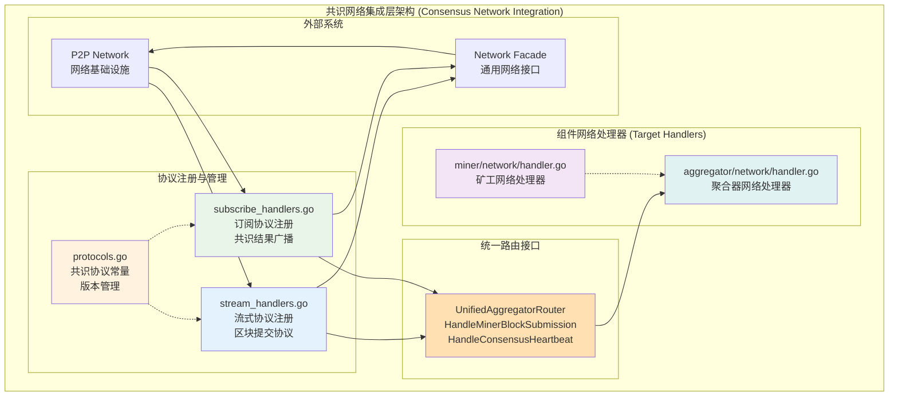
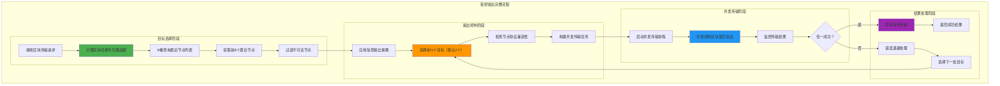
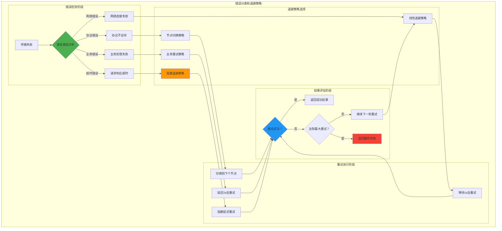
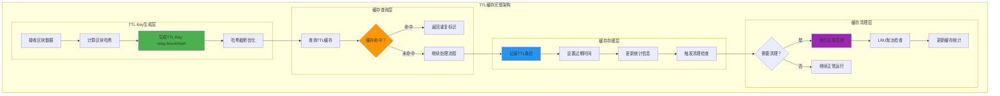
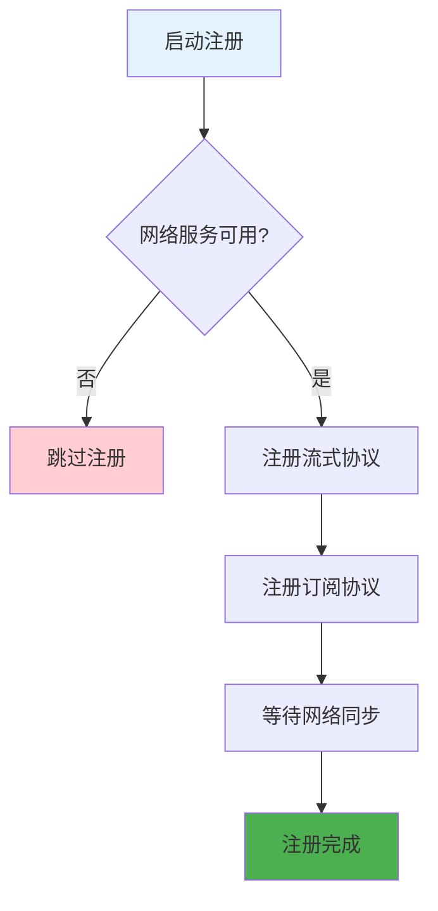

# WES 共识网络集成（Consensus Network Integration）

【模块定位】
　　本模块是WES共识系统的网络集成组件，为共识系统提供统一的网络协议集成能力。作为系统级网络集成层，主要服务于Aggregator模块的网络通信需求，通过标准化的协议注册、消息路由和接口抽象，实现网络层与业务层的松耦合架构。专注于协议适配功能，具体的路由决策、中继控制等业务逻辑由Aggregator模块负责。

【设计原则】
- **系统级网络集成**：为整个共识系统提供统一的网络协议集成服务
- **标准化协议适配**：统一管理协议注册、版本控制和消息格式转换
- **UnifiedAggregatorRouter接口**：通过标准化路由接口实现与业务层的解耦
- **业务无关的适配层**：专注于网络适配，不包含ABS共识业务逻辑
- **轻量级集成设计**：保持适配层的简洁性，业务决策由Aggregator负责

【核心职责】
1. **系统级协议注册**：向网络层注册共识系统相关的流式协议和订阅协议
2. **协议常量统一管理**：维护共识系统所有协议的常量定义和版本信息
3. **消息序列化适配**：网络字节流与protobuf消息之间的标准化转换
4. **UnifiedAggregatorRouter路由**：通过统一路由接口将消息转发给业务层处理

## 📌 **共识系统网络集成架构说明**

在WES共识系统架构中：
- **系统级集成能力**：为整个共识系统提供统一的网络协议集成服务
- **主要服务对象**：Aggregator模块的网络通信需求（区块提交、共识心跳等）
- **架构边界清晰**：Integration层仅负责协议适配，具体的路由决策、内容寻址、高度校验等ABS业务逻辑由Aggregator模块负责

## 📁 **模块组织架构**

```text
network/
├── 📖 README.md              # 本文档：网络集成详细设计
├── 🌐 stream_handlers.go     # 流式协议注册：区块提交协议注册和路由
├── 📡 subscribe_handlers.go  # 订阅协议注册：区块广播协议注册和路由  
├── 📋 protocol_constants.go  # 协议常量：统一的协议ID、版本管理
└── 🔗 router_interfaces.go   # 路由接口：UnifiedAggregatorRouter接口定义

🗑️  **已删除或迁移的文件（业务逻辑已迁移至aggregator模块）**：
├── ~~🔄 default_handler.go~~     # ❌ 已删除：智能中继和环路避免 → aggregator
├── ~~🚀 relay_manager.go~~       # ❌ 已删除：RelayHopLimit控制和TTL管理 → aggregator  
├── ~~📤 fanout_controller.go~~   # ❌ 已删除：受控扇出和并发优化 → aggregator
├── ~~⏰ ttl_cache.go~~           # ❌ 已删除：基于blockHash的环路避免 → aggregator
└── ~~🔁 retry_handler.go~~       # ❌ 已删除：错误退避和智能重试 → aggregator
```

【架构组件设计】



### 架构关键特点

**系统级网络集成模式**：
- 通过统一的UnifiedAggregatorRouter接口进行协议路由
- 主要服务aggregator模块的网络通信需求（区块提交、共识心跳等）
- 基于标准化Router接口实现类型安全的消息分发

**角色明确的架构边界**：
- **Miner模块**：不直接处理网络消息，通过内部接口提交给本地Aggregator服务
- **Aggregator模块**：处理所有网络消息（区块提交、共识心跳、内容寻址转发等）
- **Integration层**：仅负责协议适配，不包含ABS业务逻辑

**⚠️ ~~智能传输优化~~ - 已迁移至aggregator模块**：
- ~~受控扇出~~：→ aggregator模块的网络策略
- ~~TTL环路避免~~：→ aggregator模块的内容寻址逻辑  
- ~~错误退避~~：→ aggregator模块的重试机制

【系统核心特性】

## 🚀 **~~智能传输特性~~** ⚠️ **已迁移至aggregator模块**

> **架构变更说明**：以下传输优化和中继控制功能已从Integration层迁移至Aggregator业务模块实现。Integration层现在专注于协议适配功能。

- ~~**受控扇出机制**~~：→ aggregator模块的网络传播策略
- ~~**错误退避策略**~~：→ aggregator模块的重试和恢复机制
- ~~**并发优化**~~：→ aggregator模块的性能优化策略  
- ~~**性能监控**~~：→ aggregator模块的监控和统计

## 🔄 **~~中继控制特性~~** ⚠️ **已迁移至aggregator模块**

- ~~**跳数限制**~~：→ aggregator模块的转发控制逻辑
- ~~**智能路由**~~：→ aggregator模块的内容寻址和KademliaClosestPeer算法
- ~~**负载均衡**~~：→ aggregator模块的网络负载管理
- ~~**断层避免**~~：→ aggregator模块的网络分区处理策略

## 🔍 **~~环路避免特性~~** ⚠️ **已迁移至aggregator模块**

- ~~**TTL记录**~~：→ aggregator模块的内容寻址去重逻辑
- ~~**哈希去重**~~：→ aggregator模块的区块哈希去重机制
- ~~**内存优化**~~：→ aggregator模块的缓存和内存管理
- ~~**并发安全**~~：→ aggregator模块的并发控制机制

## 📡 **协议通信特性**
- **双重通信模式**：请求-响应和发布-订阅的混合通信机制
- **协议版本化**：版本化协议ID和主题，支持协议演进
- **向后兼容**：多版本协议的平滑切换和兼容性处理
- **节点类型适配**：针对不同节点类型的差异化协议支持

## 🏗️ **架构集成特性**
- **接口抽象**：完全基于接口的解耦设计，支持依赖注入
- **配置驱动**：全面的配置参数支持和动态调整能力
- **监控集成**：内置指标收集、性能监控、健康检查
- **测试支持**：Mock接口支持、单元测试友好、基准测试

## 🚀 **受控扇出实现机制**

【智能扇出策略】

　　受控扇出是WES网络协议的核心优化策略，通过智能的目标选择、并发控制和资源管理，实现高效、可靠的区块传输。

### **扇出控制算法**



#### **扇出算法实现**

```text
算法：智能受控扇出传输
输入：区块数据 (blockData)、配置参数 (config)
输出：传输结果 (success/failure) 和 统计信息 (stats)

1. 目标节点选择：
   routing_key = SHA256(blockData.ParentHash)
   if routing_key == nil:
       routing_key = DefaultRoutingKey // [0x00...]
   
   candidates = KademliaMgr.FindClosestPeers(routing_key, 8)
   available_targets = FilterReachablePeers(candidates)
   
2. 扇出控制参数：
   fanout_size = min(config.MaxFanout, len(available_targets))
   fanout_size = max(config.MinFanout, fanout_size)
   primary_targets = available_targets[0:fanout_size]
   
3. 并发传输执行：
   results_chan = make(chan TransmissionResult, fanout_size)
   ctx, cancel = context.WithTimeout(parent_ctx, config.TransmissionTimeout)
   defer cancel()
   
   for _, target := range primary_targets:
       go func(target_peer Peer):
           result = CallBlockSubmissionProtocol(ctx, target_peer, blockData)
           results_chan <- TransmissionResult{
               Peer:      target_peer,
               Success:   result.Error == nil,
               Latency:   result.Duration,
               Error:     result.Error,
           }
       end()
   end
   
4. 结果处理逻辑：
   success_count = 0
   for i in range(fanout_size):
       result = <-results_chan
       if result.Success:
           success_count++
           cancel() // 取消其他传输
           return Success(result)
       end
   end
   
   // 如果所有传输都失败
   if success_count == 0:
       return ApplyErrorBackoff(available_targets[fanout_size:])
   end
```

### **并发优化策略**

```text
高性能并发传输：确保网络资源的高效利用

1. 协程池管理：
   - 预分配协程池：避免频繁创建销毁协程的开销
   - 协程数量限制：最大并发数不超过CPU核心数*4
   - 优雅关闭：传输完成后正确清理协程资源

2. 连接复用策略：
   - 长连接维护：复用已建立的网络连接
   - 连接池管理：维护到常用节点的连接池
   - 空闲检测：定期检测和清理空闲连接

3. 内存管理优化：
   - 零拷贝传输：尽可能避免不必要的数据拷贝
   - 缓冲区复用：复用序列化和网络缓冲区
   - 内存泄漏防护：确保所有协程正确释放资源

4. 背压控制机制：
   - 队列大小限制：传输队列最大1000个任务
   - 流量控制：根据网络状况动态调整传输速度
   - 过载保护：系统过载时主动拒绝新的传输请求
```

## ⏰ **错误退避策略实现**

【智能重试机制】

### **错误分类处理**



#### **退避算法实现**

```text
算法：智能错误退避和重试
输入：错误信息 (error)、重试配置 (retryConfig)
输出：重试决策 (retryDecision) 和 延迟时间 (backoffDelay)

1. 错误分类识别：
   error_type = ClassifyError(error)
   switch error_type:
       case NetworkError:      // 网络连接错误
           strategy = LinearBackoff
           base_delay = 1 * time.Second
       case ProtocolError:     // 协议不支持错误
           strategy = NodeSwitch  
           base_delay = 0 * time.Second
       case BusinessError:     // 业务逻辑错误
           strategy = BusinessRetry
           base_delay = 2 * time.Second
       case TimeoutError:      // 请求超时错误
           strategy = ExponentialBackoff
           base_delay = 1 * time.Second
       default:
           strategy = ExponentialBackoff
           base_delay = 2 * time.Second

2. 退避延迟计算：
   switch strategy:
       case LinearBackoff:
           delay = base_delay * attempt_count
           delay = min(delay, max_linear_delay) // 最大10秒
       
       case ExponentialBackoff:
           delay = base_delay * pow(2, attempt_count-1)
           delay = min(delay, max_exponential_delay) // 最大60秒
           delay += random_jitter(0, delay*0.1) // 10%抖动
       
       case BusinessRetry:
           delay = base_delay + random_jitter(0, 1*time.Second)
       
       case NodeSwitch:
           delay = 0 // 立即切换节点

3. 重试条件检查：
   if attempt_count >= retryConfig.MaxRetryAttempts:
       return NoRetry, 0
   
   if strategy == NodeSwitch:
       if len(remaining_targets) == 0:
           return NoRetry, 0
       next_target = remaining_targets[0]
       remaining_targets = remaining_targets[1:]
       return SwitchNode(next_target), 0
   
   return RetryWithDelay, delay

4. 重试状态管理：
   retry_state = RetryState{
       AttemptCount:     attempt_count + 1,
       LastError:       error,
       LastAttemptTime: time.Now(),
       Strategy:        strategy,
       RemainingTargets: remaining_targets,
   }
   
   return retry_state
```

### **重试策略优化**

```text
多维度重试优化：提高传输成功率和系统稳定性

1. 自适应退避：
   - 网络状况感知：根据网络质量动态调整退避策略
   - 成功率统计：基于历史成功率优化重试参数
   - 负载均衡：在多个目标节点间均衡分布重试请求

2. 智能节点选择：
   - 节点质量评分：维护节点的可达性和响应速度评分
   - 黑名单机制：暂时排除连续失败的节点
   - 动态更新：定期更新节点质量评分和可达性状态

3. 资源保护机制：
   - 重试限流：限制同时进行的重试请求数量
   - 熔断保护：连续失败时触发熔断，暂停重试
   - 优雅降级：系统过载时降低重试频率和次数

4. 统计监控：
   - 重试成功率：按错误类型统计重试成功率
   - 延迟分布：记录不同退避策略的延迟分布
   - 资源使用：监控重试过程的CPU和内存使用情况
```

## 🔍 **基于blockHash的TTL记录机制**

【轻量级环路避免】

### **TTL缓存设计**



#### **TTL管理算法**

```text
算法：基于blockHash的TTL记录管理
输入：区块数据 (blockData)、TTL配置 (ttlConfig)
输出：重复检测结果 (isDuplicate) 和 缓存更新 (cacheUpdate)

1. TTL Key生成：
   block_hash = SHA256(blockData.Serialize())
   // 使用前16字节作为key，减少内存占用
   ttl_key = "relay:" + hex.EncodeToString(block_hash[:16])
   
   // 可选：添加时间窗口到key中，增强去重精度
   time_window = time.Now().Unix() / ttlConfig.WindowSize
   ttl_key = ttl_key + ":" + strconv.FormatInt(time_window, 10)

2. 重复检测查询：
   cache_entry, exists = TTLCache.Get(ttl_key)
   if exists:
       if cache_entry.ExpiryTime > time.Now().Unix():
           // 缓存未过期，确认为重复
           cache_entry.HitCount++
           TTLCache.UpdateStats(ttl_key, cache_entry)
           return Duplicate, nil
       else:
           // 缓存已过期，删除过期条目
           TTLCache.Delete(ttl_key)
       end
   end
   
3. 缓存条目创建：
   new_entry = TTLCacheEntry{
       Key:        ttl_key,
       BlockHash:  block_hash,
       CreatedAt:  time.Now().Unix(),
       ExpiryTime: time.Now().Unix() + ttlConfig.ExpiryDuration,
       HitCount:   1,
       NodeID:     local_node_id,
   }
   
4. 缓存存储管理：
   // 检查缓存容量
   if TTLCache.Size() >= ttlConfig.MaxCacheSize:
       evicted_count = TTLCache.EvictLRU(ttlConfig.EvictBatchSize)
       UpdateEvictionStats(evicted_count)
   end
   
   // 存储新的TTL条目
   TTLCache.Set(ttl_key, new_entry)
   UpdateInsertionStats()
   
   return NotDuplicate, new_entry

5. 后台清理任务：
   // 定期执行的清理任务
   cleanup_task():
       expired_keys = []
       TTLCache.Range(func(key, entry) bool:
           if entry.ExpiryTime <= time.Now().Unix():
               expired_keys = append(expired_keys, key)
           end
           return true // 继续遍历
       end)
       
       for _, key := range expired_keys:
           TTLCache.Delete(key)
       end
       
       UpdateCleanupStats(len(expired_keys))
```

### **缓存优化策略**

```text
高效TTL缓存实现：平衡性能、内存使用和准确性

1. 内存优化设计：
   - 哈希截断：使用区块哈希前16字节作为key，减少50%内存
   - 紧凑存储：使用位压缩存储时间戳和计数器
   - 预分配：预先分配缓存空间，避免频繁内存分配
   - 内存池：复用TTLCacheEntry对象，减少GC压力

2. 并发安全机制：
   - 读写分离锁：使用sync.RWMutex实现读多写少优化
   - 无锁读取：对于只读操作使用atomic操作避免锁竞争
   - 分段锁：大容量缓存使用分段锁减少锁竞争
   - 原子计数：使用atomic包实现线程安全的统计计数

3. 缓存淘汰策略：
   - LRU算法：最近最少使用的条目优先淘汰
   - 批量淘汰：每次淘汰多个条目，减少淘汰频率
   - 时间窗口：结合时间窗口和LRU的混合淘汰策略
   - 容量阈值：达到80%容量时触发主动淘汰

4. 性能监控指标：
   - 缓存命中率：监控TTL缓存的命中率和有效性
   - 内存使用率：实时监控缓存内存占用和增长趋势
   - 清理效率：统计过期清理和LRU淘汰的执行效率
   - 并发性能：监控缓存操作的延迟和吞吐量
```

【工作流程】

## 协议注册流程



## 消息处理流程

1. **消息接收**：网络服务接收到协议消息
2. **协议识别**：根据协议ID或主题识别消息类型
3. **路由查找**：查找对应的业务路由器接口
4. **消息适配**：将网络消息格式适配为接口参数
5. **业务调用**：调用业务路由器处理具体逻辑
6. **结果返回**：将处理结果返回给网络层

【外部接口】

## 统一路由器接口

### UnifiedAggregatorRouter

共识系统统一的业务路由器接口，主要服务aggregator模块：

```go
type UnifiedAggregatorRouter interface {
    // 处理矿工区块提交（包括本地提交和远程转发）
    HandleMinerBlockSubmission(ctx context.Context, from peer.ID, reqBytes []byte) ([]byte, error)
    
    // 处理共识心跳消息
    HandleConsensusHeartbeat(ctx context.Context, from peer.ID, reqBytes []byte) ([]byte, error)
}
```

**方法说明**：

**HandleMinerBlockSubmission**：
- `ctx`: 请求上下文，用于超时和取消控制
- `from`: 发送方的对等节点ID  
- `reqBytes`: 序列化的区块提交请求数据
- 返回值: 处理结果的序列化数据和错误信息

**HandleConsensusHeartbeat**：
- `ctx`: 消息处理上下文
- `from`: 发送方的对等节点ID
- `reqBytes`: 序列化的心跳数据
- 返回值: 处理结果的序列化数据和错误信息

**实现者**: 聚合器模块 (`aggregator` 包)

## 注册函数

### RegisterStreamHandlers

注册所有流式协议处理器：

```go
func RegisterStreamHandlers(
    network netiface.Network,
    router UnifiedAggregatorRouter,
    logger log.Logger,
) error
```

### RegisterSubscribeHandlers

注册所有订阅协议处理器：

```go
func RegisterSubscribeHandlers(
    network netiface.Network,
    router UnifiedAggregatorRouter,
    logger log.Logger,
) error
```

## 🔧 **关键配置参数**

【网络集成核心配置】

　　网络集成模块专注于协议适配层配置，提供协议注册、版本管理和路由配置支持。业务策略相关配置已迁移至aggregator模块。

**协议适配配置要点：**
- **协议标识配置**：标准化的协议ID和版本号管理
- **路由接口配置**：UnifiedAggregatorRouter接口注册和生命周期管理
- **序列化配置**：protobuf消息序列化和反序列化参数

**⚠️ ~~受控扇出配置~~ - 已迁移至aggregator模块**：
- ~~扇出数量配置~~：→ aggregator模块的网络传播策略
- ~~传输控制配置~~：→ aggregator模块的性能控制参数
- ~~优化策略配置~~：→ aggregator模块的负载均衡和路由策略

**⚠️ ~~错误退避配置~~ - 已迁移至aggregator模块**：
- ~~重试策略配置~~：→ aggregator模块的重试和恢复机制
- ~~延迟控制配置~~：→ aggregator模块的延迟控制策略
- ~~智能适应配置~~：→ aggregator模块的动态错误处理

**⚠️ ~~TTL缓存配置~~ - 已迁移至aggregator模块**：
- ~~容量管理配置~~：→ aggregator模块的缓存管理策略
- ~~优化策略配置~~：→ aggregator模块的性能优化策略
- ~~时间窗口配置~~：→ aggregator模块的去重时间窗口

**系统集成配置要点：**
- **协议版本管理**：协议版本兼容性检查和切换管理
- **路由接口管理**：UnifiedAggregatorRouter接口生命周期管理
- **错误处理配置**：网络层错误处理和日志记录配置

## 📊 **~~性能优化与监控~~** ⚠️ **已简化为协议适配监控**

【协议适配监控指标】
- **协议注册性能**：协议注册成功率、接口调用延迟、版本兼容性检查效果
- **消息序列化性能**：序列化/反序列化延迟、消息格式转换成功率
- **路由转发性能**：路由转发延迟、UnifiedAggregatorRouter调用成功率

【⚠️ 已迁移至aggregator模块的监控指标】
- ~~**扇出效率**~~：→ aggregator模块的网络传播监控
- ~~**重试统计**~~：→ aggregator模块的重试机制监控  
- ~~**TTL缓存**~~：→ aggregator模块的缓存性能监控
- ~~**中继性能**~~：→ aggregator模块的转发控制监控

【可观测性支持】
- **结构化日志**：详细的协议交互日志、传输过程追踪、错误分类记录
- **性能指标**：实时性能数据收集、监控大盘展示、趋势分析
- **健康检查**：协议状态检查、缓存健康监控、网络连接状态检测
- **调试接口**：运行时状态查询、配置参数调整、统计数据导出

【性能优化策略】
- **传输优化**：零拷贝数据传输、连接复用、批量处理、异步并发
- **内存优化**：对象池复用、缓冲区管理、内存预分配、GC优化
- **网络优化**：连接池管理、协议复用、压缩传输、背压控制
- **算法优化**：高效哈希计算、LRU缓存实现、无锁并发、批量操作

## 🏗️ **依赖注入架构**

【fx框架集成】

　　全面采用fx依赖注入框架，实现网络协议适配系统组件间的松耦合和生命周期自动管理。通过模块化的组件注册和协议处理器自动装配机制，确保网络适配层的高效运行。

**依赖管理特点：**
- **组件化设计**：将网络功能分解为流式处理器、订阅处理器、扇出控制器等专门组件
- **自动协议注册**：通过fx.Invoke自动注册所有网络协议处理器
- **节点类型适配**：基于节点类型的差异化协议处理和服务
- **生命周期管理**：与共识核心模块生命周期完全同步

【节点类型适配策略】

　　网络适配层支持多种节点类型的差异化协议配置，通过自动检测和适配机制，为不同类型节点提供最优的网络协议支持。

**节点适配策略：**
- **矿工节点适配**：启用区块提交客户端、订阅最新区块、禁用中继功能
- **聚合器节点适配**：启用区块提交服务端、发布最新区块广播、订阅区块同步
- **中继节点适配**：启用默认处理器、启用智能中继功能、订阅区块广播
- **轻节点适配**：启用基础协议支持、减少资源占用、优化传输效率

---

## 🔗 **与公共接口的映射关系**

【接口实现映射】

　　网络协议适配系统实现了标准的网络协议处理接口，通过流式处理器、订阅处理器、智能中继器等组件协同工作，确保共识网络通信的高效性和可靠性。

**核心接口方法：**
- **流式协议接口**：区块提交协议的请求-响应处理
- **订阅协议接口**：最新区块广播的发布-订阅处理
- **智能路由接口**：基于业务逻辑的消息路由和分发
- **中继控制接口**：受控扇出和智能中继管理

**实现要点：**
- **纯路由转发设计**：只负责协议注册和消息路由，不包含业务逻辑
- **接口抽象解耦**：通过路由器接口实现与具体业务层的完全解耦
- **类型安全路由**：基于接口的类型安全消息路由，避免运行时错误
- **协议版本控制**：维护协议版本信息，支持协议演进和兼容性

---

## 🚀 **后续扩展规划**

【模块演进方向】

1. **智能网络优化**
   - 实现基于机器学习的网络路由优化
   - 添加网络拓扑感知的动态协议选择
   - 支持自适应的扇出控制和负载均衡

2. **高级中继增强**
   - 实现多跳智能中继和路径优化
   - 添加中继质量评估和路径预测
   - 增强网络分区时的中继保障机制

3. **协议扩展升级**
   - 增加更多网络协议的支持选项
   - 实现协议自动协商和动态切换
   - 添加协议安全认证和加密传输

4. **监控分析升级**
   - 实现网络协议流的实时可视化
   - 添加网络传输质量评估和异常检测
   - 增强网络系统的预测性维护能力

---

## 📋 **开发指南**

【子模块开发规范】

1. **新建协议步骤**：
   - 在protocol_constants.go中定义新的协议ID和版本
   - 实现对应的协议处理器和路由逻辑
   - 添加完整的协议处理测试和网络测试
   - 更新协议注册函数和依赖注入配置

2. **代码质量要求**：
   - 遵循Go语言最佳实践和编码规范
   - 100%的核心网络逻辑测试覆盖率
   - 完善的并发安全和网络异常处理
   - 清晰的协议文档和接口说明

3. **性能要求**：
   - 协议处理延迟指标达标
   - 网络资源使用合理，避免连接泄漏
   - 并发安全的协议处理和状态管理
   - 合理的缓存策略和内存优化

【参考文档】
- [共识集成层整体架构](../README.md)
- [网络服务接口规范](../../../../pkg/interfaces/network/)
- [共识核心模块文档](../../README.md)
- [WES架构设计文档](../../../../docs/architecture/)

---

> 📝 **模板说明**：本README模板基于WES v0.0.1统一文档规范设计，使用时请根据具体模块需求替换相应的占位符内容，并确保所有章节都有实质性的技术内容。

> 🔄 **维护指南**：本文档应随着网络协议适配系统功能的演进及时更新，确保文档与代码实现的一致性。建议在每次重大功能变更后更新相应章节。网络协议适配作为共识核心与网络基础设施之间的关键桥梁，采用端口适配器架构模式，提供高性能、高可靠性的网络传输优化策略。
