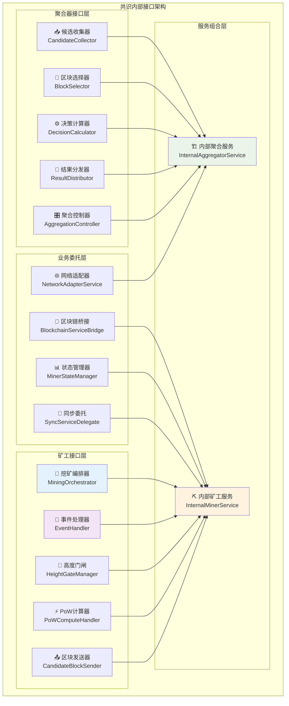
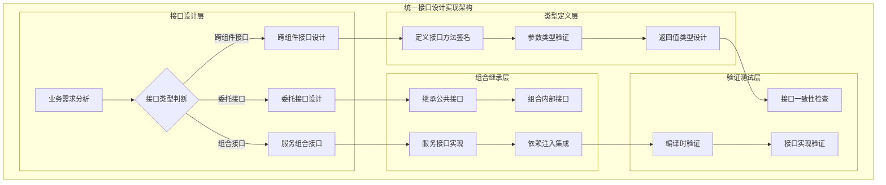

# 统一Aggregator接口定义（Unified Aggregator Interfaces）

【模块定位】
　　本模块是WES统一Aggregator架构的接口定义中心，重点定义统一Aggregator的**网络处理接口** + **共识决策接口**，以及简化后的Miner专用接口。通过标准化的接口设计，支撑统一网络处理、动态角色选择、距离计算等核心功能，确保架构简化后的组件协作稳定性。

【设计原则】
- **统一网络处理接口**：所有网络操作通过统一Aggregator接口处理
- **角色简化设计**：Miner接口仅关注挖矿算法，Aggregator承担网络+共识双重职责
- **距离计算抽象**：提供标准化的K-bucket距离计算和路由决策接口
- **内部调用优化**：Miner通过内部接口调用Aggregator，不直接网络操作
- **类型安全**：强类型接口定义，编译时错误检测
- **职责清晰**：明确区分Aggregator的网络处理接口与共识决策接口

【核心职责】
1. **统一Aggregator接口**：定义所有区块统一入口（网络+本地）的处理接口，实现留下/扔出的核心逻辑
2. **距离计算接口**：定义K-bucket距离计算和动态角色选择的标准接口
3. **Miner内部调用接口**：定义Miner调用Aggregator的ProcessMinedBlock等内部接口
4. **简化Miner接口**：定义专注挖矿算法的简化Miner接口
5. **网络路由接口**：定义中继转发和网络消息处理的标准接口
6. **构建验证保障**：确保接口定义的编译正确性和一致性

【实现架构】

　　采用**统一网络接口 → 距离计算接口 → 内部调用接口**的统一Aggregator接口架构，确保网络处理与共识决策的有机结合。



**架构层次说明：**

1. **聚合器接口层**：定义聚合节点的核心业务接口
   - 候选区块收集和管理
   - 决策计算和区块选择
   - 结果分发和网络广播

2. **矿工接口层**：定义矿工节点的核心业务接口
   - 挖矿流程编排和控制
   - PoW计算和区块生产
   - 事件处理和状态管理

3. **业务委托层**：定义专用委托接口
   - 区块链服务桥接
   - 网络同步委托
   - 状态和配置管理

4. **服务组合层**：标准化的服务接口组合
   - 继承公共接口保持对外一致性
   - 组合内部接口支持子组件协作

---

## 📁 **模块组织结构**

【接口定义模块架构】

```
interfaces/
├── 📖 README.md           # 本文档
├── 🏗️ aggregator.go       # 聚合器内部接口定义
└── ⛏️ miner.go            # 矿工内部接口定义
```

### **🎯 模块职责分工**

| **模块** | **核心职责** | **接口数量** | **主要组件** | **复杂度** |
|----------|-------------|-------------|-------------|-----------|
| `aggregator.go` | 聚合器接口定义 | 9个核心接口 | 候选收集、决策计算、结果分发 | ⭐⭐⭐⭐ |
| `miner.go` | 矿工接口定义 | 7个核心接口 | 挖矿编排、PoW计算、状态管理 | ⭐⭐⭐⭐⭐ |

---

## 🔄 **统一接口设计实现**

【实现策略】

　　所有接口定义均严格遵循**类型安全+委托模式+组合继承**设计模式，确保接口体系的高可用性和可维护性。



**关键实现要点：**

1. **标准化接口设计**：
   - 统一的参数命名和类型约定
   - 清晰的错误处理和返回值规范
   - 完整的上下文和生命周期管理

2. **高效委托机制**：
   - Controller专用委托接口分离复杂逻辑
   - 业务逻辑委托到专门的处理器
   - 接口实现的可测试性和可替换性

3. **组合继承模式**：
   - 继承公共接口保持对外一致性
   - 组合内部接口支持子组件协作
   - 清晰的职责边界和实现委托

---

## 🏗️ **fx依赖注入集成**

【框架集成配置】

　　完全集成到共识组件的fx依赖注入体系中，实现接口实现的自动装配和生命周期管理。

```go
// 示例：接口实现依赖注入配置
package consensus

import (
    "go.uber.org/fx"
    "github.com/weisyn/v1/internal/core/consensus/interfaces"
    "github.com/weisyn/v1/internal/core/consensus/miner"
    "github.com/weisyn/v1/internal/core/consensus/aggregator"
)

// Module 共识组件模块
var Module = fx.Module("consensus",
    // 接口实现提供者
    fx.Provide(
        // 创建内部矿工服务
        func(params MinerModuleParams) interfaces.InternalMinerService {
            return miner.NewManager(params)
        },
        
        // 创建内部聚合服务
        func(params AggregatorModuleParams) interfaces.InternalAggregatorService {
            return aggregator.NewManager(params)
        },
        
        // 提供公共接口实现
        fx.Annotate(
            func(internal interfaces.InternalMinerService) consensus.MinerService {
                return internal
            },
            fx.As(new(consensus.MinerService)),
        ),
    ),
    
    // 生命周期管理
    fx.Invoke(
        func(lc fx.Lifecycle, minerService interfaces.InternalMinerService) {
            lc.Append(fx.Hook{
                OnStart: func(ctx context.Context) error {
                    return minerService.StartMining(ctx)
                },
                OnStop: func(ctx context.Context) error {
                    return minerService.StopMining(ctx)
                },
            })
        },
    ),
)
```

**依赖管理特点：**
- **自动生命周期**：与组件主模块完全同步的启动停止管理
- **智能接口选择**：优先使用内部接口，对外暴露公共接口
- **类型安全注入**：通过强类型接口进行依赖注入，支持编译时验证
- **配置驱动实现**：支持运行时配置和环境变量控制接口行为

---

## 📊 **接口设计规范**

【接口设计目标】

| **接口类型** | **方法数量** | **复杂度等级** | **使用频率** | **维护策略** |
|-------------|-------------|---------------|-------------|------------|
| 跨组件业务接口 | 2-4个方法 | ⭐⭐⭐ | 高频 | 稳定维护 |
| 委托专用接口 | 1-3个方法 | ⭐⭐ | 中频 | 按需优化 |
| 服务组合接口 | 继承+组合 | ⭐⭐⭐⭐⭐ | 高频 | 持续重构 |
| 网络适配接口 | 1-2个方法 | ⭐⭐ | 中频 | 按需扩展 |

**接口设计策略：**
- **职责单一原则**：每个接口专注于单一业务领域
- **依赖倒置原则**：高层模块不依赖低层模块的具体实现
- **接口隔离原则**：客户端不应依赖它不需要的接口方法
- **开闭原则**：接口对扩展开放，对修改封闭

---

## 🎯 **核心概念与组件**

【聚合器接口体系】
共识系统聚合节点的完整接口定义，核心功能：
- 📥 **候选区块收集**：收集和管理来自矿工的候选区块
- 🎯 **智能区块选择**：基于算法选择最佳候选区块
- ⚙️ **决策计算引擎**：执行共识算法和决策计算
- 📡 **结果分发广播**：向网络分发共识结果和确认信息
- 🌐 **网络适配服务**：提供网络层协议适配和路由

【矿工接口体系】
共识系统矿工节点的完整接口定义，核心特性：
- 🎼 **挖矿编排控制**：协调整个挖矿流程的执行和错误处理
- ⚡ **PoW计算处理**：委托PoW引擎执行区块挖掘计算
- 📤 **候选区块发送**：通过K桶近邻选择目标并发送候选区块
- 📢 **事件处理响应**：处理区块链事件回调和状态同步
- 🚪 **高度门闸管理**：防止重复挖矿，确保高度同步

【业务委托接口】
标准化的业务委托和桥接接口：
- 🌉 **区块链服务桥接**：桥接区块链核心服务，隔离具体实现
- 📊 **矿工状态管理**：管理矿工运行状态，确保状态转换安全性
- 🔄 **同步服务委托**：委托同步操作给专门的同步服务
- 🌐 **网络适配器服务**：提供网络层集成所需的适配器访问

【事件处理接口】
标准化的系统事件处理接口：
- 📡 **聚合器事件处理**：处理链重组、网络质量变化等系统事件
- ⛏️ **矿工事件处理**：处理分叉检测、处理进度、完成状态等事件
- 🎯 **事件订阅集成**：继承integration/event订阅接口，确保架构一致性
- 🔄 **状态协调响应**：与状态管理器协调，确保事件处理的安全性

## 🎯 接口分类

### 聚合器接口 (10 个核心接口)
```go
// 候选区块收集器
type CandidateCollector interface {
    CollectCandidate(ctx context.Context, candidateBlock *block.Block, from peer.ID) error
    GetCandidateBlocks(ctx context.Context, height uint64) ([]*block.Block, error)
}

// 决策计算器
type DecisionCalculator interface {
    CalculateDecision(ctx context.Context, candidates []*block.Block, height uint64) (*block.Block, error)
}
```

// 聚合器事件处理器
type AggregatorEventHandler interface {
    HandleChainReorganized(ctx context.Context, eventData *types.ChainReorganizedEventData) error
    HandleNetworkQualityChanged(ctx context.Context, eventData *types.NetworkQualityChangedEventData) error
}
```

**核心场景**：
- 🎯 候选区块收集 - 从矿工节点收集候选区块并管理
- 📊 决策计算处理 - 基于共识算法计算最优区块选择
- 📡 系统事件响应 - 处理链重组、网络变化等系统事件

### 矿工接口 (8 个核心接口)
```go
// 挖矿编排器
type MiningOrchestrator interface {
    ExecuteMiningRound(ctx context.Context) error
    HandleMiningError(err error)
}

// PoW计算处理器
type PoWComputeHandler interface {
    ProduceBlockFromTemplate(ctx context.Context, candidateBlock *block.Block) (*block.Block, error)
}

// 矿工事件处理器
type MinerEventHandler interface {
    HandleForkDetected(ctx context.Context, eventData *types.ForkDetectedEventData) error
    HandleForkProcessing(ctx context.Context, eventData *types.ForkProcessingEventData) error
    HandleForkCompleted(ctx context.Context, eventData *types.ForkCompletedEventData) error
}
```

**核心场景**：
- 🎯 挖矿流程编排 - 协调整个挖矿轮次的执行和错误处理
- ⚡ PoW计算执行 - 委托PoW引擎执行区块挖掘计算
- 🔀 分叉事件响应 - 处理分叉检测、处理进度、完成状态等事件

### 业务委托接口 (4 个专用接口)
```go
// 区块链服务桥接
type BlockchainServiceBridge interface {
    CreateMiningCandidate(ctx context.Context) ([]byte, error)
    GetChainInfo(ctx context.Context) (*types.ChainInfo, error)
}

// 矿工状态管理
type MinerStateManager interface {
    GetMinerState() types.MinerState
    SetMinerState(state types.MinerState) error
}
```

**核心场景**：
- 🌉 服务桥接 - 桥接区块链核心服务，隔离Controller与具体实现
- 📊 状态管理 - 管理矿工运行状态，确保状态转换的安全性

## 🏗️ 架构设计

### 接口继承组合
```go
// 内部矿工服务接口组合
type InternalMinerService interface {
    consensus.MinerService // 继承公共接口
    
    // 组合内部业务接口
    MiningOrchestrator
    EventHandler
    HeightGateManager
    
    // 组合委托接口
    PoWComputeHandler
    CandidateBlockSender
    BlockchainServiceBridge
    MinerStateManager
    SyncServiceDelegate
}
```

### 接口实现模式
遵循统一的接口实现模式：
- **Manager模式** - 每个接口通过Manager结构体实现
- **Constructor模式** - 提供New*构造函数创建接口实例
- **依赖注入** - 通过fx.Provide提供接口实现
- **生命周期管理** - 通过fx.Lifecycle管理接口生命周期

### 委托实现策略
Controller专用委托接口的实现策略：
- **业务分离** - 复杂业务逻辑委托给专门的处理器
- **职责单一** - 每个委托接口专注于单一业务领域
- **可测试性** - 接口实现支持单元测试和模拟替换
- **可扩展性** - 支持接口方法的动态扩展和版本演进

## 🚀 使用示例

### 基础接口实现
```go
// 实现聚合器接口
type AggregatorManager struct {
    collector    interfaces.CandidateCollector
    selector     interfaces.BlockSelector
    calculator   interfaces.DecisionCalculator
    distributor  interfaces.ResultDistributor
}

// 实现内部聚合服务接口
func (m *AggregatorManager) CollectCandidate(
    ctx context.Context, 
    candidateBlock *block.Block, 
    from peer.ID) error {
    
    // 委托给候选收集器
    return m.collector.CollectCandidate(ctx, candidateBlock, from)
}

// 实现矿工接口
type MinerManager struct {
    orchestrator    interfaces.MiningOrchestrator
    powHandler      interfaces.PoWComputeHandler
    blockSender     interfaces.CandidateBlockSender
    stateManager    interfaces.MinerStateManager
}

// 实现内部矿工服务接口
func (m *MinerManager) ExecuteMiningRound(ctx context.Context) error {
    // 委托给挖矿编排器
    return m.orchestrator.ExecuteMiningRound(ctx)
}
```

### 委托接口使用
```go
// Controller中使用委托接口
type MinerController struct {
    powHandler      interfaces.PoWComputeHandler
    blockchainBridge interfaces.BlockchainServiceBridge
    stateManager    interfaces.MinerStateManager
    syncDelegate    interfaces.SyncServiceDelegate
}

func (c *MinerController) StartMining(ctx context.Context) error {
    // 检查矿工状态
    currentState := c.stateManager.GetMinerState()
    if currentState != types.MinerStateIdle {
        return fmt.Errorf("矿工状态不允许启动: %v", currentState)
    }
    
    // 设置挖矿状态
    if err := c.stateManager.SetMinerState(types.MinerStateMining); err != nil {
        return fmt.Errorf("设置挖矿状态失败: %v", err)
    }
    
    // 创建挖矿候选
    candidateHash, err := c.blockchainBridge.CreateMiningCandidate(ctx)
    if err != nil {
        return fmt.Errorf("创建挖矿候选失败: %v", err)
    }
    
    // 启动PoW引擎
    return c.powHandler.StartPoWEngine(ctx, types.MiningParameters{
        CandidateHash: candidateHash,
        Difficulty:    config.MiningDifficulty,
    })
}
```

### 接口组合集成
```go
// 在fx模块中提供接口实现
var Module = fx.Module("consensus",
    fx.Provide(
        // 提供聚合器子接口实现
        func(params AggregatorParams) interfaces.CandidateCollector {
            return candidate_collector.NewCollector(params)
        },
        func(params AggregatorParams) interfaces.DecisionCalculator {
            return decision_calculator.NewCalculator(params)
        },
        
        // 提供矿工子接口实现
        func(params MinerParams) interfaces.MiningOrchestrator {
            return mining_orchestrator.NewManager(params)
        },
        func(params MinerParams) interfaces.PoWComputeHandler {
            return pow_compute_handler.NewManager(params)
        },
        
        // 组合为内部服务接口
        func(
            collector interfaces.CandidateCollector,
            calculator interfaces.DecisionCalculator,
            // ... 其他接口
        ) interfaces.InternalAggregatorService {
            return aggregator.NewManager(collector, calculator /* ... */)
        },
    ),
)
```

## 📊 接口维护和演进

### 接口版本管理
```go
// 接口版本标记
const (
    InterfaceVersionV1 = "v1.0.0"
    InterfaceVersionV2 = "v2.0.0" // 未来版本
)

// 向后兼容性处理
type VersionedInterface interface {
    GetVersion() string
    IsCompatible(version string) bool
}
```

### 接口质量检查
```go
// 接口一致性验证
func ValidateInterfaceConsistency() error {
    // 检查接口方法签名一致性
    // 验证返回值类型规范
    // 确认参数命名约定
    return nil
}

// 接口实现检查
func ValidateInterfaceImplementation(impl interface{}) error {
    // 检查接口方法是否完全实现
    // 验证方法行为是否符合接口约定
    // 确认错误处理是否规范
    return nil
}
```

## 🧪 测试策略

### 接口契约测试
专注于接口契约验证，确保实现的正确性：
```bash
# 运行接口契约测试
go test ./interfaces -v -run TestInterface

# 运行接口一致性检查
go test ./interfaces -v -run TestConsistency
```

### 测试覆盖范围
- ✅ **接口定义** - 验证所有接口方法签名正确
- ✅ **类型一致性** - 确保参数和返回值类型一致
- ✅ **方法实现** - 测试接口方法的基本实现
- ✅ **组合继承** - 验证接口组合和继承关系
- ✅ **依赖注入** - 测试fx依赖注入的正确性
- 📊 **性能基准** - 关键接口方法的性能基准测试

## 🔧 配置参考

### 接口配置
```go
type InterfaceConfig struct {
    EnableValidation     bool          // 启用接口验证: true
    StrictMode          bool          // 严格模式: false
    EnableProfiling     bool          // 启用性能分析: false
    LogLevel            string        // 日志级别: "info"
    TimeoutDuration     time.Duration // 操作超时: 30s
    RetryCount          int           // 重试次数: 3
    EnableCircuitBreaker bool         // 启用熔断器: false
}
```

### 实现配置
```go
type ImplementationConfig struct {
    ComponentName       string         // 组件名称
    EnableAutoStart     bool           // 自动启动: true
    EnableLifecycle     bool           // 生命周期管理: true
    PoolSize            int            // 工作池大小: 8
    BufferSize          int            // 缓冲区大小: 1000
    ProcessTimeout      time.Duration  // 处理超时: 10s
    EnableMetrics       bool           // 启用指标: true
    EnableHealthCheck   bool           // 启用健康检查: true
}
```

## 🎯 最佳实践

### 接口设计原则
1. **🎯 职责单一** - 每个接口专注于单一业务职责
2. **📊 类型安全** - 使用强类型参数和返回值
3. **⚡ 性能优化** - 合理使用上下文和超时机制
4. **🔄 向后兼容** - 接口演进保持向后兼容性
5. **📈 可测试性** - 接口设计支持单元测试和模拟

### 实现规范
1. **🛡️ 错误处理** - 统一的错误处理和返回规范
2. **🔄 生命周期** - 正确实现接口的生命周期管理
3. **📝 文档注释** - 详细的接口方法文档和使用示例
4. **🚨 日志记录** - 合理的日志记录和错误追踪

### 维护策略
1. **⚡ 定期审查** - 定期审查接口设计和实现质量
2. **📦 版本管理** - 规范的接口版本管理和升级策略
3. **🎯 性能监控** - 持续监控接口性能和资源使用
4. **💾 兼容性测试** - 确保接口变更的向后兼容性

## 📚 相关文档

- [共识系统整体架构](../../README.md)
- [聚合器组件文档](../aggregator/README.md)
- [矿工组件文档](../miner/README.md)
- [WES v0.0.1 共识接口规范](../../../../pkg/interfaces/consensus/consensus.go)

## 🚀 快速开始

1. **了解接口定义** 阅读aggregator.go和miner.go了解接口结构
2. **实现业务接口** 根据业务需求实现相应的接口方法
3. **配置依赖注入** 在组件的module.go中添加接口实现
4. **编写单元测试** 验证接口实现的正确性和性能
5. **集成生命周期** 确保接口实现正确集成到组件生命周期
6. **性能优化** 根据实际使用情况优化接口实现性能

---

## 📊 **性能与监控**

【性能指标目标】

| **接口类型** | **调用延迟** | **吞吐量目标** | **成功率目标** | **监控方式** |
|-------------|-------------|---------------|---------------|------------|
| 聚合器核心接口 | < 50ms | > 1000 CPS | > 99.9% | 实时监控 |
| 矿工编排接口 | < 100ms | > 500 OPS | > 99.5% | 关键路径监控 |
| PoW计算接口 | 5s - 30s | 可变 | > 98.0% | 异步监控 |
| 委托业务接口 | < 20ms | > 2000 OPS | > 99.8% | 实时监控 |
| 服务组合接口 | < 200ms | > 100 SPS | > 99.0% | 复合监控 |

**性能优化策略：**
- **接口调用优化**：减少接口调用层次，合并相关操作
- **类型转换优化**：避免不必要的类型转换和内存复制
- **并发安全优化**：使用读写锁和无锁数据结构
- **资源管理优化**：接口实例池化和生命周期优化

---

## 🔗 **与公共接口的映射关系**

【接口实现映射】

```mermaid
classDiagram
    class InternalMinerService {
        <<interface>>
        +StartMining(ctx context.Context, minerAddress []byte) error
        +StopMining(ctx context.Context) error
        +GetMiningStatus() (bool, []byte, error)
        +ExecuteMiningRound(ctx context.Context) error
        +ProduceBlockFromTemplate(candidateBlock CandidateBlock) Block
        +HandleMiningError(err error) error
    }
    
    class MiningOrchestrator {
        <<interface>>
        +ExecuteMiningRound(ctx context.Context) error
        +ProduceBlockFromTemplate(candidateBlock CandidateBlock) Block
        +HandleMiningError(err error) error
    }
    
    class PoWComputeHandler {
        <<interface>>
        +StartPoWEngine(ctx context.Context, params MiningParameters) error
        +StopPoWEngine(ctx context.Context) error
        +ProduceBlockFromTemplate(candidateBlock CandidateBlock) Block
        +IsPoWEngineRunning() bool
    }
    
    class EventHandler {
        <<interface>>
        +HandleBlockProcessed(event BlockProcessedEvent) error
        +HandleBlockFinalized(event BlockFinalizedEvent) error
        +HandleNetworkStateChanged(event NetworkStateEvent) error
    }
    
    class HeightGateManager {
        <<interface>>
        +GetLastProcessedHeight() uint64
        +UpdateLastProcessedHeight(height uint64)
        +WaitForHeightUpdate(ctx context.Context, targetHeight uint64) error
        +IsHeightGateOpen(targetHeight uint64) bool
    }
    
    class InternalAggregatorService {
        <<interface>>
        +StartAggregation(ctx context.Context) error
        +StopAggregation(ctx context.Context) error
        +GetAggregationStatus() AggregationStatus
        +CollectCandidate(candidateBlock CandidateBlock) error
        +CalculateDecision(candidates []CandidateBlock) DecisionResult
        +SelectBestBlock(decisionResult DecisionResult) CandidateBlock
        +DistributeResult(selectedBlock CandidateBlock) error
    }
    
    class CandidateCollector {
        <<interface>>
        +CollectCandidate(ctx context.Context, candidateBlock CandidateBlock) error
        +GetCandidatesByHeight(height uint64) []CandidateBlock
        +HandleBlockSubmission(stream network.Stream)
    }
    
    class DecisionCalculator {
        <<interface>>
        +CalculateDecision(candidates []CandidateBlock) DecisionResult
        +SetWeightFactors(factors WeightFactors) error
        +ValidateThreshold(result DecisionResult) bool
    }
    
    class BlockSelector {
        <<interface>>
        +SelectBestBlock(decisionResult DecisionResult) CandidateBlock
        +SetSelectionStrategy(strategy SelectionStrategy) error
        +ScoreBlocks(candidates []CandidateBlock) []ScoredBlock
    }
    
    class ResultDistributor {
        <<interface>>
        +DistributeResult(selectedBlock CandidateBlock) error
        +BroadcastLatestBlock(block Block) error
        +TrackConfirmation(blockHash []byte) ConfirmationStatus
    }
    
    InternalMinerService --> MiningOrchestrator : composes
    InternalMinerService --> PoWComputeHandler : composes
    InternalMinerService --> EventHandler : composes
    InternalMinerService --> HeightGateManager : composes
    
    InternalAggregatorService --> CandidateCollector : composes
    InternalAggregatorService --> DecisionCalculator : composes
    InternalAggregatorService --> BlockSelector : composes
    InternalAggregatorService --> ResultDistributor : composes
```



**实现要点：**
- **接口组合**：通过接口组合实现复杂服务的分层设计
- **委托模式**：Controller通过委托接口实现业务逻辑分离
- **类型安全**：强类型接口定义确保编译时类型检查
- **生命周期管理**：接口实现与组件生命周期同步管理

---

## 🚀 **后续扩展规划**

【模块演进方向】

1. **接口版本管理增强**
   - 实现接口版本控制和兼容性检查
   - 支持接口的渐进式升级和迁移
   - 添加接口废弃和替换机制

2. **接口性能监控**
   - 实现接口调用性能监控和分析
   - 添加接口调用链追踪和调试支持
   - 优化接口实现的性能瓶颈

3. **接口扩展支持**
   - 支持插件化接口扩展机制
   - 实现接口的动态注册和发现
   - 添加第三方接口集成支持

4. **接口安全增强**
   - 实现接口访问控制和权限管理
   - 添加接口调用审计和日志记录
   - 增强接口参数验证和安全检查

---

## 📋 **开发指南**

【接口开发规范】

1. **新建接口步骤**：
   - 在对应的.go文件中定义接口方法签名
   - 添加详细的接口文档注释和使用示例
   - 实现接口的具体业务逻辑
   - 添加完整的接口单元测试和契约测试
   - 更新接口依赖注入配置

2. **接口设计要求**：
   - 遵循Go语言接口设计最佳实践
   - 保持接口方法的职责单一和语义清晰
   - 使用强类型参数和返回值
   - 完善的错误处理和上下文管理

3. **接口实现要求**：
   - 严格遵循接口契约和方法签名
   - 实现高效的接口调用和资源管理
   - 确保接口实现的并发安全性
   - 提供完整的接口实现测试覆盖

【参考文档】
- [聚合器接口实现](../aggregator/README.md)
- [矿工接口实现](../miner/README.md) 
- [共识系统架构文档](../README.md)
- [WES公共接口规范](../../../../pkg/interfaces/consensus/)

---

> 📝 **模板说明**：本README模板基于WES v0.0.1统一文档规范设计，使用时请根据具体模块需求替换相应的占位符内容，并确保所有章节都有实质性的技术内容。

> 🔄 **维护指南**：本文档应随着接口定义的演进及时更新，确保文档与接口实现的一致性。建议在每次接口变更后更新相应章节。
