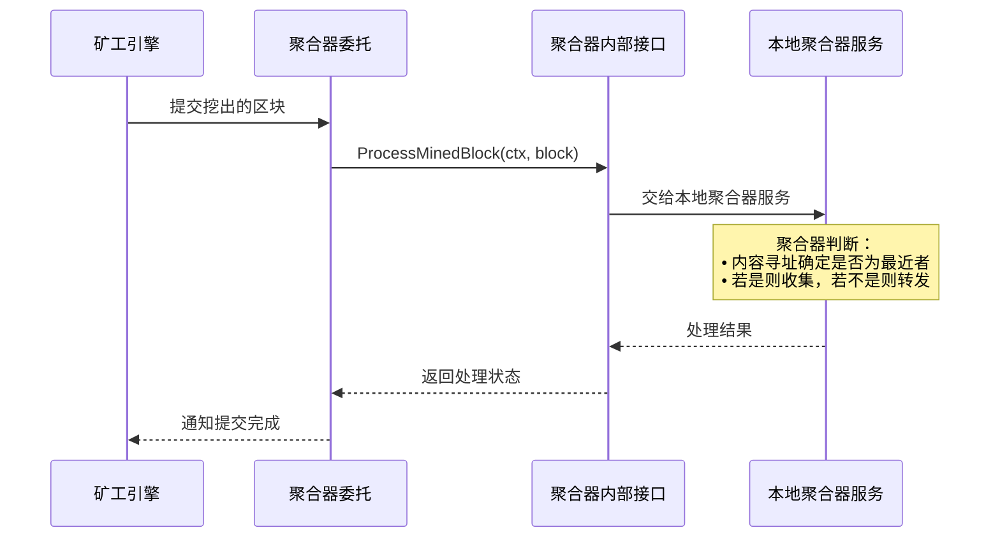
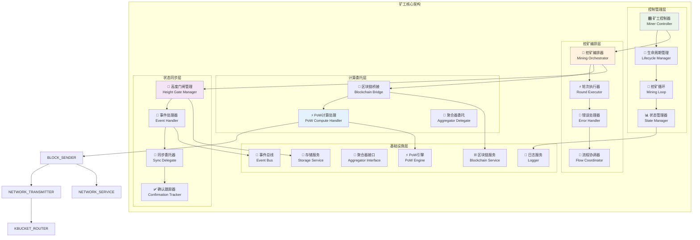
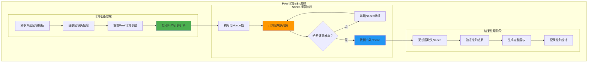
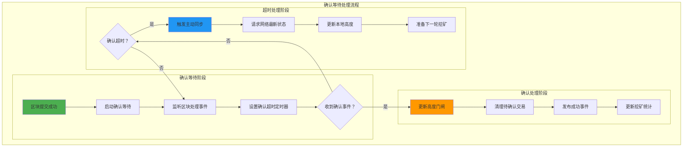
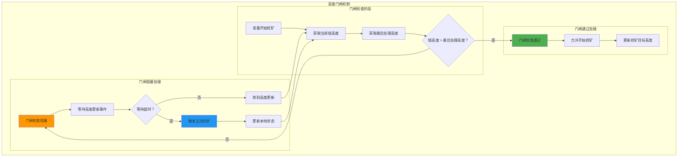
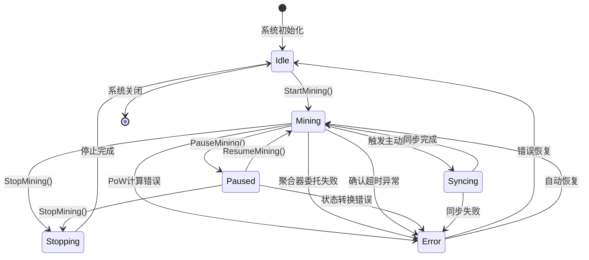
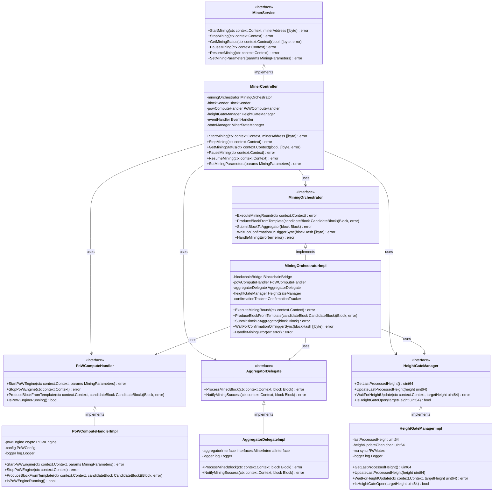

# 专注矿工模块（Dedicated Miner）

【模块定位】
　　本模块在WES统一Aggregator架构中专注于纯粹的挖矿算法：候选区块模板创建 → 工作量证明计算 → 内部接口委托处理。**严格禁止任何网络相关的内容**，不直接处理网络传输、K桶选择、路由决策、协议封装等网络层面的复杂逻辑，而是通过内部接口将挖出的区块交给Aggregator统一处理，实现职责单一化和架构优化。

【设计原则】
- **专注挖矿算法**：专注于PoW计算和区块模板创建，**完全移除网络复杂性**
- **统一委托架构**：挖出区块通过内部接口交给Aggregator统一处理
- **网络职责分离**：**Miner绝不包含任何网络服务、协议处理、消息传输相关代码**
- **高效计算流程**：优化PoW计算各阶段执行效率，最小化出块延迟
- **状态安全管理**：线程安全的状态机制，防止并发冲突
- **高度同步门闸**：防重复挖矿的智能高度同步机制
- **事件驱动响应**：基于区块链事件的异步状态同步
- **分叉事件处理**：处理分叉检测、处理进度、完成状态，确保挖矿安全

【核心职责】
1. **挖矿生命周期管理**：矿工启动、停止、暂停恢复的完整生命周期控制
2. **候选区块模板创建**：从交易池选择交易，创建有效的候选区块模板
3. **工作量证明计算**：高效的PoW计算，搜索满足难度要求的Nonce
4. **内部接口委托**：将挖出的区块通过内部接口交给Aggregator处理
5. **状态同步管理**：高度门闸、事件响应、挖矿状态转换的统一管理
6. **分叉安全响应**：监听分叉事件，及时暂停/恢复挖矿，避免冲突区块产生

【架构约束】
- **禁止网络依赖**：Miner模块内严禁导入或使用任何网络相关的包和服务
- **禁止协议处理**：不允许处理任何网络协议、消息封装、路由选择
- **禁止直接传输**：不允许直接发送或接收网络消息
- **统一委托入口**：所有对外通信必须通过AggregatorDelegate内部接口

【实现架构】

　　采用**控制管理 → 挖矿编排 → 算法计算 → 委托处理**的挖矿架构，专注于挖矿算法本身，确保挖矿流程的高效性。

### **🔗 内部接口集成**

　　矿工模块不再直接处理网络通信，而是通过内部接口与Aggregator集成，由Aggregator统一处理protobuf协议和网络通信。

**核心协议使用**：

| **操作场景** | **协议类型** | **Protocol ID** | **Message类型** | **Protobuf定义** |
|-------------|------------|-----------------|----------------|------------------|
| **提交候选区块** | Stream RPC | `/weisyn/consensus/block_submission/1.0.0` | `MinerBlockSubmission` | `pb/network/consensus.proto` |
| **接收聚合器响应** | Stream Response | `/weisyn/consensus/block_submission/1.0.0` | `AggregatorBlockAcceptance` | `pb/network/consensus.proto` |
| **订阅共识结果** | GossipSub | `weisyn.consensus.latest_block.v1` | `ConsensusResultBroadcast` | `pb/network/consensus.proto` |

**内部委托流程**：


**内部接口委托示例**：
```go
// 通过内部接口提交挖出的区块给本地聚合器
func (m *MiningOrchestratorImpl) SubmitBlockToAggregator(block Block) error {
    ctx := context.Background()
    
    // 调用聚合器内部接口，让聚合器处理路由和转发逻辑
    err := m.aggregatorDelegate.ProcessMinedBlock(ctx, block)
    if err != nil {
        m.logger.Info("提交区块给聚合器失败", "blockHeight", block.Header.Height, "error", err)
        return fmt.Errorf("聚合器处理失败: %v", err)
    }
    
    m.logger.Info("区块已成功提交给本地聚合器", "blockHeight", block.Header.Height, "blockHash", block.Header.Hash)
    return nil
}
```



**架构层次说明：**

1. **控制管理层**：管理矿工的生命周期和挖矿循环控制
   - 矿工控制器统一管理所有挖矿操作
   - 生命周期管理器控制启动、停止、暂停恢复
   - 挖矿循环管理器控制挖矿循环的执行

2. **挖矿编排层**：编排完整的挖矿轮次流程
   - 挖矿编排器协调整个挖矿流程
   - 轮次执行器执行单次挖矿轮次
   - 错误处理器处理挖矿过程中的各类错误

3. **计算委托层**：处理区块创建、PoW计算和结果委托
   - 区块链桥接负责候选区块创建和链状态查询
   - PoW计算处理器负责高效的工作量证明计算
   - 聚合器委托负责将挖出区块委托给本地聚合器服务

4. **状态同步层**：管理高度同步和事件处理
   - 高度门闸管理器防止重复挖矿
   - 事件处理器处理区块链事件
   - 同步委托器负责主动同步操作

---

## 📁 **模块组织架构**

```text
miner/
├── 📖 README.md              # 本文档：矿工模块整体架构设计
├── 🏗️ manager.go             # 矿工管理器：fx依赖注入和接口组装
├── 🎛️ controller/            # 矿工控制器：生命周期管理、挖矿循环控制
│   ├── controller.go         # 控制器核心逻辑和接口实现
│   ├── start_mining.go       # 启动挖矿：状态检查、环境初始化、循环启动
│   ├── stop_mining.go        # 停止挖矿：优雅停止、资源清理、状态更新
│   ├── get_mining_status.go  # 状态查询：挖矿状态、统计信息查询接口
│   └── mining_loop.go        # 挖矿循环：核心挖矿循环、门闸检查、轮次执行
├── 🎼 mining_orchestrator/   # 挖矿编排器：完整挖矿轮次的流程编排
│   ├── manager.go            # 编排管理器：编排逻辑协调
│   ├── execute_mining_round.go     # 轮次执行：完整挖矿轮次流程编排
│   ├── handle_mining_error.go      # 错误处理：挖矿错误分类处理和恢复
│   ├── produce_block_from_template.go    # 区块生产：PoW计算和区块生成
│   ├── submit_block_to_aggregator.go     # 区块提交：通过内部接口提交给本地aggregator
│   └── wait_for_confirmation_or_trigger_sync.go  # 确认等待：确认处理或同步触发
├── 🤝 aggregator_delegate/   # 聚合器委托：内部接口调用和错误处理
├── ⚡ pow_compute_handler/   # PoW计算处理：工作量证明计算委托管理
├── 🌉 blockchain_service_bridge/  # 区块链桥接：候选区块创建、链状态查询
├── 📢 event_handler/         # 事件处理器：区块处理事件响应、状态同步
├── 🚪 height_gate_manager/   # 高度门闸：防重复挖矿的高度同步机制
├── 📊 miner_state_manager/   # 状态管理器：矿工状态转换、并发安全控制
└── 🔄 sync_service_delegate/ # 同步委托器：区块链同步操作委托
```

---

## 🔄 **统一挖矿流程实现**

【实现策略】

　　所有子模块均严格遵循**门闸检查 → 区块创建 → PoW计算 → 内部委托 → 确认处理**架构模式，确保挖矿流程的一致性和高效性。

```mermaid
flowchart TD
    subgraph "统一挖矿流程实现架构"
        subgraph "挖矿准备层"
            A[挖矿循环启动] --> B{高度门闸检查}
            B -->|通过| C[获取区块链状态]
            B -->|阻塞| D[等待高度更新]
            D --> A
        end
        
        subgraph "区块创建层"
            C --> E[从交易池选择交易]
            E --> F[创建候选区块模板]
            F --> G[设置区块头参数]
            G --> H[计算Merkle根]
            H --> I[生成候选区块]
        end
        
        subgraph "PoW计算层"
            I --> J[启动PoW计算引擎]
            J --> K[执行Nonce搜索]
            K --> L{找到有效Nonce？}
            L -->|是| M[生成完整区块]
            L -->|否| N[继续搜索]
            N --> K
        end
        
        subgraph "内部委托层"
            M --> O[聚合器委托调用]
            O --> P[内部接口调用]
            P --> Q[本地聚合器处理]
            Q --> R{委托成功？}
            R -->|是| S[进入确认等待]
            R -->|否| T[错误退避重试]
            T --> O
        end
        
        subgraph "确认处理层"
            S --> U[监听确认事件]
            U --> V{收到确认？}
            V -->|是| W[更新高度门闸]
            V -->|否| X{确认超时？}
            X -->|否| U
            X -->|是| Y[触发主动同步]
            W --> A
            Y --> A
        end
    end
```



**关键实现要点：**

1. **标准化流程控制**：
   - 统一的挖矿轮次启动、执行、结束流程
   - 一致的错误处理和恢复机制
   - 标准化的状态转换和生命周期管理

2. **高效资源利用**：
   - PoW计算的并行优化和资源复用
   - 内部委托的统一接口和错误处理
   - 内存和缓存的合理分配和回收

3. **可靠状态同步**：
   - 高度门闸的智能检查和等待机制
   - 区块确认的超时处理和主动同步
   - 事件驱动的异步状态更新机制

---

## 🔄 **完整挖矿流程设计**

【五阶段挖矿流程】

　　矿工采用"创建 → 计算 → 发送 → 确认 → 同步"的五阶段流程，通过精密的流程编排和智能优化，实现高效、可靠的区块挖掘。

### **阶段一：候选区块创建**

```mermaid
graph TB
    subgraph "候选区块创建流程"
        subgraph "交易选择阶段"
            A[启动挖矿轮次] --> B[获取当前链状态]
            B --> C[从交易池获取待处理交易]
            C --> D[按优先级排序交易]
            D --> E[选择最优交易组合]
        end
        
        subgraph "区块构建阶段"
            E --> F[创建区块头模板]
            F --> G[设置父区块哈希]
            G --> H[计算Merkle根哈希]
            H --> I[设置时间戳和难度]
            I --> J[生成候选区块]
        end
        
        subgraph "验证缓存阶段"
            J --> K[验证区块基本格式]
            K --> L[计算区块哈希]
            L --> M[缓存候选区块]
            M --> N[返回区块哈希标识]
        end
    end
    
    style A fill:#4CAF50
    style F fill:#FF9800
    style L fill:#2196F3
```



### **阶段二：工作量证明计算**



### **阶段三：内部接口委托**

```mermaid
graph TB
    subgraph "内部接口委托流程"
        subgraph "委托准备阶段"
            A[挖出完整区块] --> B[创建委托上下文]
            B --> C[验证区块完整性]
            C --> D[准备委托参数]
        end
        
        subgraph "接口调用阶段"
            D --> E[调用聚合器内部接口]
            E --> F[ProcessMinedBlock(ctx, block)]
            F --> G[等待聚合器处理]
            G --> H{处理成功？}
        end
        
        subgraph "结果处理阶段"
            H -->|是| I[记录提交成功]
            H -->|否| J[错误分类处理]
            J --> K[重试策略判断]
            K -->|重试| E
            K -->|放弃| L[记录最终失败]
            I --> M[通知上层成功]
        end
    end
    
    style E fill:#4CAF50
    style F fill:#FF9800
    style I fill:#2196F3
```

### **阶段四：确认等待处理**



### **阶段五：状态同步更新**

```mermaid
graph TB
    subgraph "状态同步更新流程"
        subgraph "高度门闸更新"
            A[收到区块确认事件] --> B[提取区块高度信息]
            B --> C[更新最后处理高度]
            C --> D[验证高度连续性]
        end
        
        subgraph "状态同步协调"
            D --> E[更新矿工内部状态]
            E --> F[清理过期数据]
            F --> G[刷新缓存信息]
            G --> H[发布状态变更事件]
        end
        
        subgraph "下轮准备"
            H --> I[检查挖矿条件]
            I --> J[准备下一轮挖矿]
            J --> K[重置轮次计数器]
            K --> L[进入下一个挖矿周期]
        end
    end
    
    style C fill:#4CAF50
    style F fill:#FF9800
    style J fill:#2196F3
```



## 🤝 **聚合器委托与接口调用**

【内部委托策略】

### **聚合器委托算法**

```text
算法：基于内部接口的区块委托处理
输入：挖出的完整区块 (minedBlock)
输出：聚合器处理结果状态

1. 委托准备：
   ctx = context.WithTimeout(背景上下文, 10秒)
   验证区块的基础完整性（哈希、签名、结构）
   
2. 内部接口调用：
   result = aggregatorInterface.ProcessMinedBlock(ctx, minedBlock)
   等待聚合器确认处理结果
   
3. 结果处理：
   如果成功：记录提交成功，通知上层
   如果失败：进行错误分类和重试判断

4. 错误恢复：
   可恢复错误（网络、超时）：重试最多3次
   永久错误（区块无效、高度过时）：直接放弃
```

### **委托接口规范**

```text
接口设计：标准化的内部接口调用

1. 接口方法：
   - ProcessMinedBlock(ctx, block): 主要委托方法
   - NotifyMiningSuccess(ctx, block): 成功通知方法
   - 遵循标准的Go接口约定和错误处理

2. 调用策略：
   - 单次调用：避免重复提交同一区块
   - 超时控制：防止长时间阻塞挖矿流程
   - 错误透传：保留详细的错误信息用于调试

3. 日志记录：
   - 成功提交：记录区块高度和哈希
   - 失败重试：记录错误原因和重试次数
   - 指数退避：1s, 2s, 4s 间隔重试
   - 最大重试：3 次失败后触发同步
```

### **协议可用性过滤**

```text
过滤机制：确保目标节点协议兼容性

1. 协议注册检查：
   - 检查目标节点是否注册区块提交协议
   - 协议ID：/weisyn/consensus/block_submission/1.0.0
   
2. 可达性判断：
   - 当前实现：基于 Call 成功/失败判断
   - 未来扩展：支持公网可达性检测
   - Call 失败 → 协议未注册 → 自动切换节点

3. 动态适应：
   - 根据历史成功率调整节点优先级
   - 维护节点质量评分缓存
   - 智能排除长期不可达节点
```

## 🚪 **高度门闸同步机制**

【防重复挖矿的智能门闸】

### **门闸工作原理**



### **高度同步策略**

1. **被动同步**：监听区块处理事件，自动更新最后处理高度
2. **主动同步**：门闸超时时触发sync服务，强制同步网络状态
3. **智能等待**：结合事件监听和定时检查的混合等待策略

## 📊 **矿工状态管理**

【完整状态机设计】



【状态转换规则】
- **Idle → Mining**：检查矿工地址，初始化挖矿环境
- **Mining → Paused**：暂停挖矿循环，保持状态
- **Paused → Mining**：恢复挖矿循环，继续挖矿
- **任何状态 → Stopping**：优雅停止，清理资源
- **错误状态**：自动恢复或手动重置

## 🔧 **关键配置参数**

【矿工核心配置】
```yaml
miner:
  # 基础挖矿配置
  confirmation_timeout: 30s      # 确认等待超时时间
  block_interval: 10s           # 目标出块间隔
  mining_threads: 4             # PoW计算线程数
  miner_address: ""             # 矿工奖励地址
  
  # 聚合器委托配置
  aggregator_call_timeout: 10s  # 聚合器接口调用超时
  max_retries: 3               # 委托失败最大重试次数
  retry_backoff: "1s,2s,4s"    # 委托重试退避时间序列
  success_notification: true   # 是否启用成功通知
  
  # 高度门闸配置
  height_check_interval: 5s     # 高度门闸检查间隔
  height_wait_timeout: 60s     # 高度等待超时时间
  max_height_lag: 3            # 允许的最大高度滞后
  
  # PoW计算配置
  pow_difficulty: 4            # PoW计算难度
  pow_timeout: 30s             # PoW计算超时
  nonce_step: 1               # Nonce递增步长
  
  # 状态管理配置
  state_transition_timeout: 5s  # 状态转换超时
  max_error_count: 10          # 最大错误计数
  error_reset_interval: 300s   # 错误计数重置间隔
```

---

## 🏗️ **依赖注入架构**

【fx框架集成】

　　全面采用fx依赖注入框架，实现矿工组件间的松耦合和生命周期自动管理。

```go
// 示例：矿工模块依赖注入配置
package miner

import (
    "go.uber.org/fx"
    "github.com/weisyn/v1/internal/core/consensus/interfaces"
    "github.com/weisyn/v1/pkg/interfaces/consensus"
)

// Module 矿工核心模块
var Module = fx.Module("miner",
    // 导入子模块
    fx.Provide(
        // 控制管理层
        controller.NewController,
        
        // 挖矿编排层
        mining_orchestrator.NewManager,
        mining_orchestrator.NewMiningOrchestrator,
        mining_orchestrator.NewRoundExecutor,
        mining_orchestrator.NewErrorHandler,
        
        // 计算传输层
        blockchain_service_bridge.NewManager,
        blockchain_service_bridge.NewBlockchainBridge,
        pow_compute_handler.NewManager,
        pow_compute_handler.NewPoWComputeHandler,
        block_sender.NewManager,
        block_sender.NewBlockSender,
        
        // 状态同步层
        height_gate_manager.NewManager,
        height_gate_manager.NewHeightGateManager,
        event_handler.NewManager,
        event_handler.NewEventHandler,
        sync_service_delegate.NewManager,
        sync_service_delegate.NewSyncDelegate,
        
        // 基础服务层
        miner_state_manager.NewManager,
        miner_state_manager.NewMinerStateManager,
    ),
    
    // 导出公共接口
    fx.Provide(
        fx.Annotate(
            func(ctrl *controller.Controller) consensus.MinerService {
                return ctrl
            },
            fx.As(new(consensus.MinerService)),
        ),
        fx.Annotate(
            func(ctrl *controller.Controller) interfaces.MinerController {
                return ctrl
            },
            fx.As(new(interfaces.MinerController)),
        ),
    ),
    
    // 生命周期管理
    fx.Invoke(InitializeMiningServices),
)

// 挖矿服务初始化
func InitializeMiningServices(
    minerService consensus.MinerService,
    powHandler *pow_compute_handler.PoWComputeHandler,
    heightGateManager *height_gate_manager.HeightGateManager,
    eventHandler *event_handler.EventHandler,
    config *MinerConfig,
    logger log.Logger,
) error {
    logger.Info("初始化矿工服务")
    
    // 初始化PoW计算引擎
    if err := powHandler.InitializePoWEngine(config.PoWConfig); err != nil {
        return fmt.Errorf("初始化PoW引擎失败: %v", err)
    }
    
    // 初始化高度门闸
    if err := heightGateManager.Initialize(); err != nil {
        return fmt.Errorf("初始化高度门闸失败: %v", err)
    }
    
    // 注册事件处理器
    if err := eventHandler.RegisterEventHandlers(); err != nil {
        return fmt.Errorf("注册事件处理器失败: %v", err)
    }
    
    logger.Info("矿工服务初始化完成")
    return nil
}
```

**依赖管理特点：**
- **分层模块注入**：按架构层次组织依赖注入，确保模块间协作清晰
- **服务生命周期**：统一管理各子模块的启动、运行和停止
- **接口契约导向**：基于接口而非实现的依赖注入模式
- **配置驱动初始化**：支持基于配置的服务参数初始化

---

## 📊 **性能与监控**

【性能指标目标】

| **操作类型** | **目标延迟** | **吞吐量目标** | **成功率目标** | **监控方式** |
|-------------|-------------|---------------|---------------|------------|
| 候选区块创建 | < 1s | > 10 BPM | > 99.5% | 实时监控 |
| PoW计算执行 | 5s - 30s | 可变 | > 98.0% | 关键路径监控 |
| 聚合器委托 | < 100ms | > 500 TPS | > 99.0% | 实时监控 |
| 确认等待处理 | < 30s | N/A | > 90.0% | 异步监控 |
| 高度门闸检查 | < 100ms | > 1000 QPS | > 99.8% | 实时监控 |

**性能优化策略：**
- **挖矿效率优化**：并行PoW计算、智能难度调整、预取候选区块
- **内部委托优化**：接口调用缓存、超时控制、重试机制
- **状态同步优化**：异步事件处理、智能门闸等待、批量更新
- **资源管理优化**：内存池复用、连接复用、缓存优化

---

## 🔗 **与公共接口的映射关系**

【接口实现映射】



**实现要点：**
- **接口契约**：严格遵循公共接口的方法签名和语义，确保外部调用兼容性
- **错误处理**：标准化的错误返回和异常处理机制，提供详细的错误信息  
- **日志记录**：完善的操作日志和性能指标记录，支持调试和监控
- **测试覆盖**：每个接口方法都有对应的单元测试和集成测试，确保质量

## 🏗️ **关键依赖接口**

【外部服务依赖】
- **区块链服务** (`blockchain.BlockService`): 候选区块创建、链信息查询
- **PoW引擎** (`crypto.POWEngine`): 工作量证明计算、Nonce搜索
- **网络服务** (`network.Network`): 协议调用、消息传输
- **聚合器接口** (`interfaces.MinerInternalInterface`): 区块委托处理、结果通知
- **事件系统** (`event.EventBus`): 事件订阅、状态同步
- **存储服务** (`repository.*`): 区块数据读取、索引查询

【内部接口协作】
- **跨组件接口**：挖矿编排、事件处理、高度门闸管理
- **专用委托接口**：PoW计算、聚合器委托、区块链桥接、状态管理、同步委托

## 🚀 **使用示例**

【基础挖矿操作】
```go
// 启动挖矿
minerAddress := []byte{0x12, 0x34, ..., 0xab} // 20字节矿工地址
err := minerService.StartMining(ctx, minerAddress)
if err != nil {
    log.Errorf("启动挖矿失败: %v", err)
    return
}

// 查询挖矿状态
isRunning, address, err := minerService.GetMiningStatus(ctx)
if err != nil {
    log.Errorf("查询状态失败: %v", err)
    return
}
log.Infof("挖矿状态: running=%v, address=%x", isRunning, address)

// 停止挖矿
err = minerService.StopMining(ctx)
if err != nil {
    log.Errorf("停止挖矿失败: %v", err)
    return
}
```

## 🎯 **质量保证**

【代码质量标准】
- **接口规范**：严格实现 `consensus.MinerService` 公共接口
- **线程安全**：所有状态管理操作都是线程安全的
- **错误处理**：完善的错误分类、处理和恢复机制
- **资源管理**：正确的资源创建、使用和清理
- **配置驱动**：所有关键参数可配置，支持热更新

【测试覆盖】
- **单元测试**：各子模块的独立功能测试
- **集成测试**：完整挖矿流程的端到端测试
- **性能测试**：PoW计算、聚合器委托的性能基准测试
- **压力测试**：高负载下的稳定性和资源使用测试

---

## 🚀 **后续扩展规划**

【模块演进方向】

1. **PoW算法优化增强**
   - 支持更多PoW算法（Ethash、Blake2b等）
   - 实现自适应难度调整算法
   - 添加GPU加速计算支持

2. **委托接口性能提升**
   - 优化聚合器委托调用性能
   - 实现接口调用连接池复用
   - 添加委托调用监控和统计

3. **挖矿策略智能化**
   - 支持基于收益的智能挖矿策略
   - 实现多池切换和负载均衡
   - 添加机器学习辅助的参数优化

4. **高可用性和容错能力**
   - 实现矿工集群和故障转移
   - 添加分布式挖矿协调机制
   - 增强网络分区和异常恢复能力

---

## 📋 **开发指南**

【子模块开发规范】

1. **新建子模块步骤**：
   - 在interfaces/中定义矿工内部接口
   - 创建子模块目录和基础文件结构
   - 实现核心挖矿业务逻辑
   - 添加完整的单元测试和集成测试
   - 更新fx依赖注入配置

2. **代码质量要求**：
   - 遵循Go语言最佳实践和编码规范
   - 100%的接口方法测试覆盖率
   - 完善的错误处理机制和边界条件处理
   - 清晰的代码注释和API文档

3. **性能要求**：
   - 关键挖矿路径延迟指标达标
   - 内存使用合理，避免内存泄漏
   - 并发安全的挖矿操作和状态访问
   - 合理的资源清理和回收机制

【参考文档】
- [挖矿编排器实现](mining_orchestrator/README.md)
- [PoW计算处理器实现](pow_compute_handler/README.md)
- [聚合器委托实现](aggregator_delegate/README.md)
- [WES架构设计文档](../../../../docs/architecture/)

---

> 🔄 **维护指南**：本文档应随着模块功能的演进及时更新，确保文档与代码实现的一致性。建议在每次重大功能变更后更新相应章节。
