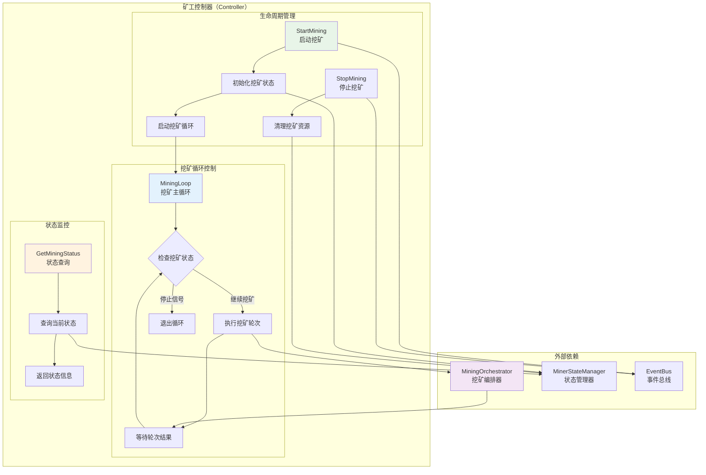

# 矿工控制器（Miner Controller）

【模块定位】
　　本模块是WES矿工系统的核心控制器，负责矿工生命周期管理、挖矿流程控制和状态监控。作为矿工的主要控制中心，统一管理挖矿启动、停止、循环执行和错误处理，确保矿工在PoW+ABS混合共识机制下的高效、稳定运行。

【设计原则】
- **单一入口控制**：作为矿工系统唯一的控制入口，统一管理所有挖矿操作
- **生命周期管理**：完整的矿工启动、运行、停止生命周期控制
- **状态驱动执行**：基于矿工状态进行智能的流程控制和决策
- **编排器委托**：将具体的挖矿业务逻辑委托给编排器（orchestrator）执行
- **异步非阻塞**：支持异步挖矿操作，不阻塞主线程执行
- **错误隔离恢复**：完善的错误处理和自动恢复机制

【核心职责】
1. **挖矿生命周期控制**：启动、停止挖矿服务，管理矿工运行状态
2. **挖矿循环管理**：控制持续的挖矿循环执行，直到手动停止
3. **状态监控与查询**：提供矿工当前状态、挖矿进度的实时查询接口
4. **编排器协调**：与挖矿编排器协调，执行具体的挖矿轮次
5. **异常处理与恢复**：处理挖矿过程中的异常，支持自动重试和恢复
6. **资源管理**：合理管理挖矿过程中的系统资源和协程生命周期

## 📁 **模块组织架构**

```text
controller/
├── 📖 README.md              # 本文档：矿工控制器设计说明
├── 🎛️ manager.go             # 薄实现：仅实现接口方法，委托给具体方法文件
├── ▶️  start_mining.go        # StartMining 方法具体实现
├── ⏹️  stop_mining.go         # StopMining 方法具体实现
└── 📊 get_mining_status.go    # GetMiningStatus 方法具体实现
```

> **注意**: 此结构严格遵循 `REFACTORING_ANALYSIS.md` 中的权威设计。移除了过度设计的 `mining_loop.go` 和 `error_handler.go`，这些逻辑已整合到具体的方法文件中。

## 🏗️ **控制器架构设计**

### **挖矿控制流程架构**



## 🔧 **核心接口实现**

### **MinerController接口定义**

```go
// interfaces/miner.go - 矿工控制器接口
type MinerController interface {
    // 启动挖矿服务
    StartMining(ctx context.Context, minerAddress []byte) error
    
    // 停止挖矿服务  
    StopMining(ctx context.Context) error
    
    // 获取挖矿状态
    GetMiningStatus(ctx context.Context) (bool, []byte, error)
}
```

### **控制器管理器实现**

```go
// controller/manager.go - 控制器管理器实现

type Manager struct {
    // 核心依赖组件
    orchestrator interfaces.MiningOrchestrator    // 挖矿编排器
    stateManager interfaces.MinerStateManager     // 状态管理器
    eventBus     interfaces.EventBus             // 事件总线
    logger       log.Logger                      // 日志记录器
    
    // 控制状态
    minerAddress  []byte                         // 矿工地址
    stopChan      chan struct{}                  // 停止信号通道
    isRunning     atomic.Bool                    // 运行状态标记
    wg            sync.WaitGroup                 // 协程等待组
}

func NewManager(
    orchestrator interfaces.MiningOrchestrator,
    stateManager interfaces.MinerStateManager,
    eventBus interfaces.EventBus,
    logger log.Logger,
) *Manager {
    return &Manager{
        orchestrator: orchestrator,
        stateManager: stateManager,
        eventBus:     eventBus,
        logger:       logger,
        stopChan:     make(chan struct{}),
    }
}

// 实现接口方法（薄实现，委托给具体文件）
func (m *Manager) StartMining(ctx context.Context, minerAddress []byte) error {
    return m.startMining(ctx, minerAddress)
}

func (m *Manager) StopMining(ctx context.Context) error {
    return m.stopMining(ctx)
}

func (m *Manager) GetMiningStatus(ctx context.Context) (bool, []byte, error) {
    return m.getMiningStatus(ctx)
}
```

## ▶️ **启动挖矿实现**

### **start_mining.go - 挖矿启动逻辑**

```go
// controller/start_mining.go - 挖矿启动实现

func (m *Manager) startMining(ctx context.Context, minerAddress []byte) error {
    // 1. 检查当前状态
    if m.isRunning.Load() {
        return fmt.Errorf("挖矿已在运行中")
    }
    
    // 2. 验证矿工地址
    if len(minerAddress) == 0 {
        return fmt.Errorf("矿工地址不能为空")
    }
    
    // 3. 更新矿工状态
    if err := m.stateManager.SetMinerState(types.MinerStateActive); err != nil {
        return fmt.Errorf("设置矿工状态失败: %v", err)
    }
    
    // 4. 设置运行标记和地址
    m.isRunning.Store(true)
    m.minerAddress = minerAddress
    m.stopChan = make(chan struct{}) // 重新创建停止通道
    
    // 5. 启动挖矿循环协程
    m.wg.Add(1)
    go func() {
        defer m.wg.Done()
        if err := m.runMiningLoop(ctx); err != nil {
            m.logger.Info("挖矿循环结束")
            m.handleMiningError(err)
        }
    }()
    
    // 6. 发布挖矿启动事件
    m.eventBus.Publish("consensus.miner.mining_started", map[string]interface{}{
        "miner_address": hex.EncodeToString(minerAddress),
        "timestamp":     time.Now().Unix(),
    })
    
    m.logger.Info("挖矿服务启动成功")
    return nil
}
```

## ⏹️ **停止挖矿实现**

### **stop_mining.go - 挖矿停止逻辑**

```go
// controller/stop_mining.go - 挖矿停止实现

func (m *Manager) stopMining(ctx context.Context) error {
    // 1. 检查运行状态
    if !m.isRunning.Load() {
        return fmt.Errorf("挖矿未在运行")
    }
    
    m.logger.Info("开始停止挖矿服务")
    
    // 2. 发送停止信号
    close(m.stopChan)
    
    // 3. 等待挖矿循环退出（带超时）
    done := make(chan struct{})
    go func() {
        m.wg.Wait()
        close(done)
    }()
    
    select {
    case <-done:
        m.logger.Info("挖矿循环已正常退出")
    case <-time.After(30 * time.Second):
        m.logger.Info("等待挖矿循环退出超时")
        return fmt.Errorf("停止挖矿超时")
    case <-ctx.Done():
        return ctx.Err()
    }
    
    // 4. 更新矿工状态
    if err := m.stateManager.SetMinerState(types.MinerStateIdle); err != nil {
        m.logger.Info("更新矿工状态失败")
    }
    
    // 5. 清理状态
    m.isRunning.Store(false)
    m.minerAddress = nil
    
    // 6. 发布挖矿停止事件
    m.eventBus.Publish("consensus.miner.mining_stopped", map[string]interface{}{
        "timestamp": time.Now().Unix(),
    })
    
    m.logger.Info("挖矿服务停止完成")
    return nil
}
```

## 🔄 **挖矿循环实现**

### **mining_loop.go - 挖矿主循环逻辑**

```go
// controller/mining_loop.go - 挖矿主循环实现

func (m *Manager) runMiningLoop(ctx context.Context) error {
    m.logger.Info("挖矿主循环启动")
    
    // 挖矿循环统计
    var (
        totalRounds   uint64
        successRounds uint64
        errorRounds   uint64
    )
    
    for {
        // 1. 检查停止信号
        select {
        case <-m.stopChan:
            m.logger.Info("收到停止信号，退出挖矿循环")
            return nil
        case <-ctx.Done():
            m.logger.Info("上下文取消，退出挖矿循环")
            return ctx.Err()
        default:
            // 继续执行
        }
        
        // 2. 检查矿工状态
        currentState := m.stateManager.GetMinerState()
        if currentState != types.MinerStateActive {
            m.logger.Info("矿工状态非活跃，暂停挖矿")
            time.Sleep(time.Second)
            continue
        }
        
        // 3. 执行一轮挖矿
        totalRounds++
        startTime := time.Now()
        
        if err := m.executeMiningRound(ctx); err != nil {
            errorRounds++
            m.logger.Info("挖矿轮次执行失败")
            
            // 错误处理逻辑
            if m.shouldStopOnError(err) {
                return fmt.Errorf("严重错误，停止挖矿: %v", err)
            }
            
            // 非严重错误，延迟后重试
            time.Sleep(time.Second * 5)
            continue
        }
        
        successRounds++
        duration := time.Since(startTime)
        
        // 4. 记录挖矿轮次完成
        m.logger.Info("挖矿轮次完成")
        
        // 5. 发布轮次统计（每100轮次发布一次）
        if totalRounds%100 == 0 {
            m.publishMiningStatistics(totalRounds, successRounds, errorRounds)
        }
        
        // 6. 短暂休息，避免过于频繁
        time.Sleep(time.Millisecond * 100)
    }
}

func (m *Manager) executeMiningRound(ctx context.Context) error {
    // 委托给挖矿编排器执行具体的挖矿轮次
    return m.orchestrator.ExecuteMiningRound(ctx)
}

func (m *Manager) shouldStopOnError(err error) bool {
    // 判断错误类型，决定是否需要停止挖矿
    switch {
    case strings.Contains(err.Error(), "fatal"):
        return true
    case strings.Contains(err.Error(), "blockchain service unavailable"):
        return true
    default:
        return false
    }
}
```

## 📊 **状态查询实现**

### **get_mining_status.go - 挖矿状态查询**

```go
// controller/get_mining_status.go - 状态查询实现

func (m *Manager) getMiningStatus(ctx context.Context) (bool, []byte, error) {
    // 1. 获取基本运行状态
    isRunning := m.isRunning.Load()
    
    // 2. 获取矿工地址
    var minerAddress []byte
    if m.minerAddress != nil {
        minerAddress = make([]byte, len(m.minerAddress))
        copy(minerAddress, m.minerAddress)
    }
    
    // 3. 获取详细的矿工状态
    minerState := m.stateManager.GetMinerState()
    
    // 4. 构建状态信息
    statusInfo := map[string]interface{}{
        "is_running":     isRunning,
        "miner_address":  hex.EncodeToString(minerAddress),
        "miner_state":    minerState.String(),
        "last_updated":   time.Now().Unix(),
    }
    
    // 5. 如果挖矿正在运行，获取更多详细信息
    if isRunning {
        // 从编排器获取当前轮次信息
        if roundInfo, err := m.orchestrator.GetCurrentRoundInfo(); err == nil {
            statusInfo["current_height"] = roundInfo.Height
            statusInfo["current_difficulty"] = roundInfo.Difficulty
            statusInfo["round_start_time"] = roundInfo.StartTime
        }
    }
    
    m.logger.Info("查询挖矿状态完成")
    
    return isRunning, minerAddress, nil
}

// 状态信息结构体
type MiningStatusInfo struct {
    IsRunning        bool   `json:"is_running"`
    MinerAddress     string `json:"miner_address"`
    MinerState       string `json:"miner_state"`
    CurrentHeight    uint64 `json:"current_height,omitempty"`
    CurrentDifficulty uint32 `json:"current_difficulty,omitempty"`
    RoundStartTime   int64  `json:"round_start_time,omitempty"`
    LastUpdated      int64  `json:"last_updated"`
}
```

## 🛠️ **错误处理实现**

### **error_handler.go - 挖矿异常处理**

```go
// controller/error_handler.go - 错误处理实现

func (m *Manager) handleMiningError(err error) {
    m.logger.Info("处理挖矿错误")
    
    // 1. 错误分类处理
    switch {
    case isNetworkError(err):
        m.handleNetworkError(err)
    case isBlockchainError(err):
        m.handleBlockchainError(err)
    case isResourceError(err):
        m.handleResourceError(err)
    default:
        m.handleGenericError(err)
    }
    
    // 2. 发布错误事件
    m.eventBus.Publish("consensus.miner.error", map[string]interface{}{
        "error":     err.Error(),
        "timestamp": time.Now().Unix(),
    })
    
    // 3. 更新矿工状态为错误状态
    m.stateManager.SetMinerState(types.MinerStateError)
}

func (m *Manager) handleNetworkError(err error) {
    m.logger.Info("网络错误，尝试重新连接")
    // 网络错误处理逻辑
}

func (m *Manager) handleBlockchainError(err error) {
    m.logger.Info("区块链服务错误，等待恢复")
    // 区块链服务错误处理逻辑
}

func (m *Manager) handleResourceError(err error) {
    m.logger.Info("资源不足错误，降低挖矿频率")
    // 资源错误处理逻辑
}

func (m *Manager) handleGenericError(err error) {
    m.logger.Info("通用错误处理")
    // 通用错误处理逻辑
}

// 错误类型判断辅助函数
func isNetworkError(err error) bool {
    return strings.Contains(err.Error(), "network") || 
           strings.Contains(err.Error(), "connection")
}

func isBlockchainError(err error) bool {
    return strings.Contains(err.Error(), "blockchain") ||
           strings.Contains(err.Error(), "block")
}

func isResourceError(err error) bool {
    return strings.Contains(err.Error(), "resource") ||
           strings.Contains(err.Error(), "memory")
}
```

## ⚙️ **配置与集成**

### **fx依赖注入配置**

```go
// controller/module.go

var ControllerModule = fx.Module("miner_controller",
    fx.Provide(NewManager),
)

func NewManager(
    orchestrator interfaces.MiningOrchestrator,
    stateManager interfaces.MinerStateManager,  
    eventBus interfaces.EventBus,
    logger log.Logger,
) interfaces.MinerController {
    return NewManager(orchestrator, stateManager, eventBus, logger)
}
```

### **配置参数**

```json
{
  "miner": {
    "controller": {
      "stop_timeout": "30s",
      "mining_loop_interval": "100ms",
      "error_retry_delay": "5s",
      "statistics_report_interval": 100,
      "max_consecutive_errors": 10
    }
  }
}
```

## 📊 **性能监控**

### **关键性能指标**

- **挖矿轮次统计**：总轮次、成功轮次、失败轮次
- **平均轮次时间**：每轮挖矿的平均执行时间
- **错误率统计**：错误轮次占总轮次的比例
- **状态切换频率**：矿工状态变更的频率统计
- **资源使用情况**：CPU、内存使用率监控

### **监控事件发布**

```go
// 定期发布挖矿统计信息
func (m *Manager) publishMiningStatistics(total, success, errors uint64) {
    stats := map[string]interface{}{
        "total_rounds":   total,
        "success_rounds": success,
        "error_rounds":   errors,
        "success_rate":   float64(success) / float64(total),
        "timestamp":      time.Now().Unix(),
    }
    
    m.eventBus.Publish("consensus.miner.statistics", stats)
}
```

## 🔚 **总结**

**矿工控制器核心特性**：

1. **统一控制入口**：作为矿工系统的唯一控制入口，管理完整生命周期
2. **持续循环执行**：支持7×24小时持续挖矿，直到手动停止
3. **智能状态管理**：基于状态驱动的智能流程控制和决策
4. **委托式设计**：将具体业务逻辑委托给专业组件（编排器）处理
5. **完善错误处理**：分类错误处理，支持自动重试和优雅降级
6. **异步非阻塞**：支持异步操作，不阻塞主线程执行
7. **实时状态监控**：提供详细的挖矿状态查询和统计信息

**架构设计优势**：
- 职责单一，专注控制逻辑
- 委托式设计，降低耦合度
- 状态驱动，提高可靠性
- 异步执行，提升性能
- 完善监控，便于运维管理
