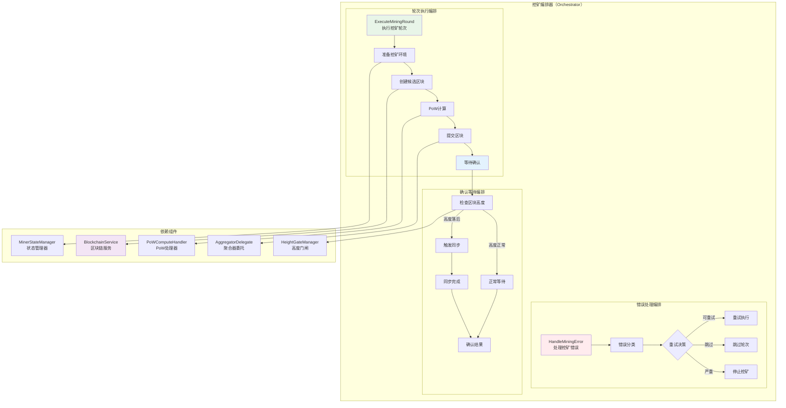

# 挖矿编排器（Mining Orchestrator）

【模块定位】
　　本模块是WES矿工系统的核心业务编排器，负责协调和执行完整的挖矿业务流程。在当前 PoW + 距离聚合（XOR）共识机制下，编排器统一管理从候选区块创建、PoW计算、区块提交到确认等待的完整挖矿轮次，确保挖矿流程的正确性、高效性和一致性。

【设计原则】
- **业务流程编排**：统一编排挖矿的完整业务流程，确保各步骤正确执行
- **组件协调中心**：作为各矿工子组件的协调中心，管理组件间的交互
- **错误处理中心**：集中处理挖矿过程中的各类错误和异常情况
- **状态驱动执行**：基于区块链状态和挖矿状态进行智能决策
- **聚合流程适配**：完全适配 PoW + 距离聚合共识的特殊要求
- **委托式调用**：通过接口委托专业组件处理具体任务

【核心职责】
1. **挖矿轮次编排**：完整编排从准备到提交的挖矿轮次执行流程
2. **组件协调管理**：协调PoW处理器、高度门闸、状态管理器等组件
3. **PoW流程管理**：实现PoW共识的挖矿流程管理
4. **确认等待管理**：管理区块提交后的确认等待和同步触发逻辑

## 📁 **模块组织架构**

```text
orchestrator/
├── 📖 README.md              # 本文档：挖矿编排器设计说明
├── 🎼 manager.go             # 薄实现：仅实现接口方法，委托给具体方法文件
├── ⚙️ execute_mining_round.go # ExecuteMiningRound 方法具体实现
└── ⏳ wait_confirmation.go    # 等待确认和同步触发逻辑
```

> **注意**: 此结构严格遵循 `REFACTORING_ANALYSIS.md` 中的权威设计。移除了过度设计的错误处理、统计监控、同步触发等独立文件，相关逻辑已整合到核心方法文件中。

## 🏗️ **编排器架构设计**

### **挖矿编排流程架构**



## 🔧 **核心接口实现**

### **MiningOrchestrator接口定义**

```go
// interfaces/miner.go - 挖矿编排器接口
type MiningOrchestrator interface {
    // 执行一轮完整的挖矿
    ExecuteMiningRound(ctx context.Context) error
    
    // 处理挖矿错误
    HandleMiningError(err error) error
    
    // 获取当前轮次信息
    GetCurrentRoundInfo() (*MiningRoundInfo, error)
    
    // 等待区块确认
    WaitForConfirmation(ctx context.Context, blockHash string) error
}
```

### **编排器管理器实现**

```go
// orchestrator/manager.go - 编排器管理器实现

type Manager struct {
    // 核心依赖组件
    blockchainService  interfaces.BlockchainService    // 区块链服务
    powHandler        interfaces.PoWComputeHandler     // PoW处理器
    heightGate        interfaces.HeightGateManager     // 高度门闸
    stateManager      interfaces.MinerStateManager     // 状态管理器
    aggregatorDelegate interfaces.AggregatorDelegate   // 聚合器委托
    eventBus          interfaces.EventBus              // 事件总线
    logger            log.Logger                       // 日志记录器
    
    // 编排状态
    currentRound      *MiningRoundInfo                 // 当前轮次信息
    roundMutex        sync.RWMutex                     // 轮次信息锁
    roundStats        *RoundStatistics                 // 轮次统计
}

func NewManager(
    blockchainService interfaces.BlockchainService,
    powHandler interfaces.PoWComputeHandler,
    heightGate interfaces.HeightGateManager,
    stateManager interfaces.MinerStateManager,
    aggregatorDelegate interfaces.AggregatorDelegate,
    eventBus interfaces.EventBus,
    logger log.Logger,
) *Manager {
    return &Manager{
        blockchainService:  blockchainService,
        powHandler:         powHandler,
        heightGate:         heightGate,
        stateManager:       stateManager,
        aggregatorDelegate: aggregatorDelegate,
        eventBus:          eventBus,
        logger:            logger,
        roundStats:        NewRoundStatistics(),
    }
}

// 轮次信息结构体
type MiningRoundInfo struct {
    RoundID      string    `json:"round_id"`
    Height       uint64    `json:"height"`
    Difficulty   uint32    `json:"difficulty"`
    StartTime    time.Time `json:"start_time"`
    Status       string    `json:"status"`
    BlockHash    string    `json:"block_hash,omitempty"`
    SubmitTime   time.Time `json:"submit_time,omitempty"`
}
```

## ⚙️ **挖矿轮次执行**

### **execute_mining_round.go - 完整挖矿轮次实现**

```go
// orchestrator/execute_mining_round.go - 挖矿轮次执行实现

func (m *Manager) ExecuteMiningRound(ctx context.Context) error {
    // 1. 创建轮次ID和记录开始时间
    roundID := m.generateRoundID()
    startTime := time.Now()
    
    m.logger.Info("开始执行挖矿轮次")
    
    defer func() {
        // 轮次结束时更新统计
        duration := time.Since(startTime)
        m.updateRoundStatistics(roundID, duration)
    }()
    
    // 2. 准备挖矿环境
    if err := m.prepareMiningEnvironment(ctx); err != nil {
        return fmt.Errorf("准备挖矿环境失败: %v", err)
    }
    
    // 3. 获取区块链信息
    chainInfo, err := m.blockchainService.GetChainInfo(ctx)
    if err != nil {
        return fmt.Errorf("获取区块链信息失败: %v", err)
    }
    
    // 4. 检查高度门闸
    lastProcessedHeight := m.heightGate.GetLastProcessedHeight()
    if chainInfo.Height <= lastProcessedHeight {
        // 高度未更新，等待下一轮
        m.logger.Info("区块高度未更新，等待下一轮")
        return nil
    }
    
    // 5. 更新当前轮次信息
    m.updateCurrentRound(roundID, chainInfo.Height, chainInfo.Difficulty, startTime)
    
    // 6. 创建候选区块
    candidateData, err := m.blockchainService.CreateMiningCandidate(ctx)
    if err != nil {
        return fmt.Errorf("创建候选区块失败: %v", err)
    }
    
    // 7. 执行PoW计算
    minedBlock, err := m.powHandler.MineBlockHeader(ctx, candidateData)
    if err != nil {
        return fmt.Errorf("PoW计算失败: %v", err)
    }
    
    m.logger.Info("PoW计算完成")
    
    // 8. 提交区块给聚合器
    if err := m.aggregatorDelegate.DelegateMinedBlock(ctx, minedBlock); err != nil {
        return fmt.Errorf("提交区块失败: %v", err)
    }
    
    // 9. 更新高度门闸
    m.heightGate.UpdateLastProcessedHeight(chainInfo.Height)
    
    // 10. 等待确认（异步）
    go func() {
        if err := m.waitForConfirmation(ctx, minedBlock.Hash); err != nil {
            m.logger.Info("等待区块确认失败")
        }
    }()
    
    // 11. 发布挖矿完成事件
    m.publishMiningCompletedEvent(roundID, minedBlock)
    
    m.logger.Info("挖矿轮次执行完成")
    return nil
}

func (m *Manager) prepareMiningEnvironment(ctx context.Context) error {
    // 1. 检查矿工状态
    currentState := m.stateManager.GetMinerState()
    if currentState != types.MinerStateActive {
        return fmt.Errorf("矿工状态非活跃: %s", currentState)
    }
    
    // 2. 检查系统资源
    if err := m.checkSystemResources(); err != nil {
        return fmt.Errorf("系统资源检查失败: %v", err)
    }
    
    // 3. 检查网络连接
    if err := m.checkNetworkConnectivity(); err != nil {
        return fmt.Errorf("网络连接检查失败: %v", err)
    }
    
    return nil
}

func (m *Manager) generateRoundID() string {
    return fmt.Sprintf("round_%d_%d", time.Now().Unix(), rand.Int63())
}

func (m *Manager) updateCurrentRound(roundID string, height uint64, difficulty uint32, startTime time.Time) {
    m.roundMutex.Lock()
    defer m.roundMutex.Unlock()
    
    m.currentRound = &MiningRoundInfo{
        RoundID:    roundID,
        Height:     height,
        Difficulty: difficulty,
        StartTime:  startTime,
        Status:     "mining",
    }
}
```

## ⏳ **确认等待管理**

### **wait_confirmation.go - 区块确认等待实现**

```go
// orchestrator/wait_confirmation.go - 确认等待实现

func (m *Manager) waitForConfirmation(ctx context.Context, blockHash string) error {
    m.logger.Info("开始等待区块确认")
    
    // 确认等待超时时间
    confirmTimeout := 60 * time.Second
    checkInterval := 5 * time.Second
    
    ctx, cancel := context.WithTimeout(ctx, confirmTimeout)
    defer cancel()
    
    ticker := time.NewTicker(checkInterval)
    defer ticker.Stop()
    
    for {
        select {
        case <-ctx.Done():
            m.logger.Info("等待区块确认超时")
            return m.handleConfirmationTimeout(blockHash)
            
        case <-ticker.C:
            // 检查区块是否已确认
            confirmed, err := m.checkBlockConfirmation(blockHash)
            if err != nil {
                m.logger.Info("检查区块确认状态失败")
                continue
            }
            
            if confirmed {
                m.logger.Info("区块确认成功")
                m.publishBlockConfirmedEvent(blockHash)
                return nil
            }
            
            // 检查是否需要触发同步
            if needSync, err := m.checkSyncRequired(); err == nil && needSync {
                m.logger.Info("检测到需要同步，触发同步")
                return m.triggerSync()
            }
        }
    }
}

func (m *Manager) checkBlockConfirmation(blockHash string) (bool, error) {
    // 通过区块链服务检查区块确认状态
    return m.blockchainService.IsBlockConfirmed(blockHash)
}

func (m *Manager) checkSyncRequired() (bool, error) {
    // 获取当前本地高度
    localHeight := m.heightGate.GetLastProcessedHeight()
    
    // 获取网络最新高度
    chainInfo, err := m.blockchainService.GetChainInfo(context.Background())
    if err != nil {
        return false, err
    }
    
    // 如果高度差距超过阈值，需要同步
    const syncThreshold = 3
    return chainInfo.Height > localHeight+syncThreshold, nil
}

func (m *Manager) handleConfirmationTimeout(blockHash string) error {
    m.logger.Info("区块确认超时，检查是否需要同步")
    
    // 超时后检查同步需求
    if needSync, err := m.checkSyncRequired(); err == nil && needSync {
        return m.triggerSync()
    }
    
    // 发布超时事件
    m.eventBus.Publish("consensus.miner.confirmation_timeout", map[string]interface{}{
        "block_hash": blockHash,
        "timestamp":  time.Now().Unix(),
    })
    
    return fmt.Errorf("区块确认超时: %s", blockHash)
}
```

## 🛠️ **错误处理策略**

### **handle_mining_error.go - 挖矿错误处理实现**

```go
// orchestrator/handle_mining_error.go - 错误处理实现

func (m *Manager) HandleMiningError(err error) error {
    m.logger.Info("处理挖矿错误")
    
    // 1. 错误分类
    errorType := m.classifyError(err)
    
    // 2. 根据错误类型制定处理策略
    switch errorType {
    case ErrorTypeTransient:
        return m.handleTransientError(err)
    case ErrorTypeRetryable:
        return m.handleRetryableError(err)
    case ErrorTypeSkippable:
        return m.handleSkippableError(err)
    case ErrorTypeFatal:
        return m.handleFatalError(err)
    default:
        return m.handleUnknownError(err)
    }
}

// 错误类型枚举
type ErrorType int

const (
    ErrorTypeTransient ErrorType = iota // 暂时性错误
    ErrorTypeRetryable                  // 可重试错误
    ErrorTypeSkippable                  // 可跳过错误
    ErrorTypeFatal                      // 致命错误
    ErrorTypeUnknown                    // 未知错误
)

func (m *Manager) classifyError(err error) ErrorType {
    errMsg := err.Error()
    
    switch {
    case strings.Contains(errMsg, "network timeout"):
        return ErrorTypeRetryable
    case strings.Contains(errMsg, "connection refused"):
        return ErrorTypeRetryable
    case strings.Contains(errMsg, "height not updated"):
        return ErrorTypeSkippable
    case strings.Contains(errMsg, "blockchain service unavailable"):
        return ErrorTypeFatal
    case strings.Contains(errMsg, "invalid mining address"):
        return ErrorTypeFatal
    case strings.Contains(errMsg, "resource temporarily unavailable"):
        return ErrorTypeTransient
    default:
        return ErrorTypeUnknown
    }
}

func (m *Manager) handleTransientError(err error) error {
    m.logger.Info("处理暂时性错误，短暂等待后继续")
    
    // 短暂等待后继续
    time.Sleep(time.Second)
    return nil
}

func (m *Manager) handleRetryableError(err error) error {
    m.logger.Info("处理可重试错误")
    
    // 增加重试计数
    retryCount := m.incrementRetryCount()
    
    const maxRetries = 3
    if retryCount >= maxRetries {
        m.logger.Info("重试次数超限，跳过当前轮次")
        m.resetRetryCount()
        return nil // 跳过当前轮次
    }
    
    // 等待后重试
    retryDelay := time.Duration(retryCount) * time.Second
    time.Sleep(retryDelay)
    
    return err // 返回错误，触发重试
}

func (m *Manager) handleSkippableError(err error) error {
    m.logger.Info("处理可跳过错误，跳过当前轮次")
    
    // 发布跳过事件
    m.eventBus.Publish("consensus.miner.round_skipped", map[string]interface{}{
        "reason":    err.Error(),
        "timestamp": time.Now().Unix(),
    })
    
    return nil // 跳过当前轮次
}

func (m *Manager) handleFatalError(err error) error {
    m.logger.Info("处理致命错误，停止挖矿")
    
    // 更新矿工状态为错误状态
    m.stateManager.SetMinerState(types.MinerStateError)
    
    // 发布致命错误事件
    m.eventBus.Publish("consensus.miner.fatal_error", map[string]interface{}{
        "error":     err.Error(),
        "timestamp": time.Now().Unix(),
    })
    
    return fmt.Errorf("致命错误，需要停止挖矿: %v", err)
}

func (m *Manager) handleUnknownError(err error) error {
    m.logger.Info("处理未知错误，保守跳过")
    
    // 对未知错误采取保守策略，跳过当前轮次
    return m.handleSkippableError(err)
}
```

## 🔄 **同步触发逻辑**

### **sync_trigger.go - 同步触发实现**

```go
// orchestrator/sync_trigger.go - 同步触发实现

func (m *Manager) triggerSync() error {
    m.logger.Info("触发区块链同步")
    
    // 1. 更新矿工状态为同步中
    if err := m.stateManager.SetMinerState(types.MinerStateSyncing); err != nil {
        m.logger.Info("更新矿工状态失败")
    }
    
    // 2. 发布同步触发事件
    m.eventBus.Publish("consensus.system.sync_triggered", map[string]interface{}{
        "trigger_source": "miner_orchestrator",
        "reason":        "height_difference_detected",
        "timestamp":     time.Now().Unix(),
    })
    
    // 3. 等待同步完成
    if err := m.waitForSyncCompletion(); err != nil {
        m.logger.Info("等待同步完成失败")
        return err
    }
    
    // 4. 恢复矿工状态为活跃
    if err := m.stateManager.SetMinerState(types.MinerStateActive); err != nil {
        m.logger.Info("恢复矿工状态失败")
    }
    
    m.logger.Info("同步完成，恢复挖矿")
    return nil
}

func (m *Manager) waitForSyncCompletion() error {
    m.logger.Info("等待同步完成")
    
    syncTimeout := 5 * time.Minute
    checkInterval := 10 * time.Second
    
    ctx, cancel := context.WithTimeout(context.Background(), syncTimeout)
    defer cancel()
    
    ticker := time.NewTicker(checkInterval)
    defer ticker.Stop()
    
    for {
        select {
        case <-ctx.Done():
            return fmt.Errorf("等待同步完成超时")
            
        case <-ticker.C:
            // 检查同步是否完成
            if synced, err := m.checkSyncStatus(); err == nil && synced {
                m.logger.Info("同步已完成")
                return nil
            }
        }
    }
}

func (m *Manager) checkSyncStatus() (bool, error) {
    // 检查本地高度与网络高度的差异
    localHeight := m.heightGate.GetLastProcessedHeight()
    
    chainInfo, err := m.blockchainService.GetChainInfo(context.Background())
    if err != nil {
        return false, err
    }
    
    // 如果高度差异小于等于1，认为同步完成
    const syncCompleteThreshold = 1
    return chainInfo.Height <= localHeight+syncCompleteThreshold, nil
}
```

## 📊 **轮次统计监控**

### **round_statistics.go - 轮次统计实现**

```go
// orchestrator/round_statistics.go - 轮次统计实现

type RoundStatistics struct {
    TotalRounds       uint64        `json:"total_rounds"`
    SuccessfulRounds  uint64        `json:"successful_rounds"`
    FailedRounds      uint64        `json:"failed_rounds"`
    SkippedRounds     uint64        `json:"skipped_rounds"`
    AverageRoundTime  time.Duration `json:"average_round_time"`
    LastRoundTime     time.Time     `json:"last_round_time"`
    mutex             sync.RWMutex
}

func NewRoundStatistics() *RoundStatistics {
    return &RoundStatistics{}
}

func (rs *RoundStatistics) RecordSuccessfulRound(duration time.Duration) {
    rs.mutex.Lock()
    defer rs.mutex.Unlock()
    
    rs.TotalRounds++
    rs.SuccessfulRounds++
    rs.updateAverageTime(duration)
    rs.LastRoundTime = time.Now()
}

func (rs *RoundStatistics) RecordFailedRound(duration time.Duration) {
    rs.mutex.Lock()
    defer rs.mutex.Unlock()
    
    rs.TotalRounds++
    rs.FailedRounds++
    rs.updateAverageTime(duration)
    rs.LastRoundTime = time.Now()
}

func (rs *RoundStatistics) RecordSkippedRound() {
    rs.mutex.Lock()
    defer rs.mutex.Unlock()
    
    rs.TotalRounds++
    rs.SkippedRounds++
    rs.LastRoundTime = time.Now()
}

func (rs *RoundStatistics) updateAverageTime(duration time.Duration) {
    if rs.TotalRounds == 1 {
        rs.AverageRoundTime = duration
    } else {
        // 计算移动平均
        rs.AverageRoundTime = (rs.AverageRoundTime*time.Duration(rs.TotalRounds-1) + duration) / time.Duration(rs.TotalRounds)
    }
}

func (rs *RoundStatistics) GetStatistics() RoundStatistics {
    rs.mutex.RLock()
    defer rs.mutex.RUnlock()
    
    return *rs
}

func (m *Manager) updateRoundStatistics(roundID string, duration time.Duration) {
    // 根据轮次结果更新统计
    if m.currentRound != nil && m.currentRound.Status == "completed" {
        m.roundStats.RecordSuccessfulRound(duration)
    } else if m.currentRound != nil && m.currentRound.Status == "failed" {
        m.roundStats.RecordFailedRound(duration)
    } else {
        m.roundStats.RecordSkippedRound()
    }
    
    // 定期发布统计信息
    if m.roundStats.TotalRounds%50 == 0 {
        m.publishRoundStatistics()
    }
}

func (m *Manager) publishRoundStatistics() {
    stats := m.roundStats.GetStatistics()
    
    m.eventBus.Publish("consensus.miner.round_statistics", map[string]interface{}{
        "total_rounds":       stats.TotalRounds,
        "successful_rounds":  stats.SuccessfulRounds,
        "failed_rounds":      stats.FailedRounds,
        "skipped_rounds":     stats.SkippedRounds,
        "success_rate":       float64(stats.SuccessfulRounds) / float64(stats.TotalRounds),
        "average_round_time": stats.AverageRoundTime.Milliseconds(),
        "timestamp":          time.Now().Unix(),
    })
}
```

## ⚙️ **配置与集成**

### **fx依赖注入配置**

```go
// orchestrator/module.go

var OrchestratorModule = fx.Module("mining_orchestrator",
    fx.Provide(NewManager),
)

func NewManager(
    blockchainService interfaces.BlockchainService,
    powHandler interfaces.PoWComputeHandler,
    heightGate interfaces.HeightGateManager,
    stateManager interfaces.MinerStateManager,
    aggregatorDelegate interfaces.AggregatorDelegate,
    eventBus interfaces.EventBus,
    logger log.Logger,
) interfaces.MiningOrchestrator {
    return NewManager(
        blockchainService,
        powHandler,
        heightGate,
        stateManager,
        aggregatorDelegate,
        eventBus,
        logger,
    )
}
```

### **配置参数**

```json
{
  "miner": {
    "orchestrator": {
      "confirmation_timeout": "60s",
      "confirmation_check_interval": "5s",
      "sync_timeout": "300s",
      "sync_check_interval": "10s",
      "sync_threshold": 3,
      "sync_complete_threshold": 1,
      "max_retry_count": 3,
      "retry_base_delay": "1s"
    }
  }
}
```

## 🔚 **总结**

**挖矿编排器核心特性**：

1. **完整流程编排**：从候选创建到区块提交的完整业务流程编排
2. **聚合流程适配**：与统一 Aggregator + 距离选择架构解耦但兼容
3. **智能错误处理**：分类错误处理，支持重试、跳过、停止等策略
4. **异步确认等待**：支持异步等待区块确认，不阻塞下一轮挖矿
5. **自动同步触发**：智能检测高度差异，自动触发同步机制
6. **性能统计监控**：完善的轮次统计和性能监控
7. **组件协调中心**：统一协调各矿工子组件的交互

**架构设计优势**：
- 业务逻辑集中，便于管理和维护
- 错误处理策略丰富，提高容错性
- 支持异步操作，提升挖矿效率
- 统计监控完善，便于性能优化
- 与当前 PoW + 距离聚合共识机制保持良好解耦
