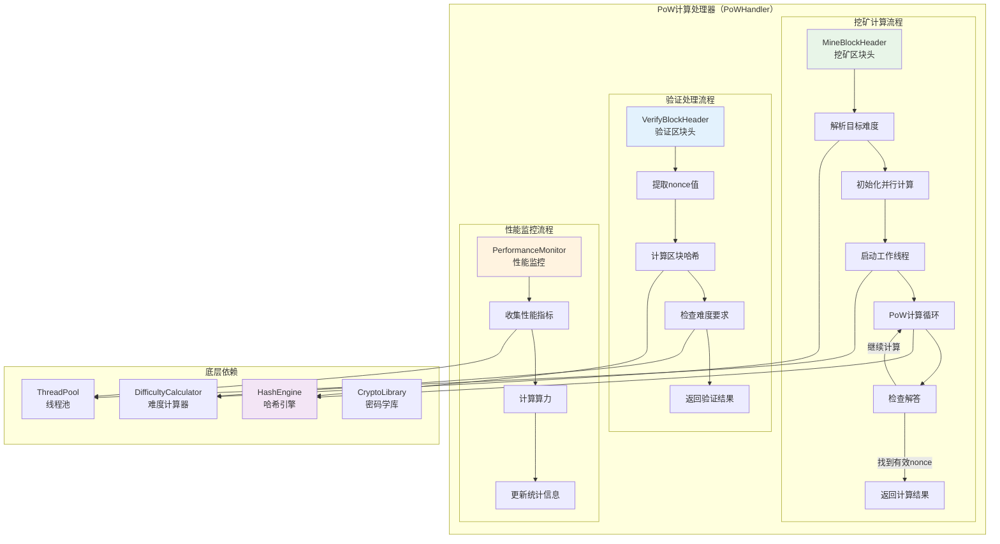

# PoW计算处理器（PoW Compute Handler）

【模块定位】
　　本模块是WES矿工系统的核心PoW计算引擎，负责执行工作量证明算法的计算和验证。在PoW+ABS混合共识机制下，PoW处理器保持传统PoW的安全性和去中心化特性，提供高效的nonce计算、区块头挖矿和PoW验证功能，确保矿工能够产生符合难度要求的有效区块。

【设计原则】
- **传统PoW兼容**：完全兼容传统Bitcoin-style PoW算法，保持安全性
- **高性能计算**：优化算法实现，提供高效的PoW计算性能
- **可配置难度**：支持动态难度调整，适应网络算力变化
- **多线程并行**：支持多线程并行计算，充分利用CPU资源
- **中断可控**：支持计算过程的优雅中断和取消机制
- **验证高效**：提供快速的PoW结果验证功能

【核心职责】
1. **区块头挖矿**：对给定区块头进行轻量级PoW计算，寻找满足固定难度要求的nonce
2. **PoW验证**：验证区块头的PoW是否满足指定的固定难度要求
3. **哈希服务集成**：使用fx依赖注入的pb/blockchain/block/block_grpc.pb.go哈希服务
4. **PoW引擎管理**：管理PoW计算引擎的启动和停止生命周期
5. **中断控制**：支持PoW计算过程的优雅中断和取消操作

## 📁 **模块组织架构**

```text
pow_handler/
├── 📖 README.md              # 本文档：PoW计算处理器设计说明
├── ⚡ manager.go             # 薄实现：仅实现接口方法，委托给具体方法文件
├── ⛏️ mine_block_header.go    # MineBlockHeader 方法具体实现
├── ✅ verify_block_header.go  # VerifyBlockHeader 方法具体实现  
├── 🧮 produce_block.go        # ProduceBlockFromTemplate 方法具体实现
├── 🚀 start_engine.go         # StartPoWEngine 方法具体实现
└── ⏹️ stop_engine.go          # StopPoWEngine 方法具体实现
```

> **注意**: 此结构严格遵循 `REFACTORING_ANALYSIS.md` 中的权威设计。移除了：
> - `hash_computer.go`：使用fx依赖注入的pb/blockchain/block/block_grpc.pb.go哈希服务
> - `difficulty_manager.go`：采用简单固定难度值（如20）
> - `parallel_miner.go`：移除多线程并行计算，采用轻量级单线程PoW
> - `performance_monitor.go`：区块链自运行系统不需要性能监控

## 🏗️ **PoW处理器架构设计**

### **PoW计算流程架构**



## 🔧 **核心接口实现**

### **PoWComputeHandler接口定义**

```go
// interfaces/miner.go - PoW计算处理器接口
type PoWComputeHandler interface {
    // 挖矿区块头，寻找满足难度要求的nonce
    MineBlockHeader(ctx context.Context, candidateData []byte) (*block.Block, error)
    
    // 验证区块头的PoW是否满足难度要求
    VerifyBlockHeader(blockHeader *block.Header, difficulty uint32) (bool, error)
    
    // 获取当前算力统计
    GetHashrateStatistics() (*HashrateStats, error)
    
    // 设置挖矿线程数
    SetMiningThreads(threadCount int) error
}
```

### **PoW管理器实现**

```go
// pow_handler/manager.go - PoW管理器实现

type Manager struct {
    // 核心组件
    hashEngine        interfaces.HashEngine           // 哈希计算引擎
    difficultyManager interfaces.DifficultyManager    // 难度管理器
    threadPool        interfaces.ThreadPool           // 线程池管理
    perfMonitor       *PerformanceMonitor             // 性能监控
    logger            log.Logger                      // 日志记录器
    
    // 挖矿配置
    miningThreads     int                             // 挖矿线程数
    maxNonce          uint64                          // 最大nonce值
    batchSize         uint64                          // 计算批次大小
    
    // 运行状态
    isRunning         atomic.Bool                     // 运行状态
    cancelChan        chan struct{}                   // 取消通道
    statsMutex        sync.RWMutex                    // 统计锁
}

func NewManager(
    hashEngine interfaces.HashEngine,
    difficultyManager interfaces.DifficultyManager,
    threadPool interfaces.ThreadPool,
    logger log.Logger,
    config *PoWConfig,
) *Manager {
    return &Manager{
        hashEngine:        hashEngine,
        difficultyManager: difficultyManager,
        threadPool:        threadPool,
        logger:            logger,
        miningThreads:     config.MiningThreads,
        maxNonce:          config.MaxNonce,
        batchSize:         config.BatchSize,
        perfMonitor:       NewPerformanceMonitor(),
        cancelChan:        make(chan struct{}),
    }
}

// PoW配置结构体
type PoWConfig struct {
    MiningThreads    int    `json:"mining_threads"`
    MaxNonce        uint64 `json:"max_nonce"`
    BatchSize       uint64 `json:"batch_size"`
    HashAlgorithm   string `json:"hash_algorithm"`
    EnableProfiling bool   `json:"enable_profiling"`
}
```

## ⛏️ **区块头挖矿实现**

### **mine_block_header.go - PoW挖矿核心实现**

```go
// pow_handler/mine_block_header.go - 区块头挖矿实现

func (m *Manager) MineBlockHeader(ctx context.Context, candidateData []byte) (*block.Block, error) {
    m.logger.Info("开始PoW挖矿计算")
    
    // 1. 解析候选区块数据
    candidateBlock, err := m.parseCandidateBlock(candidateData)
    if err != nil {
        return nil, fmt.Errorf("解析候选区块失败: %v", err)
    }
    
    // 2. 计算目标难度值
    target, err := m.calculateTarget(candidateBlock.Header.Difficulty)
    if err != nil {
        return nil, fmt.Errorf("计算目标难度失败: %v", err)
    }
    
    // 3. 初始化挖矿环境
    miningCtx, cancel := context.WithCancel(ctx)
    defer cancel()
    
    // 4. 启动并行挖矿
    resultChan := make(chan *MiningResult, 1)
    m.startParallelMining(miningCtx, candidateBlock, target, resultChan)
    
    // 5. 等待挖矿结果
    select {
    case result := <-resultChan:
        if result.Success {
            m.logger.Info("PoW挖矿成功")
            return m.buildMinedBlock(candidateBlock, result.Nonce), nil
        }
        return nil, fmt.Errorf("PoW挖矿失败: %s", result.Error)
        
    case <-ctx.Done():
        m.logger.Info("PoW挖矿被取消")
        return nil, ctx.Err()
    }
}

func (m *Manager) startParallelMining(ctx context.Context, candidateBlock *block.Block, target []byte, resultChan chan<- *MiningResult) {
    // 计算每个线程的nonce范围
    nonceRangePerThread := m.maxNonce / uint64(m.miningThreads)
    
    // 启动挖矿工作线程
    for i := 0; i < m.miningThreads; i++ {
        threadID := i
        startNonce := uint64(threadID) * nonceRangePerThread
        endNonce := startNonce + nonceRangePerThread
        
        go func() {
            m.mineInRange(ctx, candidateBlock, target, startNonce, endNonce, resultChan)
        }()
    }
}

func (m *Manager) mineInRange(ctx context.Context, candidateBlock *block.Block, target []byte, startNonce, endNonce uint64, resultChan chan<- *MiningResult) {
    // 获取区块头的副本进行修改
    header := candidateBlock.Header
    headerBytes := m.serializeHeaderForHashing(header)
    
    m.logger.Info("开始nonce范围挖矿")
    
    // 挖矿循环
    for nonce := startNonce; nonce < endNonce; nonce++ {
        // 检查取消信号
        select {
        case <-ctx.Done():
            return
        default:
        }
        
        // 计算当前nonce的哈希
        hash := m.computeHashWithNonce(headerBytes, nonce)
        
        // 检查是否满足难度要求
        if m.isHashValidForTarget(hash, target) {
            // 找到有效解
            result := &MiningResult{
                Success:    true,
                Nonce:      nonce,
                Hash:       hash,
                ThreadID:   nonce / (m.maxNonce / uint64(m.miningThreads)),
                Attempts:   nonce - startNonce + 1,
            }
            
            select {
            case resultChan <- result:
                m.logger.Info("找到有效nonce")
                return
            default:
                // 结果通道已满，其他线程已找到解
                return
            }
        }
        
        // 更新性能统计（批量更新）
        if nonce%m.batchSize == 0 {
            m.perfMonitor.UpdateHashCount(m.batchSize)
        }
    }
    
    // 范围内未找到有效解
    m.logger.Info("nonce范围内未找到有效解")
}

func (m *Manager) computeHashWithNonce(headerBytes []byte, nonce uint64) []byte {
    // 将nonce添加到区块头字节中
    headerWithNonce := append(headerBytes, m.uint64ToBytes(nonce)...)
    
    // 计算SHA256哈希
    return m.hashEngine.DoubleSHA256(headerWithNonce)
}

func (m *Manager) isHashValidForTarget(hash []byte, target []byte) bool {
    // 比较哈希值是否小于目标值
    return bytes.Compare(hash, target) <= 0
}

// 挖矿结果结构体
type MiningResult struct {
    Success   bool     `json:"success"`
    Nonce     uint64   `json:"nonce"`
    Hash      []byte   `json:"hash"`
    ThreadID  uint64   `json:"thread_id"`
    Attempts  uint64   `json:"attempts"`
    Error     string   `json:"error,omitempty"`
}
```

## ✅ **PoW验证实现**

### **verify_block_header.go - PoW验证实现**

```go
// pow_handler/verify_block_header.go - PoW验证实现

func (m *Manager) VerifyBlockHeader(blockHeader *block.Header, difficulty uint32) (bool, error) {
    m.logger.Info("开始验证区块头PoW")
    
    // 1. 验证输入参数
    if blockHeader == nil {
        return false, fmt.Errorf("区块头不能为空")
    }
    
    // 2. 计算目标难度值
    target, err := m.calculateTarget(difficulty)
    if err != nil {
        return false, fmt.Errorf("计算目标难度失败: %v", err)
    }
    
    // 3. 序列化区块头用于哈希计算
    headerBytes := m.serializeHeaderForHashing(blockHeader)
    
    // 4. 计算区块头的哈希值
    hash := m.hashEngine.DoubleSHA256(headerBytes)
    
    // 5. 验证哈希是否满足难度要求
    isValid := m.isHashValidForTarget(hash, target)
    
    // 6. 记录验证结果
    if isValid {
        m.logger.Info("区块头PoW验证成功")
        m.perfMonitor.RecordValidVerification()
    } else {
        m.logger.Info("区块头PoW验证失败")
        m.perfMonitor.RecordInvalidVerification()
    }
    
    return isValid, nil
}

func (m *Manager) serializeHeaderForHashing(header *block.Header) []byte {
    // 序列化区块头的所有字段（除了nonce，它单独处理）
    var buffer bytes.Buffer
    
    // 按照特定顺序序列化字段
    buffer.Write(header.ParentHash[:])
    buffer.Write(header.MerkleRoot[:])
    buffer.Write(m.uint64ToBytes(header.Timestamp))
    buffer.Write(m.uint32ToBytes(header.Difficulty))
    buffer.Write(m.uint64ToBytes(header.Height))
    
    // 添加其他必要字段...
    
    return buffer.Bytes()
}

func (m *Manager) calculateTarget(difficulty uint32) ([]byte, error) {
    // 使用难度管理器计算目标值
    return m.difficultyManager.CalculateTarget(difficulty)
}

// 批量验证接口
func (m *Manager) VerifyMultipleHeaders(headers []*block.Header, difficulty uint32) ([]bool, error) {
    m.logger.Info("开始批量验证区块头PoW")
    
    if len(headers) == 0 {
        return nil, fmt.Errorf("区块头列表不能为空")
    }
    
    results := make([]bool, len(headers))
    
    // 计算目标难度值（只需计算一次）
    target, err := m.calculateTarget(difficulty)
    if err != nil {
        return nil, fmt.Errorf("计算目标难度失败: %v", err)
    }
    
    // 并行验证多个区块头
    var wg sync.WaitGroup
    for i, header := range headers {
        wg.Add(1)
        go func(index int, h *block.Header) {
            defer wg.Done()
            
            headerBytes := m.serializeHeaderForHashing(h)
            hash := m.hashEngine.DoubleSHA256(headerBytes)
            results[index] = m.isHashValidForTarget(hash, target)
        }(i, header)
    }
    
    wg.Wait()
    
    // 统计验证结果
    validCount := 0
    for _, valid := range results {
        if valid {
            validCount++
        }
    }
    
    m.logger.Info("批量验证完成")
    
    return results, nil
}
```

## 🧮 **高效哈希计算**

### **hash_computer.go - 哈希计算优化实现**

```go
// pow_handler/hash_computer.go - 哈希计算实现

type HashComputer struct {
    algorithm    string                 // 哈希算法类型
    hashPool     sync.Pool             // 哈希对象池
    bufferPool   sync.Pool             // 缓冲区对象池
    logger       log.Logger
}

func NewHashComputer(algorithm string, logger log.Logger) *HashComputer {
    hc := &HashComputer{
        algorithm: algorithm,
        logger:    logger,
    }
    
    // 初始化对象池
    hc.hashPool.New = func() interface{} {
        switch algorithm {
        case "SHA256":
            return sha256.New()
        case "Blake2b":
            h, _ := blake2b.New256(nil)
            return h
        default:
            return sha256.New()
        }
    }
    
    hc.bufferPool.New = func() interface{} {
        return make([]byte, 0, 1024) // 预分配1KB缓冲区
    }
    
    return hc
}

func (hc *HashComputer) DoubleSHA256(data []byte) []byte {
    // 从对象池获取哈希对象
    hasher := hc.hashPool.Get().(hash.Hash)
    defer func() {
        hasher.Reset()
        hc.hashPool.Put(hasher)
    }()
    
    // 第一次哈希
    hasher.Write(data)
    firstHash := hasher.Sum(nil)
    
    // 重置哈希对象
    hasher.Reset()
    
    // 第二次哈希
    hasher.Write(firstHash)
    return hasher.Sum(nil)
}

func (hc *HashComputer) ComputeHashBatch(dataList [][]byte) [][]byte {
    results := make([][]byte, len(dataList))
    
    // 并行计算多个哈希
    var wg sync.WaitGroup
    semaphore := make(chan struct{}, runtime.NumCPU()) // 限制并发数
    
    for i, data := range dataList {
        wg.Add(1)
        go func(index int, d []byte) {
            defer wg.Done()
            
            semaphore <- struct{}{} // 获取信号量
            defer func() { <-semaphore }() // 释放信号量
            
            results[index] = hc.DoubleSHA256(d)
        }(i, data)
    }
    
    wg.Wait()
    return results
}

// SIMD优化的哈希计算（如果CPU支持）
func (hc *HashComputer) ComputeHashSIMD(data []byte) []byte {
    // 检查CPU是否支持SIMD指令
    if hc.supportsSIMD() {
        return hc.computeHashWithSIMD(data)
    }
    
    // 回退到标准实现
    return hc.DoubleSHA256(data)
}

func (hc *HashComputer) supportsSIMD() bool {
    // 检查CPU特性支持
    return cpu.X86.HasAVX2 || cpu.ARM64.HasSHA2
}

func (hc *HashComputer) computeHashWithSIMD(data []byte) []byte {
    // SIMD优化的哈希计算实现
    // 这里可以集成专门的SIMD哈希库
    return hc.DoubleSHA256(data) // 默认实现
}
```

## 🚀 **并行挖矿优化**

### **parallel_miner.go - 并行挖矿实现**

```go
// pow_handler/parallel_miner.go - 并行挖矿实现

type ParallelMiner struct {
    threadCount    int
    workQueue      chan MiningWork
    resultChan     chan MiningResult
    workers        []*MiningWorker
    perfMonitor    *PerformanceMonitor
    logger         log.Logger
}

type MiningWork struct {
    WorkID      int
    HeaderBytes []byte
    Target      []byte
    StartNonce  uint64
    EndNonce    uint64
}

type MiningWorker struct {
    workerID    int
    workChan    <-chan MiningWork
    resultChan  chan<- MiningResult
    hashEngine  interfaces.HashEngine
    stopChan    chan struct{}
    logger      log.Logger
}

func NewParallelMiner(threadCount int, hashEngine interfaces.HashEngine, logger log.Logger) *ParallelMiner {
    pm := &ParallelMiner{
        threadCount: threadCount,
        workQueue:   make(chan MiningWork, threadCount*2),
        resultChan:  make(chan MiningResult, threadCount),
        workers:     make([]*MiningWorker, threadCount),
        perfMonitor: NewPerformanceMonitor(),
        logger:      logger,
    }
    
    // 创建工作线程
    for i := 0; i < threadCount; i++ {
        pm.workers[i] = &MiningWorker{
            workerID:   i,
            workChan:   pm.workQueue,
            resultChan: pm.resultChan,
            hashEngine: hashEngine,
            stopChan:   make(chan struct{}),
            logger:     logger,
        }
    }
    
    return pm
}

func (pm *ParallelMiner) StartMining(ctx context.Context, headerBytes []byte, target []byte) <-chan MiningResult {
    pm.logger.Info("启动并行挖矿")
    
    // 启动所有工作线程
    for _, worker := range pm.workers {
        go worker.Run(ctx)
    }
    
    // 分发挖矿任务
    go pm.distributeMiningWork(ctx, headerBytes, target)
    
    return pm.resultChan
}

func (pm *ParallelMiner) distributeMiningWork(ctx context.Context, headerBytes []byte, target []byte) {
    const maxNonce = uint64(1) << 32 // 4G nonce范围
    nonceRangePerWork := maxNonce / uint64(pm.threadCount*4) // 将总范围分成更多小任务
    
    workID := 0
    for startNonce := uint64(0); startNonce < maxNonce; startNonce += nonceRangePerWork {
        endNonce := startNonce + nonceRangePerWork
        if endNonce > maxNonce {
            endNonce = maxNonce
        }
        
        work := MiningWork{
            WorkID:      workID,
            HeaderBytes: headerBytes,
            Target:      target,
            StartNonce:  startNonce,
            EndNonce:    endNonce,
        }
        
        select {
        case pm.workQueue <- work:
            workID++
        case <-ctx.Done():
            pm.logger.Info("挖矿任务分发被取消")
            return
        }
    }
    
    close(pm.workQueue)
}

func (worker *MiningWorker) Run(ctx context.Context) {
    worker.logger.Info("挖矿工作线程启动")
    defer worker.logger.Info("挖矿工作线程退出")
    
    for {
        select {
        case work, ok := <-worker.workChan:
            if !ok {
                // 工作队列已关闭
                return
            }
            
            // 执行挖矿工作
            result := worker.executeWork(ctx, work)
            if result.Success {
                // 找到有效解，立即通知
                select {
                case worker.resultChan <- result:
                    worker.logger.Info("找到有效解")
                    return // 工作完成
                case <-ctx.Done():
                    return
                }
            }
            
        case <-worker.stopChan:
            worker.logger.Info("收到停止信号")
            return
            
        case <-ctx.Done():
            worker.logger.Info("上下文取消")
            return
        }
    }
}

func (worker *MiningWorker) executeWork(ctx context.Context, work MiningWork) MiningResult {
    attempts := uint64(0)
    
    for nonce := work.StartNonce; nonce < work.EndNonce; nonce++ {
        attempts++
        
        // 定期检查取消信号
        if attempts%1000 == 0 {
            select {
            case <-ctx.Done():
                return MiningResult{Success: false, Error: "cancelled"}
            default:
            }
        }
        
        // 计算哈希
        headerWithNonce := append(work.HeaderBytes, worker.uint64ToBytes(nonce)...)
        hash := worker.hashEngine.DoubleSHA256(headerWithNonce)
        
        // 检查是否满足难度
        if bytes.Compare(hash, work.Target) <= 0 {
            return MiningResult{
                Success:  true,
                Nonce:    nonce,
                Hash:     hash,
                ThreadID: uint64(worker.workerID),
                Attempts: attempts,
            }
        }
    }
    
    return MiningResult{Success: false, Attempts: attempts}
}
```

## 📊 **性能监控系统**

### **performance_monitor.go - 性能监控实现**

```go
// pow_handler/performance_monitor.go - 性能监控实现

type PerformanceMonitor struct {
    // 基础统计
    totalHashes       uint64    // 总计算哈希数
    startTime         time.Time // 开始时间
    lastUpdateTime    time.Time // 最后更新时间
    
    // 验证统计
    totalVerifications uint64   // 总验证次数
    validVerifications uint64   // 有效验证次数
    
    // 线程统计
    threadStats       map[int]*ThreadStats // 每线程统计
    
    // 性能指标
    currentHashrate   float64   // 当前算力
    averageHashrate   float64   // 平均算力
    peakHashrate      float64   // 峰值算力
    
    mutex sync.RWMutex
}

type ThreadStats struct {
    ThreadID      int     `json:"thread_id"`
    HashCount     uint64  `json:"hash_count"`
    ValidSolutions uint64  `json:"valid_solutions"`
    LastActiveTime time.Time `json:"last_active_time"`
}

type HashrateStats struct {
    CurrentHashrate    float64            `json:"current_hashrate"`
    AverageHashrate    float64            `json:"average_hashrate"`
    PeakHashrate       float64            `json:"peak_hashrate"`
    TotalHashes        uint64             `json:"total_hashes"`
    TotalVerifications uint64             `json:"total_verifications"`
    ValidVerifications uint64             `json:"valid_verifications"`
    ThreadStatistics   map[int]*ThreadStats `json:"thread_statistics"`
    Uptime            time.Duration       `json:"uptime"`
}

func NewPerformanceMonitor() *PerformanceMonitor {
    return &PerformanceMonitor{
        startTime:      time.Now(),
        lastUpdateTime: time.Now(),
        threadStats:    make(map[int]*ThreadStats),
    }
}

func (pm *PerformanceMonitor) UpdateHashCount(count uint64) {
    pm.mutex.Lock()
    defer pm.mutex.Unlock()
    
    pm.totalHashes += count
    pm.lastUpdateTime = time.Now()
    
    // 计算当前算力
    pm.calculateCurrentHashrate()
}

func (pm *PerformanceMonitor) UpdateThreadStats(threadID int, hashCount uint64) {
    pm.mutex.Lock()
    defer pm.mutex.Unlock()
    
    if _, exists := pm.threadStats[threadID]; !exists {
        pm.threadStats[threadID] = &ThreadStats{
            ThreadID: threadID,
        }
    }
    
    pm.threadStats[threadID].HashCount += hashCount
    pm.threadStats[threadID].LastActiveTime = time.Now()
}

func (pm *PerformanceMonitor) RecordValidSolution(threadID int) {
    pm.mutex.Lock()
    defer pm.mutex.Unlock()
    
    if stats, exists := pm.threadStats[threadID]; exists {
        stats.ValidSolutions++
    }
}

func (pm *PerformanceMonitor) RecordValidVerification() {
    pm.mutex.Lock()
    defer pm.mutex.Unlock()
    
    pm.totalVerifications++
    pm.validVerifications++
}

func (pm *PerformanceMonitor) RecordInvalidVerification() {
    pm.mutex.Lock()
    defer pm.mutex.Unlock()
    
    pm.totalVerifications++
}

func (pm *PerformanceMonitor) calculateCurrentHashrate() {
    elapsed := time.Since(pm.startTime)
    if elapsed > 0 {
        pm.averageHashrate = float64(pm.totalHashes) / elapsed.Seconds()
    }
    
    // 计算最近1分钟的算力作为当前算力
    recentDuration := time.Since(pm.lastUpdateTime)
    if recentDuration > time.Minute {
        pm.currentHashrate = pm.averageHashrate
    }
    
    // 更新峰值算力
    if pm.currentHashrate > pm.peakHashrate {
        pm.peakHashrate = pm.currentHashrate
    }
}

func (pm *PerformanceMonitor) GetStatistics() *HashrateStats {
    pm.mutex.RLock()
    defer pm.mutex.RUnlock()
    
    // 复制线程统计
    threadStatsCopy := make(map[int]*ThreadStats)
    for id, stats := range pm.threadStats {
        threadStatsCopy[id] = &ThreadStats{
            ThreadID:       stats.ThreadID,
            HashCount:      stats.HashCount,
            ValidSolutions: stats.ValidSolutions,
            LastActiveTime: stats.LastActiveTime,
        }
    }
    
    return &HashrateStats{
        CurrentHashrate:    pm.currentHashrate,
        AverageHashrate:    pm.averageHashrate,
        PeakHashrate:       pm.peakHashrate,
        TotalHashes:        pm.totalHashes,
        TotalVerifications: pm.totalVerifications,
        ValidVerifications: pm.validVerifications,
        ThreadStatistics:   threadStatsCopy,
        Uptime:            time.Since(pm.startTime),
    }
}

func (pm *PerformanceMonitor) ResetStatistics() {
    pm.mutex.Lock()
    defer pm.mutex.Unlock()
    
    pm.totalHashes = 0
    pm.startTime = time.Now()
    pm.lastUpdateTime = time.Now()
    pm.totalVerifications = 0
    pm.validVerifications = 0
    pm.currentHashrate = 0
    pm.averageHashrate = 0
    pm.peakHashrate = 0
    pm.threadStats = make(map[int]*ThreadStats)
}
```

## ⚙️ **配置与集成**

### **fx依赖注入配置**

```go
// pow_handler/module.go

var PoWHandlerModule = fx.Module("pow_handler",
    fx.Provide(NewManager),
    fx.Provide(NewHashComputer),
    fx.Provide(NewParallelMiner),
)

func NewManager(
    hashEngine interfaces.HashEngine,
    difficultyManager interfaces.DifficultyManager,
    threadPool interfaces.ThreadPool,
    logger log.Logger,
    config *PoWConfig,
) interfaces.PoWComputeHandler {
    return NewManager(hashEngine, difficultyManager, threadPool, logger, config)
}
```

### **配置参数**

```json
{
  "miner": {
    "pow_handler": {
      "mining_threads": 8,
      "max_nonce": 4294967296,
      "batch_size": 10000,
      "hash_algorithm": "SHA256",
      "enable_profiling": true,
      "simd_optimization": true,
      "thread_affinity": true,
      "memory_pool_size": "64MB"
    }
  }
}
```

## 🔚 **总结**

**PoW计算处理器核心特性**：

1. **高性能计算**：多线程并行PoW计算，充分利用CPU资源
2. **算法兼容性**：支持多种哈希算法，兼容传统PoW机制
3. **SIMD优化**：利用CPU SIMD指令集优化哈希计算性能
4. **智能任务分发**：动态任务分发，优化工作负载平衡
5. **实时监控**：详细的算力统计和性能监控
6. **内存优化**：对象池化，减少内存分配开销
7. **中断控制**：支持计算过程的优雅中断和取消

**架构设计优势**：
- 职责单一，专注PoW计算
- 高度并行化，性能优异
- 内存友好，资源利用高效
- 监控完善，便于性能调优
- 配置灵活，适应不同硬件环境
