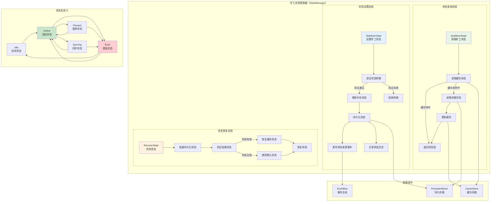

# 矿工状态管理器（Miner State Manager）

【模块定位】
　　本模块是WES矿工系统的核心状态控制组件，负责管理和维护矿工在不同工作阶段的状态信息。在当前 PoW + 距离聚合（XOR）共识机制下，状态管理器确保矿工状态的正确转换、持久化存储和实时查询，为矿工系统的可靠运行提供状态基础设施支持。

【设计原则】
- **状态驱动设计**：基于明确的状态机模型，确保矿工行为的可预测性
- **状态转换控制**：严格控制状态转换的合法性和顺序性
- **数据一致性保证**：确保状态数据的一致性和持久性
- **高性能状态查询**：提供快速的状态查询和更新操作
- **状态变更通知**：支持状态变更的实时事件通知机制
- **容错恢复能力**：支持异常情况下的状态恢复和修正

【核心职责】
1. **矿工状态管理**：维护矿工的运行状态（Idle、Mining、Paused、Stopping）
2. **状态转换控制**：验证和执行矿工状态的转换规则
3. **状态查询服务**：提供高效的状态查询接口（毫秒级响应）
4. **线程安全保障**：使用读写锁保证多线程环境下的状态一致性

## 📁 **模块组织架构**

```text
state_manager/
├── 📖 README.md              # 本文档：矿工状态管理器设计说明
├── 🎛️ manager.go             # 薄实现：仅实现接口方法，委托给具体方法文件
├── 📊 get_state.go           # GetMinerState 方法具体实现
├── ⚡ set_state.go           # SetMinerState 方法具体实现
└── ✅ validate_transition.go  # ValidateStateTransition 方法具体实现
```

> **注意**: 此结构严格遵循 `REFACTORING_ANALYSIS.md` 中的权威设计和优化策略。移除了过度设计的：
> - `state_validator.go`：验证逻辑整合到validate_transition.go中
> - `state_persistence.go`：状态使用内存存储，无需复杂持久化
> - `state_machine.go`：采用优化的状态转换规则，避免复杂状态机
> - `state_history.go`：历史记录功能不是必需的
> - `state_monitor.go`：区块链自运行系统不需要监控统计

## 🏗️ **状态管理器架构设计**

### **矿工状态机架构**



## 🔧 **核心接口实现**

### **MinerStateManager接口定义**

```go
// interfaces/miner.go - 矿工状态管理器接口
type MinerStateManager interface {
    // 获取矿工当前状态
    GetMinerState() types.MinerState
    
    // 设置矿工状态
    SetMinerState(state types.MinerState) error
    
    // 验证状态转换是否合法
    ValidateStateTransition(from, to types.MinerState) bool
    
    // 获取状态历史记录
    GetStateHistory(limit int) ([]types.StateHistoryEntry, error)
    
    // 从存储恢复状态
    RecoverStateFromStorage() error
    
    // 重置状态为默认值
    ResetToDefaultState() error
}

// 矿工状态枚举
type MinerState int

const (
    MinerStateIdle    MinerState = iota // 空闲状态
    MinerStateActive                    // 活跃状态（正在挖矿）
    MinerStatePaused                    // 暂停状态
    MinerStateError                     // 错误状态
    MinerStateSyncing                   // 同步状态
)

func (ms MinerState) String() string {
    switch ms {
    case MinerStateIdle:
        return "Idle"
    case MinerStateActive:
        return "Active"
    case MinerStatePaused:
        return "Paused"
    case MinerStateError:
        return "Error"
    case MinerStateSyncing:
        return "Syncing"
    default:
        return "Unknown"
    }
}
```

### **状态管理器实现**

```go
// state_manager/manager.go - 状态管理器实现

type Manager struct {
    // 核心依赖组件
    cacheStore      interfaces.CacheStore        // 缓存存储
    persistentStore interfaces.PersistentStore   // 持久存储
    eventBus        interfaces.EventBus          // 事件总线
    logger          log.Logger                   // 日志记录器
    
    // 状态管理
    currentState    atomic.Value                 // 当前状态（原子操作）
    stateHistory    *StateHistoryManager         // 状态历史管理器
    stateMachine    *StateMachine               // 状态机管理器
    
    // 配置参数
    cacheKeyPrefix  string                      // 缓存键前缀
    persistKey      string                      // 持久化键名
    
    // 同步控制
    stateMutex      sync.RWMutex                // 状态操作锁
    
    // 统计监控
    stateStats      *StateStatistics            // 状态统计
}

func NewManager(
    cacheStore interfaces.CacheStore,
    persistentStore interfaces.PersistentStore,
    eventBus interfaces.EventBus,
    logger log.Logger,
    config *StateManagerConfig,
) *Manager {
    mgr := &Manager{
        cacheStore:      cacheStore,
        persistentStore: persistentStore,
        eventBus:       eventBus,
        logger:         logger,
        cacheKeyPrefix: config.CacheKeyPrefix,
        persistKey:     config.PersistKey,
        stateHistory:   NewStateHistoryManager(config.HistoryLimit),
        stateMachine:   NewStateMachine(),
        stateStats:     NewStateStatistics(),
    }
    
    // 初始化状态为Idle
    mgr.currentState.Store(types.MinerStateIdle)
    
    // 尝试从持久存储恢复状态
    mgr.recoverStateFromStorage()
    
    return mgr
}

// 状态历史条目
type StateHistoryEntry struct {
    FromState   types.MinerState `json:"from_state"`
    ToState     types.MinerState `json:"to_state"`
    Timestamp   time.Time        `json:"timestamp"`
    Reason      string          `json:"reason"`
    Success     bool            `json:"success"`
}

// 配置结构体
type StateManagerConfig struct {
    CacheKeyPrefix   string        `json:"cache_key_prefix"`
    PersistKey      string        `json:"persist_key"`
    HistoryLimit    int           `json:"history_limit"`
    CacheTTL        time.Duration `json:"cache_ttl"`
    PersistInterval time.Duration `json:"persist_interval"`
}
```

## 📊 **状态查询实现**

### **get_state.go - 状态查询实现**

```go
// state_manager/get_state.go - 状态查询实现

func (m *Manager) GetMinerState() types.MinerState {
    // 从原子变量快速获取当前状态
    if state := m.currentState.Load(); state != nil {
        m.stateStats.RecordStateQuery()
        return state.(types.MinerState)
    }
    
    // 如果原子变量未初始化，从存储加载
    return m.loadStateWithFallback()
}

func (m *Manager) loadStateWithFallback() types.MinerState {
    m.stateMutex.RLock()
    defer m.stateMutex.RUnlock()
    
    // 1. 尝试从缓存加载
    if state, err := m.loadStateFromCache(); err == nil {
        m.currentState.Store(state)
        m.logger.Info("从缓存加载状态成功")
        return state
    }
    
    // 2. 从持久存储加载
    if state, err := m.loadStateFromPersistent(); err == nil {
        m.currentState.Store(state)
        // 更新缓存
        m.updateCache(state)
        m.logger.Info("从持久存储加载状态成功")
        return state
    }
    
    // 3. 使用默认状态
    defaultState := types.MinerStateIdle
    m.currentState.Store(defaultState)
    m.logger.Info("使用默认状态")
    return defaultState
}

func (m *Manager) loadStateFromCache() (types.MinerState, error) {
    cacheKey := m.cacheKeyPrefix + "miner_state"
    
    data, err := m.cacheStore.Get(cacheKey)
    if err != nil {
        return types.MinerStateIdle, fmt.Errorf("缓存读取失败: %v", err)
    }
    
    if len(data) < 4 {
        return types.MinerStateIdle, fmt.Errorf("缓存数据长度不足")
    }
    
    stateValue := binary.BigEndian.Uint32(data)
    state := types.MinerState(stateValue)
    
    return state, nil
}

func (m *Manager) loadStateFromPersistent() (types.MinerState, error) {
    data, err := m.persistentStore.Get(m.persistKey)
    if err != nil {
        return types.MinerStateIdle, fmt.Errorf("持久存储读取失败: %v", err)
    }
    
    if len(data) < 4 {
        return types.MinerStateIdle, fmt.Errorf("持久存储数据长度不足")
    }
    
    stateValue := binary.BigEndian.Uint32(data)
    state := types.MinerState(stateValue)
    
    return state, nil
}

func (m *Manager) GetStateHistory(limit int) ([]types.StateHistoryEntry, error) {
    return m.stateHistory.GetHistory(limit)
}

func (m *Manager) GetStateStatistics() *StateStatistics {
    return m.stateStats.GetStatistics()
}

// 获取详细状态信息
func (m *Manager) GetDetailedStateInfo() *DetailedStateInfo {
    currentState := m.GetMinerState()
    stats := m.stateStats.GetStatistics()
    recentHistory, _ := m.stateHistory.GetRecentHistory(5)
    
    return &DetailedStateInfo{
        CurrentState:        currentState,
        StateDuration:       time.Since(stats.LastStateChangeTime),
        TotalStateChanges:   stats.TotalStateChanges,
        StateChangeRate:     stats.StateChangeRate,
        RecentHistory:      recentHistory,
        LastUpdateTime:     time.Now(),
    }
}

type DetailedStateInfo struct {
    CurrentState      types.MinerState         `json:"current_state"`
    StateDuration     time.Duration           `json:"state_duration"`
    TotalStateChanges uint64                  `json:"total_state_changes"`
    StateChangeRate   float64                 `json:"state_change_rate"`
    RecentHistory     []types.StateHistoryEntry `json:"recent_history"`
    LastUpdateTime    time.Time               `json:"last_update_time"`
}
```

## ⚡ **状态设置实现**

### **set_state.go - 状态设置实现**

```go
// state_manager/set_state.go - 状态设置实现

func (m *Manager) SetMinerState(newState types.MinerState) error {
    m.logger.Info("设置矿工状态")
    
    currentState := m.GetMinerState()
    
    // 1. 检查状态是否需要变更
    if currentState == newState {
        m.logger.Info("状态无变更，跳过设置")
        return nil
    }
    
    // 2. 验证状态转换合法性
    if !m.ValidateStateTransition(currentState, newState) {
        err := fmt.Errorf("非法状态转换: %s -> %s", currentState, newState)
        m.recordStateTransitionFailure(currentState, newState, err.Error())
        return err
    }
    
    // 3. 执行状态转换
    if err := m.performStateTransition(currentState, newState); err != nil {
        m.recordStateTransitionFailure(currentState, newState, err.Error())
        return fmt.Errorf("状态转换失败: %v", err)
    }
    
    m.logger.Info("矿工状态设置完成")
    return nil
}

func (m *Manager) performStateTransition(oldState, newState types.MinerState) error {
    m.stateMutex.Lock()
    defer m.stateMutex.Unlock()
    
    // 1. 执行状态转换前置操作
    if err := m.preStateTransition(oldState, newState); err != nil {
        return fmt.Errorf("状态转换前置操作失败: %v", err)
    }
    
    // 2. 更新当前状态
    m.currentState.Store(newState)
    
    // 3. 更新缓存
    if err := m.updateCache(newState); err != nil {
        m.logger.Info("更新缓存失败")
    }
    
    // 4. 异步持久化
    go func() {
        if err := m.persistState(newState); err != nil {
            m.logger.Info("持久化状态失败")
        }
    }()
    
    // 5. 记录状态历史
    m.stateHistory.RecordTransition(oldState, newState, true, "normal_transition")
    
    // 6. 更新统计信息
    m.stateStats.RecordStateTransition(oldState, newState)
    
    // 7. 发布状态变更事件
    m.publishStateChangeEvent(oldState, newState)
    
    // 8. 执行状态转换后置操作
    m.postStateTransition(oldState, newState)
    
    return nil
}

func (m *Manager) preStateTransition(oldState, newState types.MinerState) error {
    // 状态转换前的准备工作
    switch newState {
    case types.MinerStateActive:
        // 转换到活跃状态前的检查
        return m.validateActiveStatePrerequisites()
        
    case types.MinerStatePaused:
        // 转换到暂停状态前的操作
        return m.preparePauseState()
        
    case types.MinerStateError:
        // 转换到错误状态前的操作
        return m.prepareErrorState()
        
    case types.MinerStateSyncing:
        // 转换到同步状态前的操作
        return m.prepareSyncState()
        
    default:
        return nil
    }
}

func (m *Manager) postStateTransition(oldState, newState types.MinerState) {
    // 状态转换后的处理工作
    switch newState {
    case types.MinerStateIdle:
        m.handleIdleStateEntered(oldState)
        
    case types.MinerStateActive:
        m.handleActiveStateEntered(oldState)
        
    case types.MinerStatePaused:
        m.handlePausedStateEntered(oldState)
        
    case types.MinerStateError:
        m.handleErrorStateEntered(oldState)
        
    case types.MinerStateSyncing:
        m.handleSyncingStateEntered(oldState)
    }
}

func (m *Manager) updateCache(state types.MinerState) error {
    cacheKey := m.cacheKeyPrefix + "miner_state"
    
    // 序列化状态值
    stateBytes := make([]byte, 4)
    binary.BigEndian.PutUint32(stateBytes, uint32(state))
    
    // 设置缓存，带过期时间
    return m.cacheStore.SetWithTTL(cacheKey, stateBytes, time.Hour)
}

func (m *Manager) persistState(state types.MinerState) error {
    // 序列化状态值
    stateBytes := make([]byte, 4)
    binary.BigEndian.PutUint32(stateBytes, uint32(state))
    
    // 持久化到存储
    return m.persistentStore.Set(m.persistKey, stateBytes)
}

func (m *Manager) publishStateChangeEvent(oldState, newState types.MinerState) {
    event := map[string]interface{}{
        "old_state":  oldState.String(),
        "new_state":  newState.String(),
        "timestamp":  time.Now().Unix(),
        "miner_id":   "local", // 可以从配置获取
    }
    
    m.eventBus.Publish("consensus.miner.state_changed", event)
}

func (m *Manager) recordStateTransitionFailure(from, to types.MinerState, reason string) {
    m.stateHistory.RecordTransition(from, to, false, reason)
    m.stateStats.RecordTransitionFailure()
}
```

## ✅ **状态转换验证**

### **state_validator.go - 状态转换验证实现**

```go
// state_manager/state_validator.go - 状态转换验证实现

func (m *Manager) ValidateStateTransition(from, to types.MinerState) bool {
    return m.stateMachine.IsValidTransition(from, to)
}

// 状态机管理器
type StateMachine struct {
    transitionRules map[types.MinerState][]types.MinerState
    logger          log.Logger
}

func NewStateMachine() *StateMachine {
    sm := &StateMachine{
        transitionRules: make(map[types.MinerState][]types.MinerState),
    }
    
    // 初始化状态转换规则
    sm.initializeTransitionRules()
    
    return sm
}

func (sm *StateMachine) initializeTransitionRules() {
    // 定义状态转换规则
    sm.transitionRules = map[types.MinerState][]types.MinerState{
        types.MinerStateIdle: {
            types.MinerStateActive, // Idle -> Active: 启动挖矿
            types.MinerStateError,  // Idle -> Error: 初始化失败
        },
        
        types.MinerStateActive: {
            types.MinerStateIdle,    // Active -> Idle: 停止挖矿
            types.MinerStatePaused,  // Active -> Paused: 暂停挖矿
            types.MinerStateError,   // Active -> Error: 挖矿错误
            types.MinerStateSyncing, // Active -> Syncing: 需要同步
        },
        
        types.MinerStatePaused: {
            types.MinerStateActive,  // Paused -> Active: 恢复挖矿
            types.MinerStateIdle,    // Paused -> Idle: 停止挖矿
            types.MinerStateError,   // Paused -> Error: 暂停期间出错
        },
        
        types.MinerStateError: {
            types.MinerStateIdle,    // Error -> Idle: 错误恢复后停止
            types.MinerStateActive,  // Error -> Active: 错误恢复后继续
        },
        
        types.MinerStateSyncing: {
            types.MinerStateActive,  // Syncing -> Active: 同步完成后继续挖矿
            types.MinerStateIdle,    // Syncing -> Idle: 同步完成后停止
            types.MinerStateError,   // Syncing -> Error: 同步失败
        },
    }
}

func (sm *StateMachine) IsValidTransition(from, to types.MinerState) bool {
    allowedStates, exists := sm.transitionRules[from]
    if !exists {
        return false
    }
    
    for _, allowedState := range allowedStates {
        if allowedState == to {
            return true
        }
    }
    
    return false
}

func (sm *StateMachine) GetAllowedTransitions(from types.MinerState) []types.MinerState {
    if allowedStates, exists := sm.transitionRules[from]; exists {
        // 返回副本，避免外部修改
        result := make([]types.MinerState, len(allowedStates))
        copy(result, allowedStates)
        return result
    }
    
    return nil
}

func (sm *StateMachine) ValidateTransitionWithReason(from, to types.MinerState) (bool, string) {
    if sm.IsValidTransition(from, to) {
        return true, ""
    }
    
    allowedStates := sm.GetAllowedTransitions(from)
    if len(allowedStates) == 0 {
        return false, fmt.Sprintf("状态 %s 不允许任何转换", from.String())
    }
    
    allowedStateNames := make([]string, len(allowedStates))
    for i, state := range allowedStates {
        allowedStateNames[i] = state.String()
    }
    
    return false, fmt.Sprintf("从状态 %s 不能转换到 %s，允许的转换: %s", 
        from.String(), to.String(), strings.Join(allowedStateNames, ", "))
}

// 状态转换上下文验证
func (m *Manager) validateTransitionContext(from, to types.MinerState) error {
    // 根据不同的状态转换进行上下文验证
    switch {
    case from == types.MinerStateIdle && to == types.MinerStateActive:
        return m.validateIdleToActive()
        
    case from == types.MinerStateActive && to == types.MinerStatePaused:
        return m.validateActiveToPaused()
        
    case from == types.MinerStateActive && to == types.MinerStateSyncing:
        return m.validateActiveToSyncing()
        
    case to == types.MinerStateError:
        return m.validateToError(from)
        
    default:
        return nil // 其他转换无需特殊验证
    }
}

func (m *Manager) validateIdleToActive() error {
    // 验证启动挖矿的前置条件
    // 检查系统资源、网络连接、配置等
    return nil
}

func (m *Manager) validateActiveToPaused() error {
    // 验证暂停挖矿的条件
    return nil
}

func (m *Manager) validateActiveToSyncing() error {
    // 验证开始同步的条件
    return nil
}

func (m *Manager) validateToError(from types.MinerState) error {
    // 验证进入错误状态的条件
    return nil
}
```

## 📈 **状态历史管理**

### **state_history.go - 状态历史实现**

```go
// state_manager/state_history.go - 状态历史实现

type StateHistoryManager struct {
    history      []types.StateHistoryEntry
    maxSize      int
    mutex        sync.RWMutex
}

func NewStateHistoryManager(maxSize int) *StateHistoryManager {
    if maxSize <= 0 {
        maxSize = 1000 // 默认保留1000条历史记录
    }
    
    return &StateHistoryManager{
        history: make([]types.StateHistoryEntry, 0, maxSize),
        maxSize: maxSize,
    }
}

func (shm *StateHistoryManager) RecordTransition(from, to types.MinerState, success bool, reason string) {
    shm.mutex.Lock()
    defer shm.mutex.Unlock()
    
    entry := types.StateHistoryEntry{
        FromState: from,
        ToState:   to,
        Timestamp: time.Now(),
        Reason:    reason,
        Success:   success,
    }
    
    // 添加新记录
    shm.history = append(shm.history, entry)
    
    // 如果超过最大大小，移除最旧的记录
    if len(shm.history) > shm.maxSize {
        // 移除前面的记录，保留后面的记录
        copy(shm.history, shm.history[1:])
        shm.history = shm.history[:shm.maxSize]
    }
}

func (shm *StateHistoryManager) GetHistory(limit int) ([]types.StateHistoryEntry, error) {
    shm.mutex.RLock()
    defer shm.mutex.RUnlock()
    
    if limit <= 0 || limit > len(shm.history) {
        limit = len(shm.history)
    }
    
    // 返回最新的limit条记录
    startIndex := len(shm.history) - limit
    result := make([]types.StateHistoryEntry, limit)
    copy(result, shm.history[startIndex:])
    
    return result, nil
}

func (shm *StateHistoryManager) GetRecentHistory(limit int) ([]types.StateHistoryEntry, error) {
    return shm.GetHistory(limit)
}

func (shm *StateHistoryManager) GetHistoryByTimeRange(start, end time.Time) []types.StateHistoryEntry {
    shm.mutex.RLock()
    defer shm.mutex.RUnlock()
    
    var result []types.StateHistoryEntry
    
    for _, entry := range shm.history {
        if entry.Timestamp.After(start) && entry.Timestamp.Before(end) {
            result = append(result, entry)
        }
    }
    
    return result
}

func (shm *StateHistoryManager) GetHistoryByState(state types.MinerState) []types.StateHistoryEntry {
    shm.mutex.RLock()
    defer shm.mutex.RUnlock()
    
    var result []types.StateHistoryEntry
    
    for _, entry := range shm.history {
        if entry.FromState == state || entry.ToState == state {
            result = append(result, entry)
        }
    }
    
    return result
}

func (shm *StateHistoryManager) GetFailedTransitions() []types.StateHistoryEntry {
    shm.mutex.RLock()
    defer shm.mutex.RUnlock()
    
    var result []types.StateHistoryEntry
    
    for _, entry := range shm.history {
        if !entry.Success {
            result = append(result, entry)
        }
    }
    
    return result
}

func (shm *StateHistoryManager) ClearHistory() {
    shm.mutex.Lock()
    defer shm.mutex.Unlock()
    
    shm.history = shm.history[:0] // 清空但保留容量
}

func (shm *StateHistoryManager) GetHistoryStatistics() *HistoryStatistics {
    shm.mutex.RLock()
    defer shm.mutex.RUnlock()
    
    stats := &HistoryStatistics{
        TotalTransitions:  len(shm.history),
        StateDistribution: make(map[string]int),
        TransitionTypes:   make(map[string]int),
    }
    
    successCount := 0
    
    for _, entry := range shm.history {
        if entry.Success {
            successCount++
        }
        
        // 统计状态分布
        fromState := entry.FromState.String()
        toState := entry.ToState.String()
        stats.StateDistribution[fromState]++
        stats.StateDistribution[toState]++
        
        // 统计转换类型
        transitionType := fmt.Sprintf("%s->%s", fromState, toState)
        stats.TransitionTypes[transitionType]++
        
        // 记录时间范围
        if stats.EarliestTransition.IsZero() || entry.Timestamp.Before(stats.EarliestTransition) {
            stats.EarliestTransition = entry.Timestamp
        }
        if entry.Timestamp.After(stats.LatestTransition) {
            stats.LatestTransition = entry.Timestamp
        }
    }
    
    if len(shm.history) > 0 {
        stats.SuccessRate = float64(successCount) / float64(len(shm.history))
    }
    
    return stats
}

type HistoryStatistics struct {
    TotalTransitions    int                 `json:"total_transitions"`
    SuccessRate         float64             `json:"success_rate"`
    StateDistribution   map[string]int      `json:"state_distribution"`
    TransitionTypes     map[string]int      `json:"transition_types"`
    EarliestTransition  time.Time           `json:"earliest_transition"`
    LatestTransition    time.Time           `json:"latest_transition"`
}
```

## 📊 **状态监控统计**

### **state_monitor.go - 状态监控实现**

```go
// state_manager/state_monitor.go - 状态监控实现

type StateStatistics struct {
    // 基础统计
    TotalStateChanges     uint64                           `json:"total_state_changes"`
    TotalQueries          uint64                           `json:"total_queries"`
    TransitionFailures    uint64                           `json:"transition_failures"`
    LastStateChangeTime   time.Time                        `json:"last_state_change_time"`
    StartTime             time.Time                        `json:"start_time"`
    
    // 状态持续时间统计
    StateDurations        map[types.MinerState]time.Duration `json:"state_durations"`
    StateEnterTimes       map[types.MinerState]time.Time     `json:"state_enter_times"`
    
    // 转换频率统计
    StateChangeRate       float64                           `json:"state_change_rate"`
    TransitionsPerMinute  float64                           `json:"transitions_per_minute"`
    TransitionsPerHour    float64                           `json:"transitions_per_hour"`
    
    // 状态分布统计
    StateFrequency        map[types.MinerState]uint64       `json:"state_frequency"`
    CurrentStateDuration  time.Duration                     `json:"current_state_duration"`
    
    mutex sync.RWMutex
}

func NewStateStatistics() *StateStatistics {
    return &StateStatistics{
        StartTime:        time.Now(),
        StateDurations:   make(map[types.MinerState]time.Duration),
        StateEnterTimes:  make(map[types.MinerState]time.Time),
        StateFrequency:   make(map[types.MinerState]uint64),
    }
}

func (ss *StateStatistics) RecordStateTransition(from, to types.MinerState) {
    ss.mutex.Lock()
    defer ss.mutex.Unlock()
    
    now := time.Now()
    
    // 更新基础统计
    ss.TotalStateChanges++
    ss.LastStateChangeTime = now
    
    // 计算上一个状态的持续时间
    if enterTime, exists := ss.StateEnterTimes[from]; exists {
        duration := now.Sub(enterTime)
        ss.StateDurations[from] += duration
    }
    
    // 记录新状态的进入时间
    ss.StateEnterTimes[to] = now
    
    // 更新状态频率
    ss.StateFrequency[to]++
    
    // 计算转换频率
    ss.calculateTransitionRates(now)
}

func (ss *StateStatistics) RecordStateQuery() {
    ss.mutex.Lock()
    defer ss.mutex.Unlock()
    
    ss.TotalQueries++
}

func (ss *StateStatistics) RecordTransitionFailure() {
    ss.mutex.Lock()
    defer ss.mutex.Unlock()
    
    ss.TransitionFailures++
}

func (ss *StateStatistics) calculateTransitionRates(now time.Time) {
    uptime := now.Sub(ss.StartTime)
    if uptime > 0 {
        ss.StateChangeRate = float64(ss.TotalStateChanges) / uptime.Seconds()
        ss.TransitionsPerMinute = ss.StateChangeRate * 60
        ss.TransitionsPerHour = ss.StateChangeRate * 3600
    }
}

func (ss *StateStatistics) GetStatistics() *StateStatistics {
    ss.mutex.RLock()
    defer ss.mutex.RUnlock()
    
    // 创建统计信息的副本
    stats := &StateStatistics{
        TotalStateChanges:    ss.TotalStateChanges,
        TotalQueries:         ss.TotalQueries,
        TransitionFailures:   ss.TransitionFailures,
        LastStateChangeTime:  ss.LastStateChangeTime,
        StartTime:            ss.StartTime,
        StateChangeRate:      ss.StateChangeRate,
        TransitionsPerMinute: ss.TransitionsPerMinute,
        TransitionsPerHour:   ss.TransitionsPerHour,
        StateDurations:       make(map[types.MinerState]time.Duration),
        StateFrequency:       make(map[types.MinerState]uint64),
    }
    
    // 复制映射
    for state, duration := range ss.StateDurations {
        stats.StateDurations[state] = duration
    }
    
    for state, freq := range ss.StateFrequency {
        stats.StateFrequency[state] = freq
    }
    
    return stats
}

func (ss *StateStatistics) GetCurrentStateDuration(currentState types.MinerState) time.Duration {
    ss.mutex.RLock()
    defer ss.mutex.RUnlock()
    
    if enterTime, exists := ss.StateEnterTimes[currentState]; exists {
        return time.Since(enterTime)
    }
    
    return 0
}

func (ss *StateStatistics) ResetStatistics() {
    ss.mutex.Lock()
    defer ss.mutex.Unlock()
    
    ss.TotalStateChanges = 0
    ss.TotalQueries = 0
    ss.TransitionFailures = 0
    ss.StartTime = time.Now()
    ss.LastStateChangeTime = time.Time{}
    ss.StateChangeRate = 0
    ss.TransitionsPerMinute = 0
    ss.TransitionsPerHour = 0
    ss.StateDurations = make(map[types.MinerState]time.Duration)
    ss.StateEnterTimes = make(map[types.MinerState]time.Time)
    ss.StateFrequency = make(map[types.MinerState]uint64)
}

// 定期发布统计信息
func (m *Manager) startStatisticsReporter(ctx context.Context) {
    ticker := time.NewTicker(time.Minute * 2) // 每2分钟发布一次
    defer ticker.Stop()
    
    for {
        select {
        case <-ticker.C:
            stats := m.stateStats.GetStatistics()
            currentState := m.GetMinerState()
            currentStateDuration := m.stateStats.GetCurrentStateDuration(currentState)
            
            m.publishStatistics(stats, currentState, currentStateDuration)
            
        case <-ctx.Done():
            return
        }
    }
}

func (m *Manager) publishStatistics(stats *StateStatistics, currentState types.MinerState, currentStateDuration time.Duration) {
    // 转换状态频率为字符串键的映射
    stateFreqMap := make(map[string]uint64)
    for state, freq := range stats.StateFrequency {
        stateFreqMap[state.String()] = freq
    }
    
    // 转换状态持续时间为字符串键的映射（以秒为单位）
    stateDurationMap := make(map[string]float64)
    for state, duration := range stats.StateDurations {
        stateDurationMap[state.String()] = duration.Seconds()
    }
    
    event := map[string]interface{}{
        "current_state":           currentState.String(),
        "current_state_duration":  currentStateDuration.Seconds(),
        "total_state_changes":     stats.TotalStateChanges,
        "total_queries":           stats.TotalQueries,
        "transition_failures":     stats.TransitionFailures,
        "state_change_rate":       stats.StateChangeRate,
        "transitions_per_minute":  stats.TransitionsPerMinute,
        "state_frequency":         stateFreqMap,
        "state_durations":         stateDurationMap,
        "uptime":                  time.Since(stats.StartTime).Seconds(),
        "timestamp":               time.Now().Unix(),
    }
    
    m.eventBus.Publish("consensus.miner.state_statistics", event)
}
```

## ⚙️ **配置与集成**

### **fx依赖注入配置**

```go
// state_manager/module.go

var StateManagerModule = fx.Module("miner_state_manager",
    fx.Provide(NewManager),
)

func NewManager(
    cacheStore interfaces.CacheStore,
    persistentStore interfaces.PersistentStore,
    eventBus interfaces.EventBus,
    logger log.Logger,
    config *StateManagerConfig,
) interfaces.MinerStateManager {
    return NewManager(
        cacheStore,
        persistentStore,
        eventBus,
        logger,
        config,
    )
}
```

### **配置参数**

```json
{
  "miner": {
    "state_manager": {
      "cache_key_prefix": "miner_state_",
      "persist_key": "miner_current_state",
      "history_limit": 1000,
      "cache_ttl": "1h",
      "persist_interval": "30s",
      "statistics_report_interval": "2m",
      "enable_state_validation": true,
      "enable_transition_logging": true
    }
  }
}
```

## 💾 **状态恢复机制**

### **state_persistence.go - 状态恢复实现**

```go
// state_manager/state_persistence.go - 状态恢复实现

func (m *Manager) RecoverStateFromStorage() error {
    m.logger.Info("从存储恢复状态")
    
    // 尝试从持久存储恢复状态
    state, err := m.loadStateFromPersistent()
    if err != nil {
        m.logger.Info("从持久存储恢复状态失败")
        return m.ResetToDefaultState()
    }
    
    // 验证恢复的状态是否有效
    if !m.isValidState(state) {
        m.logger.Info("恢复的状态无效")
        return m.ResetToDefaultState()
    }
    
    // 设置恢复的状态
    m.currentState.Store(state)
    
    // 更新缓存
    m.updateCache(state)
    
    // 记录恢复事件
    m.eventBus.Publish("consensus.miner.state_recovered", map[string]interface{}{
        "recovered_state": state.String(),
        "timestamp":       time.Now().Unix(),
    })
    
    m.logger.Info("状态恢复完成")
    return nil
}

func (m *Manager) ResetToDefaultState() error {
    m.logger.Info("重置为默认状态")
    
    defaultState := types.MinerStateIdle
    
    // 设置默认状态
    m.currentState.Store(defaultState)
    
    // 更新缓存和持久存储
    m.updateCache(defaultState)
    m.persistState(defaultState)
    
    // 记录重置事件
    m.eventBus.Publish("consensus.miner.state_reset", map[string]interface{}{
        "default_state": defaultState.String(),
        "timestamp":     time.Now().Unix(),
    })
    
    m.logger.Info("默认状态设置完成")
    return nil
}

func (m *Manager) isValidState(state types.MinerState) bool {
    switch state {
    case types.MinerStateIdle, types.MinerStateActive, types.MinerStatePaused, 
         types.MinerStateError, types.MinerStateSyncing:
        return true
    default:
        return false
    }
}

func (m *Manager) recoverStateFromStorage() {
    if err := m.RecoverStateFromStorage(); err != nil {
        m.logger.Info("状态恢复失败，使用默认状态")
        m.ResetToDefaultState()
    }
}
```

## 🔚 **总结**

**矿工状态管理器核心特性**：

1. **完整状态机管理**：基于明确的状态转换规则，确保状态变更的合法性
2. **高性能状态操作**：支持原子操作和缓存机制，提供快速的状态查询和更新
3. **数据持久化保证**：状态数据的缓存存储和持久化存储，支持重启恢复
4. **详细历史记录**：完整的状态变更历史记录，支持审计和调试
5. **实时统计监控**：丰富的状态统计信息和性能监控指标
6. **状态转换验证**：严格的状态转换合法性验证机制
7. **事件驱动通知**：状态变更的实时事件发布机制

**架构设计优势**：
- 状态机模型清晰，转换规则明确
- 多层存储机制，保证数据可靠性
- 线程安全设计，支持并发操作
- 统计监控完善，便于性能分析
- 恢复机制健全，提高系统稳定性
- 事件通知及时，支持系统协调
