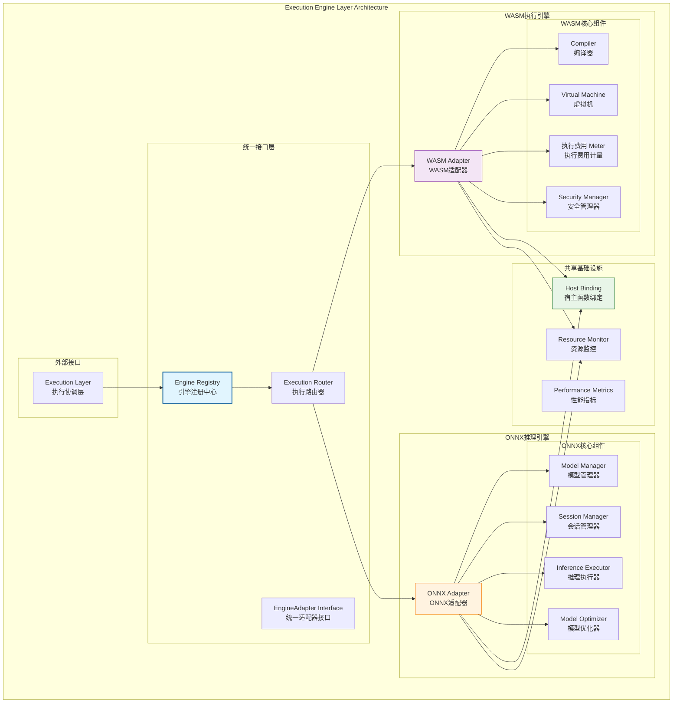
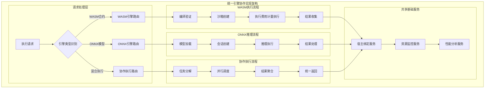
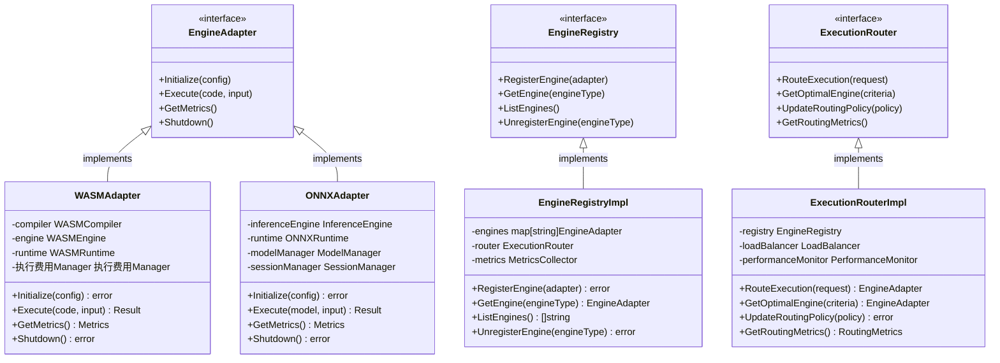

# 执行引擎层（internal/core/engines）

【模块定位】
　　本目录实现WES区块链的执行引擎层，提供双引擎协作的智能执行能力。通过WASM引擎和ONNX引擎的协同工作，为区块链提供智能合约执行和AI模型推理的完整解决方案。采用统一的`EngineAdapter`接口和fx依赖注入机制，确保引擎的可扩展性和互操作性。

【设计原则】
- 双引擎协作：WASM智能合约执行 + ONNX AI推理的完整引擎生态
- 统一接口标准：严格实现`pkg/interfaces/execution.EngineAdapter`接口
- 智能路由分发：基于合约类型和执行需求的智能引擎选择
- 安全隔离运行：每个引擎提供独立的安全沙箱和资源隔离
- 高性能优化：编译优化、运行时缓存、资源预分配等性能策略
- 可扩展架构：为未来新引擎类型（如Native、GPU等）预留扩展接口

【核心职责】
1. **双引擎协调**：WASM和ONNX引擎的统一管理和智能分发
2. **统一接口实现**：提供标准化的执行引擎抽象接口
3. **安全沙箱管理**：为不同类型的执行提供安全隔离环境
4. **性能优化协调**：跨引擎的性能监控、资源调度和优化策略
5. **宿主函数绑定**：统一的区块链环境交互接口
6. **引擎生命周期**：初始化、配置、销毁等生命周期管理

【引擎层设计理念：双引擎协作模式】
本执行引擎层采用"双引擎协作"设计模式，通过WASM引擎处理智能合约执行，通过ONNX引擎处理AI模型推理，两者通过统一的适配器接口协作。这种设计的核心思想是"专业化分工，统一化管理，智能化分发"。

## 双引擎协作架构设计



## 引擎特性对比

### 🔧 引擎功能对比表
| 特性 | WASM引擎 | ONNX引擎 | 协作方式 |
|------|----------|----------|----------|
| **主要用途** | 智能合约执行 | AI模型推理 | 业务场景互补 |
| **安全模型** | 沙箱隔离 + 执行费用计量 | 模型验证 + 资源限制 | 统一安全策略 |
| **性能优化** | JIT编译 + 缓存 | 图优化 + GPU加速 | 资源池共享 |
| **资源管理** | 内存限制 + 执行时间 | 模型缓存 + 会话池 | 统一资源监控 |
| **宿主函数** | 区块链状态访问 | 数据预处理接口 | 共享Host Binding |
| **错误处理** | 执行费用耗尽 + 异常捕获 | 推理失败 + 超时处理 | 统一错误分类 |

### 🚀 引擎性能特点
| 性能指标 | WASM引擎 | ONNX引擎 | 优化策略 |
|----------|----------|----------|----------|
| **启动时间** | 编译时间 ~10-50ms | 模型加载 ~100-500ms | 预编译 + 预加载 |
| **执行性能** | 接近原生 ~90% | GPU加速 ~10x CPU | 并行执行 + 缓存 |
| **内存占用** | 动态分配 ~1-10MB | 模型缓存 ~10-100MB | 智能回收 + 共享池 |
| **并发能力** | 实例池 ~100+ | 会话池 ~10-50 | 负载均衡 + 弹性扩展 |

## 引擎协作机制

### 智能路由策略
- **合约类型检测**：通过合约元数据自动识别执行引擎类型
- **性能评估分发**：基于资源使用情况和性能指标智能分发
- **混合执行支持**：支持在单一交易中调用多种引擎类型
- **降级策略**：引擎故障时的自动降级和容错机制

### 资源协调管理
- **统一资源池**：跨引擎的内存、CPU、GPU资源统一管理
- **优先级调度**：基于交易优先级的资源分配策略
- **弹性伸缩**：根据负载自动调整引擎实例数量
- **性能监控**：实时监控各引擎性能指标和资源使用情况

---

## 🔄 **统一引擎协作实现**

【协作策略】

　　所有执行引擎均严格遵循**双引擎协作**架构模式，确保智能合约执行和AI模型推理的无缝协同。



**关键实现要点：**

1. **智能路由分发**：
   - 基于资源类型自动选择最优执行引擎
   - 支持单一交易中的多引擎协作执行
   - 动态负载均衡和性能优化分发策略

2. **统一资源管理**：
   - 跨引擎的内存、CPU、GPU资源统一调度
   - 公平的资源分配和优先级管理机制
   - 弹性伸缩和自适应资源调整策略

3. **协作执行机制**：
   - WASM合约调用ONNX模型推理的无缝集成
   - 数据格式自动转换和类型安全保障
   - 执行结果的标准化处理和错误传播机制

---

## 📁 **模块组织结构**

【内部模块架构】

```
internal/core/engines/
├── 🔧 wasm/                   # WASM执行引擎
│   ├── adapter.go             # WASM适配器 - 统一接口实现
│   ├── compiler/              # 编译器组件 - WASM编译、验证、优化
│   │   ├── cache.go           # 编译缓存管理
│   │   ├── optimizer.go       # 编译优化器
│   │   ├── validator.go       # 代码验证器
│   │   └── README.md          # 编译器文档
│   ├── engine/                # 引擎组件 - 虚拟机、上下文管理
│   │   ├── config.go          # 引擎配置
│   │   ├── context.go         # 执行上下文
│   │   ├── lifecycle.go       # 生命周期管理
│   │   ├── vm.go              # 虚拟机实现
│   │   └── README.md          # 引擎文档
│   ├── runtime/               # 运行时组件 - 执行费用计量、安全管理
│   │   ├── 执行费用.go             # 执行费用计量系统
│   │   ├── security.go        # 安全沙箱
│   │   ├── instance.go        # 实例管理
│   │   └── README.md          # 运行时文档
│   ├── module.go              # fx依赖注入和组件装配
│   └── README.md              # WASM引擎文档
├── 🧠 onnx/                   # ONNX推理引擎
│   ├── adapter.go             # ONNX适配器 - 统一接口实现
│   ├── inference/             # 推理组件 - 推理执行、预处理
│   │   ├── executor.go        # 推理执行器
│   │   ├── preprocessor.go    # 数据预处理
│   │   ├── postprocessor.go   # 结果后处理
│   │   └── README.md          # 推理组件文档
│   ├── runtime/               # 运行时组件 - 模型管理、会话管理
│   │   ├── model.go           # 模型管理器
│   │   ├── session.go         # 会话管理器
│   │   ├── config.go          # 运行时配置
│   │   └── README.md          # 运行时文档
│   ├── module.go              # fx依赖注入和组件装配
│   └── README.md              # ONNX引擎文档
└── 📖 README.md               # 本文档
```

### **🎯 子模块职责分工**

| **子模块** | **核心职责** | **对外接口** | **内部组件** | **复杂度** |
|-----------|-------------|-------------|-------------|-----------|
| `wasm/` | WASM智能合约执行 | EngineAdapter接口 | 编译器、引擎、运行时 | ⭐⭐⭐⭐⭐ |
| `wasm/compiler/` | WASM代码编译优化 | 编译服务接口 | 缓存、优化器、验证器 | ⭐⭐⭐⭐ |
| `wasm/engine/` | WASM虚拟机管理 | 引擎服务接口 | 配置、上下文、VM、生命周期 | ⭐⭐⭐⭐⭐ |
| `wasm/runtime/` | WASM运行时管理 | 运行时服务接口 | 执行费用计量、安全、实例管理 | ⭐⭐⭐⭐ |
| `onnx/` | ONNX AI模型推理 | EngineAdapter接口 | 推理、运行时 | ⭐⭐⭐⭐ |
| `onnx/inference/` | AI模型推理执行 | 推理服务接口 | 执行器、预处理、后处理 | ⭐⭐⭐⭐ |
| `onnx/runtime/` | ONNX运行时管理 | 运行时服务接口 | 模型管理、会话管理、配置 | ⭐⭐⭐ |

---

## 🏗️ **依赖注入架构**

【fx框架集成】

　　全面采用fx依赖注入框架，实现组件间的松耦合和生命周期自动管理。

```go
// 示例：执行引擎层依赖注入配置
package engines

import (
    "go.uber.org/fx"
    "github.com/weisyn/v1/pkg/interfaces/execution"
)

// Module 执行引擎层模块
var Module = fx.Module("engines",
    // 导入引擎子模块
    fx.Provide(
        // WASM引擎
        wasm.NewAdapter,
        wasm.NewCompiler,
        wasm.NewEngine,
        wasm.NewRuntime,
        
        // ONNX引擎
        onnx.NewAdapter,
        onnx.NewInferenceEngine,
        onnx.NewRuntime,
        
        // 引擎注册中心
        NewEngineRegistry,
        NewExecutionRouter,
    ),
    
    // 导出引擎适配器接口
    fx.Provide(
        fx.Annotate(
            func(adapter *wasm.Adapter) execution.EngineAdapter {
                return adapter
            },
            fx.As(new(execution.EngineAdapter)),
            fx.ResultTags(`group:"engines" name:"wasm"`),
        ),
        fx.Annotate(
            func(adapter *onnx.Adapter) execution.EngineAdapter {
                return adapter
            },
            fx.As(new(execution.EngineAdapter)),
            fx.ResultTags(`group:"engines" name:"onnx"`),
        ),
    ),
    
    // 引擎注册和初始化
    fx.Invoke(RegisterEngines),
    fx.Invoke(InitializeEngines),
)

// 引擎注册函数
func RegisterEngines(
    registry *EngineRegistry,
    engines []execution.EngineAdapter `group:"engines"`,
) error {
    for _, engine := range engines {
        if err := registry.RegisterEngine(engine); err != nil {
            return err
        }
    }
    return nil
}

// 引擎初始化函数
func InitializeEngines(
    wasmEngine *wasm.Adapter,
    onnxEngine *onnx.Adapter,
    config *EnginesConfig,
) error {
    // 初始化WASM引擎
    if config.WASM.Enabled {
        if err := wasmEngine.Initialize(config.WASM); err != nil {
            return err
        }
    }
    
    // 初始化ONNX引擎
    if config.ONNX.Enabled {
        if err := onnxEngine.Initialize(config.ONNX); err != nil {
            return err
        }
    }
    
    return nil
}
```

**依赖管理特点：**
- **引擎注册**：通过fx依赖注入以组的形式注册引擎
- **接口导向**：通过EngineAdapter接口统一管理
- **配置驱动**：支持引擎的动态启用和配置
- **生命周期管理**：自动管理引擎的初始化和清理

---

## 📊 **性能与监控**

【性能指标】

| **操作类型** | **目标延迟** | **吞吐量目标** | **资源利用率** | **监控方式** |
|-------------|-------------|---------------|--------------|------------|
| WASM编译 | < 50ms | > 200 CPS | < 80% CPU | 实时监控 |
| WASM执行 | < 10ms | > 1000 TPS | < 70% Memory | 批量统计 |
| ONNX推理 | < 100ms | > 500 IPS | < 90% GPU | 关键路径监控 |
| 模型加载 | < 500ms | > 100 LPS | < 60% Memory | 异步监控 |
| 引擎切换 | < 5ms | > 2000 SPS | < 50% CPU | 实时监控 |

**性能优化策略：**
- **编译优化**：预编译缓存、增量编译、并行编译、优化等级
- **运行时优化**：实例池管理、内存优化、缓存策略、资源预热
- **监控诊断**：性能指标、资源监控、异常诊断、性能分析
- **负载均衡**：智能引擎选择、资源调度、弹性伸缩

---

## 🔗 **与公共接口的映射关系**

【接口实现映射】



**实现要点：**
- **接口契约**：严格遵循公共接口的方法签名和语义
- **错误处理**：标准化的错误返回和异常处理机制
- **日志记录**：完善的操作日志和性能指标记录
- **测试覆盖**：每个接口方法都有对应的单元测试和集成测试

---

## 🚀 **后续扩展规划**

【模块演进方向】

1. **新引擎类型支持**
   - Native引擎：原生代码执行引擎（C/C++/Rust等）
   - GPU引擎：专用GPU计算引擎（CUDA/OpenCL等）
   - 量子引擎：量子计算模拟引擎（未来扩展）
   - 边缘引擎：轻量级边缘计算引擎（IoT场景）

2. **性能优化提升**
   - 硬件加速：GPU、TPU、FPGA等硬件加速支持
   - 编译优化：更高级的编译优化技术和算法
   - 运行时优化：更智能的资源管理和调度策略
   - 缓存优化：多级缓存和智能预取机制

3. **功能扩展完善**
   - 跨引擎协作：支持多引擎协同执行复杂任务
   - 动态扩展：运行时动态加载和卸载引擎
   - 版本管理：引擎版本控制和平滑升级机制
   - 调试工具：更完善的调试和性能分析工具

4. **运维增强**
   - 自动调优：基于机器学习的自动性能调优
   - 故障恢复：更强的故障检测和自动恢复能力
   - 监控告警：更全面的监控指标和智能告警
   - 容量规划：基于历史数据的容量规划建议

---

## 📋 **开发指南**

【引擎开发规范】

1. **新引擎接入流程**：
   - 实现EngineAdapter接口的完整方法
   - 通过fx依赖注入以组的形式注册引擎
   - 在执行路由器中添加新引擎的分发逻辑
   - 完成引擎功能和集成测试

2. **代码质量要求**：
   - 遵循Go语言最佳实践
   - 100%的接口方法测试覆盖
   - 完善的错误处理机制
   - 清晰的代码注释和文档

3. **性能要求**：
   - 关键路径延迟指标达标
   - 内存使用合理，避免泄漏
   - 并发安全的数据访问
   - 合理的资源清理机制

【参考文档】
- [WASM引擎实现](wasm/README.md)
- [ONNX引擎实现](onnx/README.md)
- [执行接口规范](../../pkg/interfaces/execution/)
- [WES架构设计文档](../../../docs/architecture/)

---

> 📝 **模板说明**：本README模板基于WES v0.0.1统一文档规范设计，使用时请根据具体模块需求替换相应的占位符内容，并确保所有章节都有实质性的技术内容。

> 🔄 **维护指南**：本文档应随着模块功能的演进及时更新，确保文档与代码实现的一致性。建议在每次重大功能变更后更新相应章节。

---

## 🔗 相关文档

- **WASM引擎**：`wasm/README.md` - WASM执行引擎详细实现
- **ONNX引擎**：`onnx/README.md` - ONNX推理引擎详细实现
- **执行接口**：`../../pkg/interfaces/execution/` - 执行引擎统一接口定义
- **执行协调层**：`../execution/` - 执行层架构和协调机制
